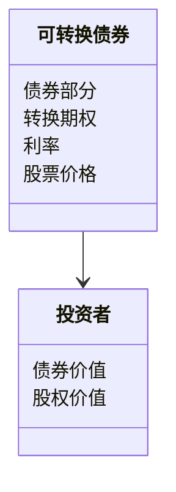
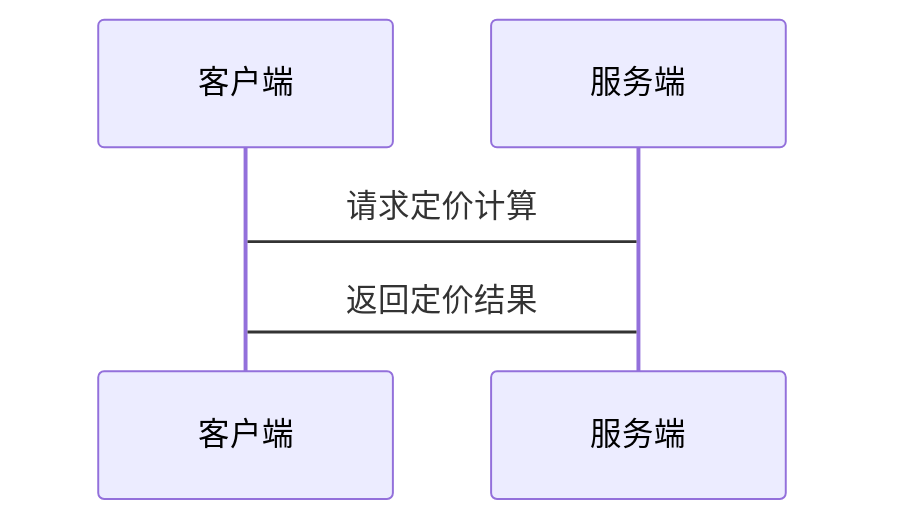

                 


---

# 可转换债券：股债结合的灵活投资工具

## 关键词：可转换债券，股债结合，投资工具，债券定价，风险管理

## 摘要

可转换债券是一种结合了债券和股票特性的投资工具，具有灵活性和风险分散的特点。本文将从可转换债券的基本概念、定价模型、投资策略和风险管理等方面进行详细分析，帮助投资者更好地理解和应用这种投资工具。文章结合数学模型和实际案例，深入探讨可转换债券的核心原理和实际应用。

---

# 第1章: 可转换债券的基本概念与市场现状

## 1.1 可转换债券的定义与特点

可转换债券是一种可以在特定条件下转换为公司股票的债券。其特点包括：

### 1.1.1 可转换债券的定义

可转换债券（Convertible Bond）是一种债务工具，允许持有人在债券到期前将其转换为发行公司的股票。这种工具结合了债券的固定收益特性和股票的资本增值特性，为投资者提供了灵活的投资选择。

### 1.1.2 可转换债券的核心特点

1. **债券部分**：提供固定的利息收入，类似于普通债券。
2. **股权部分**：持有人有权在特定条件下将债券转换为股票，分享公司股价上涨的收益。
3. **灵活性**：投资者可以根据市场情况选择持有债券还是转换为股票，从而优化投资回报。

## 1.2 可转换债券的市场现状

### 1.2.1 全球可转换债券市场的概况

全球范围内，可转换债券市场近年来发展迅速，市场规模不断扩大。特别是在美国和欧洲市场，可转换债券已成为企业融资的重要工具之一。

### 1.2.2 中国可转换债券市场的特点

中国的可转换债券市场起步较晚，但发展迅速。近年来，随着资本市场改革的推进，可转换债券逐渐成为中国企业融资的重要方式之一。

### 1.2.3 可转换债券市场的未来发展趋势

随着市场对灵活融资工具需求的增加，可转换债券市场将继续扩大。同时，随着金融创新的推进，可转换债券的产品种类和结构将更加多样化。

## 1.3 可转换债券的主要参与者

### 1.3.1 发行人

发行人通常是需要融资的企业，通过发行可转换债券筹集资金。

### 1.3.2 投资者

投资者包括机构投资者和个人投资者，他们可以通过投资可转换债券获得固定收益和潜在的资本增值收益。

### 1.3.3 中介机构

包括证券公司、律师事务所和评级机构等，负责可转换债券的发行、交易和评级工作。

## 1.4 本章小结

本章主要介绍了可转换债券的基本概念、市场现状和主要参与者。可转换债券作为一种结合了债券和股票特性的工具，具有独特的灵活性和风险分散的特点，为投资者提供了多样化的投资选择。

---

# 第2章: 可转换债券的核心概念与定价模型

## 2.1 可转换债券的结构与定价原理

### 2.1.1 可转换债券的结构分析

可转换债券的结构主要包括债券部分和转换期权部分。债券部分提供固定利息，转换期权赋予持有人在特定条件下将债券转换为股票的权利。

### 2.1.2 可转换债券的定价模型

可转换债券的定价涉及复杂的数学模型，主要包括债券价值和转换期权价值两部分。

## 2.2 可转换债券的定价模型

### 2.2.1 Black-Scholes期权定价模型

Black-Scholes模型是期权定价的经典模型，也可应用于可转换债券的定价。其公式如下：

$$ C = S_0 N(d_1) - K e^{-rT} N(d_2) $$

其中：
- $S_0$：标的资产价格
- $K$：行权价
- $r$：无风险利率
- $T$：时间至到期
- $N(d)$：标准正态分布的累积分布函数
- $d_1 = \frac{\ln(S_0/K) + (r + \sigma^2/2)T}{\sigma \sqrt{T}}$
- $d_2 = d_1 - \sigma \sqrt{T}$

### 2.2.2 二叉树模型在可转换债券定价中的应用

二叉树模型通过构建股价树和债券价值树，计算可转换债券的期权价值。其步骤如下：

1. 构建股价树。
2. 计算每节点的债券价值。
3. 回溯计算期权价值。

### 2.2.3 股票价格波动对债券价值的影响

股票价格波动越大，可转换债券的期权价值越高，整体债券价值也越高。

## 2.3 可转换债券定价的关键因素

### 2.3.1 利率因素

利率上升会增加债券的利息成本，降低其市场价值。

### 2.3.2 股票价格波动

股票价格波动越大，可转换债券的期权价值越高。

### 2.3.3 转换溢价

转换溢价是指可转换债券市场价格与其内在价值之间的差额，反映了市场对期权部分的估值。

## 2.4 本章小结

本章详细介绍了可转换债券的结构和定价模型，重点讲解了Black-Scholes模型和二叉树模型的应用。股票价格波动、利率和转换溢价是影响可转换债券定价的重要因素。

---

# 第3章: 可转换债券的投资策略与风险管理

## 3.1 可转换债券的投资策略

### 3.1.1 纯粹债券投资者的策略

纯粹债券投资者主要关注可转换债券的债券部分，追求稳定的利息收益。

### 3.1.2 股权投资者的策略

股权投资者关注可转换债券的期权部分，期望通过股价上涨获得资本收益。

### 3.1.3 投资组合优化策略

通过将可转换债券与其他资产组合，优化投资组合的风险和收益。

## 3.2 不同市场环境下的投资策略

### 3.2.1 牛市环境下的投资策略

在牛市环境下，可转换债券的期权价值较高，适合投资者积极参与。

### 3.2.2 熊市环境下的投资策略

在熊市环境下，可转换债券的债券部分提供一定的安全性，适合保守投资者。

### 3.2.3 平衡市环境下的投资策略

在平衡市环境下，可转换债券的投资应注重风险控制和收益稳定。

## 3.3 可转换债券的择时与择券策略

### 3.3.1 择时策略

根据市场趋势和公司基本面，选择合适的入市时机。

### 3.3.2 拆券策略

选择具有较高转换溢价和良好流动性可转换债券。

## 3.4 可转换债券的风险管理

### 3.4.1 市场风险

市场波动可能导致可转换债券价格波动。

### 3.4.2 利率风险

利率上升会降低可转换债券的市场价值。

### 3.4.3 转换风险

股价下跌可能导致可转换债券的期权价值下降。

## 3.5 本章小结

本章重点分析了可转换债券的投资策略和风险管理。投资者应根据市场环境和自身风险承受能力，制定合适的投资策略。

---

# 第4章: 可转换债券的系统分析与架构设计

## 4.1 可转换债券的系统分析

### 4.1.1 问题场景介绍

可转换债券的定价和风险管理涉及复杂的数学模型和系统架构。

### 4.1.2 项目介绍

本项目旨在构建一个可转换债券定价和风险管理的系统。

## 4.2 可转换债券的系统架构设计

### 4.2.1 领域模型 mermaid 类图



### 4.2.2 系统架构 mermaid 架构图


## 4.3 可转换债券的接口设计

### 4.3.1 系统接口设计

提供可转换债券的定价和风险管理功能接口。

### 4.3.2 系统交互 mermaid 序列图



## 4.4 本章小结

本章通过系统分析和架构设计，展示了可转换债券定价和风险管理的实现框架。

---

# 第5章: 可转换债券的项目实战

## 5.1 环境安装与配置

### 5.1.1 Python 环境安装

安装Python和必要的库，如numpy、pandas、scipy。

## 5.2 可转换债券的核心实现

### 5.2.1 Black-Scholes 模型的实现

```python
import numpy as np

def black_scholes(S, K, r, T, sigma):
    d1 = (np.log(S/K) + (r + sigma**2/2)*T) / (sigma*np.sqrt(T))
    d2 = d1 - sigma*np.sqrt(T)
    N = lambda x: 0.5*(1 + np.erf(x/np.sqrt(2)))
    C = S*N(d1) - K*np.exp(-r*T)*N(d2)
    return C

# 示例计算
S = 100
K = 105
r = 0.05
T = 1
sigma = 0.3
print(black_scholes(S, K, r, T, sigma))
```

### 5.2.2 二叉树模型的实现

```python
def binomial_tree(S, K, r, T, sigma, N):
    dt = T / N
    df = np.exp(-r*dt)
    up = np.exp(sigma*np.sqrt(dt))
    down = 1 / up
    Q = (np.exp(r*dt) - down) / (up - down)
    
    # 初始化股价树
    stock_tree = np.zeros((N+1, N+1))
    stock_tree[0,0] = S
    for i in range(1, N+1):
        stock_tree[i,0] = stock_tree[i-1,0] * up
        for j in range(1, i+1):
            stock_tree[i,j] = stock_tree[i-1,j-1] * down
    
    # 计算期权价值
    option_tree = np.zeros((N+1, N+1))
    for j in range(N):
        option_tree[N,j] = max(0, stock_tree[N,j] - K)
    for i in range(N-1, -1, -1):
        for j in range(i+1):
            option_tree[i,j] = Q * option_tree[i+1,j] * df
    return option_tree[0,0]

# 示例计算
S = 100
K = 105
r = 0.05
T = 1
sigma = 0.3
N = 100
print(binomial_tree(S, K, r, T, sigma, N))
```

## 5.3 实际案例分析

### 5.3.1 案例背景

假设某公司发行面值为100元的可转换债券，期限为1年，票面利率为5%，转股价为120元。

### 5.3.2 计算可转换债券的价值

使用Black-Scholes模型计算期权价值，结合债券价值确定整体债券价格。

## 5.4 本章小结

本章通过实际案例分析，展示了如何使用Black-Scholes模型和二叉树模型计算可转换债券的价值，并提供了Python代码实现。

---

# 第6章: 可转换债券的高级主题与最佳实践

## 6.1 可转换债券的高级主题

### 6.1.1 结构化可转换债券

结构化可转换债券通过嵌入其他金融工具，提供多样化的收益结构。

### 6.1.2 可转换债券的创新产品

包括可赎回可转换债券和可分拆可转换债券等。

## 6.2 可转换债券的最佳实践

### 6.2.1 投资者注意事项

1. **充分了解发行人基本面**：选择信用状况良好的发行人。
2. **关注市场环境**：根据市场环境调整投资策略。
3. **分散投资**：避免过度集中投资可转换债券。

### 6.2.2 风险管理建议

1. **设定止损点**：控制投资风险。
2. **定期评估投资组合**：根据市场变化及时调整。

## 6.3 本章小结

本章总结了可转换债券的高级主题和最佳实践，为投资者提供了实用的建议。

---

# 总结

可转换债券作为一种股债结合的投资工具，具有灵活性和风险分散的特点。通过本文的详细分析，投资者可以更好地理解可转换债券的核心原理、定价模型和投资策略。同时，结合实际案例和系统设计，可以帮助投资者在实际操作中更好地应用这些知识。

---

# 作者：AI天才研究院/AI Genius Institute & 禅与计算机程序设计艺术 /Zen And The Art of Computer Programming

---

