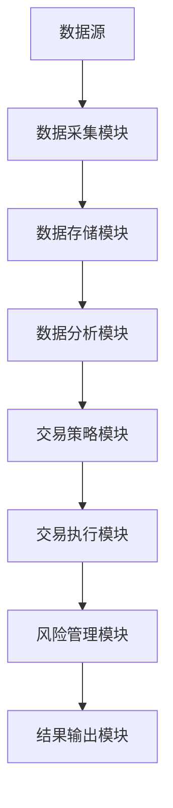
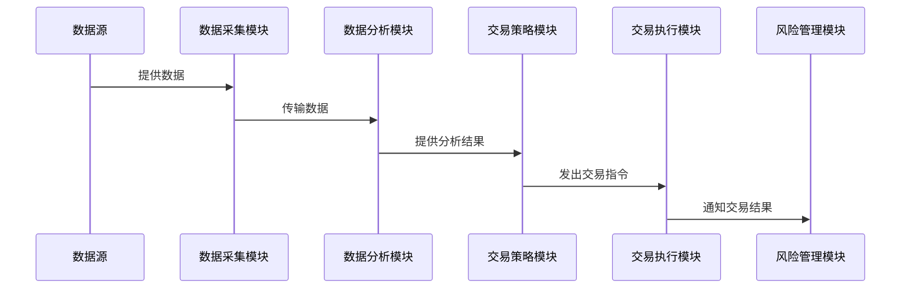

                 


# 商品投资：在通胀环境中的对冲作用

---

## 关键词：
商品投资、通胀、对冲、期货、期权、数学模型、系统架构

---

## 摘要：
本文深入探讨商品投资在通胀环境中的对冲作用，从商品市场的基本运作机制、通胀的成因及影响、商品投资的对冲策略、数学模型与算法原理、系统架构设计到实际案例分析，全面解析商品投资如何有效对冲通胀风险。通过详细的技术分析和实战案例，本文旨在为投资者提供科学的对冲策略和系统化的解决方案。

---

## 第1章: 商品投资与通胀环境的基础知识

### 1.1 商品投资的定义与分类

#### 1.1.1 商品投资的定义
商品投资是指通过购买和持有实物商品（如黄金、原油、铜等）或相关金融工具（如商品期货、期权）来实现投资收益的行为。商品投资具有高度的流动性、多样化的选择性和对冲通胀的特性。

#### 1.1.2 商品投资的主要分类
商品投资可以分为以下几类：
1. **实物商品投资**：直接购买实物商品，如黄金、白银、原油等。
2. **商品期货投资**：通过购买商品期货合约进行投资。
3. **商品期权投资**：通过购买商品期权合约进行投资。
4. **商品指数基金投资**：通过投资商品指数基金间接参与商品市场。

#### 1.1.3 商品投资的市场参与者
商品市场的参与者包括：
1. **生产者**：如矿商、石油生产商等。
2. **消费者**：如制造企业、贸易商等。
3. **投机者**：通过期货市场进行短期交易的投资者。
4. **机构投资者**：如基金、保险公司等。

### 1.2 通胀的定义与成因

#### 1.2.1 通胀的定义
通胀是指物价总水平在一段时间内持续上涨的现象。通常用消费者价格指数（CPI）和生产者价格指数（PPI）来衡量。

#### 1.2.2 通胀的主要成因
通胀的成因复杂，主要包括：
1. **需求拉动型通胀**：需求超过供给，导致价格上涨。
2. **成本推动型通胀**：生产成本（如工资、原材料价格）上升，导致产品价格上涨。
3. **货币供应增加**：货币供给过多，导致货币贬值，物价上涨。
4. **预期因素**：市场对未来的通胀预期也可能导致当前物价上涨。

#### 1.2.3 通胀对经济的影响
通胀对经济的影响是多方面的：
1. **对消费者的影响**：实际购买力下降，生活成本增加。
2. **对企业的影响**：成本上升，利润减少，可能导致裁员或倒闭。
3. **对政府的影响**：财政赤字增加，货币政策调整压力增大。

### 1.3 商品投资在通胀环境中的作用

#### 1.3.1 商品作为通胀对冲工具的原理
商品价格通常与通胀密切相关。在通胀环境下，商品价格往往会上涨，从而为投资者提供对冲通胀的工具。

#### 1.3.2 商品投资在资产配置中的地位
商品投资可以作为资产配置的一部分，帮助投资者分散风险，降低整体投资组合的波动性。

#### 1.3.3 商品投资的风险与收益分析
商品投资的风险主要来自于价格波动、市场流动性不足、政策变化等因素。然而，商品投资的收益可以通过对冲策略和多元化投资来实现稳定收益。

---

## 第2章: 商品市场的运作机制

### 2.1 商品市场的基本结构

#### 2.1.1 商品交易所的运作模式
商品交易所是商品交易的主要场所，通常包括期货交易所和现货交易所。期货交易所的主要交易品种是标准化的期货合约，而现货交易所则进行即期交易。

#### 2.1.2 商品期货与现货市场的区别
1. **期货市场**：标准化合约，可以在到期日之前进行交割或平仓。
2. **现货市场**：实物交易，即时发生。

#### 2.1.3 商品价格的形成机制
商品价格的形成机制受到市场供需、宏观经济环境、政策因素等多重影响。

### 2.2 商品期货与期权的基本原理

#### 2.2.1 商品期货的定义与特点
商品期货是一种标准化合约，约定在未来某一特定时间以特定价格购买或出售某种商品。期货市场的特点是杠杆效应高、风险可控。

#### 2.2.2 商品期权的定义与特点
商品期权是一种期权合约，赋予买方在特定时间内以特定价格购买或出售某种商品的权利，但没有义务。

#### 2.2.3 商品期货与期权的关系
商品期权的价格通常受到商品期货价格的影响，期权市场是期货市场的衍生品市场。

### 2.3 商品市场的价格波动分析

#### 2.3.1 商品价格波动的主要因素
1. **供需关系**：市场供需变化直接影响商品价格。
2. **宏观经济因素**：如GDP增长率、货币政策、财政政策等。
3. **地缘政治因素**：如战争、罢工、自然灾害等。
4. **市场预期**：市场参与者对未来价格的预期影响当前价格。

#### 2.3.2 商品市场的周期性分析
商品市场通常具有周期性波动，投资者可以通过技术分析和基本面分析来把握市场趋势。

#### 2.3.3 商品价格预测的基本方法
商品价格预测的方法包括时间序列分析、回归分析、专家判断等。

---

## 第3章: 商品投资的对冲策略

### 3.1 商品投资的对冲原理

#### 3.1.1 对冲的基本概念
对冲是指通过同时进行相反的交易，以减少或消除价格波动带来的风险。

#### 3.1.2 商品投资对冲通胀的机制
在通胀环境下，商品价格通常会上涨，通过持有商品或相关金融工具，投资者可以对冲通胀带来的资产贬值风险。

#### 3.1.3 对冲策略的分类
1. **套期保值策略**：通过卖出期货合约对冲持有的现货头寸风险。
2. **跨期套利**：在不同时间点买入和卖出同一商品的期货合约，利用价差获利。
3. **跨市场套利**：在不同市场之间进行套利，利用价格差异获利。

### 3.2 商品期货套利策略

#### 3.2.1 价差套利的定义与原理
价差套利是指同时买入和卖出同一商品在不同市场或不同时间点的期货合约，利用价格差异获利。

#### 3.2.2 跨期套利的策略与实施
跨期套利是指在同一市场内，买入近期合约并卖出远期合约，或相反操作，利用价差获利。

#### 3.2.3 跨市场套利的策略与实施
跨市场套利是指在不同市场之间进行套利，利用价格差异获利。

### 3.3 商品投资的风险管理

#### 3.3.1 风险管理的基本原则
1. **分散投资**：通过多样化投资降低风险。
2. **杠杆控制**：合理使用杠杆，避免过度杠杆化。
3. **止损策略**：设定止损点，避免重大损失。

#### 3.3.2 商品投资中的止损策略
止损策略是风险管理的重要工具，通常设定在投资组合的最大承受损失范围内。

#### 3.3.3 商品投资中的仓位管理
仓位管理是通过调整持仓规模，控制风险和优化收益的重要手段。

---

## 第4章: 商品投资的数学模型与算法原理

### 4.1 商品价格预测的数学模型

#### 4.1.1 时间序列分析模型
时间序列分析模型是一种常用的商品价格预测方法，包括ARIMA模型和GARCH模型。

#### 4.1.2 ARIMA模型的原理与应用
ARIMA模型是一种广泛应用于时间序列预测的模型，通过自回归和移动平均部分拟合数据。

#### 4.1.3 GARCH模型的原理与应用
GARCH模型用于预测金融时间序列中的波动性，特别适用于商品价格的波动预测。

### 4.2 商品投资中的统计套利算法

#### 4.2.1 统计套利的基本原理
统计套利是通过寻找资产价格与理论价值之间的差异，进行套利交易。

#### 4.2.2 均值回归策略
均值回归策略基于价格回归均值的假设，通过买入低估资产、卖出高估资产进行套利。

#### 4.2.3 配对交易策略
配对交易策略是通过配对相关资产，利用其价格差异进行套利交易。

---

## 第5章: 商品投资的系统架构设计

### 5.1 商品投资系统的功能设计

#### 5.1.1 系统功能模块
1. **数据采集模块**：采集商品市场数据、宏观经济数据等。
2. **数据分析模块**：对数据进行清洗、分析和建模。
3. **交易执行模块**：根据模型结果执行交易指令。
4. **风险管理模块**：实时监控和管理投资风险。

#### 5.1.2 系统架构图
以下是系统架构图：



### 5.2 商品投资系统的接口设计

#### 5.2.1 系统接口设计
系统接口设计需要考虑数据输入、数据输出、交易执行和风险管理等模块之间的接口。

#### 5.2.2 接口交互流程
以下是接口交互流程图：



---

## 第6章: 项目实战与案例分析

### 6.1 项目实战环境搭建

#### 6.1.1 环境搭建
1. **安装Python**：选择Python 3.8或更高版本。
2. **安装必要的库**：如Pandas、NumPy、Matplotlib、Scikit-learn等。

#### 6.1.2 数据获取
从金融数据源获取商品价格数据，如黄金、原油等。

### 6.2 系统核心实现源代码

#### 6.2.1 ARIMA模型实现
以下是ARIMA模型的Python实现代码：

```python
from statsmodels.tsa.arima_model import ARIMA
import pandas as pd

# 加载数据
data = pd.read_csv('commodity_prices.csv')

# 拟合ARIMA模型
model = ARIMA(data['price'], order=(1, 1, 1))
model_fit = model.fit()

# 预测未来价格
forecast = model_fit.forecast(steps=10)
print(forecast)
```

#### 6.2.2 GARCH模型实现
以下是GARCH模型的Python实现代码：

```python
from arch import arch_model

# 加载数据
data = pd.read_csv('commodity_prices.csv')

# 拟合GARCH模型
model = arch_model(data['price'], p=1, q=1)
model_fit = model.fit()

# 预测未来波动性
forecast_volatility = model_fit.forecast(h=10)
print(forecast_volatility)
```

### 6.3 案例分析与解读

#### 6.3.1 实际案例分析
以黄金为例，分析在通胀环境中的对冲作用。

#### 6.3.2 交易策略实现
通过配对交易策略，实现商品投资的对冲。

### 6.4 项目小结

#### 6.4.1 项目总结
商品投资在通胀环境中的对冲作用可以通过多种策略实现，如套期保值、统计套利等。

#### 6.4.2 项目经验与教训
项目中需要注意市场风险、模型的有效性和交易成本等因素。

---

## 第7章: 最佳实践与总结

### 7.1 最佳实践

#### 7.1.1 投资策略选择
根据市场环境和个人风险承受能力选择合适的商品投资策略。

#### 7.1.2 风险管理技巧
合理使用止损、止盈等风险管理工具，控制投资风险。

#### 7.1.3 持续学习与适应
金融市场变化快，需要持续学习和适应新的市场环境。

### 7.2 小结

商品投资在通胀环境中的对冲作用是多方面的，通过合理配置商品资产和有效的风险管理，投资者可以在通胀环境下实现稳定收益。

### 7.3 注意事项

1. **市场风险**：商品价格波动较大，需要谨慎操作。
2. **政策风险**：政策变化可能影响商品市场，需密切关注。
3. **模型的有效性**：数学模型的有效性依赖于数据质量和市场环境。

### 7.4 拓展阅读

1. 《商品期货交易策略》
2. 《通胀对冲的理论与实践》
3. 《金融数学与风险管理》

---

## 作者：AI天才研究院/AI Genius Institute & 禅与计算机程序设计艺术 /Zen And The Art of Computer Programming

---

感谢您的阅读！希望本文能为您提供有价值的信息和启发。

