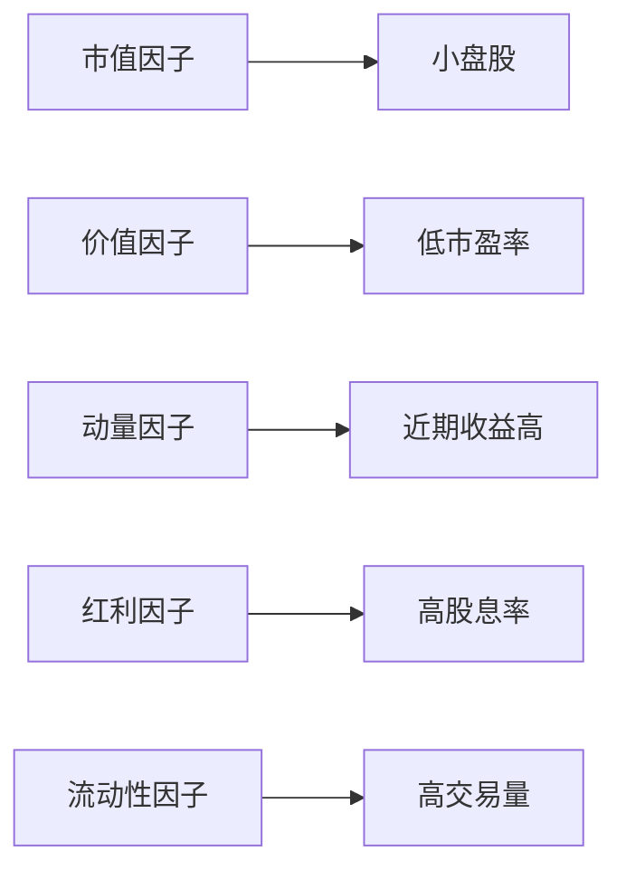

                 


# 因子投资：系统性捕捉超额收益的方法

> 关键词：因子投资，超额收益，量化交易，投资组合，风险管理

> 摘要：因子投资是一种通过系统性分析和选择特定因子来构建投资组合的方法，旨在捕捉市场中的超额收益。本文将从因子投资的背景与基础出发，深入探讨其核心概念、数学模型、算法原理、系统架构以及项目实战，最终总结最佳实践和未来发展趋势。通过详细的理论分析和实际案例，本文将为读者提供一个全面的视角，帮助其掌握因子投资的系统性方法。

---

## 第一部分: 因子投资的背景与基础

### 第1章: 因子投资的定义与背景

#### 1.1 因子投资的定义
##### 1.1.1 什么是因子投资
因子投资是一种基于特定金融变量（如市值、价值、动量等）构建投资组合的方法，旨在通过系统性地分析这些变量的定价能力，捕捉市场中的超额收益。

##### 1.1.2 因子投资与传统投资的区别
- **传统投资**：依赖于基本面分析或技术分析，投资决策基于个体证券的分析。
- **因子投资**：从整体市场中寻找具有共同特征的因子，通过组合这些因子来优化收益和风险。

##### 1.1.3 因子投资的核心目标
通过系统性地选择具有超额收益潜力的因子，构建投资组合，实现长期稳定的收益。

#### 1.2 因子投资的历史发展
##### 1.2.1 因子投资的起源
因子投资的起源可以追溯到20世纪60年代，威廉·夏普提出了资本资产定价模型（CAPM），为因子投资奠定了理论基础。

##### 1.2.2 因子投资的发展阶段
- **早期阶段**：基于CAPM模型，提出单因子模型。
- **发展阶段**：Fama-French提出三因子模型，引入规模和价值因子。
- **现代阶段**：多因子模型的广泛应用，以及机器学习在因子选择中的应用。

##### 1.2.3 当前因子投资的现状
因子投资已经成为量化投资的重要组成部分，广泛应用于机构投资和个人投资者的策略中。

#### 1.3 因子投资在金融领域的重要性
##### 1.3.1 因子投资对投资决策的影响
因子投资通过系统化的方法，帮助投资者识别市场中的结构性机会和风险。

##### 1.3.2 因子投资在量化交易中的应用
量化交易依赖于因子投资，通过算法交易实现对因子组合的快速响应。

##### 1.3.3 因子投资的未来趋势
随着人工智能和大数据技术的发展，因子投资将更加精细化和个性化。

---

### 第2章: 因子投资的核心概念

#### 2.1 因子的分类与特征
##### 2.1.1 常见的因子类型
- **市值因子（Size）**：小盘股相对于大盘股的收益差异。
- **价值因子（Value）**：低市盈率、低市净率股票的收益差异。
- **动量因子（Momentum）**：近期价格走势强劲的股票可能继续表现出色。
- **红利因子（Dividend Yield）**：高股息率股票的收益差异。
- **流动性因子（Liquidity）**：高流动性的股票表现优于低流动性股票。

##### 2.1.2 每个因子的特征与属性
| 因子类型 | 主要特征 | 计算方法 | 优缺点 |
|----------|----------|----------|--------|
| 市值因子 | 小盘股收益较高 | 市值（Market Cap） | 中小盘股波动较大，风险较高 |
| 价值因子 | 低市盈率、低市净率股票收益较高 | 市盈率（P/E）、市净率（P/B） | 易受市场情绪影响 |
| 动量因子 | 近期表现好的股票未来表现较好 | 过去12个月的收益 | 易受短期市场波动影响 |
| 红利因子 | 高股息率股票收益较高 | 股息率（Dividend Yield） | 高分红股票流动性可能较差 |
| 流动性因子 | 高流动性股票收益较高 | 交易量、换手率 | 高流动性股票可能被过度交易 |

##### 2.1.3 因子之间的关系与对比
通过Mermaid图展示因子之间的关系：



#### 2.2 因子投资的核心原理
##### 2.2.1 因子选择的逻辑
因子选择的逻辑基于因子的定价能力，即因子能够解释股票收益的能力。通过回归分析，筛选出具有显著定价能力的因子。

##### 2.2.2 因子权重的确定方法
- **等权法**：每个因子在组合中的权重相等。
- **市值加权法**：根据因子的市值大小确定权重。
- **风险加权法**：根据因子的风险程度进行加权。

##### 2.2.3 因子组合的构建策略
- **单因子策略**：仅选择一个因子进行投资。
- **多因子策略**：组合多个因子，优化风险和收益。
- **因子轮动策略**：根据市场变化动态调整因子权重。

#### 2.3 因子投资的风险与收益
##### 2.3.1 因子投资的收益来源
- **因子的定价能力**：因子能够解释股票收益的能力。
- **因子的分散化效应**：通过组合多个因子降低风险。

##### 2.3.2 因子投资的主要风险
- **因子失效风险**：市场变化导致因子的定价能力下降。
- **过度拟合风险**：模型在历史数据上表现优异，但在未来可能失效。
- **流动性风险**：部分因子可能涉及低流动性股票，导致难以快速买卖。

##### 2.3.3 如何平衡风险与收益
- **风险调整收益法**：使用夏普比率、特雷诺比率等指标衡量风险调整后的收益。
- **动态调整法**：定期重新优化因子组合，应对市场变化。

---

### 第3章: 因子投资的数学模型与公式

#### 3.1 因子模型的构建
##### 3.1.1 单因子模型
单因子模型假设股票收益仅由一个因子决定，常用CAPM模型表示：

$$ R_i = R_f + \beta_i (R_m - R_f) $$

其中：
- \( R_i \) 为股票i的收益
- \( R_f \) 为无风险利率
- \( R_m \) 为市场收益
- \( \beta_i \) 为股票i的贝塔系数

##### 3.1.2 多因子模型
多因子模型假设股票收益由多个因子共同决定，常用Fama-French三因子模型表示：

$$ R_i = R_f + \beta_{i1} (F_1 - R_f) + \beta_{i2} (F_2 - R_f) + \beta_{i3} (F_3 - R_f) $$

其中：
- \( F_1 \)、\( F_2 \)、\( F_3 \) 分别为规模因子、价值因子和动量因子

##### 3.1.3 因子模型的数学表达式
通过线性回归模型构建因子模型：

$$ R_i = \alpha + \beta_1 F_1 + \beta_2 F_2 + \ldots + \beta_n F_n + \epsilon $$

其中：
- \( \alpha \) 为截距
- \( \beta_j \) 为因子j的回归系数
- \( \epsilon \) 为误差项

#### 3.2 因子投资的数学公式
##### 3.2.1 因子收益的计算公式
因子收益可以通过以下公式计算：

$$ R_F = \sum_{i=1}^n w_i R_i $$

其中：
- \( w_i \) 为因子i的权重
- \( R_i \) 为因子i的收益

##### 3.2.2 因子组合的优化公式
通过均值-方差优化模型，优化因子组合的风险和收益：

$$ \min \sigma^2 \quad \text{subject to} \quad \mu \geq \text{目标收益} $$

其中：
- \( \sigma^2 \) 为组合的方差
- \( \mu \) 为组合的期望收益

##### 3.2.3 因子权重的调整公式
根据因子的定价能力和风险特征，动态调整因子权重：

$$ w_i = \frac{e_i}{\sum_{j=1}^n e_j} $$

其中：
- \( e_i \) 为因子i的定价能力评分
- 分母为所有因子评分的总和

---

### 第4章: 因子投资的系统架构与设计

#### 4.1 系统功能设计
##### 4.1.1 数据采集模块
- 数据源：股票价格、财务数据、市场数据等。
- 数据处理：清洗、转换、标准化。

##### 4.1.2 因子计算模块
- 计算各个因子值（如市值、价值因子等）。
- 数据存储：因子值的存储与管理。

##### 4.1.3 因子模型构建模块
- 构建单因子或多因子模型。
- 模型优化：参数调整、模型验证。

##### 4.1.4 投资组合优化模块
- 组合优化：基于因子模型构建最优投资组合。
- 风险控制：控制组合的风险，如最大回撤、VaR等。

##### 4.1.5 回测与分析模块
- 回测策略：历史数据回测，验证策略的有效性。
- 性能分析：计算收益、风险指标，如夏普比率、最大回撤等。

#### 4.2 系统架构设计
##### 4.2.1 系统架构图
通过Mermaid图展示系统架构：


##### 4.2.2 系统接口设计
- 数据接口：与数据源对接，获取实时数据。
- 计算接口：因子计算模块与其他模块的交互接口。
- 优化接口：投资组合优化模块与回测模块的交互接口。

##### 4.2.3 系统交互流程
通过Mermaid图展示系统交互流程：


---

### 第5章: 因子投资的项目实战

#### 5.1 环境安装与数据准备
##### 5.1.1 环境安装
- 安装Python、Pandas、NumPy、Scikit-learn等库。
- 安装数据获取工具，如Yahoo Finance API。

##### 5.1.2 数据准备
- 下载历史数据：包括股票价格、财务数据等。
- 数据清洗：处理缺失值、异常值。

#### 5.2 因子计算与模型构建
##### 5.2.1 计算因子值
```python
import pandas as pd
import numpy as np

# 假设data是一个包含股票数据的DataFrame
data['市值'] = data['收盘价'] * data['成交量']
data['市盈率'] = data['股价'] / data['每股收益']
# 其他因子的计算类似
```

##### 5.2.2 构建因子模型
```python
from sklearn.linear_model import LinearRegression

model = LinearRegression()
model.fit(X, y)
# X为因子矩阵，y为目标收益
```

##### 5.2.3 优化因子组合
```python
import cvxopt

# 优化目标：最小化方差
# 约束条件：收益等于目标收益
# 使用CVXOPT进行优化
```

#### 5.3 代码实现与案例分析
##### 5.3.1 代码实现
```python
def calculate_factor_returns(factor_data):
    returns = factor_data.mean(axis=1)
    return returns

def optimize_portfolio(factor_returns, target_return):
    n = factor_returns.shape[1]
    m = cvxopt.matrix(factor_returns.T, n)
    # 其他优化代码...
```

##### 5.3.2 案例分析
通过实际案例分析，验证因子投资策略的有效性：

- 选择特定因子，构建投资组合。
- 回测策略，计算收益与风险指标。
- 比较不同因子策略的性能。

#### 5.4 项目小结
通过项目实战，掌握因子投资的实现步骤，理解因子选择、模型构建和组合优化的关键点。

---

### 第6章: 因子投资的案例分析与最佳实践

#### 6.1 案例分析
##### 6.1.1 实际应用中的因子选择
- 根据市场环境选择合适的因子。
- 动态调整因子权重。

##### 6.1.2 案例分析与结果展示
- 展示因子组合的收益与风险指标。
- 对比不同因子策略的回测结果。

#### 6.2 最佳实践
##### 6.2.1 注意事项
- 避免过度拟合，确保策略的稳健性。
- 定期重新优化因子组合，应对市场变化。
- 注意交易成本和流动性风险。

##### 6.2.2 小结
因子投资是一种系统性捕捉超额收益的有效方法，但需要结合实际市场环境和投资者目标进行灵活应用。

---

## 第七章: 因子投资的未来发展趋势

#### 7.1 人工智能与因子投资的结合
- 机器学习在因子选择中的应用。
- 深度学习模型用于预测因子收益。

#### 7.2 大数据技术在因子投资中的应用
- 利用大数据分析更多潜在因子。
- 增强因子模型的复杂性和精细度。

#### 7.3 因子投资的全球化与本地化
- 全球市场因子投资的差异与统一。
- 区域市场的因子策略优化。

#### 7.4 因子投资的智能化与自动化
- 智能化因子选择算法。
- 自动化投资组合优化工具。

---

## 作者

作者：AI天才研究院/AI Genius Institute & 禅与计算机程序设计艺术 /Zen And The Art of Computer Programming

