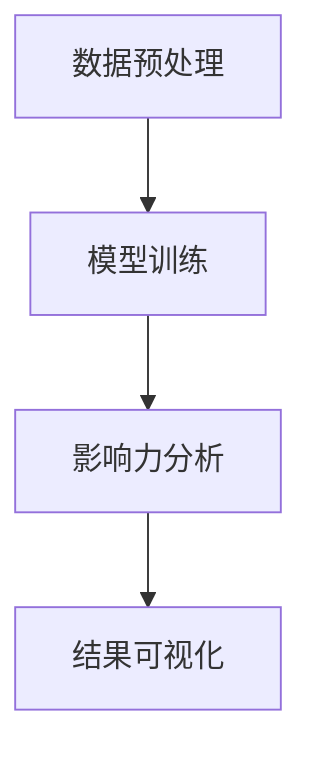

                 


# 图注意力网络在金融影响力分析中的应用

> **关键词**：图注意力网络，金融影响力分析，节点表示，注意力机制，深度学习，金融风险

> **摘要**：  
本文系统地探讨了图注意力网络（Graph Attention Network, GAN）在金融影响力分析中的应用。我们从金融市场的复杂性入手，分析了传统方法的局限性，引入了图注意力网络的核心概念与算法原理。通过构建基于图注意力网络的影响力分析系统，我们提出了一种高效、精准的影响力评估方法，并通过实际案例展示了其在金融风险预警、市场情绪分析等场景中的优势。本文还详细讨论了系统的实现细节，包括数据预处理、模型训练与部署，以及实际应用中的优化策略。

---

## 第1章 图注意力网络与金融影响力分析概述

### 1.1 问题背景与研究意义

#### 1.1.1 问题背景
金融市场的复杂性使得传统的影响力分析方法难以捕捉非线性关系。金融市场中的影响力分析涉及多个维度，包括市场情绪、投资者行为、机构影响力等。传统的统计方法和浅层学习模型在处理这些复杂关系时表现有限，难以应对金融市场的动态变化。

#### 1.1.2 研究意义
图注意力网络通过结合图结构和注意力机制，能够更好地捕捉金融市场的复杂关系。通过引入注意力机制，模型可以聚焦于对目标节点影响力最大的邻居节点，从而提高模型的精度和效率。

#### 1.1.3 创新点与应用价值
本文的创新点在于将图注意力网络引入金融影响力分析，提出了一种基于节点表示的学习方法，能够有效识别关键节点及其影响力传播路径。该方法在金融风险预警、市场情绪分析等领域具有广泛的应用潜力。

### 1.2 图注意力网络的基本概念

#### 1.2.1 图结构与节点关系
图结构通过节点和边描述金融市场的参与者及其关系。节点代表市场中的个体（如公司、投资者），边表示它们之间的交互或关联。

#### 1.2.2 注意力机制的引入
注意力机制通过计算节点之间的注意力权重，捕捉节点之间的关系强度。在金融影响力分析中，注意力权重反映了节点对目标节点的影响力大小。

#### 1.2.3 图注意力网络的定义与特点
图注意力网络是一种结合图结构和注意力机制的深度学习模型，能够通过端到端的训练过程，自动学习节点的表示和影响力传播路径。

### 1.3 金融影响力分析的场景与应用

#### 1.3.1 金融市场的影响力传播
通过图注意力网络，我们可以分析市场中关键节点的影响力传播路径，识别系统性风险的来源。

#### 1.3.2 机构投资者的影响力评估
机构投资者在金融市场中具有重要的影响力。通过图注意力网络，我们可以评估机构投资者的影响力大小，并预测其对市场的影响。

#### 1.3.3 金融风险的传导机制
图注意力网络可以用于分析金融风险的传导机制，识别风险传播的关键路径，从而制定有效的风险管理策略。

---

## 第2章 图注意力网络的原理

### 2.1 图结构与节点表示

#### 2.1.1 图的基本概念与表示方法
图由节点和边组成，节点代表市场中的个体，边表示它们之间的关系。图的表示方式包括邻接矩阵和边列表。

#### 2.1.2 节点表示的挑战与解决方案
传统的节点表示方法难以捕捉图中的非线性关系。通过引入深度学习模型，我们可以学习节点的低维表示，捕捉图中的复杂结构。

### 2.2 注意力机制的原理

#### 2.2.1 注意力机制的起源与核心思想
注意力机制最初用于自然语言处理领域，通过计算词与词之间的注意力权重，捕捉语义关系。其核心思想是通过加权聚合的方式，聚焦于重要的信息。

#### 2.2.2 图注意力机制的数学表达
图注意力机制的注意力权重计算公式为：
$$
\text{Attention}(i,j) = \text{softmax}(\frac{W_i^T W_j}{\sqrt{d}})
$$
其中，$W_i$ 和 $W_j$ 是节点 $i$ 和 $j$ 的嵌入向量，$d$ 是嵌入维度。

### 2.3 图注意力网络的模型结构

#### 2.3.1 基于GCN的注意力网络
基于图卷积网络（GCN）的注意力网络结合了图卷积操作和注意力机制，能够更好地捕捉图中的局部结构信息。

#### 2.3.2 图注意力网络的变体与改进
图注意力网络的变体包括自注意力网络（Self-Attention）、图注意力编码器-解码器（Encoder-Decoder）等。这些变体在不同的金融应用场景中表现出不同的优势。

---

## 第3章 图注意力网络的算法实现

### 3.1 图注意力网络的数学模型

#### 3.1.1 图注意力机制的公式推导
图注意力机制的核心公式为：
$$
\text{Attention}(i,j) = \text{softmax}(\frac{W_i^T W_j}{\sqrt{d}})
$$
其中，$W_i$ 和 $W_j$ 是节点 $i$ 和 $j$ 的嵌入向量，$\sqrt{d}$ 是嵌入维度的归一化因子。

#### 3.1.2 图注意力网络的损失函数
图注意力网络的损失函数可以采用交叉熵损失：
$$
\mathcal{L} = -\sum_{i=1}^{n} \sum_{j=1}^{n} y_{ij} \log p(y_{ij})
$$
其中，$y_{ij}$ 是节点 $i$ 和 $j$ 之间的标签，$p(y_{ij})$ 是模型预测的概率。

### 3.2 系统架构与设计

#### 3.2.1 系统功能设计
系统功能包括数据预处理、模型训练、影响力分析、结果可视化等模块。

#### 3.2.2 系统架构图


### 3.3 算法实现细节

#### 3.3.1 环境配置
- Python 3.8+
- PyTorch 1.9+
- NetworkX 2.8+

#### 3.3.2 核心代码实现
```python
import torch
import torch.nn as nn
import torch.nn.functional as F

class GraphAttention(nn.Module):
    def __init__(self, in_features, out_features):
        super(GraphAttention, self).__init__()
        self.W = nn.Linear(in_features, out_features)
    
    def forward(self, x, adj):
        # x: (n, in_features), adj: (n, n)
        x_proj = self.W(x)
        attention = F.softmax(torch.mm(x_proj, x_proj.T), dim=-1)
        output = torch.mm(attention, x)
        return output
```

---

## 第4章 项目实战与实现

### 4.1 环境配置与数据预处理

#### 4.1.1 环境配置
```bash
pip install torch==1.9.0
pip install networkx==2.8.0
pip install matplotlib==3.5.1
```

#### 4.1.2 数据预处理
使用金融市场的交易数据，构建图结构。节点代表公司，边代表公司之间的关联（如持股关系）。

### 4.2 模型训练与部署

#### 4.2.1 模型训练
```python
model = GraphAttention(64, 32)
optimizer = torch.optim.Adam(model.parameters(), lr=0.001)
criterion = nn.CrossEntropyLoss()

for epoch in range(100):
    outputs = model(x, adj)
    loss = criterion(outputs, labels)
    optimizer.zero_grad()
    loss.backward()
    optimizer.step()
```

#### 4.2.2 模型部署
将训练好的模型部署到生产环境中，实时分析金融市场的影响力变化。

### 4.3 实际案例分析

#### 4.3.1 案例背景
分析某次金融危机中各机构的影响力传播路径。

#### 4.3.2 模型预测与结果解读
通过模型预测，识别出关键的影响力节点，并分析其对市场的影响。

---

## 第5章 优化与展望

### 5.1 现有方法的局限性

#### 5.1.1 计算复杂度问题
图注意力网络的计算复杂度较高，难以处理大规模金融图数据。

#### 5.1.2 模型可解释性问题
注意力机制的权重计算可能缺乏直观的解释性，影响模型的可信度。

### 5.2 优化方向与策略

#### 5.2.1 引入轻量化模型
通过引入轻量化模型（如图卷积网络的变体），降低计算复杂度。

#### 5.2.2 提升模型可解释性
通过引入可解释性增强方法（如注意力权重可视化），提高模型的可信度。

### 5.3 未来研究方向

#### 5.3.1 多模态数据融合
将文本、图像等多模态数据与图数据结合，提升影响力分析的精度。

#### 5.3.2 实时分析与动态更新
研究如何实时更新模型参数，适应金融市场的动态变化。

---

## 结语

图注意力网络为金融影响力分析提供了新的思路和方法。通过引入图结构和注意力机制，我们能够更精准地捕捉金融市场的复杂关系，识别关键节点和影响力传播路径。未来，随着深度学习技术的不断发展，图注意力网络将在金融领域发挥更大的作用。

---

## 作者

**作者：AI天才研究院 & 禅与计算机程序设计艺术**  
欢迎关注我们的技术博客，获取更多关于人工智能与编程的深度内容。

