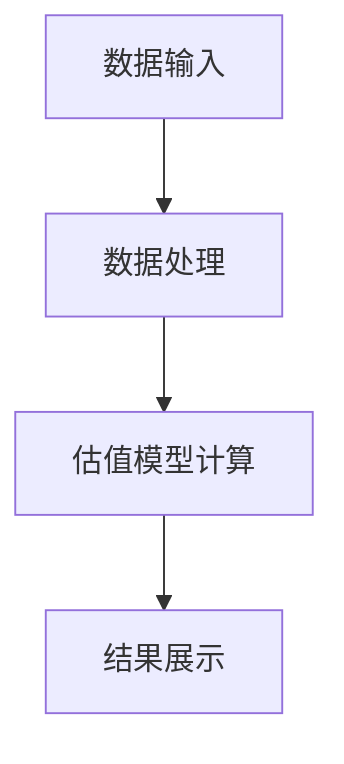

                 

# 土耳其股市估值:欧亚交界的新兴市场

> 关键词：土耳其股市，股市估值，新兴市场，地缘政治，经济结构，金融分析

> 摘要：本文深入探讨土耳其股市的估值方法，结合其作为新兴市场在欧亚交界的特殊地位，分析其独特的经济结构和地缘政治对股市估值的影响。通过系统化的分析和案例研究，本文旨在为投资者提供一套科学的估值框架，帮助他们在复杂多变的市场环境中做出明智的投资决策。

---

## 第1章：土耳其股市的概况与历史演变

### 1.1 土耳其股市的概况

#### 1.1.1 土耳其股市的基本介绍
土耳其股市是新兴市场中的重要组成部分，其历史可以追溯到19世纪末。 Istanbul Stock Exchange（ISE）是土耳其的主要证券交易所，也是中东和北非地区最具影响力的交易所之一。土耳其股市的参与者包括个人投资者、机构投资者、外国投资者和政府机构。

#### 1.1.2 土耳其股市的历史发展
土耳其股市经历了多次改革和重组，尤其是在20世纪80年代，土耳其政府推行了一系列市场开放政策，吸引了大量外国投资者。近年来，土耳其股市的表现受到地缘政治和经济政策的双重影响。

#### 1.1.3 土耳其股市在欧亚市场中的地位
作为连接欧洲和亚洲的桥梁，土耳其股市在欧亚市场中具有独特的地位。其地理位置使其成为投资者关注的焦点，同时也面临更多的不确定性。

### 1.2 土耳其股市的市场结构

#### 1.2.1 土耳其股市的主要参与者
土耳其股市的主要参与者包括：
1. 个人投资者：占市场交易量的大部分。
2. 机构投资者：包括基金、保险公司和资产管理公司。
3. 外国投资者：近年来，外国投资者在土耳其股市中的占比显著增加。
4. 政府机构：土耳其政府通过国有银行间接参与股市。

#### 1.2.2 土耳其股市的主要指数
土耳其股市的主要指数包括：
1. Istanbul Stock Exchange 30（ISE 30）：由30家流动性最高的公司组成。
2. Istanbul Stock Exchange National 100（ISE 100）：由100家最具代表性的公司组成。

#### 1.2.3 土耳其股市的交易机制
土耳其股市的交易机制与国际接轨，采用电子化交易系统，交易时间为周一至周五，每天上午9:30至下午3:30。

---

## 第2章：土耳其股市估值的核心概念与背景

### 2.1 股市估值的基本原理

#### 2.1.1 股票估值的定义与意义
股票估值是指通过对公司的财务数据、市场环境和行业趋势进行分析，确定股票的内在价值。其意义在于帮助投资者做出合理的投资决策。

#### 2.1.2 股票估值的主要方法
股票估值的主要方法包括：
1. 市盈率（P/E）法：通过比较市盈率与行业平均水平，判断股票的估值。
2. 市净率（P/B）法：通过比较市净率与行业平均水平，判断股票的估值。
3. 现金流量折现模型（DCF）：通过预测公司的未来现金流，计算其内在价值。

#### 2.1.3 股票估值的关键因素
股票估值的关键因素包括：
1. 公司的财务状况。
2. 行业的竞争格局。
3. 宏观经济环境。

### 2.2 土耳其股市估值的特殊性

#### 2.2.1 土耳其市场的地缘政治影响
土耳其位于欧亚交界处，其地缘政治地位使其面临更多的不确定性。地缘政治风险对股市估值的影响不容忽视。

#### 2.2.2 土耳其市场的经济结构特点
土耳其经济以制造业和服务业为主，同时受到通货膨胀和汇率波动的影响较大。

#### 2.2.3 土耳其市场的投资者行为特征
土耳其股市的投资者行为具有一定的周期性，尤其是在选举周期和重大事件期间，投资者情绪波动较大。

---

## 第3章：土耳其股市估值的基本原理

### 3.1 股票估值的核心公式

#### 3.1.1 股票内在价值的计算公式
股票的内在价值可以通过以下公式计算：
$$
\text{内在价值} = \frac{\text{未来现金流}}{\text{折现率}}
$$

#### 3.1.2 市盈率（P/E）的计算与应用
市盈率的计算公式为：
$$
\text{P/E} = \frac{\text{股价}}{\text{每股收益}}
$$
市盈率越低，通常意味着股票的估值越低。

#### 3.1.3 市净率（P/B）的计算与应用
市净率的计算公式为：
$$
\text{P/B} = \frac{\text{股价}}{\text{每股净资产}}
$$
市净率越低，通常意味着股票的估值越低。

### 3.2 土耳其股市估值的特殊因素

#### 3.2.1 土耳其里拉的汇率波动影响
土耳其里拉的汇率波动对股市估值的影响较大，尤其是在外资大量流入或流出时。

#### 3.2.2 土耳其市场的通货膨胀压力
土耳其的通货膨胀率较高，这对股市估值提出了更高的要求。

#### 3.2.3 土耳其市场的政策风险
土耳其政府的政策变化对股市估值的影响不容忽视，尤其是在经济政策和外交政策方面。

---

## 第4章：土耳其股市估值的关键指标与分析

### 4.1 股票估值的关键指标

#### 4.1.1 市盈率（P/E）分析
市盈率是衡量股票估值的重要指标，通常用于比较不同公司的估值水平。

#### 4.1.2 市净率（P/B）分析
市净率是衡量股票估值的另一个重要指标，尤其适用于资产密集型行业。

#### 4.1.3 股息率（Dividend Yield）分析
股息率是衡量股票收益能力的重要指标，通常用于比较不同股票的收益水平。

### 4.2 土耳其股市估值的行业差异

#### 4.2.1 银行业与房地产行业的估值差异
银行业和房地产行业在土耳其股市中占据重要地位，但其估值方法存在差异。

#### 4.2.2 制造业与科技行业的估值差异
制造业和科技行业在土耳其股市中也存在较大的估值差异。

#### 4.2.3 消费品行业的估值特点
消费品行业在土耳其股市中的估值通常较为稳定，但也受到通货膨胀的影响。

---

## 第5章：土耳其股市估值的实战分析与案例

### 5.1 股票估值的基本步骤

#### 5.1.1 确定公司的基本面数据
基本面数据包括公司的收入、利润、资产和负债等。

#### 5.1.2 选择合适的估值方法
根据公司的特点选择合适的估值方法，如市盈率法或DCF模型。

#### 5.1.3 考虑市场环境的特殊影响
考虑地缘政治和经济政策等市场环境因素对估值的影响。

### 5.2 土耳其股市估值的行业案例分析

#### 5.2.1 银行业案例：土耳其银行的估值分析
以某家土耳其银行为例，分析其市盈率和市净率的水平。

#### 5.2.2 地产行业案例：土耳其地产公司的估值分析
以某家土耳其地产公司为例，分析其市盈率和市净率的水平。

#### 5.2.3 制造业案例：土耳其制造业企业的估值分析
以某家土耳其制造业企业为例，分析其市盈率和市净率的水平。

---

## 第6章：土耳其股市估值的数学模型与公式

### 6.1 常用估值模型的数学表达

#### 6.1.1 市盈率模型
市盈率模型的数学表达为：
$$
\text{内在价值} = \text{每股收益} \times \text{行业平均市盈率}
$$

#### 6.1.2 市净率模型
市净率模型的数学表达为：
$$
\text{内在价值} = \text{每股净资产} \times \text{行业平均市净率}
$$

#### 6.1.3 现金流量折现模型（DCF）
DCF模型的数学表达为：
$$
\text{内在价值} = \sum_{t=1}^{n} \frac{\text{自由现金流}}{(1 + r)^t} + \frac{\text{终值}}{(1 + r)^n}
$$
其中，\( r \) 是折现率，\( n \) 是预测期数。

### 6.2 土耳其股市估值的特殊调整公式

#### 6.2.1 汇率调整对估值的影响
汇率调整对估值的影响可以通过以下公式计算：
$$
\text{调整后的估值} = \text{原估值} \times \text{汇率变动系数}
$$

#### 6.2.2 通货膨胀对估值的调整
通货膨胀对估值的调整可以通过以下公式计算：
$$
\text{调整后的估值} = \text{原估值} \times \text{通货膨胀率调整系数}
$$

#### 6.2.3 政策风险对估值的调整
政策风险对估值的调整可以通过以下公式计算：
$$
\text{调整后的估值} = \text{原估值} \times \text{政策风险调整系数}
$$

---

## 第7章：土耳其股市估值的系统架构与案例实现

### 7.1 系统架构设计

#### 7.1.1 估值系统的需求分析
系统需求包括数据采集、估值模型计算和结果展示。

#### 7.1.2 估值系统的功能设计
系统功能包括数据输入、模型选择、计算结果展示和报告生成。

#### 7.1.3 估值系统的架构图
以下是系统的架构图：

### 7.2 系统实现与案例分析

#### 7.2.1 数据收集与处理
数据包括公司财务数据、市场数据和宏观经济数据。

#### 7.2.2 估值模型的实现
实现市盈率、市净率和DCF模型的计算。

#### 7.2.3 案例分析与结果解读
以某家土耳其公司为例，分析其估值结果。

---

## 第8章：总结与展望

### 8.1 总结
土耳其股市估值是一个复杂的过程，需要考虑多种因素。本文通过系统化的分析和案例研究，为投资者提供了一套科学的估值框架。

### 8.2 展望
未来，随着土耳其市场的进一步开放和全球经济的不确定性增加，股市估值的方法和工具也将不断改进。投资者需要密切关注市场动态，灵活调整投资策略。

---

## 附录

### 附录A：数据来源与工具推荐
推荐使用以下工具进行股市估值：
1. Bloomberg
2. Yahoo Finance
3. Excel

### 附录B：常用术语解释
1. 市盈率（P/E）：股价与每股收益的比率。
2. 市净率（P/B）：股价与每股净资产的比率。

---

作者：AI天才研究院/AI Genius Institute & 禅与计算机程序设计艺术 /Zen And The Art of Computer Programming

