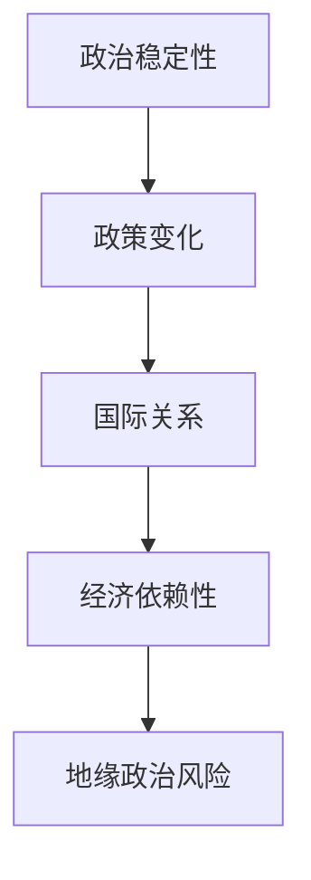

                 


# 地缘政治风险定价：如何在投资决策中考虑政治因素

**关键词：** 地缘政治风险、投资决策、政治因素、风险定价、模型构建、数据驱动

**摘要：** 地缘政治风险是投资决策中不可忽视的重要因素。本文将从定义、构成要素、定价模型、系统架构设计、项目实战等多方面详细分析地缘政治风险在投资中的影响及应对策略，帮助投资者更好地理解和应用地缘政治风险定价。

---

## 第一部分: 地缘政治风险定价概述

### 第1章: 地缘政治风险的定义与背景

#### 1.1 地缘政治风险的核心概念
地缘政治风险是指由于政治因素（如战争、政策变化、国际关系紧张等）对企业或资产造成的影响。这种风险不仅影响企业的经营环境，还可能对资产价格产生重大影响。地缘政治风险具有隐蔽性、不可预测性和长期性的特点，需要投资者在决策中充分考虑。

#### 1.2 地缘政治风险的分类与特征
地缘政治风险可以分为国家风险、主权风险和政治风险。国家风险主要指由于国家政策变化或政治动荡对企业的影响；主权风险涉及主权国家的债务违约风险；政治风险则包括政策变化、法律变更等。

#### 1.3 地缘政治风险与投资决策的关系
地缘政治风险直接影响资产的估值和投资回报。投资者需要通过分析地缘政治风险，调整投资组合，选择风险较低的资产，从而降低潜在损失。

---

### 第2章: 地缘政治风险的构成要素

#### 2.1 地缘政治风险的构成要素
地缘政治风险的构成要素包括政治稳定性、政策变化、国际关系和经济依赖性。

- **政治稳定性**：国家的政治稳定性直接影响投资环境的稳定性。
- **政策变化**：政府政策的变化可能对行业或企业产生重大影响。
- **国际关系**：国际贸易关系和地缘政治紧张可能引发市场波动。
- **经济依赖性**：经济对某些国家或行业的依赖性越高，地缘政治风险越大。

#### 2.2 地缘政治风险的实体关系图


---

## 第二部分: 地缘政治风险定价模型

### 第3章: 地缘政治风险定价模型

#### 3.1 地缘政治风险定价的基本原理
风险定价是将风险因素量化为具体的数值，用于评估资产价值。地缘政治风险定价的基本公式为：
$$ \text{风险价值} = \text{资产价值} \times \text{风险系数} $$

#### 3.2 地缘政治风险定价的数学模型
- **贝叶斯网络模型**：通过分析事件发生的概率，构建风险系数。
  ```mermaid
  graph LR
      A[事件概率] --> B[风险系数]
      B --> C[资产价值]
      C --> D[风险价值]
  ```
- **回归分析模型**：通过回归分析，确定风险因素对资产价值的影响。
  $$ \text{风险价值} = \beta_0 + \beta_1 \times \text{风险系数} + \epsilon $$

---

## 第三部分: 系统分析与架构设计

### 第4章: 地缘政治风险的系统架构设计

#### 4.1 系统架构设计


#### 4.2 接口设计
- 数据接口：与外部数据源（如政府数据、新闻媒体）交互，获取地缘政治风险相关数据。
- 风险报告接口：生成风险评估报告，供投资者参考。

---

## 第四部分: 项目实战

### 第5章: 地缘政治风险的项目实战

#### 5.1 环境配置
- 数据来源：政府公告、新闻媒体、行业报告。
- 工具：Python、Pandas、Matplotlib、Scikit-learn。

#### 5.2 代码实现
```python
import pandas as pd
import numpy as np
from sklearn.linear_model import LinearRegression

# 示例数据
data = pd.DataFrame({
    '风险系数': [0.2, 0.3, 0.1, 0.4, 0.5],
    '资产价值': [100, 150, 80, 200, 250]
})

# 回归分析模型
model = LinearRegression()
model.fit(data[['风险系数']], data['资产价值'])

# 预测风险价值
new_risk = 0.3
predicted_value = model.predict([[new_risk]])
print(predicted_value)
```

#### 5.3 案例分析
以某国家的政治动荡为例，分析其对本国企业的投资影响。通过模型计算风险系数，调整投资组合，降低潜在损失。

---

## 第五部分: 总结与展望

### 5.1 总结
地缘政治风险是投资决策中的重要因素。本文通过定义、构成要素、定价模型和系统架构设计，详细分析了地缘政治风险的影响及应对策略。

### 5.2 注意事项
- 数据来源的准确性：确保数据的可靠性和全面性。
- 模型的适用性：根据不同场景选择合适的模型。
- 风险监控：持续监控地缘政治风险的变化，及时调整投资策略。

### 5.3 拓展阅读
- 建议阅读相关书籍：《投资学》、《风险管理》。

---

**作者：AI天才研究院/AI Genius Institute & 禅与计算机程序设计艺术/Zen And The Art of Computer Programming**

