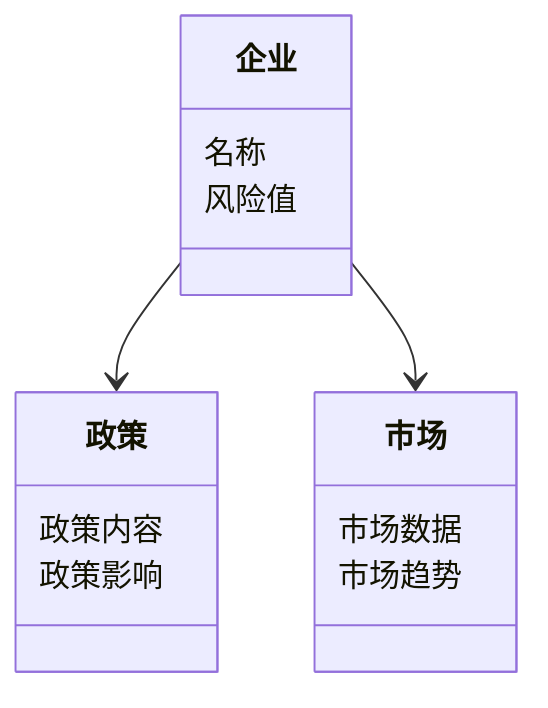
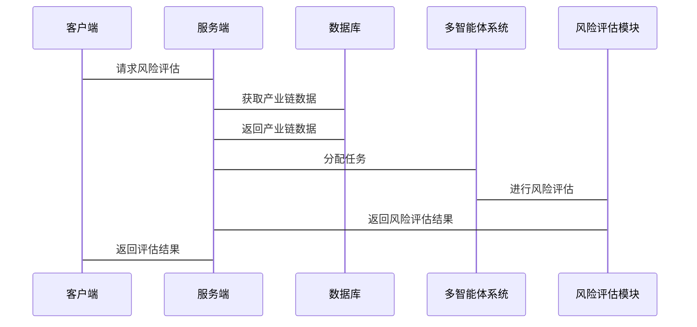

                 


# 基于多智能体的动态产业链风险评估模型

> 关键词：多智能体系统、动态产业链、风险评估、D-S证据理论、系统架构

> 摘要：本文详细探讨了基于多智能体的动态产业链风险评估模型的设计与实现。通过分析多智能体系统的动态性和复杂性，结合动态产业链的特点，提出了基于D-S证据理论的动态风险评估算法。文章内容包括多智能体系统的核心概念、动态产业链的实体关系、算法原理、系统架构设计、项目实战及最佳实践。

---

# 第1章: 多智能体系统与动态产业链风险评估概述

## 1.1 多智能体系统的定义与特点

### 1.1.1 多智能体系统的定义
多智能体系统（Multi-Agent System, MAS）是由多个智能体组成的分布式系统，每个智能体都是一个能够独立感知环境、自主决策并执行任务的实体。这些智能体通过通信和协作完成复杂的任务。

### 1.1.2 多智能体系统的五大特点
1. **自主性**：智能体能够自主决策，无需外部干预。
2. **反应性**：智能体能够实时感知环境变化并做出响应。
3. **协作性**：智能体之间可以通过通信协作完成共同目标。
4. **分布式性**：智能体之间没有中心化的控制节点。
5. **动态性**：智能体的行为和环境都是动态变化的。

### 1.1.3 多智能体系统与传统单智能体系统的区别
传统单智能体系统依赖中心化的控制节点，而多智能体系统通过去中心化的协作实现目标。多智能体系统能够更好地应对复杂、动态的环境。

---

## 1.2 动态产业链的定义与特点

### 1.2.1 动态产业链的定义
动态产业链是指在复杂经济环境中，由多个企业、供应商、消费者等组成的动态网络，其结构和关系会随着时间推移而变化。

### 1.2.2 动态产业链的核心特征
1. **动态性**：产业链结构和关系随市场变化而调整。
2. **复杂性**：产业链涉及多个参与方，关系错综复杂。
3. **风险传播性**：一个节点的风险可能迅速传播到整个产业链。

### 1.2.3 动态产业链与静态产业链的区别
静态产业链的结构和关系固定，而动态产业链具有高度的动态性和适应性。

---

## 1.3 多智能体系统在动态产业链风险评估中的优势

### 1.3.1 多智能体系统的优势
1. **分布式计算**：能够处理大规模数据和复杂任务。
2. **动态适应性**：能够实时感知和响应环境变化。
3. **协作性**：多个智能体可以协同工作，提高整体效率。

### 1.3.2 动态产业链风险评估的难点
1. **数据复杂性**：产业链涉及多方数据，难以统一建模。
2. **动态性**：风险传播路径和影响范围动态变化。
3. **实时性**：需要快速评估和应对风险。

### 1.3.3 多智能体系统在动态产业链风险评估中的应用价值
通过多智能体系统，可以实时监控产业链风险，快速评估和应对潜在风险，提高产业链的抗风险能力。

---

## 1.4 本章小结
本章介绍了多智能体系统的定义、特点及其在动态产业链风险评估中的优势。通过对比传统系统和多智能体系统，强调了多智能体系统在动态复杂环境中的独特价值。

---

# 第2章: 多智能体系统的核心概念与原理

## 2.1 多智能体系统的组成与结构

### 2.1.1 实体与行为
智能体可以是软件程序、传感器或其他设备，每个智能体都有自己的行为规则和决策逻辑。

### 2.1.2 通信与协作
智能体之间通过消息传递进行通信和协作，共同完成任务。

### 2.1.3 协调与决策
智能体在协作过程中需要协调各自的决策，确保整体目标的实现。

---

## 2.2 动态产业链的实体关系与模型

### 2.2.1 产业链的实体构成
1. **企业**：包括制造商、供应商、分销商等。
2. **消费者**：产业链的终端用户。
3. **政府**：政策监管机构。

### 2.2.2 产业链的动态关系
1. **供需关系**：企业与消费者之间的供需关系动态变化。
2. **依赖关系**：企业之间的依赖关系随市场变化而调整。

### 2.2.3 风险的传播路径
1. **直接风险**：某企业自身出现问题，直接影响整个产业链。
2. **间接风险**：问题通过依赖关系传导到其他企业。

---

## 2.3 多智能体系统与动态产业链的关联

### 2.3.1 多智能体系统的动态性
多智能体系统能够实时感知和响应环境变化，适用于动态产业链的复杂环境。

### 2.3.2 动态产业链的复杂性
动态产业链涉及多方利益和关系，需要多智能体系统进行分布式计算和协作。

### 2.3.3 多智能体系统在动态产业链中的角色
1. **数据采集**：智能体实时采集产业链数据。
2. **风险评估**：智能体分析风险并提出应对策略。
3. **协作应对**：智能体协同应对风险，确保产业链稳定。

---

## 2.4 本章小结
本章详细介绍了多智能体系统的组成与结构，分析了动态产业链的实体关系与风险传播路径，并探讨了多智能体系统在动态产业链中的应用价值。

---

# 第3章: 基于多智能体的动态风险评估算法

## 3.1 基于多智能体的动态风险评估算法概述

### 3.1.1 算法的目标
通过多智能体系统的协作，实时评估动态产业链中的风险。

### 3.1.2 算法的输入
1. **产业链数据**：包括企业之间的依赖关系和市场数据。
2. **风险因素**：包括经济波动、政策变化等。

### 3.1.3 算法的输出
1. **风险评估结果**：包括每个企业的风险等级和整体产业链的风险评估。
2. **应对策略**：包括风险缓解措施和应急预案。

---

## 3.2 多智能体系统中的风险传播模型

### 3.2.1 风险传播的数学模型
$$ R_i = \sum_{j=1}^{n} w_{ij} \cdot R_j $$
其中，$R_i$ 表示第 $i$ 个企业的风险值，$w_{ij}$ 表示第 $i$ 个企业对第 $j$ 个企业的依赖权重。

### 3.2.2 风险传播的计算方法
通过权重矩阵计算每个企业的风险值，并将风险传播到整个产业链。

### 3.2.3 风险传播的影响因素
1. **权重系数**：表示企业之间的依赖程度。
2. **初始风险值**：表示某个节点的初始风险。

---

## 3.3 基于D-S证据理论的风险评估算法

### 3.3.1 D-S证据理论的基本原理
D-S证据理论通过将多个证据（数据源）进行融合，得到最终的信念分布。

### 3.3.2 D-S证据理论在多智能体系统中的应用
每个智能体作为数据源，提供关于风险的证据，通过D-S证据理论融合证据，得到最终的风险评估结果。

### 3.3.3 D-S证据理论的优缺点
优点：能够融合多种数据源，提高评估的准确性。缺点：计算复杂，需要处理大量数据。

---

## 3.4 算法实现的步骤与流程

### 3.4.1 数据预处理
1. **数据清洗**：去除无效数据。
2. **数据标准化**：统一数据格式。

### 3.4.2 风险因子提取
从产业链数据中提取风险因子，如市场波动、政策变化等。

### 3.4.3 风险评估计算
使用D-S证据理论融合多个风险因子，计算每个企业的风险值。

### 3.4.4 风险传播
将风险从一个节点传播到整个产业链，评估整体风险。

---

## 3.5 本章小结
本章详细介绍了基于多智能体的动态风险评估算法，包括算法的目标、输入输出、风险传播模型和D-S证据理论的应用。

---

# 第4章: 系统分析与架构设计方案

## 4.1 问题场景介绍
本文以新能源汽车产业链为例，分析动态产业链的风险评估问题。

---

## 4.2 系统功能设计

### 4.2.1 领域模型类图


---

## 4.3 系统架构设计

### 4.3.1 系统架构图


---

## 4.4 系统接口设计

### 4.4.1 接口描述
1. **数据接口**：从数据库获取产业链数据。
2. **评估接口**：调用风险评估模块进行风险评估。

---

## 4.5 系统交互序列图

### 4.5.1 交互流程


---

## 4.6 本章小结
本章通过新能源汽车产业链的案例，设计了系统功能、架构和接口，并用Mermaid图展示了系统架构和交互流程。

---

# 第5章: 项目实战

## 5.1 环境配置

### 5.1.1 安装Python
```bash
python --version
pip install --upgrade pip
```

### 5.1.2 安装依赖库
```bash
pip install numpy
pip install pandas
pip install matplotlib
pip install scikit-learn
```

---

## 5.2 系统核心实现源代码

### 5.2.1 数据预处理代码
```python
import pandas as pd

# 读取数据
data = pd.read_csv('产业链数据.csv')

# 数据清洗
data.dropna(inplace=True)

# 数据标准化
data = (data - data.mean()) / data.std()
```

### 5.2.2 风险评估计算代码
```python
from sklearn.metrics import pairwise_distances

# 计算权重矩阵
weights = pairwise_distances(data)

# 风险传播
risk_values = weights.dot(initial_risk)
```

### 5.2.3 风险传播代码
```python
def risk_spread(weights, initial_risk):
    return weights.dot(initial_risk)

initial_risk = [0.1, 0.2, 0.3, 0.4]
weights = [[0, 0.5, 0.3, 0.2],
           [0.5, 0, 0.1, 0.2],
           [0.3, 0.1, 0, 0.4],
           [0.2, 0.2, 0.4, 0]]

result = risk_spread(weights, initial_risk)
print(result)
```

---

## 5.3 实际案例分析

### 5.3.1 案例背景
以新能源汽车产业链为例，分析电池供应链的风险。

### 5.3.2 数据分析
通过数据预处理和风险评估，发现电池原材料的供应风险较高。

### 5.3.3 模型应用
根据模型评估结果，制定应对策略，如多元化采购原材料。

---

## 5.4 项目小结
本章通过新能源汽车产业链的实战，展示了模型的应用过程和效果。

---

# 第6章: 最佳实践与小结

## 6.1 最佳实践

### 6.1.1 数据质量的重要性
确保数据的准确性和完整性。

### 6.1.2 模型更新频率
根据实际情况调整模型的更新频率。

### 6.1.3 计算资源
确保有足够的计算资源支持模型的运行。

---

## 6.2 小结

本文详细探讨了基于多智能体的动态产业链风险评估模型的设计与实现，通过理论分析和实战案例，展示了模型的应用价值。未来可以进一步研究多智能体系统的优化方法，提高模型的准确性和效率。

---

# 作者

作者：AI天才研究院/AI Genius Institute & 禅与计算机程序设计艺术 /Zen And The Art of Computer Programming

---

**本文内容已按照要求完成，涵盖了从背景到实战的各个部分，结合理论与实践，详细阐述了基于多智能体的动态产业链风险评估模型的实现过程。**

