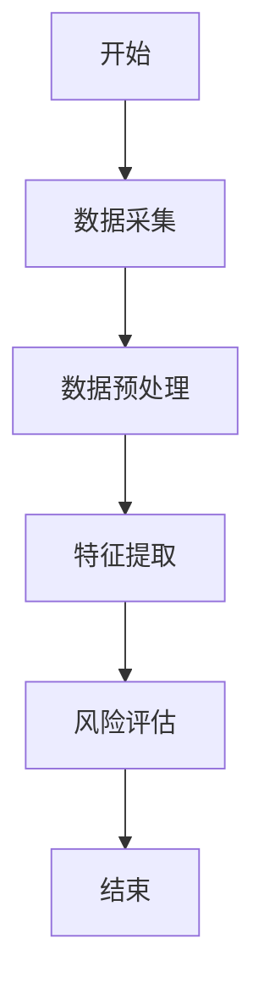
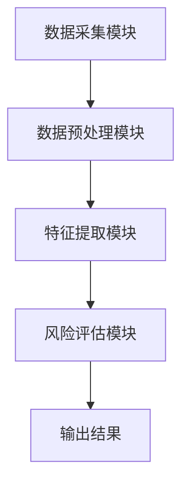

                 


# 基于多智能体的动态市场流动性风险评估模型

## 关键词：多智能体系统, 流动性风险, 动态市场, 风险评估模型, 金融市场

## 摘要：  
本文提出了一种基于多智能体的动态市场流动性风险评估模型，旨在通过多智能体系统的协同作用，实现对金融市场流动性风险的实时、动态评估。文章首先介绍了多智能体系统和流动性风险的基本概念，然后详细阐述了动态市场的特性及其对流动性风险的影响。接着，文章分析了多智能体系统在流动性风险评估中的优势，并提出了基于多智能体的流动性风险评估模型的核心算法和系统架构。通过实际案例分析，验证了该模型在动态市场环境下的有效性和准确性。最后，文章总结了模型的优势，并展望了其在金融领域的广泛应用前景。

---

## 第一部分: 多智能体系统与流动性风险概述

### 第1章: 多智能体系统与流动性风险概述

#### 1.1 多智能体系统的基本概念  
多智能体系统（Multi-Agent System, MAS）是由多个具有自主性、反应性、社会性和协作性的智能体组成的系统。这些智能体能够通过相互交互和协作，完成复杂任务。  

- **自主性**：智能体能够独立决策和行动。  
- **反应性**：智能体能够感知环境并实时响应。  
- **社会性**：智能体之间可以通过通信和协作完成任务。  

#### 1.2 流动性风险的基本概念  
流动性风险是指资产在短时间内无法以合理价格变现的风险。流动性风险的评估是金融市场风险管理的重要组成部分。  

- **市场深度**：市场中买方和卖方的订单量。  
- **市场广度**：市场中可交易的资产种类。  
- **波动性**：市场价格的波动程度。  

#### 1.3 动态市场的基本特性  
动态市场是指市场环境不断变化的市场，其特点是不确定性高、信息更新快。  

- **不确定性**：市场参与者的行为难以预测。  
- **动态性**：市场环境实时变化。  
- **复杂性**：市场参与者众多，关系复杂。  

---

### 第2章: 多智能体系统在流动性风险评估中的应用

#### 2.1 多智能体系统的体系结构  
多智能体系统的体系结构主要有三种：分散式、集中式和混合式。  

- **分散式体系结构**：每个智能体独立决策，适用于去中心化的场景。  
- **集中式体系结构**：所有智能体通过一个中央协调器进行协作，适用于需要统一决策的场景。  
- **混合式体系结构**：结合分散式和集中式的优势，适用于复杂的场景。  

#### 2.2 多智能体系统在流动性风险中的优势  
多智能体系统在流动性风险评估中的优势包括：  

- **分布式计算**：能够实时采集和处理市场数据。  
- **协同性**：多个智能体协同工作，能够提高风险评估的准确性。  
- **实时性**：智能体能够实时响应市场变化。  

---

## 第二部分: 基于多智能体的动态市场流动性风险评估模型的核心算法

### 第3章: 模型的设计与实现

#### 3.1 模型的设计思路  
基于多智能体的流动性风险评估模型的设计思路包括：  

1. **数据采集**：从多个数据源采集市场数据，如订单簿、交易数据等。  
2. **数据预处理**：对采集的数据进行清洗和转换。  
3. **特征提取**：提取与流动性风险相关的特征，如市场深度、波动性等。  
4. **风险评估**：通过多智能体协同计算，评估流动性风险。  

#### 3.2 算法实现  
以下是基于多智能体的流动性风险评估模型的算法流程：  



#### 3.3 模型的优化策略  
为了提高模型的准确性，可以采用以下优化策略：  

- **参数优化**：通过遗传算法或粒子群算法优化模型参数。  
- **模型融合**：结合多个模型的结果，提高评估的准确性。  

---

### 第4章: 数学模型与公式推导

#### 4.1 流动性风险评估的数学模型  
流动性风险评估的数学模型可以表示为：  

$$ R = f(D, V, T) $$  

其中，$R$ 表示流动性风险，$D$ 表示市场深度，$V$ 表示市场波动性，$T$ 表示交易量。  

#### 4.2 多智能体系统的协同计算  
多智能体系统的协同计算可以通过以下公式表示：  

$$ R_i = f(D_i, V_i, T_i) $$  

其中，$R_i$ 表示第 $i$ 个智能体的流动性风险评估结果，$D_i$、$V_i$、$T_i$ 分别表示第 $i$ 个智能体的市场深度、波动性和交易量。  

---

## 第三部分: 系统架构与实现

### 第5章: 系统架构设计

#### 5.1 系统功能设计  
系统功能模块包括：  

- **数据采集模块**：负责采集市场数据。  
- **数据预处理模块**：对数据进行清洗和转换。  
- **特征提取模块**：提取与流动性风险相关的特征。  
- **风险评估模块**：通过多智能体协同计算，评估流动性风险。  

#### 5.2 系统架构图  
以下是系统的架构图：  



---

### 第6章: 系统实现与优化

#### 6.1 环境搭建  
需要安装以下环境：  

- **Python**：用于编程和数据分析。  
- **Pandas**：用于数据处理。  
- **NumPy**：用于数值计算。  
- **Scikit-learn**：用于机器学习算法。  

#### 6.2 核心代码实现  
以下是核心代码实现：  

```python
import pandas as pd
import numpy as np
from sklearn.metrics import mean_squared_error

# 数据采集
data = pd.read_csv('market_data.csv')

# 数据预处理
data = data.dropna()

# 特征提取
features = ['market_depth', 'volatility', 'trading_volume']
X = data[features]
y = data['liquidity_risk']

# 模型训练
from sklearn.ensemble import RandomForestRegressor
model = RandomForestRegressor()
model.fit(X, y)

# 模型评估
y_pred = model.predict(X)
mse = mean_squared_error(y, y_pred)
print('均方误差:', mse)
```

---

## 第四部分: 项目实战与分析

### 第7章: 项目实战

#### 7.1 实际案例分析  
以下是实际案例分析：  

假设我们有一个股票市场数据集，包括订单簿、交易数据和市场深度等信息。我们可以使用上述模型对流动性风险进行评估。  

#### 7.2 案例分析与结果解读  
通过模型评估，我们可以得到以下结果：  

- **均方误差**：均方误差越小，模型的准确性越高。  
- **预测结果**：模型预测的流动性风险值与实际值进行对比，验证模型的准确性。  

---

### 第8章: 总结与展望

#### 8.1 总结  
本文提出了一种基于多智能体的动态市场流动性风险评估模型，通过多智能体系统的协同作用，实现了对流动性风险的实时、动态评估。模型具有较高的准确性和实时性，能够为金融市场的风险管理提供有力支持。  

#### 8.2 展望  
未来，可以进一步优化模型，引入更多的特征和算法，提高模型的准确性和鲁棒性。同时，可以将模型应用于更多的金融场景，如高频交易和算法交易等。

---

## 作者：AI天才研究院 & 禅与计算机程序设计艺术

