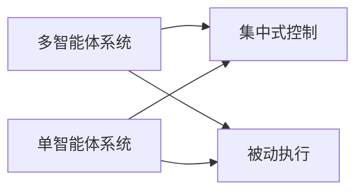
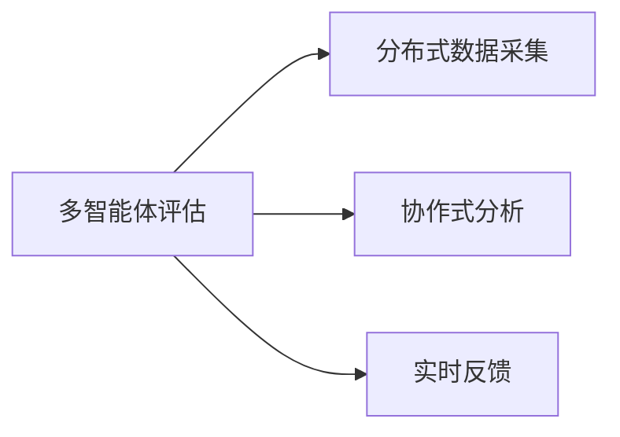
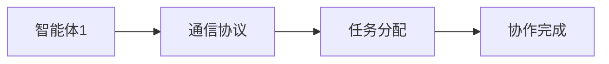
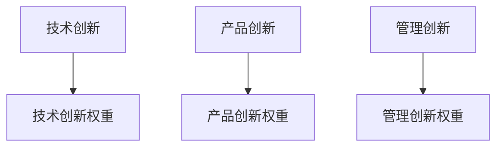
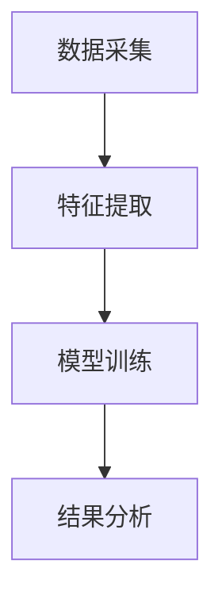
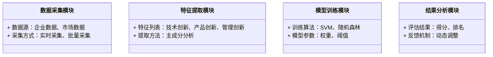
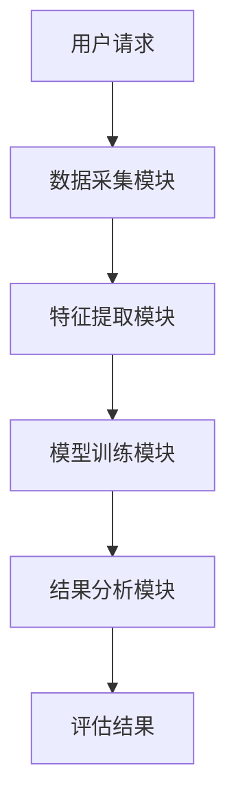
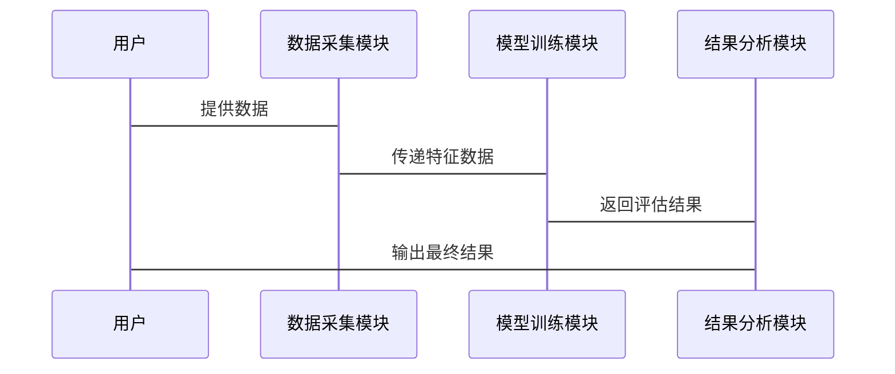

                 


# 基于多智能体的自动化公司创新能力评估

> 关键词：多智能体系统、公司创新能力、自动化评估、协作机制、算法原理

> 摘要：本文详细探讨了基于多智能体的公司创新能力自动化评估方法，从理论基础到算法实现，从系统设计到项目实战，全面解析了多智能体技术在企业创新能力评估中的应用。文章结合实际案例，深入分析了多智能体系统的协作机制、算法原理、系统架构以及最佳实践，为读者提供了全面的技术指导和实践参考。

---

# 第一部分: 基于多智能体的公司创新能力评估背景与概念

# 第1章: 多智能体系统与公司创新能力评估概述

## 1.1 多智能体系统的定义与特点

### 1.1.1 多智能体系统的定义

多智能体系统（Multi-Agent System, 简称 MAS）是由多个智能体（Agent）组成的分布式系统，这些智能体通过协作完成共同目标。智能体是指能够感知环境、自主决策、执行任务的实体。

### 1.1.2 多智能体系统的特征

| 特性 | 描述 |
|------|------|
| 分布式 | 智能体独立运行，无中心控制节点 |
| 协作性 | 智能体之间通过通信协作完成任务 |
| 反应性 | 能够实时感知环境变化并做出反应 |
| 自主性 | 智能体具备自主决策能力 |

### 1.1.3 多智能体系统与传统单智能体系统的区别



## 1.2 公司创新能力评估的背景与意义

### 1.2.1 公司创新能力的定义

公司创新能力是指企业在市场中通过技术创新、产品创新、管理创新等方面的能力，是企业核心竞争力的重要体现。

### 1.2.2 创新能力评估的重要性

创新能力强的企业能够更快地响应市场需求，抓住发展机遇，提高市场竞争力。创新能力评估是企业战略规划、资源配置和绩效管理的重要依据。

### 1.2.3 基于多智能体的创新能力评估的优势



---

# 第2章: 多智能体系统与创新能力评估的核心概念

## 2.1 多智能体系统的原理与机制

### 2.1.1 多智能体系统的协作机制



### 2.1.2 多智能体系统的通信协议

多智能体系统中，智能体之间的通信需要遵循特定的协议，例如通过消息队列或事件触发机制。

### 2.1.3 多智能体系统的任务分配与协调

任务分配是多智能体系统中的核心问题，常用算法包括基于角色分配的协作机制和基于优先级的任务调度。

## 2.2 创新能力评估的指标体系

### 2.2.1 创新能力评估的主要指标

| 指标 | 描述 |
|------|------|
| 技术创新 | 企业的研发投入、专利数量 |
| 产品创新 | 新产品推出速度、市场反馈 |
| 管理创新 | 组织架构优化、流程改进 |

### 2.2.2 指标权重的确定方法

指标权重可以通过层次分析法（AHP）或熵值法确定。

### 2.2.3 指标体系的构建与优化



## 2.3 多智能体与创新能力评估的结合点

### 2.3.1 多智能体在数据采集与处理中的作用

多智能体系统能够实时采集企业内外部数据，例如市场数据、竞争对手信息等。

### 2.3.2 多智能体在评估模型构建中的应用

通过多智能体协作，可以构建分布式评估模型，提高评估结果的准确性和实时性。

### 2.3.3 多智能体在结果分析与决策支持中的优势

多智能体系统能够根据评估结果动态调整评估策略，提供实时的决策支持。

## 2.4 本章小结

---

# 第3章: 多智能体系统算法与创新能力评估模型

## 3.1 多智能体系统的算法基础

### 3.1.1 分布式计算算法

分布式计算算法是多智能体系统的核心算法，例如基于P2P网络的分布式任务分配算法。

### 3.1.2 协作式搜索算法

协作式搜索算法通过智能体之间的协作，提高搜索效率和准确性。

### 3.1.3 智能体的博弈论算法

博弈论算法用于解决智能体之间的利益冲突和协作问题。

## 3.2 创新能力评估模型的构建

### 3.2.1 数据预处理与特征提取

数据预处理包括数据清洗、归一化等步骤，特征提取可以通过主成分分析（PCA）实现。

### 3.2.2 模型训练与优化

模型训练可以使用机器学习算法，例如支持向量机（SVM）或随机森林（Random Forest）。

### 3.2.3 模型评估与验证

模型评估可以通过交叉验证（Cross-Validation）方法进行。

## 3.3 基于多智能体的创新能力评估算法实现

### 3.3.1 算法流程图



### 3.3.2 算法实现代码

```python
import numpy as np
from sklearn import svm

# 数据预处理
data = np.array([...])
X = data[:, :-1]
y = data[:, -1]

# 模型训练
model = svm.SVC()
model.fit(X, y)

# 模型预测
y_pred = model.predict(X)
```

### 3.3.3 数学模型

评估模型可以表示为：

$$
\text{评估得分} = \sum_{i=1}^{n} w_i x_i
$$

其中，\( w_i \) 是指标权重，\( x_i \) 是指标得分。

---

# 第四部分: 系统分析与架构设计方案

# 第4章: 基于多智能体的创新能力评估系统架构

## 4.1 系统功能设计

### 4.1.1 功能模块划分

| 模块 | 功能描述 |
|------|----------|
| 数据采集 | 采集企业内外部数据 |
| 特征提取 | 提取评估所需特征 |
| 模型训练 | 构建评估模型 |
| 结果分析 | 输出评估结果 |

### 4.1.2 领域模型类图



### 4.1.3 系统架构设计



### 4.1.4 系统交互设计



---

# 第五部分: 项目实战与优化

# 第5章: 基于多智能体的创新能力评估系统实现

## 5.1 项目环境安装

```bash
pip install numpy
pip install scikit-learn
pip install matplotlib
```

## 5.2 系统核心实现

### 5.2.1 数据采集代码

```python
import requests
import json

def fetch_data(url):
    response = requests.get(url)
    data = json.loads(response.text)
    return data
```

### 5.2.2 特征提取代码

```python
from sklearn.decomposition import PCA

def extract_features(data):
    pca = PCA(n_components=3)
    features = pca.fit_transform(data)
    return features
```

### 5.2.3 模型训练代码

```python
from sklearn import svm

def train_model(features, labels):
    model = svm.SVC()
    model.fit(features, labels)
    return model
```

### 5.2.4 结果分析代码

```python
def analyze_results(model, test_features):
    predictions = model.predict(test_features)
    return predictions
```

## 5.3 案例分析与优化

### 5.3.1 案例分析

假设我们有以下数据：

```python
data = [
    [5, 4, 3],
    [6, 5, 4],
    [7, 6, 5],
    [8, 7, 6]
]
```

特征提取后：

```python
features = extract_features(data)
```

模型训练：

```python
model = train_model(features, [1, 2, 3, 4])
```

结果分析：

```python
test_features = extract_features([[9, 8, 7]])
predictions = analyze_results(model, test_features)
print(predictions)
```

### 5.3.2 优化建议

1. **数据预处理**：增加数据清洗和特征工程步骤，提高模型准确性。
2. **模型优化**：尝试不同的模型和参数组合，选择最优模型。
3. **实时反馈**：增加实时反馈机制，动态调整评估策略。

---

# 第六部分: 总结与展望

# 第6章: 基于多智能体的创新能力评估总结与展望

## 6.1 本章小结

本文详细探讨了基于多智能体的公司创新能力自动化评估方法，从理论基础到算法实现，从系统设计到项目实战，全面解析了多智能体技术在企业创新能力评估中的应用。

## 6.2 未来研究方向

1. **多智能体系统的优化**：研究更高效的协作机制和通信协议。
2. **创新能力评估的扩展**：探索更多创新维度，例如用户体验创新。
3. **系统的实时性与可扩展性**：优化系统架构，提高系统的实时性和可扩展性。

---

# 附录: 参考文献与工具安装指南

## 附录A: 参考文献

1. 书籍：《多智能体系统与应用》
2. 论文：《基于多智能体的创新能力评估研究》
3. 网站：多智能体系统技术社区

## 附录B: 工具安装指南

1. 安装Python环境：推荐使用Anaconda
2. 安装相关库：`pip install numpy scikit-learn`

---

作者：AI天才研究院 & 禅与计算机程序设计艺术

