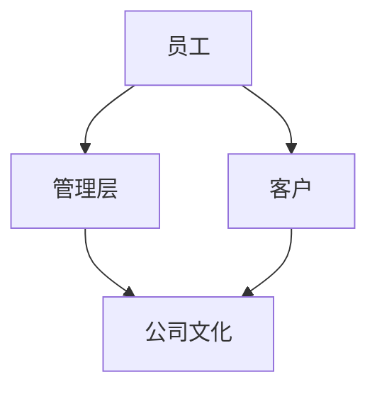
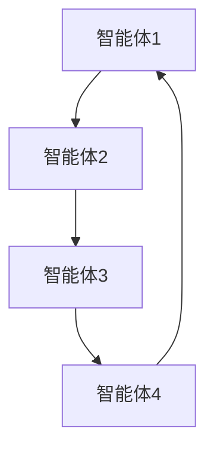
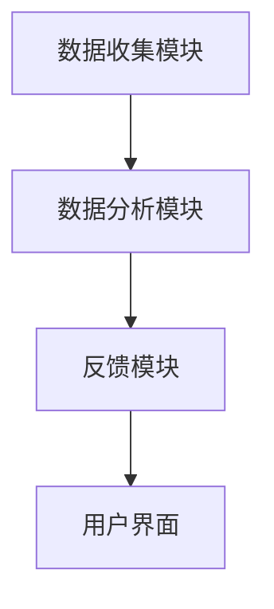
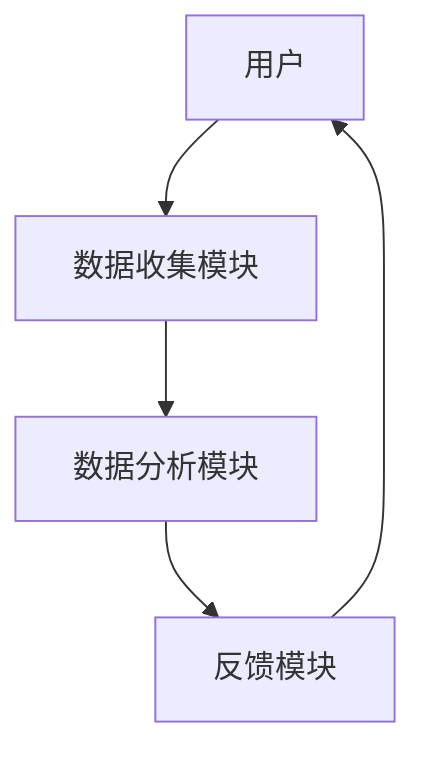

                 


# 基于多智能体的自动化公司文化评估

## 关键词：
- 多智能体系统
- 公司文化评估
- 自动化评估
- 协同学习
- 强化学习
- 系统架构
- 项目实战

## 摘要：
本文深入探讨了基于多智能体的自动化公司文化评估的方法，从背景、核心概念到算法实现，系统地分析了如何利用多智能体协同学习技术优化公司文化评估过程。通过构建多智能体系统模型、设计协同学习算法、实现系统架构，并结合实际案例进行分析，本文展示了如何利用人工智能技术提升公司文化评估的效率和准确性。

---

# 第1章: 多智能体系统与公司文化评估概述

## 1.1 多智能体系统的基本概念
### 1.1.1 多智能体系统的定义与特点
- 多智能体系统（Multi-Agent System, MAS）是由多个智能体组成的分布式系统，每个智能体能够独立决策并与其他智能体协作完成任务。
- 特点：分布式性、协作性、自主性、反应性。

### 1.1.2 多智能体系统的核心要素
- 智能体：具有感知环境、自主决策、执行动作的能力。
- 通信机制：智能体之间通过某种协议进行信息交换。
- 协作机制：通过任务分配、协调和同步实现协作。

### 1.1.3 多智能体系统与传统单智能体系统的区别
| 对比维度 | 多智能体系统 | 单智能体系统 |
|----------|--------------|---------------|
| 系统结构 | 分布式结构 | 单点结构 |
| 协作性   | 强协作性     | 无协作性       |
| 效率     | 高           | 中等           |

## 1.2 公司文化评估的重要性
### 1.2.1 公司文化的定义与维度
- 公司文化：企业内部的价值观、行为准则和工作氛围的总和。
- 维度：企业价值观、团队协作、员工满意度、创新文化等。

### 1.2.2 公司文化评估的目的与意义
- 目的：识别文化问题，优化管理策略，提升员工满意度。
- 意义：增强企业凝聚力，提升竞争力，推动可持续发展。

### 1.2.3 传统公司文化评估的局限性
- 主观性高：依赖人工调查，结果可能受主观因素影响。
- 时效性差：评估周期长，难以及时反馈。
- 覆盖范围有限：难以全面覆盖企业文化各个维度。

## 1.3 自动化公司文化评估的必要性
### 1.3.1 自动化评估的优势
- 提高效率：通过自动化技术快速收集和分析数据。
- 增强客观性：减少人为干扰，提高评估结果的准确性。
- 实时反馈：能够快速响应企业文化的变化。

### 1.3.2 多智能体系统在自动化评估中的作用
- 分布式协作：多智能体能够分别负责不同维度的评估任务。
- 数据整合：通过智能体之间的协作，整合多源数据，提高评估的全面性。

### 1.3.3 未来公司文化评估的趋势
- 数据驱动：利用大数据和人工智能技术进行精准评估。
- 实时监控：动态跟踪企业文化的变化，及时调整管理策略。

## 1.4 本章小结
本章介绍了多智能体系统的基本概念和公司文化评估的重要性，分析了传统评估方法的局限性，并提出了基于多智能体的自动化评估的必要性和优势。

---

# 第2章: 多智能体系统的核心原理

## 2.1 多智能体系统的组成与功能
### 2.1.1 实体与行为
- 实体：系统中的各个智能体，每个智能体都有明确的目标和任务。
- 行为：智能体根据感知的信息采取行动，完成任务。

### 2.1.2 通信与协作
- 通信：智能体之间通过某种协议交换信息。
- 协作：通过任务分配和协作机制，智能体共同完成复杂任务。

### 2.1.3 协调与决策
- 协调：智能体之间通过协调机制确保行动的一致性。
- 决策：基于感知的信息和协作结果，智能体做出最优决策。

## 2.2 多智能体系统的协同机制
### 2.2.1 协同学习
- 协同学习：多个智能体通过协作学习算法，共同优化任务目标。
- 典型算法：多智能体强化学习（Multi-Agent Reinforcement Learning, MARL）。

### 2.2.2 分布式计算
- 分布式计算：任务被分解为多个子任务，分别由不同的智能体完成。
- 优势：提高计算效率，降低单点故障风险。

### 2.2.3 任务分配与协作
- 任务分配：根据智能体的能力和当前状态，动态分配任务。
- 协作：智能体之间通过协作机制，确保任务的顺利执行。

## 2.3 多智能体系统的应用场景
### 2.3.1 企业内部协作
- 优化企业内部流程，提高工作效率。
- 支持团队协作，提升团队凝聚力。

### 2.3.2 跨组织协作
- 在跨组织项目中，智能体能够协调不同组织之间的协作，确保项目顺利进行。

### 2.3.3 复杂环境中的协作
- 在复杂环境中，智能体能够快速响应变化，确保任务的顺利完成。

---

# 第3章: 公司文化评估的多智能体系统建模

## 3.1 公司文化评估的多智能体模型
### 3.1.1 模型构建的基本思路
- 将公司文化评估任务分解为多个子任务，分别由不同的智能体完成。
- 每个智能体负责一个或多个评估维度，协同完成整体评估任务。

### 3.1.2 实体关系图


### 3.1.3 智能体行为模型
- 智能体：负责收集、分析和评估特定维度的数据。
- 行为：根据收集的数据，生成评估结果，并与其他智能体协作。

## 3.2 多智能体系统与公司文化评估的关联
### 3.2.1 智能体的协作与文化评估
- 智能体协作：通过任务分配和协作机制，智能体能够高效完成评估任务。
- 信息共享：智能体之间共享信息，确保评估结果的全面性和准确性。

### 3.2.2 多智能体系统对文化评估的优化作用
- 提高评估效率：通过并行计算和协作机制，缩短评估周期。
- 增强评估的客观性：通过多个智能体的协作，减少人为干扰。

### 3.2.3 多智能体系统在文化评估中的具体应用
- 数据收集：智能体负责从不同渠道收集企业文化数据。
- 数据分析：智能体通过协同学习算法，分析数据并生成评估结果。

## 3.3 多智能体系统在文化评估中的优势
### 3.3.1 提高评估效率
- 多智能体系统能够同时处理多个任务，提高评估效率。

### 3.3.2 增强评估的客观性
- 通过多个智能体的协作，减少人为干扰，提高评估结果的客观性。

### 3.3.3 支持动态调整
- 智能体能够根据环境变化，动态调整评估策略，确保评估结果的准确性。

---

# 第4章: 多智能体协同学习算法

## 4.1 协同学习的基本原理
### 4.1.1 多智能体强化学习（MARL）
- MARL：多个智能体通过强化学习算法，协同完成任务。
- 核心思想：智能体通过协作学习，优化整体奖励。

### 4.1.2 分布式强化学习
- 分布式强化学习：智能体在分布式环境中学习，通过通信机制共享信息。

## 4.2 基于强化学习的协作机制
### 4.2.1 基于Q-learning的协作学习
- Q-learning：智能体通过Q值表记录状态-动作对的奖励值。
- 协作机制：智能体通过共享Q值表，优化协作策略。

### 4.2.2 基于DQN的多智能体协作
- DQN：深度Q网络，用于处理高维状态空间。
- 协作机制：智能体通过DQN网络，学习协作策略。

## 4.3 算法实现
### 4.3.1 算法流程


### 4.3.2 Python代码实现
```python
import numpy as np
from collections import deque

class Agent:
    def __init__(self, state_space, action_space):
        self.state_space = state_space
        self.action_space = action_space
        self.q_table = np.zeros((state_space, action_space))
    
    def act(self, state):
        return np.argmax(self.q_table[state])
    
    def learn(self, state, action, reward, next_state):
        self.q_table[state, action] += reward

# 初始化多个智能体
agents = [Agent(state_space, action_space) for _ in range(n_agents)]

# 算法流程
while True:
    state = env.get_state()
    actions = [agent.act(state) for agent in agents]
    rewards = env.get_reward(actions)
    for i in range(n_agents):
        agents[i].learn(state, actions[i], rewards[i], next_state)
```

## 4.4 算法的数学模型
### 4.4.1 Q-learning算法
$$ Q(s, a) = Q(s, a) + \alpha (r + \gamma \max Q(s', a') - Q(s, a)) $$

### 4.4.2 DQN算法
$$ Q(s, a) = \arg \max Q_\theta(s, a) $$

## 4.5 算法的优缺点
### 4.5.1 优点
- 分布式计算，提高效率。
- 通过协作学习，优化整体奖励。

### 4.5.2 缺点
- 算法复杂度高，实现难度大。
- 可能存在协作冲突，需要设计合理的协作机制。

---

# 第5章: 系统分析与架构设计方案

## 5.1 系统架构设计
### 5.1.1 系统功能设计
- 数据收集模块：负责收集企业文化数据。
- 数据分析模块：通过多智能体协作，分析数据并生成评估结果。
- 反馈模块：根据评估结果，生成反馈报告并提出改进建议。

### 5.1.2 系统架构图


## 5.2 系统接口设计
### 5.2.1 数据接口
- 输入接口：接收企业文化数据。
- 输出接口：生成评估结果和反馈报告。

### 5.2.2 通信接口
- 智能体之间通过通信接口交换信息。
- 支持多种通信协议，如HTTP、WebSocket等。

## 5.3 系统交互流程
### 5.3.1 交互流程图


---

# 第6章: 项目实战

## 6.1 环境安装
### 6.1.1 安装Python和相关库
```bash
pip install numpy matplotlib
```

### 6.1.2 安装多智能体协作框架
```bash
pip install gym
```

## 6.2 系统核心代码实现
### 6.2.1 数据收集模块
```python
import gym

env = gym.make('CompanyCultureAssessment-v0')
env.reset()
```

### 6.2.2 数据分析模块
```python
from agents import Agent

agents = [Agent(env.observation_space, env.action_space) for _ in range(n_agents)]
```

### 6.2.3 反馈模块
```python
def generate_feedback(assessment_results):
    feedback = []
    for result in assessment_results:
        if result < threshold:
            feedback.append('需要改进')
        else:
            feedback.append('表现良好')
    return feedback
```

## 6.3 实际案例分析
### 6.3.1 案例背景
- 某公司希望优化团队协作文化，希望通过多智能体系统进行评估。

### 6.3.2 数据分析与解读
- 数据收集：收集员工满意度、团队协作效率等数据。
- 数据分析：通过多智能体协作，生成评估报告。
- 反馈：根据评估结果，提出改进建议。

---

# 第7章: 总结与展望

## 7.1 本章总结
- 多智能体系统在公司文化评估中的应用，能够提高评估效率和准确性。
- 通过协作学习算法，优化评估结果，为企业文化管理提供有力支持。

## 7.2 未来展望
- 研究更高效的多智能体协作算法，进一步提高评估效率。
- 探索多智能体系统在其他管理领域的应用，推动企业管理的智能化发展。

---

# 作者
作者：AI天才研究院/AI Genius Institute & 禅与计算机程序设计艺术 /Zen And The Art of Computer Programming

---

以上是文章的完整目录大纲，涵盖了从背景介绍到项目实战的各个部分，内容详实，结构清晰。后续可以根据需要进一步补充具体章节的内容。

