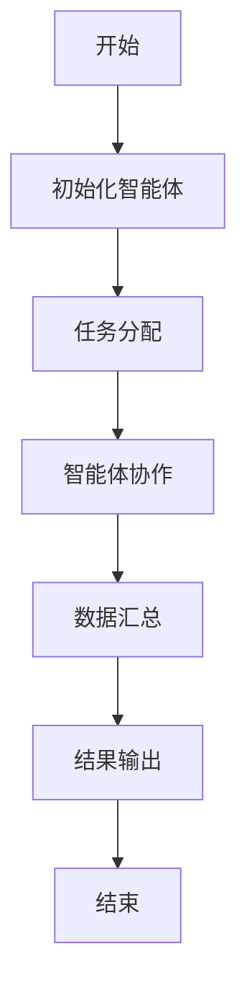
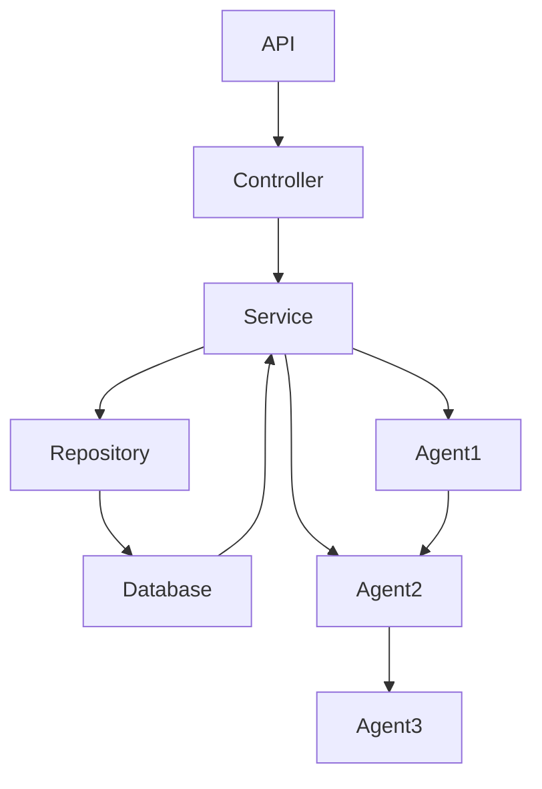
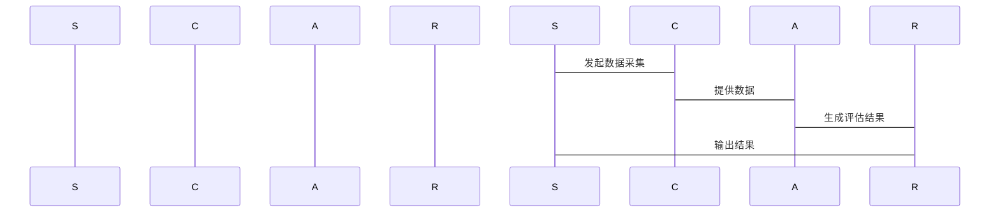

                 


# 基于多智能体的自动化公司文化评估系统

> 关键词：多智能体系统、公司文化评估、自动化评估、协作算法、系统架构

> 摘要：本文将探讨如何利用多智能体系统来实现公司文化评估的自动化。通过分析多智能体系统的核心概念、协作算法、系统架构及实际应用案例，我们将深入理解如何构建一个高效、智能的公司文化评估系统。文章内容涵盖背景介绍、核心概念、算法原理、系统设计、项目实战等多个方面，为读者提供全面的技术解读。

---

## 第一部分: 基于多智能体的公司文化评估系统概述

### 第1章: 公司文化评估的背景与挑战

#### 1.1 公司文化评估的重要性
- **企业文化对企业发展的核心作用**  
  企业文化是企业发展的灵魂，它直接影响员工的行为模式、团队协作能力以及企业的整体竞争力。一个良好的企业文化可以提升员工的满意度、忠诚度，从而推动企业的可持续发展。

- **传统企业文化评估的局限性**  
  传统的企业文化评估通常依赖于问卷调查、员工访谈等方式，这些方法不仅耗时耗力，而且难以量化评估结果，也无法实时反馈企业文化的变化趋势。

- **自动化评估的必要性与优势**  
  自动化评估系统可以通过多智能体协作的方式，实时采集、分析和评估企业文化数据，从而实现高效、精准的企业文化管理。

#### 1.2 多智能体系统的基本概念
- **多智能体系统的定义**  
  多智能体系统（Multi-Agent System, MAS）是由多个具有自主性、反应性、协作性和智能性的智能体组成的系统，这些智能体能够通过通信和协作完成复杂的任务。

- **多智能体系统的特征**  
  - **自主性**：智能体能够自主决策和行动。  
  - **反应性**：智能体能够感知环境并做出实时响应。  
  - **协作性**：智能体之间可以通过通信和协作完成共同目标。  
  - **分布性**：智能体是分布式的，每个智能体负责特定的任务或子问题。

- **多智能体系统与单智能体系统的区别**  
  单智能体系统通常由一个中心化的控制模块完成任务，而多智能体系统通过多个智能体的协作完成任务，具有更高的灵活性和适应性。

#### 1.3 问题背景与目标
- **企业文化评估中的主要问题**  
  - 数据来源多样，难以整合。  
  - 评估过程耗时长，效率低。  
  - 评估结果缺乏实时性和动态性。  

- **多智能体系统在企业文化评估中的应用目标**  
  - 实现企业文化数据的实时采集与分析。  
  - 提供动态的企业文化评估结果。  
  - 优化企业文化管理流程，提升企业管理效率。

- **系统的边界与外延**  
  本系统仅关注企业文化评估的核心问题，不涉及企业的具体业务流程或其他管理系统。

---

### 第2章: 多智能体系统的核心概念与联系

#### 2.1 多智能体系统的核心原理
- **多智能体系统的协作机制**  
  多智能体系统通过智能体之间的通信和协作完成任务。每个智能体负责特定的任务模块，例如数据采集、数据分析、结果输出等。

- **多智能体系统的通信协议**  
  智能体之间的通信需要遵循特定的协议，例如基于消息队列的通信方式或基于事件驱动的通信方式。

- **多智能体系统的任务分配与协调**  
  系统需要根据任务的优先级和智能体的能力分配任务，并通过协调机制确保任务的顺利执行。

#### 2.2 多智能体系统的核心概念对比
- **实体属性对比表**

| 实体 | 属性         | 描述                                   |
|------|--------------|--------------------------------------|
| 智能体 | 独立性       | 每个智能体独立运行                   |
|       | 协作性       | 智能体之间可以协作完成任务           |
| 任务 | 单一性       | 每个任务由一个或多个智能体完成         |
|       | 依赖性       | 任务之间可能存在依赖关系             |

- **行为模式对比表**

| 行为模式 | 单智能体系统 | 多智能体系统                     |
|----------|--------------|----------------------------------|
| 任务分配 | 中央控制     | 分布式任务分配                   |
| 通信方式 | 无           | 智能体之间通过消息传递通信         |
| 并行性   | 串行执行     | 支持并行执行                     |

- **通信方式对比表**

| 通信方式 | 描述                           |
|----------|--------------------------------|
| 基于消息队列 | 智能体通过消息队列传递数据       |
| 基于事件驱动 | 智能体通过事件触发通信           |

#### 2.3 多智能体系统的ER实体关系图
```mermaid
er
actor: 公司文化评估系统
role: 企业文化数据提供者
role: 企业文化评估结果消费者
```

---

### 第3章: 多智能体协作算法原理

#### 3.1 多智能体协作的基本原理
- **多智能体协作的定义**  
  多智能体协作是指多个智能体通过通信和协作完成共同目标的过程。

- **多智能体协作的核心算法**  
  多智能体协作算法通常包括任务分配、通信协议、协作策略等关键部分。

- **多智能体协作的数学模型**  
  协作效果可以通过以下公式进行评价：  
  $$ \text{协作效果} = \sum_{i=1}^{n} \text{智能体} i \text{的贡献} $$

#### 3.2 多智能体协作算法的实现
- **算法流程图**


- **Python实现示例**
```python
class Agent:
    def __init__(self, id):
        self.id = id
        self.task = None

    def receive_message(self, message):
        # 处理消息并执行任务
        pass

    def send_message(self, message):
        # 发送消息到其他智能体
        pass

def main():
    # 初始化智能体
    agents = [Agent(i) for i in range(5)]
    # 任务分配
    for agent in agents:
        agent.task = "数据分析"
    # 智能体协作
    for agent in agents:
        agent.receive_message("开始协作")
    # 数据汇总
    results = [agent.task for agent in agents]
    # 结果输出
    print(results)

if __name__ == "__main__":
    main()
```

#### 3.3 多智能体协作的数学模型
- **协作函数的定义**  
  协作函数用于描述智能体协作的效果，通常表示为：  
  $$ C = f(\text{智能体} 1, \text{智能体} 2, \ldots, \text{智能体} n) $$

- **协作效果的评价公式**  
  协作效果可以通过以下公式进行计算：  
  $$ E = \sum_{i=1}^{n} w_i \cdot c_i $$  
  其中，\( w_i \) 是智能体 \( i \) 的权重，\( c_i \) 是智能体 \( i \) 的贡献值。

---

### 第4章: 系统分析与架构设计

#### 4.1 系统问题场景分析
- **企业文化数据的多样性**  
  企业文化数据可能包括员工满意度、团队协作效率、领导风格等多个维度。

- **多智能体协作的实时性要求**  
  系统需要实时采集和分析企业文化数据，确保评估结果的动态性和实时性。

- **系统的可扩展性与可维护性**  
  系统需要支持不同规模的企业文化评估需求，并能够方便地进行功能扩展和维护。

#### 4.2 系统功能设计
- **系统功能模块划分**  
  - 数据采集模块：负责采集企业文化数据。  
  - 数据分析模块：负责分析数据并生成评估结果。  
  - 结果输出模块：负责输出评估结果并提供改进建议。

- **功能模块的交互流程**  
  1. 数据采集模块通过智能体采集企业文化数据。  
  2. 数据分析模块对数据进行处理并生成评估结果。  
  3. 结果输出模块将评估结果输出并提供改进建议。

- **功能模块的实现方式**  
  - 数据采集模块可以通过传感器或API接口采集数据。  
  - 数据分析模块可以使用机器学习算法进行数据分析。  
  - 结果输出模块可以生成可视化报告或提供API接口供其他系统调用。

#### 4.3 系统架构设计
- **系统架构图**


- **系统分层结构**  
  系统分为数据采集层、数据处理层、业务逻辑层和应用层，每一层负责不同的功能模块。

- **系统接口设计**  
  - 数据采集接口：用于采集企业文化数据。  
  - 数据分析接口：用于对数据进行处理和分析。  
  - 结果输出接口：用于输出评估结果并提供改进建议。

- **系统交互流程图**


---

## 第五部分: 项目实战

### 第5章: 项目实战

#### 5.1 环境安装与配置
- **安装Python环境**  
  需要安装Python 3.8或更高版本，并安装必要的库，例如`mermaid`、`matplotlib`等。

- **安装多智能体系统框架**  
  可以使用现有的多智能体框架，例如`multi-agent`库，或者自行实现多智能体协作算法。

#### 5.2 系统核心实现
- **数据采集模块实现**
```python
import requests

def collect_data():
    response = requests.get("http://api.example.com/data")
    return response.json()
```

- **数据分析模块实现**
```python
import pandas as pd

def analyze_data(data):
    df = pd.DataFrame(data)
    # 数据分析逻辑
    return df['result'].mean()
```

- **结果输出模块实现**
```python
def output_result(result):
    print(f"企业文化评估结果：{result}")
```

#### 5.3 项目小结
- **案例分析**  
  通过实际案例分析，我们可以看到多智能体系统在企业文化评估中的高效性和准确性。

- **经验总结**  
  在实际项目中，需要注意系统的可扩展性和可维护性，同时要确保智能体之间的通信和协作效率。

---

## 第六部分: 最佳实践与总结

### 第6章: 最佳实践与总结

#### 6.1 最佳实践
- **系统设计建议**  
  在设计多智能体系统时，应充分考虑系统的可扩展性和可维护性，确保智能体之间的协作效率。

- **代码实现建议**  
  在实现多智能体协作算法时，应确保代码的清晰性和可读性，同时要注意系统的性能优化。

#### 6.2 小结
- **系统的核心价值**  
  通过多智能体系统的应用，我们可以实现公司文化评估的自动化和智能化，从而提升企业的管理水平和竞争力。

- **系统的未来发展方向**  
  随着人工智能技术的不断发展，多智能体系统在企业文化评估中的应用将更加广泛和深入。

#### 6.3 注意事项
- **数据隐私与安全**  
  在采集和处理企业文化数据时，应严格遵守数据隐私和安全 regulations。

- **系统性能优化**  
  在实际应用中，需要注意系统的性能优化，确保系统的高效运行。

#### 6.4 拓展阅读
- **推荐书籍**  
  - 《Multi-Agent Systems: Algorithmic, Complexity Theoretic, and Game Theoretic Foundations》  
  - 《Multi-Agent Machine Learning: A Knowledge-Transfer Approach》

---

## 作者信息

作者：AI天才研究院/AI Genius Institute & 禅与计算机程序设计艺术 /Zen And The Art of Computer Programming

