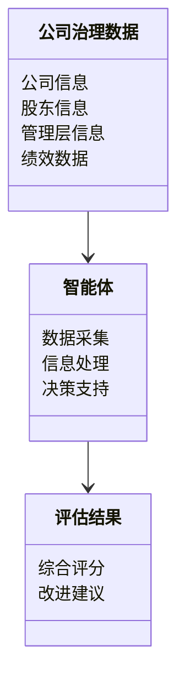

                 


# 基于多智能体的自动化公司治理评估

> 关键词：多智能体系统、公司治理评估、自动化、协同机制、决策算法

> 摘要：本文探讨如何利用多智能体系统实现公司治理评估的自动化，详细介绍系统的架构、算法原理、协同机制，并通过案例分析展示其应用。

---

## 第1章：公司治理评估的背景与挑战

### 1.1 公司治理的基本概念

#### 1.1.1 公司治理的定义与核心要素
公司治理是确保公司有效运作和利益相关者权益得到保护的体系。核心要素包括：
- **董事会**：负责战略制定和监督。
- **股东大会**：公司所有者的决策机构。
- **管理层**：日常运营的执行者。
- **利益相关者**：包括股东、员工、客户和债权人。

#### 1.1.2 公司治理的常见挑战
- **信息不对称**：不同利益相关者掌握的信息不一致。
- **决策效率低**：传统评估方法耗时且主观。
- **成本高**：人工评估需要大量资源。

#### 1.1.3 现有公司治理评估方法的局限性
传统方法依赖于主观评分和人工分析，存在效率低、结果不一致的问题。

### 1.2 自动化评估的需求与趋势

#### 1.2.1 传统公司治理评估的痛点
- **主观性**：人为因素影响评估结果。
- **效率低**：依赖大量人工操作。
- **成本高**：需要大量时间和资源。

#### 1.2.2 自动化评估的优势
- **客观性**：基于数据和算法，减少主观干扰。
- **高效性**：自动化处理大量数据，提高效率。
- **降低成本**：减少人工干预，降低运营成本。

#### 1.2.3 多智能体技术在自动化评估中的应用前景
多智能体系统通过协同合作，能够高效处理复杂问题，为公司治理评估提供新思路。

### 1.3 本章小结
本章介绍了公司治理的基本概念、传统评估方法的局限性以及自动化评估的需求和趋势，为后续章节奠定了基础。

---

## 第2章：多智能体系统概述

### 2.1 多智能体系统的基本概念

#### 2.1.1 多智能体系统的定义
多智能体系统是由多个智能体组成的分布式系统，智能体能够自主决策并协同完成任务。

#### 2.1.2 多智能体系统的特征
- **自主性**：智能体能够自主决策。
- **反应性**：能够实时响应环境变化。
- **协同性**：智能体之间可以协同合作。
- **分布式**：系统由多个独立组件组成。

#### 2.1.3 多智能体系统与单智能体系统的区别
| 特性 | 单智能体系统 | 多智能体系统 |
|------|--------------|-------------|
| 决策 | 中央决策     | 分布式决策 |
| 协作 | 无          | 高          |
| 效率 | 低          | 高          |

### 2.2 多智能体系统的组成与架构

#### 2.2.1 多智能体系统的组成要素
- **智能体**：独立决策的主体。
- **通信机制**：智能体之间的信息交换方式。
- **协作算法**：智能体协同工作的规则。

#### 2.2.2 多智能体系统的常见架构
- **分散式架构**：每个智能体独立运作，无中央控制。
- **集中式架构**：有一个中央节点协调所有智能体。
- **混合式架构**：结合分散式和集中式的特点。

#### 2.2.3 多智能体系统的通信机制
通信机制是智能体协同的基础，常用的通信方式包括：
- **发布-订阅模式**：智能体发布信息，其他智能体订阅。
- **点对点通信**：智能体之间直接交换信息。

### 2.3 多智能体系统在公司治理中的应用

#### 2.3.1 多智能体系统在公司治理评估中的作用
- **数据采集**：智能体收集公司治理相关数据。
- **信息分析**：智能体协同分析数据，生成评估结果。
- **决策支持**：提供数据支持，辅助决策者制定策略。

#### 2.3.2 多智能体系统的协同机制
协同机制包括：
- **任务分配**：智能体根据自身能力分配任务。
- **信息共享**：智能体之间共享数据和信息。
- **决策协商**：智能体通过协商达成一致决策。

#### 2.3.3 多智能体系统的决策过程
决策过程包括：
1. 数据收集与分析。
2. 信息共享与协商。
3. 协同决策与执行。

### 2.4 本章小结
本章介绍了多智能体系统的基本概念、组成与架构，并探讨了其在公司治理中的应用，为后续章节奠定了理论基础。

---

## 第3章：多智能体系统的协同机制

### 3.1 多智能体系统的通信协议

#### 3.1.1 通信协议的定义
通信协议是智能体之间信息交换的规则和格式。

#### 3.1.2 常见的通信协议类型
- **HTTP**：基于请求-响应的通信方式。
- **WebSocket**：实时双向通信协议。

#### 3.1.3 通信协议在多智能体系统中的应用
在公司治理评估中，智能体可以通过WebSocket实时交换数据和信息。

### 3.2 多智能体系统的协作算法

#### 3.2.1 协作算法的基本概念
协作算法是智能体协同工作的规则和方法。

#### 3.2.2 常见的协作算法
- **分布式一致性算法**：如Raft共识算法。
- **拜占庭容错算法**：解决网络分区问题。

#### 3.2.3 协作算法在公司治理评估中的应用
在分布式系统中，协作算法确保数据一致性和决策的正确性。

### 3.3 多智能体系统的决策机制

#### 3.3.1 决策机制的定义
决策机制是智能体根据数据和规则做出决策的方法。

#### 3.3.2 常见的决策机制
- **加权投票法**：根据权重进行投票决定。
- **分布式决策法**：智能体基于本地数据做出决策。

#### 3.3.3 决策机制在公司治理评估中的应用
智能体通过加权投票法协同做出公司治理评估的决策。

### 3.4 本章小结
本章详细探讨了多智能体系统的通信协议、协作算法和决策机制，为实现自动化公司治理评估提供了理论支持。

---

## 第4章：系统设计概述

### 4.1 系统设计的目标与范围

#### 4.1.1 系统设计的目标
- **高效评估**：快速、准确地完成公司治理评估。
- **数据集成**：整合多源数据，提高评估准确性。
- **实时反馈**：提供实时的评估结果和建议。

#### 4.1.2 系统设计的范围
- **数据层**：收集和存储公司治理相关数据。
- **逻辑层**：实现评估算法和决策逻辑。
- **表示层**：展示评估结果和分析报告。

### 4.2 系统功能设计

#### 4.2.1 功能模块
- **数据采集模块**：实时采集公司治理数据。
- **评估指标计算模块**：根据指标体系计算评估结果。
- **协同决策模块**：智能体协同做出决策。
- **结果分析模块**：生成评估报告和改进建议。

#### 4.2.2 领域模型（Mermaid类图）


### 4.3 系统架构设计

#### 4.3.1 系统架构图（Mermaid架构图）


### 4.4 本章小结
本章详细描述了系统设计的目标、功能模块和架构，为后续的实现奠定了基础。

---

## 第5章：算法实现与应用

### 5.1 算法实现

#### 5.1.1 分布式一致性算法（Raft）
Raft算法用于保证分布式系统中的数据一致性，确保智能体之间的决策一致。

#### 5.1.2 通信协议实现（WebSocket）
使用WebSocket实现智能体之间的实时通信，代码示例如下：
```python
import websockets
import asyncio

async def send_message(message):
    async with websockets.connect('ws://localhost:8000') as websocket:
        await websocket.send(message)
        response = await websocket.recv()
        print(response)

asyncio.get_event_loop().run_until_complete(send_message("公司治理数据"))
```

### 5.2 应用实例

#### 5.2.1 实际案例分析
以某公司为例，展示多智能体系统如何协同完成公司治理评估。

#### 5.2.2 评估结果分析
通过评估指标计算模块，生成详细的评估报告和改进建议。

### 5.3 本章小结
本章通过具体实现和案例分析，展示了多智能体系统在公司治理评估中的实际应用。

---

## 第6章：结论与展望

### 6.1 研究总结
本文探讨了多智能体系统在公司治理评估中的应用，提出了一种基于多智能体的自动化评估方法。

### 6.2 未来展望
未来的研究方向包括优化通信协议、提升决策算法的智能化水平，以及探索更多领域的应用。

### 6.3 本章小结
本章总结了研究的主要成果，并展望了未来的研究方向。

---

## 作者信息

作者：AI天才研究院/AI Genius Institute & 禅与计算机程序设计艺术 /Zen And The Art of Computer Programming

---

通过以上内容，我们系统地介绍了基于多智能体的自动化公司治理评估的背景、理论基础、系统设计、算法实现和实际应用，为实现高效的公司治理评估提供了全面的解决方案。

