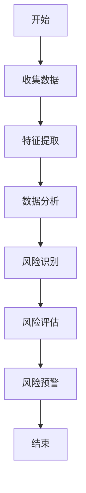
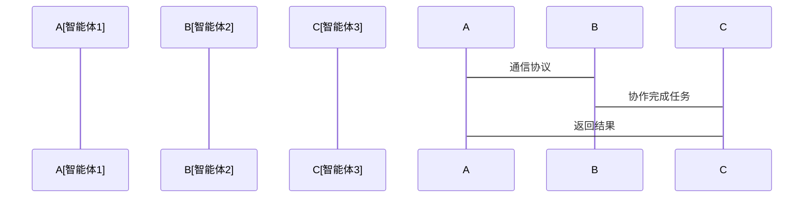

                 


# 基于多智能体的自动化公司治理风险评估

## 关键词：多智能体系统、公司治理、风险评估、自动化、分布式计算

## 摘要

随着企业规模的不断扩大和全球化进程的加速，公司治理风险评估变得越来越复杂。传统的评估方法依赖于人工分析，效率低下且容易出错。基于多智能体系统（Multi-Agent System, MAS）的自动化公司治理风险评估提供了一种高效、智能的解决方案。本文详细探讨了多智能体系统的核心原理、在公司治理中的应用，以及如何通过算法和系统架构实现风险评估的自动化。文章还提供了实际案例和代码实现，帮助读者理解如何在实际中应用这些技术。

---

## 第1章：多智能体系统概述

### 1.1 多智能体系统的定义与特点

#### 1.1.1 多智能体系统的定义
多智能体系统（MAS）由多个智能体组成，这些智能体通过协作和通信完成共同目标。智能体是具有感知、决策和执行能力的实体，可以是软件程序或物理设备。

#### 1.1.2 多智能体系统的五大特点
- **自主性**：智能体能够自主决策。
- **反应性**：能够实时感知环境变化并做出反应。
- **协作性**：通过通信和协作完成任务。
- **分布式性**：智能体分布在不同位置，独立运行。
- **适应性**：能够适应环境变化和新任务。

#### 1.1.3 多智能体系统与传统单智能体系统的区别
| 特性       | 单智能体系统                     | 多智能体系统                     |
|------------|--------------------------------|--------------------------------|
| 结构       | 单一中心化                     | 分散式，多个智能体协作           |
| 复杂性     | 简单，易于管理                 | 复杂，需要协调和通信             |
| 应用场景   | 单任务或简单问题               | 多任务、复杂问题                |

### 1.2 公司治理风险评估的定义与重要性

#### 1.2.1 公司治理风险评估的定义
公司治理风险评估是识别、分析和评估可能影响公司治理的各类风险的过程，包括财务风险、合规风险、操作风险等。

#### 1.2.2 公司治理风险评估的重要性
- **降低风险**：及时发现潜在风险，采取措施降低影响。
- **提高决策效率**：通过自动化评估，节省时间和资源。
- **提升透明度**：明确各责任方的职责，增强企业透明度。

#### 1.2.3 风险评估的常见方法
- **定性分析**：通过专家判断识别风险。
- **定量分析**：利用数据和模型量化风险。
- **混合分析**：结合定性和定量方法。

### 1.3 自动化公司治理风险评估的背景与意义

#### 1.3.1 传统公司治理风险评估的局限性
- **效率低下**：人工分析耗时且容易出错。
- **主观性强**：依赖专家经验，结果可能不一致。
- **覆盖范围有限**：难以处理复杂和动态的环境。

#### 1.3.2 自动化评估的必要性
- **提高效率**：自动化处理大量数据，节省时间。
- **减少人为错误**：智能系统更准确，结果更可靠。
- **实时监控**：持续评估风险，及时预警。

#### 1.3.3 多智能体技术在自动化评估中的优势
- **分布式计算**：多个智能体同时处理不同数据源。
- **协作性**：智能体之间协作，提供全面评估。
- **适应性**：能够适应环境变化，动态调整评估策略。

---

## 第2章：多智能体系统在公司治理中的应用

### 2.1 多智能体系统的核心概念

#### 2.1.1 智能体的定义与分类
- **定义**：智能体是具有感知、决策和执行能力的实体。
- **分类**：
  - **反应式智能体**：基于当前感知做出反应。
  - **认知式智能体**：具有推理和规划能力。

#### 2.1.2 多智能体系统的协作机制
协作机制包括：
- **分布式计算**：智能体独立计算，然后汇总结果。
- **任务分配**：根据智能体的能力分配任务。
- **通信协议**：定义智能体之间的通信规则。

#### 2.1.3 智能体之间的通信与协调
- **通信方式**：通过消息传递或共享数据库。
- **协调机制**：如仲裁、协商等，确保智能体协同工作。

### 2.2 公司治理风险评估中的多智能体模型

#### 2.2.1 风险识别的多智能体模型
- **数据采集**：智能体从不同数据源收集信息。
- **特征提取**：提取关键风险特征。
- **风险识别**：基于特征识别潜在风险。

#### 2.2.2 风险评估的多智能体模型
- **数据分析**：利用统计和机器学习方法评估风险。
- **博弈论模型**：模拟不同决策对风险的影响。

#### 2.2.3 风险预警的多智能体模型
- **阈值设定**：当风险超过阈值时触发预警。
- **动态调整**：根据实时数据动态更新预警策略。

### 2.3 多智能体系统在公司治理中的实际案例

#### 2.3.1 案例背景
假设一家跨国公司面临多个风险，如市场波动、合规问题等。

#### 2.3.2 系统设计
- **智能体1**：负责收集市场数据。
- **智能体2**：分析财务数据。
- **智能体3**：评估合规风险。

#### 2.3.3 实施效果
- **效率提升**：自动化处理数据，节省时间。
- **准确性提高**：智能体协作提供全面评估。
- **实时预警**：及时发现潜在风险。

---

## 第3章：多智能体系统在公司治理风险评估中的算法原理

### 3.1 算法原理概述

#### 3.1.1 分布式计算
- **定义**：任务分解成多个子任务，分布在不同智能体上计算。
- **优势**：提高计算效率，处理大数据量。

#### 3.1.2 博弈论模型
- **定义**：模拟多个智能体之间的博弈，预测结果。
- **应用**：评估不同决策对风险的影响。

### 3.2 算法流程图



### 3.3 数学模型与公式

#### 3.3.1 贝叶斯网络
贝叶斯网络用于计算条件概率，表示各个风险之间的关系。

$$ P(R|E) = \frac{P(E|R)P(R)}{P(E)} $$

其中，R表示风险，E表示证据。

#### 3.3.2 马尔可夫模型
马尔可夫模型用于分析序列数据，预测未来风险。

$$ P(R_{t+1} | R_t) = \theta $$

其中，$\theta$ 是转移概率矩阵。

### 3.4 算法实现

#### 3.4.1 分布式计算代码

```python
import threading

class Agent:
    def __init__(self, data):
        self.data = data
        self.result = None

    def process(self):
        # 数据处理逻辑
        pass

# 创建多个智能体
agents = [Agent(data1), Agent(data2), Agent(data3)]

# 启动处理
for agent in agents:
    threading.Thread(target=agent.process).start()

# 收集结果
results = [agent.result for agent in agents]
```

#### 3.4.2 博弈论模型代码

```python
def game_theory_model(players, payoff_matrix):
    # 简单博弈论模型，寻找纳什均衡
    pass

# 示例 payoff 矩阵
payoff = {
    'player1': {0: 3, 1: 1},
    'player2': {0: 1, 1: 2}
}

# 寻找纳什均衡
equilibrium = game_theory_model(['player1', 'player2'], payoff)
print(equilibrium)
```

---

## 第4章：系统分析与架构设计

### 4.1 系统功能设计

#### 4.1.1 风险识别模块
- **功能**：收集和分析数据，识别潜在风险。
- **实现**：使用分布式计算，多个智能体分别处理不同数据源。

#### 4.1.2 风险评估模块
- **功能**：评估风险的影响程度。
- **实现**：利用贝叶斯网络和马尔可夫模型进行预测。

#### 4.1.3 风险预警模块
- **功能**：设定阈值，触发预警。
- **实现**：动态调整阈值，实时监控风险变化。

### 4.2 系统架构设计


### 4.3 系统交互设计



---

## 第5章：项目实战

### 5.1 环境安装

#### 5.1.1 安装Python
```bash
python --version
pip install requests threading
```

#### 5.1.2 安装相关库
```bash
pip install numpy pandas scikit-learn
```

### 5.2 核心代码实现

#### 5.2.1 分布式计算代码

```python
import threading
import requests

class MarketAgent:
    def __init__(self, company):
        self.company = company
        self.data = None

    def fetch_data(self):
        response = requests.get(f'https://api.market.com/{self.company}')
        self.data = response.json()

    def process(self):
        self.fetch_data()
        print(f'{self.company} 市场数据处理完成')

# 创建多个智能体
agents = [MarketAgent('apple'), MarketAgent('google'), MarketAgent(' microsoft')]

# 启动处理
for agent in agents:
    threading.Thread(target=agent.process).start()
```

#### 5.2.2 风险评估代码

```python
from sklearn.naive_bayes import GaussianNB

class RiskAssessor:
    def __init__(self, data, labels):
        self.clf = GaussianNB()
        self.clf.fit(data, labels)

    def predict(self, new_data):
        return self.clf.predict(new_data)
```

### 5.3 实际案例分析

#### 5.3.1 案例背景
假设一家公司面临市场波动和合规风险。

#### 5.3.2 数据分析
使用贝叶斯网络分析市场数据，识别潜在风险。

#### 5.3.3 风险评估
评估风险的影响程度，触发预警。

---

## 第6章：最佳实践与小结

### 6.1 小结
本文详细介绍了多智能体系统在公司治理风险评估中的应用，包括系统设计、算法原理和项目实战。通过多智能体系统的协作和自动化处理，能够显著提高风险评估的效率和准确性。

### 6.2 最佳实践
- **数据质量管理**：确保数据准确性和完整性。
- **模型调优**：定期更新模型，适应环境变化。
- **团队协作**：多智能体系统需要跨团队协作，确保各部分协调工作。

### 6.3 注意事项
- **数据隐私**：确保数据处理符合隐私保护法规。
- **系统稳定性**：确保系统在高负载下稳定运行。
- **错误处理**：设计良好的错误处理机制，防止系统崩溃。

### 6.4 拓展阅读
- 推荐阅读《Multi-Agent Systems: Complexity Decomposition and Control》。

---

## 作者：AI天才研究院 & 禅与计算机程序设计艺术

---

以上是基于多智能体的自动化公司治理风险评估的完整目录和内容概要，您可以根据需要进一步扩展各部分的具体内容。

