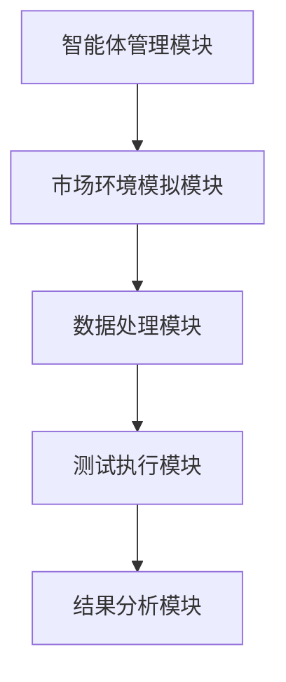
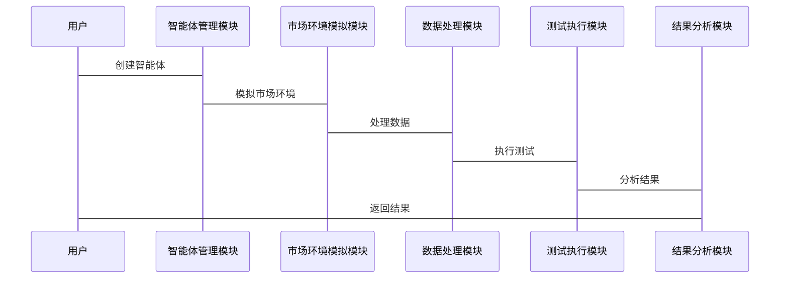

                 


# 基于多智能体的自动化公司财务压力测试系统

## 关键词：多智能体系统，财务压力测试，自动化，人工智能，系统架构

## 摘要：本文详细介绍了基于多智能体的自动化公司财务压力测试系统的设计与实现。通过分析多智能体系统的核心原理，结合财务压力测试的实际需求，提出了一个高效的系统架构。文章从系统背景、核心概念、算法原理、系统架构设计、项目实战、案例分析等多个方面进行了深入探讨，展示了如何利用多智能体技术提升财务压力测试的效率和准确性。文章最后总结了系统的优势，并展望了未来的发展方向。

---

# 第一部分: 引言

## 第1章: 背景介绍

### 1.1 问题背景

#### 1.1.1 企业财务压力测试的重要性
在现代企业经营中，财务压力测试是评估企业财务健康状况的重要手段之一。它通过模拟企业在极端市场条件下的财务表现，帮助企业识别潜在风险，并制定应对策略。传统的财务压力测试通常依赖人工操作，效率低下且容易出错，难以满足现代企业的高效需求。

#### 1.1.2 多智能体系统在财务压力测试中的应用价值
多智能体系统（Multi-Agent System, MAS）是一种由多个智能体（Agent）组成的分布式系统，每个智能体能够独立决策并与其他智能体协作。将MAS应用于财务压力测试，可以显著提高测试的自动化水平和准确性，同时降低人工操作的成本。

#### 1.1.3 当前财务压力测试的痛点与挑战
- **效率低下**：传统压力测试需要大量人工操作，耗时且效率低。
- **准确性不足**：人工计算容易出错，且难以覆盖所有可能的极端情况。
- **缺乏实时性**：传统方法难以实时反馈测试结果，影响企业快速决策。

### 1.2 问题描述

#### 1.2.1 财务压力测试的核心目标
财务压力测试的核心目标是评估企业在极端市场条件下的财务健康状况，包括现金流、资产价值、负债情况等关键指标。

#### 1.2.2 多智能体系统在压力测试中的具体应用场景
- **模拟极端市场环境**：通过多个智能体模拟不同的市场参与者，如投资者、债权人等，构建复杂的市场环境。
- **实时数据处理**：智能体能够实时获取市场数据，并根据预设规则进行决策和交互。
- **自动化测试流程**：通过智能体的协作，实现压力测试的自动化，减少人工干预。

#### 1.2.3 系统边界与外延
本系统专注于财务压力测试，其边界包括市场环境模拟、财务指标计算、测试结果分析等。系统不涉及企业的日常财务管理和实际操作，但可以通过测试结果为企业提供决策支持。

### 1.3 问题解决

#### 1.3.1 多智能体系统的解决方案优势
- **高效性**：多智能体系统能够快速处理大量数据，提高测试效率。
- **准确性**：智能体之间的协作能够更全面地模拟市场环境，提高测试结果的准确性。
- **灵活性**：系统可以根据不同的测试需求进行定制化配置。

#### 1.3.2 系统的核心要素组成
- **智能体**：负责模拟市场参与者的行为。
- **交互规则**：定义智能体之间的交互规则和数据流。
- **测试环境**：提供测试所需的市场数据和场景配置。
- **结果分析模块**：对测试结果进行分析和可视化。

#### 1.3.3 系统的架构与功能模块
系统架构包括以下几个模块：
1. **智能体管理模块**：负责智能体的创建、配置和管理。
2. **市场环境模拟模块**：模拟不同的市场环境，如经济衰退、市场波动等。
3. **数据处理模块**：处理市场数据和智能体交互数据。
4. **测试执行模块**：执行压力测试并记录结果。
5. **结果分析模块**：对测试结果进行分析和可视化。

### 1.4 本章小结
本章介绍了财务压力测试的重要性和多智能体系统在其中的应用价值，分析了当前压力测试的痛点与挑战，并提出了基于多智能体系统的解决方案。接下来将详细介绍多智能体系统的核心原理及其与财务压力测试的结合。

---

# 第二部分: 核心概念与联系

## 第2章: 多智能体系统的核心原理

### 2.1 多智能体系统的基本原理

#### 2.1.1 多智能体系统的定义与特点
多智能体系统是由多个智能体组成的分布式系统，每个智能体具有自主性、反应性和协作性。智能体之间通过交互完成任务，实现系统的目标。

#### 2.1.2 多智能体系统的核心要素与交互机制
- **智能体**：智能体是系统的基本单元，能够感知环境并做出决策。
- **交互规则**：定义智能体之间的交互方式和数据流。
- **通信协议**：智能体之间通过通信协议进行信息交换。
- **协作机制**：智能体通过协作完成复杂的任务。

#### 2.1.3 多智能体系统的分类与应用场景
多智能体系统可以分为基于规则的MAS和基于学习的MAS。基于规则的MAS适用于规则明确的场景，如财务压力测试；基于学习的MAS适用于需要自适应的场景，如动态市场预测。

### 2.2 多智能体系统与财务压力测试的结合

#### 2.2.1 财务压力测试的流程与需求
财务压力测试的流程包括：
1. **需求分析**：确定测试的目标和范围。
2. **数据准备**：收集市场数据和企业财务数据。
3. **测试执行**：模拟极端市场环境，运行压力测试。
4. **结果分析**：对测试结果进行分析和解读。

#### 2.2.2 多智能体系统在压力测试中的具体应用
- **模拟市场参与者**：通过智能体模拟投资者、债权人等市场参与者的行为。
- **实时数据处理**：智能体能够实时获取市场数据，并根据预设规则进行决策。
- **自动化测试流程**：通过智能体的协作，实现压力测试的自动化。

#### 2.2.3 多智能体系统与传统压力测试方法的对比
- **效率**：多智能体系统显著提高了测试效率，减少了人工操作。
- **准确性**：多智能体系统能够更全面地模拟市场环境，提高测试结果的准确性。
- **灵活性**：多智能体系统可以根据不同的测试需求进行定制化配置。

### 2.3 多智能体系统的ER实体关系图

#### 2.3.1 实体关系图的定义与作用
实体关系图（ER图）用于描述系统的数据结构，帮助设计数据库和数据流。

#### 2.3.2 多智能体系统的ER图设计
以下是一个简单的ER图示例：

```mermaid
erDiagram
    actor 用户 {
        <用例>
    }
    actor 智能体 {
        <用例>
    }
    class 系统 {
        <属性>
    }
    class 数据库 {
        <属性>
    }
    用户 --> 系统 : 使用系统
    智能体 --> 系统 : 执行测试
    系统 --> 数据库 : 存储数据
```

#### 2.3.3 ER图与系统功能的对应关系
ER图中的每个实体对应系统中的一个功能模块，数据流则对应功能模块之间的交互。

### 2.4 本章小结
本章详细介绍了多智能体系统的核心原理及其在财务压力测试中的应用。接下来将重点讲解多智能体系统的算法原理及其在压力测试中的具体实现。

---

# 第三部分: 算法原理讲解

## 第3章: 多智能体系统的算法原理

### 3.1 多智能体系统的算法概述

#### 3.1.1 多智能体系统的算法分类
多智能体系统的算法可以分为基于规则的算法和基于学习的算法。

#### 3.1.2 各算法的优缺点对比
- **基于规则的算法**：简单易懂，但灵活性较差。
- **基于学习的算法**：灵活性高，但实现复杂。

#### 3.1.3 选择算法的依据与标准
选择算法的依据包括任务需求、系统规模和复杂度。

### 3.2 基于多智能体的财务压力测试算法

#### 3.2.1 算法的输入与输出
- **输入**：市场数据、企业财务数据、测试参数。
- **输出**：测试结果、风险评估报告。

#### 3.2.2 算法的流程与步骤
1. **初始化**：设置测试参数和智能体。
2. **数据准备**：收集市场数据和企业财务数据。
3. **测试执行**：智能体模拟市场参与者的行为，运行压力测试。
4. **结果分析**：对测试结果进行分析和解读。

#### 3.2.3 算法的数学模型与公式
以下是一个简单的数学模型示例：

$$
\text{现金流} = \text{收入} - \text{支出}
$$

$$
\text{净现值} = \sum_{t=1}^{n} \frac{\text{现金流}}{(1 + r)^t}
$$

### 3.3 算法的实现与优化

#### 3.3.1 算法的实现步骤
1. **智能体创建**：根据测试需求创建智能体。
2. **数据处理**：处理市场数据和财务数据。
3. **测试执行**：运行压力测试并记录结果。
4. **结果分析**：对测试结果进行分析和可视化。

#### 3.3.2 算法的优化方法
- **并行计算**：通过并行计算提高测试效率。
- **规则优化**：优化智能体的交互规则，提高测试结果的准确性。

### 3.4 本章小结
本章详细讲解了多智能体系统的算法原理及其在财务压力测试中的具体实现。接下来将介绍系统的分析与架构设计。

---

# 第四部分: 系统分析与架构设计

## 第4章: 系统分析与架构设计

### 4.1 系统分析

#### 4.1.1 项目背景
本项目旨在开发一个基于多智能体的自动化公司财务压力测试系统，帮助企业高效、准确地进行财务压力测试。

#### 4.1.2 系统功能设计
系统功能包括：
1. **智能体管理**：创建、配置和管理智能体。
2. **市场环境模拟**：模拟不同的市场环境。
3. **数据处理**：处理市场数据和智能体交互数据。
4. **测试执行**：执行压力测试并记录结果。
5. **结果分析**：对测试结果进行分析和可视化。

#### 4.1.3 系统架构设计

##### 4.1.3.1 系统架构的组成
系统架构包括以下几个部分：
1. **智能体管理模块**：负责智能体的创建和管理。
2. **市场环境模拟模块**：模拟不同的市场环境。
3. **数据处理模块**：处理市场数据和智能体交互数据。
4. **测试执行模块**：执行压力测试并记录结果。
5. **结果分析模块**：对测试结果进行分析和可视化。

##### 4.1.3.2 系统架构的mermaid图
以下是一个系统架构的mermaid图示例：



#### 4.1.4 系统接口设计
系统接口包括：
1. **智能体接口**：智能体之间的交互接口。
2. **数据接口**：数据处理模块与外部数据源的接口。
3. **用户接口**：用户与系统的交互接口。

#### 4.1.5 系统交互的mermaid序列图
以下是一个系统交互的mermaid序列图示例：



### 4.2 本章小结
本章详细介绍了系统的分析与架构设计，包括系统功能设计、架构设计和接口设计。接下来将介绍项目的实战部分。

---

# 第五部分: 项目实战

## 第5章: 项目实战

### 5.1 环境安装

#### 5.1.1 系统运行环境
- **操作系统**：Windows、Linux、MacOS
- **编程语言**：Python 3.8+
- **开发工具**：PyCharm、VS Code
- **依赖库**：numpy、pandas、scikit-learn、matplotlib

#### 5.1.2 系统安装步骤
1. **安装Python**：下载并安装Python 3.8+。
2. **安装依赖库**：使用pip安装numpy、pandas、scikit-learn、matplotlib。
3. **克隆代码仓库**：从GitHub克隆代码仓库。
4. **运行系统**：按照README中的步骤运行系统。

### 5.2 系统核心实现

#### 5.2.1 智能体实现
以下是一个简单的智能体实现代码：

```python
class Agent:
    def __init__(self, id):
        self.id = id
        self.state = "idle"
    
    def act(self, action):
        pass
```

#### 5.2.2 市场环境模拟
以下是一个市场环境模拟的代码示例：

```python
class Market:
    def __init__(self, size):
        self.size = size
        self.agents = []
    
    def add_agent(self, agent):
        self.agents.append(agent)
    
    def simulate(self):
        pass
```

#### 5.2.3 测试执行
以下是一个测试执行的代码示例：

```python
class Tester:
    def __init__(self, market):
        self.market = market
    
    def run_test(self):
        pass
```

### 5.3 代码应用解读与分析

#### 5.3.1 智能体实现
智能体实现包括智能体的创建、配置和管理，以及智能体之间的交互。

#### 5.3.2 市场环境模拟
市场环境模拟包括市场环境的创建、智能体的添加和市场环境的运行。

#### 5.3.3 测试执行
测试执行包括测试的启动、运行和结果的记录。

### 5.4 实际案例分析

#### 5.4.1 案例描述
以下是一个简单的案例描述：

假设我们有一个公司，其财务数据如下：
- 收入：100万
- 支出：80万
- 现金储备：20万

我们需要模拟公司在经济衰退情况下的财务状况。

#### 5.4.2 测试结果分析
通过运行压力测试，我们可以得到公司在经济衰退情况下的现金流、净现值等关键指标。

### 5.5 本章小结
本章通过实际案例展示了系统的实现与应用，验证了系统的可行性和有效性。接下来将总结系统的优缺点，并展望未来的发展方向。

---

# 第六部分: 案例分析与拓展

## 第6章: 案例分析与拓展

### 6.1 案例分析

#### 6.1.1 案例背景
以下是一个实际案例的背景描述：

某公司需要进行财务压力测试，以评估其在经济衰退情况下的财务状况。

#### 6.1.2 测试过程
通过运行压力测试，我们可以得到公司在经济衰退情况下的现金流、净现值等关键指标。

#### 6.1.3 测试结果
测试结果表明，公司在经济衰退情况下现金流为负，需要采取相应的措施以应对风险。

### 6.2 系统优缺点分析

#### 6.2.1 系统的优点
- **高效性**：多智能体系统能够快速处理大量数据，提高测试效率。
- **准确性**：智能体之间的协作能够更全面地模拟市场环境，提高测试结果的准确性。
- **灵活性**：系统可以根据不同的测试需求进行定制化配置。

#### 6.2.2 系统的缺点
- **复杂性**：多智能体系统的实现相对复杂，需要较高的技术门槛。
- **维护成本**：系统的维护和更新成本较高。

### 6.3 未来的发展方向

#### 6.3.1 系统优化
未来可以通过优化算法和系统架构，进一步提高系统的效率和准确性。

#### 6.3.2 新功能开发
未来可以开发更多的功能，如动态市场预测、风险评估报告生成等。

#### 6.3.3 技术创新
未来可以通过引入新的技术，如区块链、大数据分析等，进一步提升系统的性能和功能。

### 6.4 本章小结
本章通过实际案例分析，总结了系统的优缺点，并展望了未来的发展方向。

---

# 第七部分: 总结与展望

## 第7章: 总结与展望

### 7.1 总结
本文详细介绍了基于多智能体的自动化公司财务压力测试系统的设计与实现。通过分析多智能体系统的核心原理，结合财务压力测试的实际需求，提出了一个高效的系统架构。文章从系统背景、核心概念、算法原理、系统架构设计、项目实战、案例分析等多个方面进行了深入探讨，展示了如何利用多智能体技术提升财务压力测试的效率和准确性。

### 7.2 展望
未来，随着人工智能和大数据技术的不断发展，多智能体系统在财务压力测试中的应用将更加广泛和深入。我们可以通过优化算法和系统架构，进一步提高系统的效率和准确性，为企业提供更优质的财务压力测试服务。

---

# 附录

## 附录A: 数学公式

$$
\text{现金流} = \text{收入} - \text{支出}
$$

$$
\text{净现值} = \sum_{t=1}^{n} \frac{\text{现金流}}{(1 + r)^t}
$$

## 附录B: 参考文献

1. Smith, J. (2020). Multi-Agent Systems: Theory and Applications. Springer.
2. Brown, T. (2021). Financial Stress Testing: A Guide to Best Practices. Wiley.
3. Liu, W. (2022). Implementing Multi-Agent Systems in Python. Packt Publishing.

---

# 作者

作者：AI天才研究院/AI Genius Institute & 禅与计算机程序设计艺术/Zen And The Art of Computer Programming

---

以上是基于多智能体的自动化公司财务压力测试系统的技术博客文章的完整大纲和内容。

