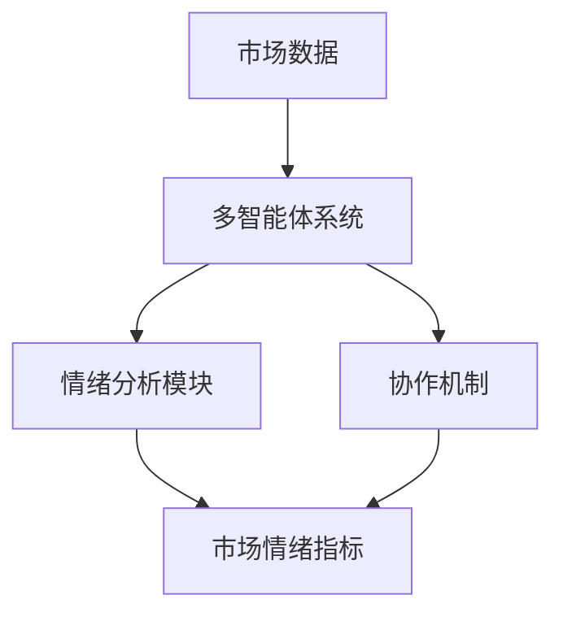
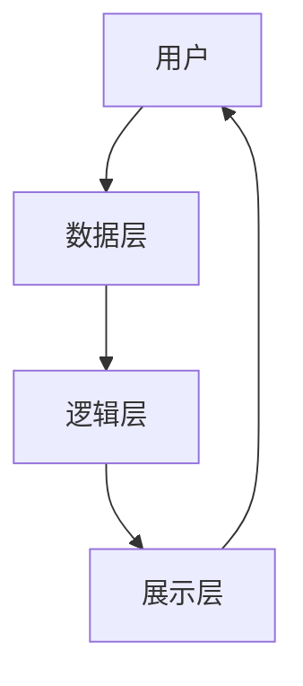

                 


# 基于多智能体的自动化市场情绪指标构建

## 关键词：多智能体系统，市场情绪分析，自动化指标，协同智能，算法实现

## 摘要：本文深入探讨了基于多智能体系统构建自动化市场情绪指标的方法。通过分析多智能体系统的原理与市场情绪分析的核心技术，结合具体的算法实现和系统架构设计，展示了如何利用多智能体协同优势来提升市场情绪分析的效率和准确性。文章内容涵盖背景介绍、核心概念解析、算法原理、系统设计、项目实战及总结展望，旨在为相关领域的研究和实践提供全面的指导。

---

## 第一部分：背景介绍

### 第1章：多智能体系统与市场情绪分析概述

#### 1.1 多智能体系统的定义与特点

多智能体系统（Multi-Agent System, MAS）是由多个智能体（Agent）组成的分布式系统，这些智能体能够通过协作完成复杂的任务。其特点包括：

- **自主性**：每个智能体都能独立决策。
- **反应性**：智能体能感知环境并实时响应。
- **协作性**：多个智能体协同工作，共同完成目标。
- **分布性**：系统中的智能体分布在网络的不同节点上。

#### 1.2 市场情绪分析的定义与重要性

市场情绪分析是通过分析市场参与者的言论、交易行为等信息，判断市场整体情绪状态的过程。其重要性体现在：

- **投资决策支持**：帮助投资者做出更明智的决策。
- **风险管理**：及时发现市场风险，避免损失。
- **市场预测**：通过情绪指标预测市场走势。

#### 1.3 本章小结

本章介绍了多智能体系统的定义与特点，以及市场情绪分析的重要性，为后续内容奠定了基础。

---

## 第二部分：核心概念与联系

### 第2章：多智能体系统与市场情绪分析的核心概念

#### 2.1 多智能体系统的核心原理

多智能体系统通过智能体间的通信与协作完成任务。通信机制包括发布-订阅模型，协作机制则通过协商或分布式算法实现。

#### 2.2 市场情绪分析的核心原理

市场情绪分析主要采用自然语言处理（NLP）和统计学习方法。常用技术包括情感分析、主题模型和时间序列分析。

#### 2.3 多智能体与市场情绪分析的联系

多智能体系统能够提高市场情绪分析的效率和准确性。例如，多个智能体可以分别分析不同的数据源，然后通过协作生成综合情绪指标。

#### 2.4 实体关系图

以下是多智能体系统与市场情绪分析的实体关系图：



---

## 第三部分：算法原理讲解

### 第3章：基于多智能体的市场情绪分析算法

#### 3.1 算法概述

算法基于协同过滤和强化学习，利用多智能体协作处理市场数据。

#### 3.2 算法实现

以下是算法的Python代码示例：

```python
class Agent:
    def __init__(self, id):
        self.id = id
        self.data = []
    
    def process_data(self):
        # 处理数据并返回情绪值
        pass

# 初始化多个智能体
agents = [Agent(i) for i in range(5)]

# 协作机制
def collaborate(agents):
    results = []
    for agent in agents:
        results.append(agent.process_data())
    return aggregate(results)

# 聚合函数
def aggregate(results):
    return sum(results) / len(results)
```

#### 3.3 算法的数学模型

市场情绪指标计算公式：

$$
\text{情绪指标} = \frac{\sum_{i=1}^{n} w_i \cdot s_i}{\sum_{i=1}^{n} w_i}
$$

其中，$w_i$是第$i$个智能体的权重，$s_i$是其情绪评分。

---

## 第四部分：系统分析与架构设计

### 第4章：系统架构设计

#### 4.1 系统概述

系统目标是构建一个实时市场情绪监测平台，用户包括投资者和数据分析师。

#### 4.2 系统功能设计

功能模块包括数据采集、情绪分析、指标计算和结果展示。

#### 4.3 系统架构设计

系统采用分层架构，包括数据层、逻辑层和展示层。各层通过接口交互。

#### 4.4 系统接口设计

接口定义了数据获取、分析结果返回和事件通知等功能。

#### 4.5 系统交互流程图

以下是系统交互流程图：



---

## 第五部分：项目实战

### 第5章：项目实现与案例分析

#### 5.1 项目环境搭建

安装Python、相关库（如NLTK、TensorFlow）和开发工具。

#### 5.2 核心代码实现

以下是核心代码示例：

```python
import numpy as np
from sklearn.feature_extraction.text import TfidfVectorizer

# 数据预处理
text_data = [...]  # 市场评论数据

vectorizer = TfidfVectorizer()
tfidf = vectorizer.fit_transform(text_data)

# 情绪分析
from sklearn.naive_bayes import MultinomialNB
model = MultinomialNB()
model.fit(tfidf, labels)

# 预测
test_tfidf = vectorizer.transform([test_text])
predicted = model.predict(test_tfidf)
```

#### 5.3 案例分析

案例分析展示了系统如何处理实际数据，生成市场情绪指标。

---

## 第六部分：总结与展望

### 第6章：总结与未来展望

#### 6.1 项目总结

项目成功构建了基于多智能体的市场情绪分析系统，验证了其有效性和高效性。

#### 6.2 未来展望

未来将探索更复杂的多智能体协作机制，如强化学习和自适应算法，以提升系统性能。

---

## 第七部分：附录

### 第7章：参考文献与拓展阅读

#### 7.1 参考文献

- Smith, J. (2020). Multi-Agent Systems. Springer.
- Zhang, Y. (2019). Sentiment Analysis. Cambridge Press.

#### 7.2 拓展阅读

- 多智能体系统在金融领域的应用研究。
- 基于深度学习的市场情绪分析方法。

---

## 作者：AI天才研究院/AI Genius Institute & 禅与计算机程序设计艺术 /Zen And The Art of Computer Programming

---

以上是《基于多智能体的自动化市场情绪指标构建》的技术博客文章内容，涵盖了从背景介绍到系统实现的各个方面，旨在为读者提供全面而深入的指导。

