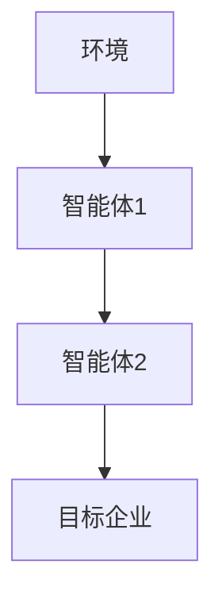
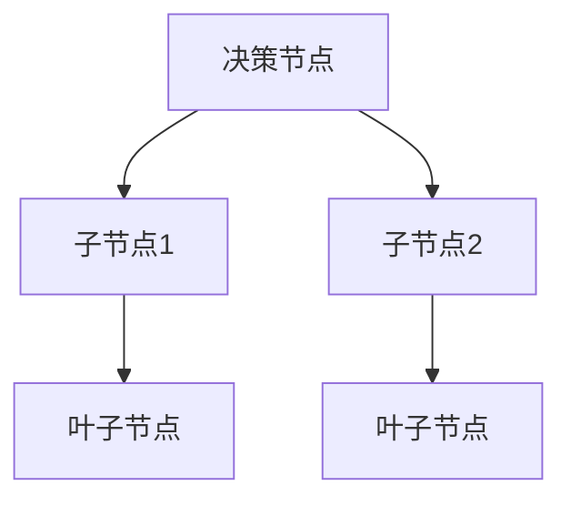
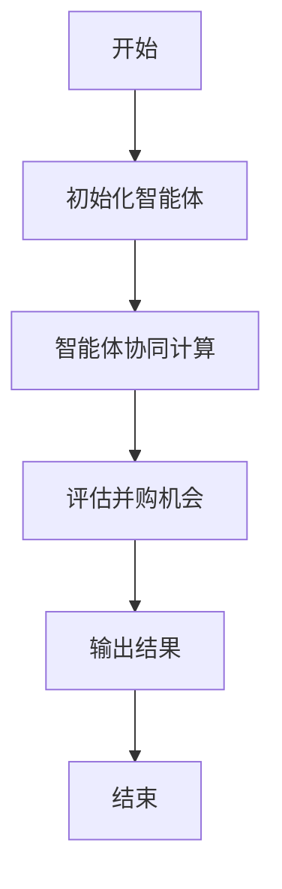
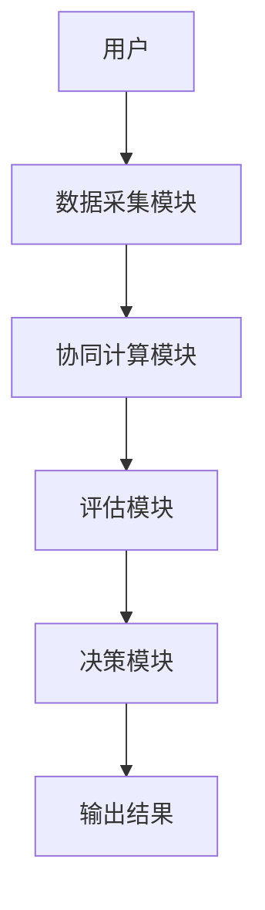

                 


# 基于多智能体的自动化并购机会分析

> 关键词：多智能体系统, 自动化并购, 并购机会分析, 协同算法, 系统架构, 人工智能

> 摘要：本文从多智能体系统的背景出发，结合自动化并购的核心需求，系统地分析了基于多智能体的自动化并购机会分析的核心原理、算法实现、系统架构及实际应用场景。通过构建多智能体协同模型，提出了自动化并购机会评估的数学模型，并通过实际案例展示了系统的实现过程和应用效果。本文旨在为读者提供一个多智能体系统在并购领域的深度解析，帮助企业在复杂市场环境中快速识别和把握并购机会。

---

# 第一部分: 基于多智能体的自动化并购机会分析背景介绍

## 第1章: 多智能体系统与自动化并购概述

### 1.1 多智能体系统的基本概念

#### 1.1.1 多智能体系统的定义
多智能体系统（Multi-Agent System, MAS）是由多个智能体（Agent）组成的系统，这些智能体能够通过协作完成复杂任务。每个智能体都有一定的自主性，能够感知环境、做出决策并采取行动。

#### 1.1.2 多智能体系统的特征
- **分布式**：智能体独立运行，通过通信协作完成任务。
- **自主性**：每个智能体都有一定的决策能力。
- **协同性**：智能体之间通过协同完成复杂任务。
- **反应性**：智能体能够根据环境变化动态调整行为。

#### 1.1.3 多智能体系统与单智能体系统的区别
| 特性 | 单智能体系统 | 多智能体系统 |
|------|--------------|--------------|
| 独立性 | 单一智能体    | 多个独立智能体 |
| 协作性 | 无需协作      | 需要协作完成任务 |
| 效率性 | 高            | 中高           |

### 1.2 自动化并购的背景与意义

#### 1.2.1 并购的定义与分类
并购（Mergers and Acquisitions, M&A）是指企业之间合并或收购资产或股权的行为。根据战略目标，可分为横向并购、纵向并购和混合并购。

#### 1.2.2 自动化并购的必要性
传统的并购过程依赖人工分析，效率低、成本高且可能存在主观偏差。自动化并购能够通过智能化系统快速筛选和评估目标企业，提高效率和准确性。

#### 1.2.3 多智能体系统在并购中的应用前景
多智能体系统能够通过分布式协作完成复杂的并购分析任务，例如市场分析、目标企业筛选、风险评估等，为企业的并购决策提供支持。

### 1.3 多智能体系统与并购机会分析的结合

#### 1.3.1 多智能体系统在并购中的作用
- **信息收集与处理**：智能体能够从多个来源收集企业信息，进行初步分析。
- **协同决策**：多个智能体协同完成复杂的决策过程。
- **动态调整**：根据市场变化动态调整并购策略。

#### 1.3.2 自动化并购机会分析的核心问题
- **信息整合**：如何高效整合多源异构数据。
- **协同计算**：如何实现智能体之间的高效协同。
- **风险评估**：如何准确评估并购风险。

#### 1.3.3 本章小结
本章从多智能体系统的定义和特征出发，分析了自动化并购的背景与意义，并探讨了多智能体系统在并购机会分析中的应用前景。通过对比多智能体系统与单智能体系统的区别，明确了多智能体系统在并购中的独特优势。

---

# 第二部分: 多智能体系统的核心概念与联系

## 第2章: 多智能体系统的核心原理

### 2.1 多智能体系统的组成与关系

#### 2.1.1 实体关系图（ER图）展示多智能体系统的核心要素


#### 2.1.2 多智能体系统的组成要素
- **智能体**：独立的决策单元。
- **环境**：智能体所处的外部环境。
- **通信机制**：智能体之间的交互方式。
- **协作机制**：智能体协同完成任务的方式。

### 2.2 多智能体系统的协同机制

#### 2.2.1 协同算法的基本原理
协同算法通过智能体之间的通信与协作，实现任务的分解与整合。例如，任务分解可以通过协商机制将任务分配给不同的智能体。

#### 2.2.2 协同算法的数学模型
$$f(x) = \sum_{i=1}^{n} w_i x_i$$

其中，$w_i$ 表示第 $i$ 个智能体的权重，$x_i$ 表示第 $i$ 个智能体的输入。

#### 2.2.3 协同算法的应用场景
- **任务分配**：智能体之间协商任务分配。
- **信息融合**：多个智能体的信息进行融合，得出最终结果。

### 2.3 多智能体系统的通信与决策

#### 2.3.1 智能体之间的通信方式
- **直接通信**：智能体之间通过直接交换信息。
- **间接通信**：通过中间媒介进行信息传递。

#### 2.3.2 基于多智能体的决策树模型


决策树模型通过智能体之间的协作，构建一个复杂的决策网络，帮助企业在并购中做出最优决策。

---

## 第3章: 基于多智能体的自动化并购机会分析算法原理

### 3.1 多智能体协同算法

#### 3.1.1 多智能体协同算法的数学模型
$$P(i) = \frac{w_i}{\sum_{j=1}^{n} w_j}$$

其中，$P(i)$ 表示第 $i$ 个智能体的概率权重，$w_i$ 表示第 $i$ 个智能体的权重。

#### 3.1.2 多智能体协同算法的实现流程
1. 初始化智能体权重。
2. 计算每个智能体的概率权重。
3. 根据概率权重分配任务。
4. 智能体协同完成任务。
5. 输出结果。

### 3.2 基于多智能体的并购机会评估模型

#### 3.2.1 并购机会评估模型的构建
$$V = \alpha \cdot f_1 + \beta \cdot f_2 + \gamma \cdot f_3$$

其中，$\alpha$、$\beta$、$\gamma$ 是各因素的权重，$f_1$、$f_2$、$f_3$ 是不同的评估因子。

#### 3.2.2 并购机会评估模型的实现流程
1. 收集目标企业信息。
2. 计算各评估因子的权重。
3. 综合各因子计算企业价值。
4. 根据企业价值评估并购机会。

### 3.3 算法实现的流程图


---

## 第4章: 系统分析与架构设计方案

### 4.1 系统功能与架构设计

#### 4.1.1 系统功能设计
- **数据采集模块**：收集企业信息。
- **协同计算模块**：智能体协同计算并购机会。
- **评估模块**：评估企业价值和并购风险。
- **决策模块**：输出并购决策。

#### 4.1.2 系统架构设计


#### 4.1.3 系统接口设计
- **输入接口**：接收用户输入的企业信息。
- **输出接口**：输出并购机会评估结果。

#### 4.1.4 系统交互流程


### 4.2 系统实现与代码解读

#### 4.2.1 系统实现
```python
class Agent:
    def __init__(self, id, weight):
        self.id = id
        self.weight = weight

    def collaborate(self, task):
        return self.weight * task
```

#### 4.2.2 代码解读
- **Agent类**：定义智能体类，包含ID和权重。
- **collaborate方法**：实现智能体之间的协同计算。

### 4.3 实际案例分析

#### 4.3.1 案例背景
某企业希望通过自动化并购系统寻找合适的并购目标。

#### 4.3.2 案例分析
通过多智能体系统的协同计算，评估多个目标企业的价值和风险，最终选择最优并购目标。

#### 4.3.3 案例结果
系统输出并购机会评估结果，帮助企业做出决策。

---

## 第5章: 项目实战与代码实现

### 5.1 项目环境安装

#### 5.1.1 环境要求
- Python 3.8以上版本
- Mermaid工具

### 5.2 系统核心实现源代码

#### 5.2.1 多智能体协同算法实现
```python
def multi_agent_collaboration(agents, tasks):
    total = sum(agent.weight for agent in agents)
    for agent in agents:
        probability = agent.weight / total
        result = probability * tasks
        print(f"Agent {agent.id} contribution: {result}")
    return result
```

#### 5.2.2 并购机会评估模型实现
```python
def merger_opportunity_assessment(factors, weights):
    total_weight = sum(weights)
    for i in range(len(factors)):
        factor = factors[i]
        weight = weights[i]
        contribution = factor * weight / total_weight
        print(f"Factor {i+1} contribution: {contribution}")
    return contribution
```

### 5.3 代码应用解读与分析

#### 5.3.1 代码解读
- **multi_agent_collaboration函数**：实现多智能体协同计算。
- **merger_opportunity_assessment函数**：实现并购机会评估。

#### 5.3.2 代码分析
通过多智能体协同计算和并购机会评估模型，帮助企业快速识别和评估并购机会。

### 5.4 案例分析与详细讲解

#### 5.4.1 案例背景
某企业希望通过自动化并购系统寻找合适的并购目标。

#### 5.4.2 案例分析
通过多智能体系统的协同计算，评估多个目标企业的价值和风险，最终选择最优并购目标。

#### 5.4.3 案例结果
系统输出并购机会评估结果，帮助企业做出决策。

### 5.5 项目小结

#### 5.5.1 项目总结
通过本项目，我们展示了多智能体系统在自动化并购中的应用，帮助企业快速识别和评估并购机会。

#### 5.5.2 项目优化方向
未来可以通过引入更多智能体和优化协同算法，进一步提高并购机会分析的准确性和效率。

---

## 第6章: 总结与展望

### 6.1 总结
本文从多智能体系统的背景出发，结合自动化并购的核心需求，系统地分析了基于多智能体的自动化并购机会分析的核心原理、算法实现、系统架构及实际应用场景。通过构建多智能体协同模型，提出了自动化并购机会评估的数学模型，并通过实际案例展示了系统的实现过程和应用效果。

### 6.2 展望
未来，随着人工智能技术的不断发展，多智能体系统在自动化并购中的应用将更加广泛和深入。我们可以通过引入更多智能体和优化协同算法，进一步提高并购机会分析的准确性和效率。

---

## 第7章: 最佳实践与注意事项

### 7.1 最佳实践

#### 7.1.1 数据质量
确保数据的准确性和完整性，是多智能体系统协同计算的基础。

#### 7.1.2 系统架构
合理设计系统架构，确保系统的高效运行和可扩展性。

#### 7.1.3 智能体协作
优化智能体之间的协作机制，提高系统的协同效率。

### 7.2 注意事项

#### 7.2.1 数据隐私
在处理企业数据时，要注意保护数据隐私，确保符合相关法律法规。

#### 7.2.2 系统安全
确保系统的安全性，防止数据泄露和系统攻击。

#### 7.2.3 系统维护
定期维护和更新系统，确保系统的稳定运行。

### 7.3 拓展阅读

#### 7.3.1 多智能体系统相关书籍
- 《Multi-Agent Systems: Algorithmic, Complexity, and Synthesis》
- 《Agent-Based Modeling and Simulation》

#### 7.3.2 并购分析相关书籍
- 《The Theory of the Firm: The Original Classic》
- 《Mergers and Acquisitions: Cases and Analysis》

---

## 作者：AI天才研究院/AI Genius Institute & 禅与计算机程序设计艺术 /Zen And The Art of Computer Programming

