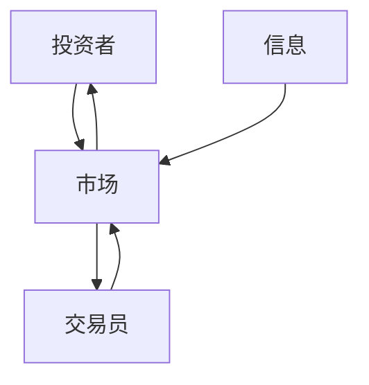
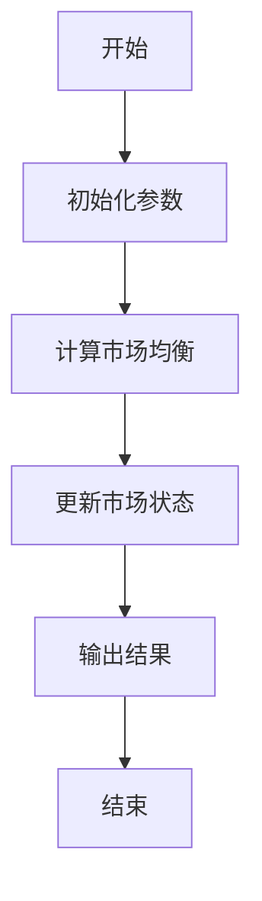
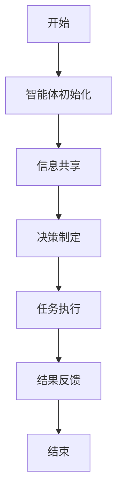
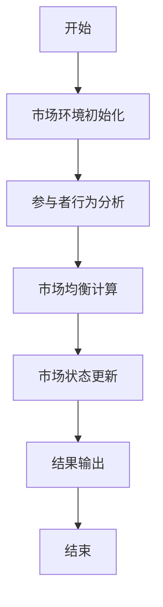

                 


# 基于多智能体的自适应市场假说在价值投资中的应用

**关键词：** 多智能体系统、自适应市场假说、价值投资、金融市场、人工智能

**摘要：** 本文深入探讨了基于多智能体的自适应市场假说在价值投资中的应用。通过分析多智能体系统的核心原理、自适应市场假说的理论基础，以及它们在金融市场的实际应用，本文提出了一个结合多智能体系统与自适应市场假说的创新性价值投资框架。文章从背景介绍、核心概念、算法原理、系统架构设计、项目实战等多个维度展开，详细阐述了如何利用多智能体系统实现自适应市场假说，并将其应用于价值投资中。通过具体的案例分析和代码实现，本文为读者提供了理论与实践相结合的深度解析。

---

# 第一部分: 背景介绍

## 第1章: 问题背景

### 1.1 问题背景

#### 1.1.1 传统价值投资的局限性
传统价值投资方法依赖于对市场趋势和公司基本面的分析，但在复杂多变的金融市场中，这种方法往往难以捕捉市场的动态变化。投资者需要一种更灵活、更具适应性的投资策略。

#### 1.1.2 多智能体系统在金融领域的潜力
多智能体系统（Multi-Agent System, MAS）通过多个智能体的协作，能够模拟市场参与者的复杂行为，捕捉市场的动态变化。这为价值投资提供了新的可能性。

#### 1.1.3 自适应市场假说的提出与意义
自适应市场假说认为，市场的参与者通过不断适应市场环境，最终会使市场呈现某种均衡状态。这一假说为多智能体系统在金融市场中的应用提供了理论基础。

### 1.2 问题描述

#### 1.2.1 传统市场假说的不足
传统市场假说（如有效市场假说）假设市场是完全理性的，但现实中市场的参与者往往存在非理性行为，导致市场呈现复杂动态。

#### 1.2.2 多智能体系统在金融市场中的角色
多智能体系统能够模拟市场参与者的行为，分析市场的动态变化，为投资决策提供支持。

#### 1.2.3 自适应市场假说的核心思想
自适应市场假说强调市场参与者的适应性行为，认为市场会通过自我调节达到某种均衡状态。

### 1.3 问题解决

#### 1.3.1 多智能体系统的自适应机制
多智能体系统通过智能体之间的协作和信息共享，实现对市场环境的自适应。

#### 1.3.2 自适应市场假说在价值投资中的应用
通过模拟市场参与者的适应性行为，投资者可以更好地捕捉市场机会，制定更科学的投资策略。

#### 1.3.3 问题边界与外延
本文研究的范围限定于多智能体系统在自适应市场假说中的应用，不涉及其他类型的市场假说或投资策略。

### 1.4 核心概念与联系

#### 1.4.1 多智能体系统的核心要素
- **智能体（Agent）**：具有感知和行动能力的独立实体。
- **通信机制**：智能体之间的信息交换方式。
- **协作机制**：智能体之间的协同工作方式。

#### 1.4.2 自适应市场假说的实体关系图
通过Mermaid图展示市场参与者（如投资者、交易员）与市场的关系。



#### 1.4.3 多智能体与自适应市场假说的对比分析
下表对比了多智能体系统与自适应市场假说的核心特征：

| 特性            | 多智能体系统                | 自适应市场假说              |
|-----------------|---------------------------|-----------------------------|
| 核心概念         | 智能体协作、自适应行为       | 市场均衡、参与者适应性        |
| 应用场景         | 金融市场模拟、投资策略优化   | 市场动态分析、投资决策支持    |
| 优势             | 高度灵活性、适应性强          | 理论基础扎实、适用范围广       |

---

## 第2章: 核心概念与联系

### 2.1 多智能体系统原理

#### 2.1.1 多智能体系统的定义与特点
- **定义**：多智能体系统是由多个智能体组成的分布式系统，通过协作完成复杂任务。
- **特点**：去中心化、协作性、适应性。

#### 2.1.2 多智能体系统的组成与功能
- **组成**：智能体、通信机制、协作机制。
- **功能**：信息处理、决策制定、任务执行。

#### 2.1.3 多智能体系统的通信与协作机制
- **通信机制**：基于消息传递或共享数据库。
- **协作机制**：基于规则或基于学习。

### 2.2 自适应市场假说的原理

#### 2.2.1 自适应市场假说的定义
- **定义**：市场参与者通过不断适应市场环境，最终使市场达到某种均衡状态。

#### 2.2.2 自适应市场假说的核心假设
- **假设1**：市场参与者能够通过学习和适应，优化自己的决策。
- **假设2**：市场的动态变化可以通过参与者的行为调整来实现均衡。

#### 2.2.3 自适应市场假说的数学模型
- **模型**：基于博弈论的市场均衡模型。
- **公式**：$$P(t) = f(P(t-1), I(t))$$，其中 \(P(t)\) 表示时间 \(t\) 的市场价格，\(I(t)\) 表示市场信息。

### 2.3 多智能体与自适应市场假说的联系

#### 2.3.1 多智能体系统如何实现自适应市场假说
- **实现方式**：通过智能体协作模拟市场参与者的适应性行为。

#### 2.3.2 多智能体系统在自适应市场假说中的角色
- **角色**：模拟市场参与者的行为，验证自适应市场假说的理论假设。

#### 2.3.3 多智能体系统与自适应市场假说的对比分析
通过对比分析，可以发现两者在核心思想和应用场景上有一定的契合点。

---

## 第3章: 算法原理讲解

### 3.1 多智能体系统的算法原理

#### 3.1.1 多智能体系统的通信协议
- **通信协议**：基于消息传递的通信协议。

#### 3.1.2 多智能体系统的协作算法
- **协作算法**：基于规则的协作算法。

#### 3.1.3 多智能体系统的自适应机制
- **自适应机制**：基于反馈的自适应算法。

### 3.2 自适应市场假说的算法实现

#### 3.2.1 自适应市场假说的数学模型
- **模型**：基于博弈论的市场均衡模型。

#### 3.2.2 自适应市场假说的算法流程
通过Mermaid图展示算法流程：



#### 3.2.3 自适应市场假说的代码实现
以下是Python代码实现：

```python
def market_adaptation(initial_params):
    # 初始化参数
    params = initial_params.copy()
    # 计算市场均衡
    equilibrium = calculate_equilibrium(params)
    # 更新市场状态
    updated_params = update_params(equilibrium)
    return updated_params

def calculate_equilibrium(params):
    # 假设均衡计算基于博弈论模型
    return params['price'] * params['demand'] / params['supply']

def update_params(equilibrium):
    # 更新参数
    return {'price': equilibrium, 'demand': equilibrium * 2, 'supply': equilibrium}
```

### 3.3 算法流程图

#### 3.3.1 多智能体系统算法流程图
通过Mermaid图展示：



#### 3.3.2 自适应市场假说算法流程图
通过Mermaid图展示：



---

## 第4章: 系统分析与架构设计方案

### 4.1 问题场景介绍

#### 4.1.1 价值投资中的问题场景
- **问题场景**：传统价值投资方法难以捕捉市场动态变化。

#### 4.1.2 多智能体系统在价值投资中的应用场景
- **应用场景**：模拟市场参与者行为，优化投资策略。

#### 4.1.3 自适应市场假说在价值投资中的应用目标
- **目标**：通过模拟市场参与者的行为，优化投资决策。

### 4.2 项目介绍

#### 4.2.1 项目目标
- **目标**：构建基于多智能体的自适应市场假说的值

