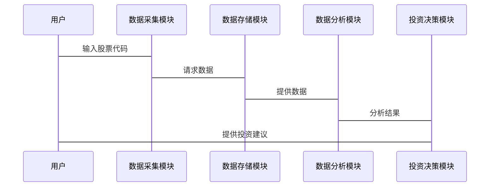

                 


# 基本面分析在彼得·林奇投资中的地位

## 关键词：基本面分析，彼得·林奇，投资策略，财务报表，估值方法

## 摘要：基本面分析是评估公司内在价值的核心方法，彼得·林奇以其独特的选股策略和长期投资理念闻名。本文深入探讨基本面分析的核心概念、彼得·林奇的投资策略、基本面分析与技术分析的结合，以及系统化的投资架构设计。通过详细分析，读者将理解如何将基本面分析应用于实际投资决策中，以实现长期稳定的收益。

---

# 第一部分: 引言

## 第1章: 什么是基本面分析

### 1.1 基本面分析的定义

#### 1.1.1 基本面分析的核心概念

基本面分析是一种评估公司内在价值的方法，侧重于分析公司的财务状况、行业地位、管理团队和宏观经济环境等因素。其核心在于通过这些因素预测公司的未来表现，从而确定其股票的合理价格。

#### 1.1.2 基本面分析的三大支柱

基本面分析主要由三部分组成：
1. **财务报表分析**：通过利润表、资产负债表和现金流量表评估公司的财务健康状况。
2. **估值方法**：使用市盈率（P/E）、市净率（P/B）等指标评估股票的合理价格。
3. **行业分析与宏观经济分析**：分析行业趋势和宏观经济环境对公司的潜在影响。

### 1.2 基本面分析的重要性

#### 1.2.1 基本面分析在投资中的作用

基本面分析帮助投资者识别具有长期增长潜力的公司，避免短期市场波动的影响，从而做出更理性的投资决策。

#### 1.2.2 基本面分析与技术分析的区别

- **基本面分析**：侧重于公司内在价值，关注长期发展趋势。
- **技术分析**：侧重于价格走势和交易量，关注短期市场波动。

### 1.3 彼得·林奇与基本面分析

#### 1.3.1 彼得·林奇的背景与投资理念

彼得·林奇是富达投资集团的传奇经理人，以其成功的选股策略和长期投资理念著称。他强调基本面分析的重要性，认为股票的价值取决于公司的财务状况和未来盈利能力。

#### 1.3.2 彼得·林奇对基本面分析的贡献

彼得·林奇将基本面分析系统化，提出了独特的选股标准和投资策略，为现代投资理论提供了宝贵的实践经验。

### 1.4 本章小结

基本面分析是评估公司内在价值的核心方法，彼得·林奇的投资理念进一步丰富了基本面分析的理论体系，为投资者提供了实用的指导。

---

# 第二部分: 基本面分析的核心概念

## 第2章: 基本面分析的方法与工具

### 2.1 财务报表分析

#### 2.1.1 利润表分析

利润表反映了公司在一定时期内的收入和利润情况，主要包括营业收入、成本、税前利润和净利润等指标。

**公式**：
$$ 利润 = 收入 - 成本 - 税费 $$

#### 2.1.2 资产负债表分析

资产负债表显示了公司在某一特定时间点的资产、负债和所有者权益情况。

**公式**：
$$ 资产 = 负债 + 所有者权益 $$

#### 2.1.3 现金流量表分析

现金流量表记录了公司在一定时期内的现金流入和流出情况，分为经营活动、投资活动和筹资活动三部分。

**公式**：
$$ 现金净流量 = 现金流入 - 现金流出 $$

#### 2.2 估值方法

##### 2.2.1 市盈率（P/E）分析

市盈率是股票价格与每股收益的比率，用于评估股票的估值是否合理。

**公式**：
$$ P/E = \frac{股价}{每股收益} $$

##### 2.2.2 市净率（P/B）分析

市净率是股票价格与每股净资产的比率，适用于评估银行、保险公司等资产密集型行业的公司。

**公式**：
$$ P/B = \frac{股价}{每股净资产} $$

##### 2.2.3 股息率分析

股息率是公司每年派发的股息与股价的比率，用于评估股票的分红能力。

**公式**：
$$ 股息率 = \frac{每股股息}{股价} \times 100\% $$

#### 2.3 行业分析与宏观经济分析

##### 2.3.1 行业分析的核心要素

行业分析包括市场规模、市场增长率、竞争格局和行业周期等因素。

##### 2.3.2 宏观经济对行业的影响

宏观经济环境如GDP增长率、利率和通货膨胀率等会直接影响行业的表现。

#### 2.4 基本面分析的工具与资源

##### 2.4.1 财务数据获取渠道

- 公司年度报告
- 金融数据平台（如Yahoo Finance, Bloomberg）

##### 2.4.2 专业分析工具介绍

- 财务分析软件（如Excel, MATLAB）
- 股票分析工具（如Morningstar）

### 2.5 本章小结

基本面分析的核心在于准确解读财务报表，合理使用估值指标，并结合行业和宏观经济因素，全面评估公司的内在价值。

---

# 第三部分: 彼得·林奇的投资策略

## 第3章: 彼得·林奇的选股标准

### 3.1 彼得·林奇的选股理念

#### 3.1.1 买入并持有策略

彼得·林奇主张买入具有长期增长潜力的公司股票，并长期持有，避免频繁交易。

#### 3.1.2 中期投资与长期投资的结合

他结合中期和长期投资策略，根据公司的基本面变化调整投资组合。

### 3.2 彼得·林奇的核心选股指标

#### 3.2.1 市盈率与市净率的平衡

他关注市盈率和市净率的合理范围，避免过高或过低的估值。

#### 3.2.2 股息率与成长性的结合

彼得·林奇偏好股息率适中且具有成长性的公司。

### 3.3 彼得·林奇的行业偏好

#### 3.3.1 喜欢的行业类型

- �消费品行业
- 医疗保健行业
- 金融行业

#### 3.3.2 不喜欢的行业类型

- 周期性较强的行业
- 高负债率的行业

### 3.4 本章小结

彼得·林奇的选股策略以基本面分析为核心，注重公司的财务健康、行业地位和成长潜力，强调长期投资和价值发现。

---

# 第四部分: 基本面分析与技术分析的结合

## 第4章: 基本面分析与技术分析的协同作用

### 4.1 技术分析的基础知识

#### 4.1.1 技术分析的核心概念

技术分析通过研究历史价格和交易量，预测未来的价格走势。

#### 4.1.2 常用的技术指标

- 移动平均线（MA）
- 相对强弱指数（RSI）
- 麦卡勒姆指标（MACD）

### 4.2 基本面分析与技术分析的结合

#### 4.2.1 基本面分析为技术分析提供方向

基本面分析确定投资标的后，技术分析用于寻找合适的入场和出场点。

#### 4.2.2 技术分析为基本面分析提供时机

技术分析帮助识别短期价格波动，捕捉基本面变化带来的市场机会。

### 4.3 实际案例分析

#### 4.3.1 一个成功的结合案例

假设某公司基本面良好，市盈率合理，技术分析显示价格处于上升趋势，投资者可以选择在价格回调时买入。

#### 4.3.2 一个失败的结合案例

如果基本面分析显示公司前景黯淡，即使技术指标显示短期上涨，投资者也应避免投资。

### 4.4 本章小结

基本面分析和技术创新的结合可以提高投资决策的准确性和可靠性，帮助投资者在不同市场条件下做出明智决策。

---

# 第五部分: 系统分析与架构设计

## 第5章: 系统分析与架构设计

### 5.1 系统分析的核心要素

#### 5.1.1 数据收集与处理

收集公司财务数据、市场数据和宏观经济数据，进行清洗和整理。

#### 5.1.2 分析模型的构建

基于基本面分析的核心指标，构建多维度的分析模型。

### 5.2 系统架构设计

#### 5.2.1 系统功能设计

- 数据采集模块
- 数据分析模块
- 投资决策模块

#### 5.2.2 系统架构图


### 5.3 系统接口设计

#### 5.3.1 数据接口

- 数据采集模块与数据存储模块之间的接口。
- 数据分析模块与投资决策模块之间的接口。

#### 5.3.2 用户界面

- 输入模块：用户输入公司名称或股票代码。
- 输出模块：显示分析结果和投资建议。

### 5.4 系统交互设计

#### 5.4.1 交互流程

1. 用户输入股票代码。
2. 系统采集相关数据。
3. 系统进行数据分析。
4. 系统生成投资建议。
5. 用户根据建议做出决策。

#### 5.4.2 交互序列图



### 5.5 本章小结

系统化的分析框架能够提高基本面分析的效率和准确性，帮助投资者做出更科学的投资决策。

---

# 第六部分: 项目实战

## 第6章: 项目实战

### 6.1 环境安装

#### 6.1.1 安装工具

- 安装Python编程语言。
- 安装数据分析库（如Pandas, NumPy）。
- 安装可视化工具（如Matplotlib, Seaborn）。

### 6.2 核心实现

#### 6.2.1 数据采集

编写代码从Yahoo Finance获取股票数据。

```python
import pandas_datareader as pdr

# 获取苹果公司的数据
data = pdr.get_data_yahoo('AAPL', start='2020-01-01', end='2023-01-01')
```

#### 6.2.2 数据分析

计算市盈率和市净率。

```python
import pandas as pd

# 计算市盈率
data['PE'] = data['Close'] / data['Earnings Per Share']

# 计算市净率
data['PB'] = data['Close'] / data['Book Value Per Share']
```

#### 6.2.3 投资决策

基于分析结果生成投资建议。

```python
# 示例：如果市盈率低于行业平均，建议买入
if data['PE'].mean() < industry_pe:
    print("建议买入")
else:
    print("建议卖出")
```

### 6.3 实际案例分析

#### 6.3.1 案例分析

以苹果公司为例，分析其财务状况和市场表现。

#### 6.3.2 代码应用解读

解读上述代码的实际应用，展示如何通过Python进行基本面分析。

### 6.4 本章小结

通过项目实战，读者可以将理论知识应用于实际投资决策，提升分析能力。

---

# 第七部分: 最佳实践与总结

## 第7章: 最佳实践与总结

### 7.1 最佳实践

- 定期更新和调整分析模型。
- 结合市场环境和个人风险偏好制定投资策略。
- 保持持续学习和实践，提升分析能力。

### 7.2 小结

基本面分析是投资决策的重要工具，彼得·林奇的成功证明了其价值。通过系统的分析框架和实际案例分析，投资者可以更好地应用基本面分析，实现长期稳定的收益。

### 7.3 注意事项

- 投资有风险，需谨慎决策。
- 避免过度依赖单一分析方法，注重多维度分析。

### 7.4 拓展阅读

- 彼得·林奇的书籍《彼得·林奇的选股术》。
- 其他投资经典著作，如《投资学原理》。

---

# 作者

作者：AI天才研究院/AI Genius Institute & 禅与计算机程序设计艺术 /Zen And The Art of Computer Programming

---

通过以上结构，本文系统地介绍了基本面分析的核心概念、彼得·林奇的投资策略、基本面分析与技术分析的结合，以及系统化的投资架构设计。希望读者能够通过本文深入理解基本面分析在投资中的重要地位，并能够在实际投资中灵活运用这些方法，实现稳健的投资回报。

