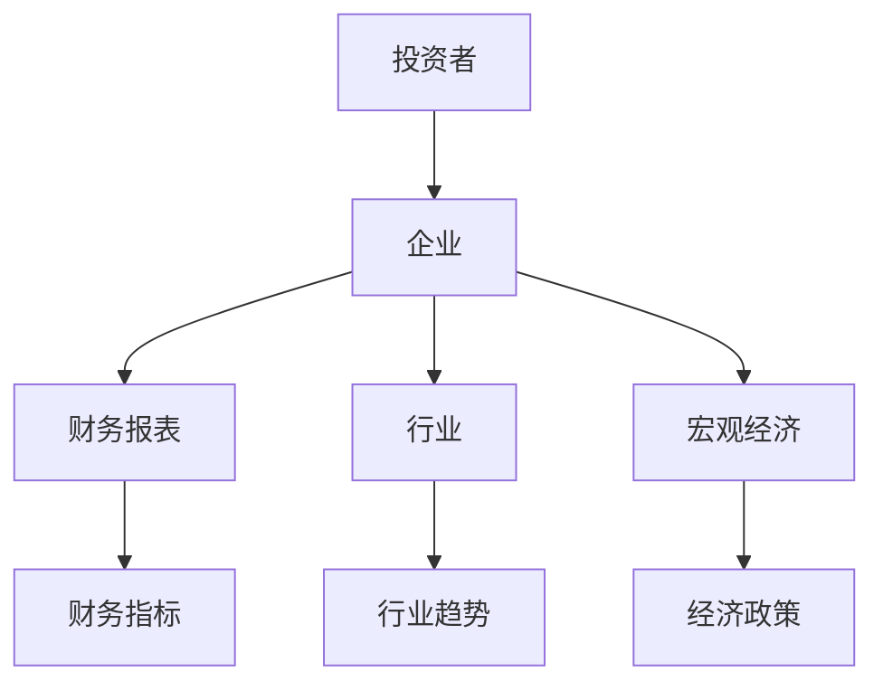
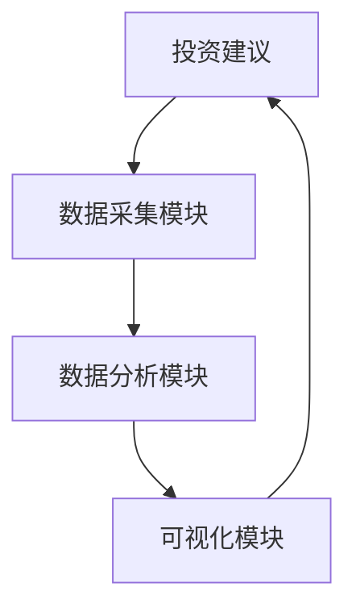

                 


# 基本面分析：识别长期优质投资标的的关键

## 关键词：
- 基本面分析
- 投资标的
- 财务报表
- 估值方法
- 长期投资

## 摘要：
基本面分析是识别长期优质投资标的的关键方法，通过深入分析企业的财务状况、行业地位、管理团队和宏观经济环境，评估其内在价值。本文将从基础概念到高级技巧，逐步解析基本面分析的核心要素，包括财务报表分析、估值方法、行业分析、宏观经济因素等，帮助读者系统性地识别和评估优质投资标的。

---

# 目录大纲

## 第一部分: 基本面分析的概述

### 第1章: 基本面分析的定义与重要性
- 1.1 基本面分析的定义
  - 1.1.1 什么是基本面分析
  - 1.1.2 基本面分析的核心要素
  - 1.1.3 基本面分析的适用场景
- 1.2 基本面分析的重要性
  - 1.2.1 基本面分析在投资中的作用
  - 1.2.2 基本面分析与市场周期的关系
  - 1.2.3 基本面分析的局限性
- 1.3 基本面分析与其他投资方法的区别
  - 1.3.1 技术分析与基本面分析的对比
  - 1.3.2 量化分析与基本面分析的结合
  - 1.3.3 行为金融学对基本面分析的影响

## 第二部分: 基本面分析的核心概念与联系

### 第2章: 基本面分析的核心概念
- 2.1 企业财务报表分析
  - 2.1.1 利润表：评估企业盈利能力
  - 2.1.2 资产负债表：了解企业资产与负债状况
  - 2.1.3 现金流量表：分析企业现金流健康状况
- 2.2 行业分析与宏观经济分析
  - 2.2.1 行业生命周期与企业竞争优势
  - 2.2.2 宏观经济指标对投资的影响
  - 2.2.3 经济周期与投资策略的调整
- 2.3 管理层分析
  - 2.3.1 管理层能力与企业长期发展
  - 2.3.2 管理层决策对企业价值的影响
  - 2.3.3 管理层透明度与企业风险

### 第3章: 基本面分析的核心要素对比
- 3.1 财务指标对比表格
  - 营业收入增长率 vs 净利润率
  - 市盈率 vs 市净率
  - 负债率 vs 速动比率
- 3.2 企业生命周期与行业周期的对比
  - 初创期企业 vs 成熟期企业
  - 增长型行业 vs 周期性行业
- 3.3 宏观经济指标与企业基本面的关联
  - 利率变化 vs 企业融资成本
  - 消费者信心 vs 企业销售增长

### 第4章: 基本面分析的ER实体关系图


## 第三部分: 基本面分析的数学模型与算法原理

### 第5章: 基本面分析的数学模型
- 5.1 市盈率（P/E）模型
  $$ P/E = \frac{Price}{Earnings} $$
  - 案例：如何通过市盈率判断股票估值是否合理
- 5.2 市净率（P/B）模型
  $$ P/B = \frac{Price}{Book\ Value} $$
  - 案例：银行行业的市净率分析
- 5.3 股息率模型
  $$ Dividend\ Yield = \frac{Annual\ Dividends}{Price} $$
  - 案例：高股息率股票的投资价值分析

### 第6章: 基本面分析的算法原理
- 6.1 财务数据预处理算法
  ```mermaid
  graph TD
    A[原始数据] --> B[数据清洗]
    B --> C[数据标准化]
    C --> D[特征提取]
  ```
  - Python代码示例：
  ```python
  import pandas as pd
  df = pd.read_csv('financial_data.csv')
  df = df.dropna()
  df['Revenue_Growth'] = df['Revenue'].pct_change()
  ```
- 6.2 财务指标评分算法
  ```mermaid
  graph TD
    A[财务指标] --> B[评分模型]
    B --> C[综合得分]
  ```
  - Python代码示例：
  ```python
  def calculate_score(revenue_growth, net_profit_margin):
      score = 0
      if revenue_growth > 10:
          score += 5
      if net_profit_margin > 20:
          score += 5
      return score
  ```

## 第四部分: 基本面分析的系统架构与实战案例

### 第7章: 系统架构设计
- 7.1 系统功能设计
  - 数据采集模块：从财务报表中提取关键指标
  - 数据分析模块：计算财务指标并生成评分
  - 可视化模块：展示分析结果和投资建议
- 7.2 系统架构图

- 7.3 系统接口设计
  - API接口：从数据库获取实时财务数据
  - 接口调用：使用Python的requests库发送请求

### 第8章: 实战案例分析
- 8.1 案例背景介绍
  - 选取某行业龙头公司进行基本面分析
- 8.2 数据分析与解读
  - 利润表分析：营业收入与净利润增长情况
  - 资产负债表分析：资产负债率与流动比率
  - 现金流量表分析：经营活动现金流状况
- 8.3 投资策略制定
  - 基于财务分析结果制定买入、持有或卖出的策略
  - 结合宏观经济环境调整投资组合

## 第五部分: 高级技巧与最佳实践

### 第9章: 高级技巧
- 9.1 基本面分析的误区与避免
  - 过度依赖财务指标的风险
  - 忽视行业周期性的影响
- 9.2 长期投资中的风险管理
  - 如何构建防御性投资组合
  - 使用对冲策略降低市场风险
- 9.3 持续学习与进化
  - 关注行业动态与政策变化
  - 定期复盘与调整投资策略

### 第10章: 小结与最佳实践
- 10.1 小结
  - 基本面分析是识别长期优质投资标的的关键方法
  - 需要结合财务分析、行业分析和宏观经济分析
- 10.2 最佳实践
  - 定期进行财务数据的更新与分析
  - 保持对市场的敏感性，及时调整投资策略
  - 长期投资需要耐心与纪律，避免情绪化决策

---

# 作者：AI天才研究院/AI Genius Institute & 禅与计算机程序设计艺术 /Zen And The Art of Computer Programming

