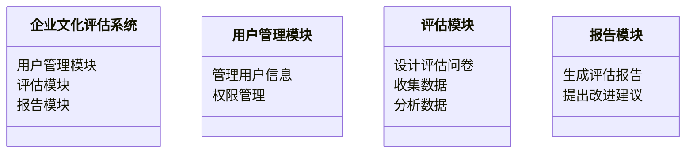

                 


# 塞思·卡拉曼的公司文化评估方法

## 关键词

公司文化评估, 企业文化管理, 组织文化分析, 文化评估模型, 文化指标体系

## 摘要

本文系统地介绍和分析塞思·卡拉曼的公司文化评估方法，涵盖背景、核心概念、评估模型、系统架构、项目实战及最佳实践。通过详细阐述文化评估的重要性、方法和应用，帮助读者理解如何有效进行企业文化管理。

---

### 第一部分：公司文化评估的背景与意义

#### 第1章：公司文化评估的背景介绍

##### 1.1 问题背景

在当今竞争激烈的商业环境中，公司文化已成为影响企业绩效的关键因素。许多企业在快速发展过程中，忽视了文化管理的重要性，导致内部沟通不畅、员工士气低落，甚至出现管理混乱的问题。因此，科学评估公司文化，成为企业持续发展的必要条件。

**1.1.1 当前企业面临的文化管理挑战**

- **内部沟通不畅**：部门间缺乏有效沟通，导致信息传递不准确，影响决策效率。
- **员工士气低落**：员工对企业发展目标缺乏认同，导致工作积极性下降。
- **文化冲突**：并购或全球化扩张时，不同文化背景的员工难以融合，引发冲突。

**1.1.2 公司文化对企业绩效的影响**

- 企业文化决定了企业的凝聚力和向心力。
- 正确的文化导向能激发员工潜能，提升企业创新能力和市场竞争力。
- 健康的文化氛围有助于企业应对外部环境变化，增强抗风险能力。

**1.1.3 文化评估的必要性与重要性**

- 通过评估发现问题，及时调整管理策略。
- 评估结果为后续文化建设提供数据支持。
- 帮助企业制定长期文化战略，提升整体竞争力。

##### 1.2 问题描述

**1.2.1 公司文化的定义与构成要素**

公司文化是指企业在长期经营过程中形成的共享价值观、行为规范和思维方式。它包括企业愿景、使命、核心价值观、管理风格、团队协作等多个方面。

**1.2.2 文化评估的核心目标**

- 识别企业文化中的优势和劣势。
- 为改进文化管理提供数据支持。
- 为制定文化战略提供参考依据。

**1.2.3 评估指标的选择与确定**

评估指标通常包括员工满意度、管理层风格、团队协作能力、创新氛围等。这些指标需要根据企业实际情况选择，确保评估结果的准确性。

##### 1.3 问题解决

**1.3.1 文化评估的方法与工具**

- **问卷调查**：通过设计结构化问卷收集员工反馈。
- **深度访谈**：与关键岗位人员进行一对一访谈，深入了解文化现状。
- **文化评估模型**：采用成熟的评估框架，如塞思·卡拉曼的三维评估模型。

**1.3.2 评估过程中的关键步骤**

1. **数据收集**：通过问卷、访谈等方式收集企业文化相关信息。
2. **数据分析**：运用统计方法对数据进行整理和分析。
3. **评估报告**：根据分析结果撰写评估报告，提出改进建议。

**1.3.3 数据收集与分析的策略**

- **多维度评估**：从多个维度进行数据收集，确保评估结果的全面性。
- **动态调整**：根据企业实际情况动态调整评估指标和方法。

##### 1.4 边界与外延

**1.4.1 文化评估的适用范围**

- 适用于各类组织，包括企业、非营利组织、政府机构等。
- 尤其适合处于快速变化和发展的企业。

**1.4.2 与其他管理方法的区别**

- 与人力资源管理的区别：文化评估更关注整体氛围和价值观，而人力资源管理更侧重于人员配置和绩效管理。
- 与战略管理的区别：文化评估为战略实施提供支持，而战略管理更关注目标设定和资源分配。

**1.4.3 评估结果的应用场景**

- 企业重组或并购时的文化整合。
- 新员工入职培训的文化融入。
- 长期文化建设规划的制定。

##### 1.5 核心要素组成

**1.5.1 企业文化的四个维度**

- **愿景与使命**：企业的长期目标和存在的意义。
- **核心价值观**：企业在经营活动中坚持的基本信念。
- **管理风格**：企业领导者的行为方式和决策风格。
- **员工关系**：员工之间的互动方式和团队协作能力。

**1.5.2 文化评估的关键指标**

- 员工满意度：员工对工作环境、薪酬福利的满意度。
- 团队协作：团队成员之间的合作程度。
- 创新氛围：员工的创新意识和企业对创新的支持程度。

**1.5.3 各维度之间的相互作用**

- 愿景与使命指导企业的整体方向。
- 核心价值观影响员工的行为方式。
- 管理风格塑造企业氛围。
- 员工关系影响团队协作和整体凝聚力。

---

### 第二部分：公司文化评估的核心概念与方法论

#### 第2章：文化评估的核心概念与联系

##### 2.1 核心概念原理

**2.1.1 企业文化评估的基本原理**

企业文化评估是通过系统的方法，识别、测量和分析企业文化的各个构成要素，以帮助企业更好地理解和管理自身文化。

**2.1.2 评估维度的理论基础**

- **维度分析法**：将企业文化分解为多个维度，分别进行评估。
- **层次分析法**：从宏观到微观，逐层分析企业文化结构。

**2.1.3 各维度的相互关系**

- 愿景与使命是企业的指导思想。
- 核心价值观是企业的行为准则。
- 管理风格是文化的具体体现。
- 员工关系是文化氛围的直接反映。

##### 2.2 评估维度对比表格

| 评估维度       | 定义与特征                              | 重要性权重 | 数据收集方法           |
|----------------|---------------------------------------|------------|------------------------|
| 愿景与使命     | 企业的长期目标和存在意义                | 高         | 企业战略文档分析       |
| 核心价值观     | 企业的基本信念和价值标准                | 高         | 问卷调查、深度访谈     |
| 管理风格       | 领导者的决策风格和管理方式              | 中高       | 观察法、员工反馈       |
| 员工关系       | 员工之间的互动和协作程度                | 中         | 团队评估、员工满意度调查|

##### 2.3 ER实体关系图架构

```mermaid
erDiagram
    actor 员工 {
        code INT
        name VARCHAR
        position VARCHAR
    }
    actor 管理层 {
        code INT
        name VARCHAR
        position VARCHAR
    }
    actor 评估维度 {
        id INT
        name VARCHAR
        description TEXT
    }
    员工 --> 评估维度 : 提供反馈
    管理层 --> 评估维度 : 设定评估标准
```

---

### 第三部分：公司文化评估的算法与数学模型

#### 第3章：文化评估的算法原理与实现

##### 3.1 加权评分法

**3.1.1 加权评分法的流程**

1. 确定评估维度及权重。
2. 设计问卷或访谈提纲。
3. 收集数据并进行评分。
4. 计算加权总分，得出评估结果。

**3.1.2 加权评分法的数学模型**

$$ \text{总分} = \sum (\text{维度得分}_i \times \text{权重}_i) $$

**3.1.3 Python代码实现**

```python
def calculate_weighted_score(dimensions, weights):
    total_score = 0
    for i in range(len(dimensions)):
        total_score += dimensions[i] * weights[i]
    return total_score

# 示例数据
dimensions = [8, 7, 6, 9]  # 各维度得分
weights = [0.3, 0.25, 0.2, 0.25]  # 各维度权重
score = calculate_weighted_score(dimensions, weights)
print("文化评估总分:", score)
```

---

### 第四部分：公司文化评估的系统分析与架构设计

#### 第4章：文化评估系统的架构与实现

##### 4.1 系统功能设计

**4.1.1 领域模型（Mermaid类图）**



##### 4.2 系统架构设计（Mermaid架构图）


---

### 第五部分：公司文化评估的项目实战

#### 第5章：文化评估项目的实施与案例分析

##### 5.1 项目实战

**5.1.1 环境安装**

安装必要的Python库，如`pandas`、`numpy`等。

**5.1.2 系统核心代码实现**

```python
import pandas as pd

def analyze_cultural_dimensions(dataframe):
    # 计算各维度平均得分
    avg_scores = dataframe.mean()
    # 生成评估报告
    report = pd.DataFrame({
        '维度': avg_scores.index,
        '平均得分': avg_scores.values
    })
    return report

# 示例数据加载
dataframe = pd.read_csv('culture_assessment.csv')
report = analyze_cultural_dimensions(dataframe)
print(report)
```

##### 5.1.3 代码应用解读与分析

上述代码从数据文件中读取企业文化评估数据，计算各维度的平均得分，并生成评估报告。报告帮助企业识别文化中的优势和改进点。

##### 5.1.4 实际案例分析

以一家科技公司为例，分析其文化评估数据，发现团队协作得分较低，建议加强团队建设活动。

---

### 第六部分：公司文化评估的最佳实践与总结

#### 第6章：总结与注意事项

##### 6.1 最佳实践 tips

- 定期进行文化评估，确保文化与时俱进。
- 评估结果与实际管理相结合，及时调整文化管理策略。
- 鼓励员工参与评估过程，增强文化认同感。

##### 6.2 小结

塞思·卡拉曼的公司文化评估方法为企业的文化管理提供了科学的指导。通过系统的方法和工具，帮助企业识别文化问题，制定有效的改进策略，提升整体竞争力。

##### 6.3 注意事项

- 评估指标的选择要结合企业实际情况。
- 数据收集要确保真实性和准确性。
- 评估结果的应用要注重长期性和系统性。

##### 6.4 拓展阅读

推荐阅读《企业文化管理》、《组织行为学》等书籍，深入理解文化评估的理论基础和应用方法。

---

### 结语

塞思·卡拉曼的公司文化评估方法为现代企业管理提供了重要指导。通过系统评估和科学分析，企业能够更好地识别文化问题，制定有效的改进策略，促进企业的可持续发展。

---

作者：AI天才研究院/AI Genius Institute & 禅与计算机程序设计艺术 /Zen And The Art of Computer Programming

