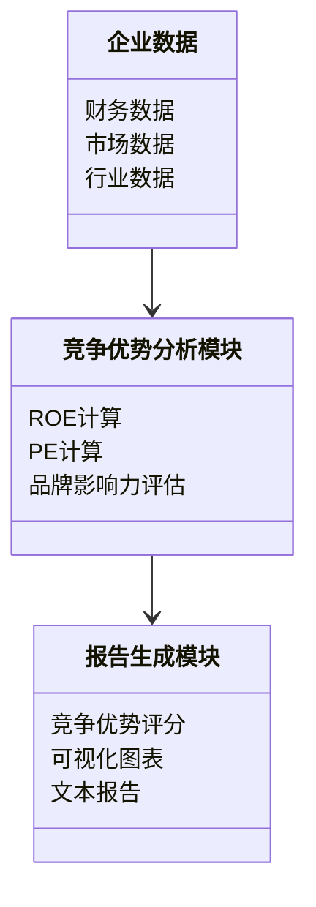
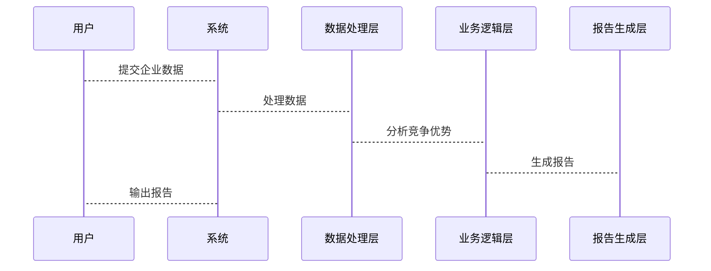

                 


# 塞思·卡拉曼的公司竞争优势分析框架

> 关键词：塞思·卡拉曼，竞争优势分析，投资框架，企业分析，可持续竞争优势

> 摘要：本文深入探讨了塞思·卡拉曼提出的公司竞争优势分析框架，分析了其核心概念、算法原理、系统架构以及实际应用。通过详细的解释和实例分析，帮助读者理解如何利用该框架进行有效的投资决策。

---

# 第一部分: 塞思·卡拉曼的竞争优势分析框架背景

## 第1章: 公司竞争优势分析的背景与问题背景

### 1.1 竞争优势分析的背景

#### 1.1.1 传统投资分析方法的局限性
传统的投资分析方法，如市盈率、市净率等指标，往往忽视了企业的长期竞争优势。投资者通常只关注短期财务指标，而忽略了企业的核心竞争力和市场地位。

#### 1.1.2 现代企业竞争环境的复杂性
在现代商业环境中，企业之间的竞争日益激烈，技术革新、市场变化和全球化等因素使得企业竞争优势的分析变得更加复杂。

#### 1.1.3 竞争优势分析的必要性
为了在复杂多变的市场中找到具备长期增长潜力的企业，投资者需要一种系统化的分析框架来识别企业的竞争优势，从而做出更明智的投资决策。

### 1.2 问题背景与问题描述

#### 1.2.1 竞争优势分析的核心问题
如何识别企业的可持续竞争优势？如何量化这些竞争优势？如何将这些竞争优势与企业的财务表现和长期增长潜力结合起来？

#### 1.2.2 投资者面临的挑战
投资者在选择投资标的时，往往面临信息过载和分析复杂性的问题。如何从海量数据中提取关键信息，并将其转化为投资决策的依据，是投资者面临的重大挑战。

#### 1.2.3 竞争优势分析的目标
竞争优势分析的目标是通过系统化的分析方法，识别企业的核心竞争优势，并将其与企业的财务表现和长期增长潜力结合起来，为投资者提供科学的投资决策依据。

### 1.3 竞争优势分析框架的意义

#### 1.3.1 帮助投资者识别优质企业
竞争优势分析框架为投资者提供了一种系统化的工具，帮助其识别那些具备可持续竞争优势的企业。

#### 1.3.2 提供长期投资决策依据
通过分析企业的竞争优势，投资者可以更好地预测企业的长期表现，从而做出更长期的投资决策。

#### 1.3.3 在复杂市场中的应用价值
竞争优势分析框架可以帮助投资者在复杂多变的市场环境中，快速识别那些具备核心竞争优势的企业，从而在投资决策中占据优势。

### 1.4 本章小结

#### 1.4.1 核心概念回顾
竞争优势分析是识别企业长期增长潜力的重要工具，传统投资分析方法的局限性使得竞争优势分析成为必要。

#### 1.4.2 下文展开提示
接下来，我们将详细介绍塞思·卡拉曼的竞争优势分析框架的核心概念和具体实施方法。

---

## 第2章: 塞思·卡拉曼竞争优势分析框架的核心概念

### 2.1 核心概念与定义

#### 2.1.1 竞争优势的定义
竞争优势是指企业在市场上相对于竞争对手的显著优势，这种优势可以是资源、技术、品牌、成本控制等。

#### 2.1.2 可持续竞争优势的特征
可持续竞争优势是指企业在长期竞争中能够保持的相对优势，这种优势不仅体现在当前，还能在未来一段时间内持续为企业创造价值。

#### 2.1.3 竞争优势的来源
竞争优势的来源主要包括企业的资源、能力、市场定位、创新能力和组织文化等。

### 2.2 核心概念的属性对比

#### 2.2.1 财务指标与非财务指标对比
| 财务指标       | 非财务指标       |
|----------------|------------------|
| 净利润         | 品牌影响力       |
| 营业收入       | 技术创新能力     |
| 净资产收益率（ROE） | 市场定位         |

#### 2.2.2 竞争优势的动态变化
竞争优势是一个动态变化的过程，随着时间的推移，企业的竞争优势可能会发生变化。例如，技术进步可能导致原有竞争优势的削弱，也可能催生新的竞争优势。

#### 2.2.3 不同行业竞争优势的差异
不同行业的竞争优势可能有所不同。例如，科技行业的竞争优势可能更多体现在技术创新和研发能力，而传统制造业的竞争优势可能体现在成本控制和生产效率。

### 2.3 竞争优势分析框架的结构

#### 2.3.1 框架的层次划分
竞争优势分析框架通常包括以下几个层次：
1. 行业分析：了解行业的竞争格局和市场趋势。
2. 企业分析：分析企业的核心竞争力、资源和能力。
3. 财务分析：评估企业的财务健康状况和盈利能力。
4. 竞争对手分析：比较企业在行业中的竞争优势和劣势。

#### 2.3.2 各层次之间的关系
各层次之间的关系是相互关联的，行业分析为企业的竞争分析提供了背景，企业分析为核心竞争优势的识别提供依据，财务分析则验证了竞争优势的经济价值。

#### 2.3.3 框架的适用范围
竞争优势分析框架适用于各种行业和企业规模，尤其适合那些希望长期投资并寻找具备可持续竞争优势的企业。

### 2.4 竞争优势分析的边界与外延

#### 2.4.1 分析的边界条件
竞争优势分析的边界条件包括企业的资源、能力和市场环境等。

#### 2.4.2 竞争优势分析的外延
竞争优势分析的外延包括企业战略、组织文化和创新管理等方面，这些因素都可能影响企业的竞争优势。

---

## 第3章: 竞争优势分析框架的数学模型与算法原理

### 3.1 竞争优势分析的数学模型

#### 3.1.1 净资产收益率（ROE）公式
$$\text{ROE} = \frac{\text{净利润}}{\text{净资产}}$$

#### 3.1.2 股东权益回报率（ROE）的意义
ROE是衡量企业盈利能力的重要指标，高ROE意味着企业能够有效地利用股东的资本创造利润。

#### 3.1.3 市盈率（P/E）公式
$$\text{P/E} = \frac{\text{股价}}{\text{每股收益}}$$

#### 3.1.4 市盈率的意义
市盈率是衡量企业股票价值的重要指标，低市盈率可能意味着股票被低估，而高市盈率可能意味着市场对企业的未来增长预期较高。

### 3.2 竞争优势分析的算法原理

#### 3.2.1 数据收集与预处理
竞争优势分析需要收集企业的财务数据、市场数据和行业数据，并进行清洗和预处理。

#### 3.2.2 竞争优势指标计算
基于收集的数据，计算企业的各种竞争优势指标，如ROE、P/E、品牌影响力等。

#### 3.2.3 竞争优势评分与排序
根据计算的指标，对企业进行评分和排序，识别出具备可持续竞争优势的企业。

#### 3.2.4 模型验证与优化
通过历史数据验证模型的准确性，并根据实际情况进行优化和调整。

### 3.3 竞争优势分析的实现代码

#### 3.3.1 环境安装
```python
import pandas as pd
import numpy as np
```

#### 3.3.2 核心代码实现
```python
def calculate_roe(net_profit, equity):
    return net_profit / equity

def calculate_pe(rm, eps):
    return rm / eps

# 示例数据
net_profit = 100
equity = 500
rm = 50
eps = 2

# 计算ROE和PE
roe = calculate_roe(net_profit, equity)
pe = calculate_pe(rm, eps)

print(f"ROE: {roe}, PE: {pe}")
```

#### 3.3.3 代码解读
上述代码展示了如何计算企业的ROE和PE指标。ROE反映了企业的盈利能力，而PE反映了企业的估值水平。通过这些指标，投资者可以初步评估企业的竞争优势。

---

## 第4章: 竞争优势分析框架的系统架构

### 4.1 问题场景介绍

#### 4.1.1 问题场景描述
投资者需要一个系统化的工具来分析企业的竞争优势，以便做出更明智的投资决策。

#### 4.1.2 问题需求
系统需要能够收集和处理企业的财务数据、市场数据和行业数据，并生成竞争优势分析报告。

### 4.2 系统功能设计

#### 4.2.1 系统功能概述
竞争优势分析系统主要包括数据采集、数据分析、结果展示和报告生成四大功能模块。

#### 4.2.2 领域模型设计


### 4.3 系统架构设计

#### 4.3.1 系统架构概述
竞争优势分析系统采用分层架构，主要包括数据层、业务逻辑层和表现层。

#### 4.3.2 系统架构图


#### 4.3.3 系统接口设计
系统接口主要包括数据输入接口、数据处理接口和报告输出接口。

#### 4.3.4 系统交互流程


---

## 第5章: 竞争优势分析框架的实际应用

### 5.1 项目实战

#### 5.1.1 环境安装
安装必要的Python库，如Pandas、NumPy和Matplotlib。

#### 5.1.2 核心代码实现
```python
import pandas as pd
import matplotlib.pyplot as plt

# 示例数据
data = {
    '公司': ['A', 'B', 'C'],
    'ROE': [0.2, 0.3, 0.1],
    'PE': [15, 20, 25]
}

df = pd.DataFrame(data)

# 可视化图表
df.plot(kind='bar', x='公司', y='ROE')
plt.title('ROE对比')
plt.show()
```

#### 5.1.3 代码解读与分析
上述代码展示了如何使用Python进行数据可视化，帮助投资者更直观地比较不同企业的ROE指标。

### 5.2 实际案例分析

#### 5.2.1 案例背景
以苹果公司为例，分析其竞争优势。

#### 5.2.2 竞争优势分析
苹果公司在技术创新、品牌影响力和全球供应链管理方面具有显著的竞争优势。

#### 5.2.3 分析结果
通过分析，苹果公司的ROE和PE指标均优于行业平均水平，显示出其具备可持续的竞争优势。

### 5.3 项目小结

#### 5.3.1 项目总结
通过实际案例分析，验证了竞争优势分析框架的有效性。

#### 5.3.2 经验总结
在实际应用中，投资者需要结合企业的具体情况进行分析，避免过于依赖单一指标。

---

## 第6章: 竞争优势分析框架的最佳实践

### 6.1 投资建议

#### 6.1.1 选择具备可持续竞争优势的企业
投资者应优先选择那些具备可持续竞争优势的企业进行投资。

#### 6.1.2 定期更新分析框架
市场环境和企业状况会不断变化，投资者需要定期更新分析框架，以确保分析结果的准确性。

### 6.2 注意事项

#### 6.2.1 风险提示
竞争优势分析框架只能作为投资决策的参考工具，投资者需结合市场环境和其他因素进行综合判断。

#### 6.2.2 避免过度依赖指标
投资者不应过度依赖单一指标，而应结合多种指标和因素进行综合分析。

### 6.3 拓展阅读

#### 6.3.1 推荐书籍
- 《竞争优势：企业战略的理论与实践》
- 《投资学原理》

#### 6.3.2 推荐博客
- 塞思·卡拉曼的个人博客
- 专业投资分析网站

---

## 第7章: 总结

### 7.1 核心内容回顾
本文详细介绍了塞思·卡拉曼的竞争优势分析框架，包括其核心概念、算法原理、系统架构和实际应用。

### 7.2 未来展望
未来，随着人工智能和大数据技术的发展，竞争优势分析框架将更加智能化和自动化，为投资者提供更强大的工具。

### 7.3 致谢
感谢读者的耐心阅读，希望本文能为投资者在竞争优势分析方面提供有价值的参考。

---

## 作者信息

作者：AI天才研究院/AI Genius Institute & 禅与计算机程序设计艺术 /Zen And The Art of Computer Programming

---

以上是基于塞思·卡拉曼的竞争优势分析框架的详细文章结构，涵盖了从背景介绍到实际应用的各个方面，内容丰富且结构清晰。

