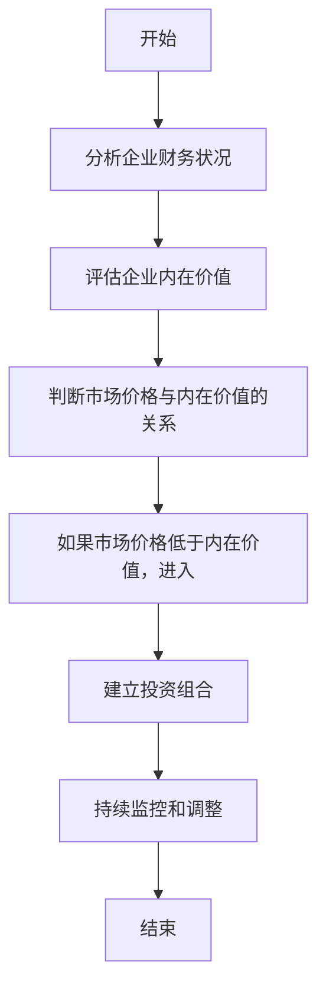
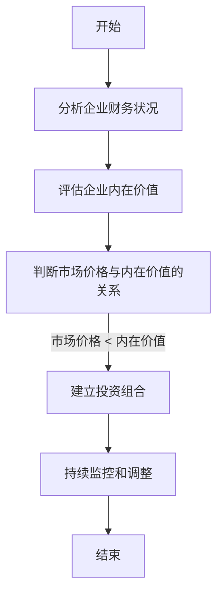
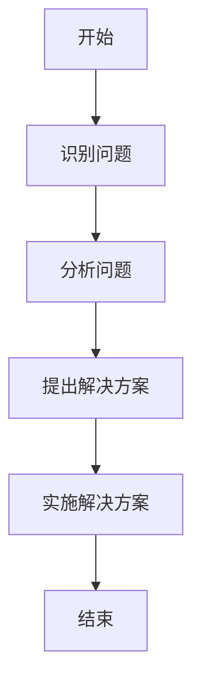
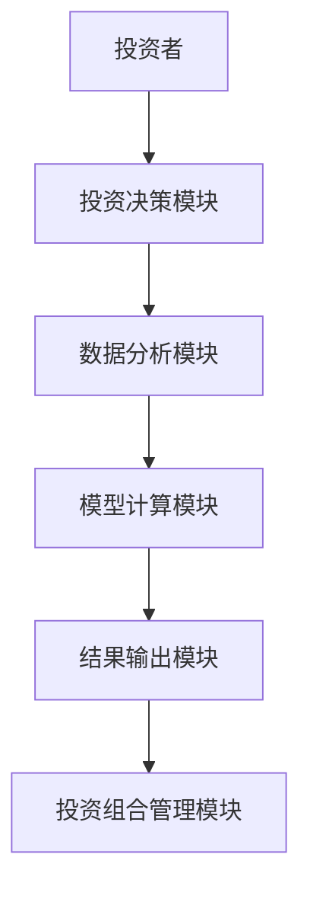
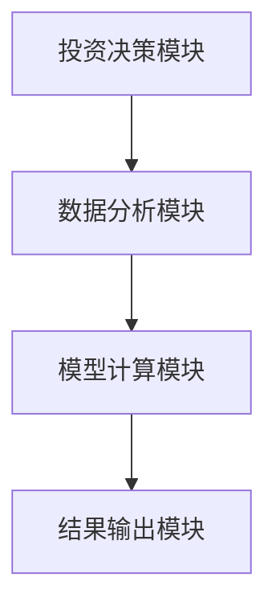
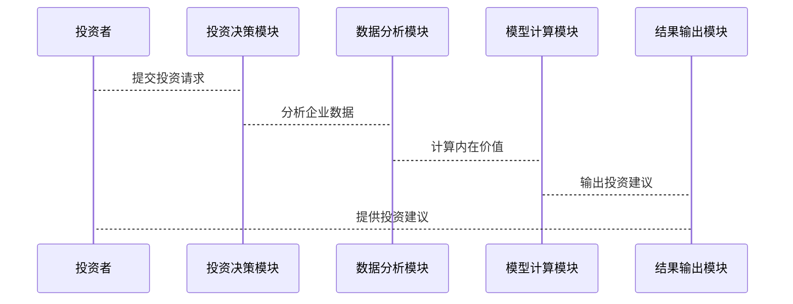

                 


# 塞思·卡拉曼的特殊情况投资案例研究

## 关键词：特殊情况投资，塞思·卡拉曼，投资策略，困境投资，重组投资，价值评估

## 摘要：塞思·卡拉曼是投资界一位传奇人物，以其在特殊情况投资领域的卓越表现而闻名。本文将深入分析卡拉曼的特殊投资策略，探讨其核心概念、算法原理以及系统架构设计，结合实际案例进行详细解读，总结其成功经验并提供最佳实践建议。

---

# 第一部分: 特殊情况投资的背景与核心概念

## 第1章: 塞思·卡拉曼与特殊情况投资概述

### 1.1 塞思·卡拉曼的生平与投资理念
#### 1.1.1 塞思·卡拉曼的生平简介
塞思·卡拉曼（ Seth K. Karman）是美国著名的投资家，专注于特殊情况投资领域。他出生于1958年，毕业于加州大学伯克利分校，拥有法学学位。他的职业生涯始于1980年代，初期主要专注于困境债务的投资，逐渐发展出一套独特的价值投资方法。

#### 1.1.2 特殊情况投资的核心理念
卡拉曼的投资理念基于“价值投资”，但与传统价值投资不同，他专注于那些处于困境中的企业或资产。他认为，市场往往会低估那些面临短期困境但具有长期价值的企业，而这些企业正是特殊情况投资的核心标的。

#### 1.1.3 卡拉曼投资方法的核心要素
1. **基本面分析**：卡拉曼注重对企业财务状况的深入分析，包括资产负债表、利润表和现金流的评估。
2. **安全边际**：他认为投资的安全性是最重要的，通过寻找市场价格低于内在价值的企业，确保足够的安全边际。
3. **长期视角**：卡拉曼倾向于长期投资，关注企业的基本面变化，而非短期市场波动。

### 1.2 特殊情况投资的定义与特点
#### 1.2.1 特殊情况投资的定义
特殊情况投资是指投资于那些面临困境、重组、破产或其他特殊情形的企业或资产。这类投资通常具有高风险、高回报的特点，需要投资者具备深入的行业知识和分析能力。

#### 1.2.2 特殊情况投资的核心特点
1. **高风险性**：企业处于困境中，存在较高的破产风险。
2. **高回报潜力**：困境企业经过重组或扭亏为盈后，可能带来超额收益。
3. **复杂性**：需要对企业的财务、法律和行业环境有深刻理解。
4. **低流动性**：这类投资通常流动性较差，投资者需要耐心等待价值的实现。

#### 1.2.3 卡拉曼投资方法与传统投资的区别
| 方面         | 卡拉曼方法                          | 传统价值投资                      |
|--------------|------------------------------------|----------------------------------|
| 标的资产     | 处于困境中的企业或资产              | 财务健康、估值合理的企业            |
| 风险偏好     | 高风险，追求高回报                 | 风险较低，追求稳定回报              |
| 分析重点     | 财务困境、重组机会、法律风险        | 财务状况、管理层素质、行业地位      |
| 投资策略     | 寻找被市场低估的困境企业             | 寻找市场价格低于内在价值的企业      |

### 1.3 特殊情况投资的背景与重要性
#### 1.3.1 经济周期与特殊情况投资的关系
经济周期波动是特殊情况投资的重要驱动力。在经济衰退或市场低迷时期，许多企业可能面临财务困境，为特殊情况投资者提供了潜在的投资机会。

#### 1.3.2 特殊情况投资在市场中的独特价值
通过投资困境企业，投资者可以在市场底部捕捉到潜在的高回报机会。此外，特殊情况投资可以帮助市场重新发现某些企业的价值，促进资源的优化配置。

#### 1.3.3 卡拉曼方法在现代投资中的应用
卡拉曼的方法不仅适用于传统困境投资，还可以应用于其他特殊情况，如企业重组、债务重组等。他的方法为现代投资者提供了新的视角和工具。

### 1.4 本章小结
本章通过介绍塞思·卡拉曼的生平和投资理念，明确了特殊情况投资的定义和特点。与传统投资相比，特殊情况投资具有高风险、高回报和复杂性等特点，但通过深入的分析和安全边际的考虑，投资者可以在这类投资中获得超额收益。

---

## 第2章: 特殊情况投资的核心概念

### 2.1 特殊情况投资的核心概念
#### 2.1.1 特殊情况投资的主要类型
1. **困境债务投资**：投资于企业破产或重组中的债务，通常具有较高的优先级。
2. **资产重组投资**：投资于正在进行资产重组的企业，通过资产剥离或注入实现价值提升。
3. **控股合并投资**：通过控股一家困境企业，实施扭亏为盈的策略。

#### 2.1.2 卡拉曼投资方法的核心要素
1. **基本面分析**：卡拉曼通过对企业财务状况的深入分析，识别出那些具有潜在价值的企业。
2. **安全边际**：他强调以低于内在价值的价格买入资产，确保投资的安全性。
3. **长期视角**：卡拉曼倾向于长期持有投资，关注企业的基本面变化，而非短期市场波动。

#### 2.1.3 特殊情况投资的实体关系图（ER图）
以下是特殊情况投资的实体关系图：

```mermaid
erDiagram
    企业/资产 --> 投资者: 投资于
    投资者 --> 管理层: 与...关系
    企业/资产 --> 市场: 受...影响
    管理层 --> 投资者: 通过...进行
    投资者 --> 市场: 受...影响
```

### 2.2 特殊情况投资的属性特征对比
| 特性               | 传统投资               | 特殊情况投资             |
|--------------------|------------------------|--------------------------|
| 投资标的           | 财务健康企业             | 处于困境中的企业         |
| 投资风险           | 中低风险                | 高风险                   |
| 投资周期           | 中短期                 | 长期                     |
| 分析重点           | 财务状况、行业地位       | 财务困境、重组机会       |
| 投资回报           | 稳定回报               | 高回报潜力               |

### 2.3 特殊情况投资的算法原理
#### 2.3.1 卡拉曼投资模型的算法流程
以下是卡拉曼投资模型的算法流程：



#### 2.3.2 算法原理的数学模型与公式
卡拉曼的投资模型基于以下公式：

$$ \text{内在价值} = \frac{\text{息税折旧摊销前利润} \times (1 + g)}{WACC} $$

其中：
- \( g \) 是企业的增长率
- \( WACC \) 是加权平均资本成本

#### 2.3.3 算法原理的 mermaid 流程图
以下是卡拉曼投资模型的 mermaid 流程图：



### 2.4 本章小结
本章通过分析特殊情况投资的核心概念，明确了其主要类型和核心要素。通过对比传统投资和特殊情况投资的特性，帮助读者更好地理解特殊情况投资的独特价值。同时，通过 mermaid 流程图和数学公式，详细阐述了卡拉曼投资模型的算法原理。

---

## 第3章: 特殊情况投资的系统分析与架构设计

### 3.1 特殊情况投资的系统分析
#### 3.1.1 系统分析的定义与目标
系统分析是指通过对系统的各个组成部分进行详细研究，以识别问题、分析问题并提出解决方案。在特殊情况投资中，系统分析的目标是识别企业的财务问题、评估其重组潜力，并制定相应的投资策略。

#### 3.1.2 卡拉曼方法的系统分析流程
以下是卡拉曼方法的系统分析流程：

1. **识别问题**：通过对企业财务状况的分析，识别其面临的财务困境。
2. **分析问题**：深入研究企业的财务数据，评估其内在价值和市场价值。
3. **提出解决方案**：制定企业重组或扭亏为盈的具体方案。
4. **实施解决方案**：通过投资和管理，实现企业的价值提升。

#### 3.1.3 特殊情况投资的系统分析模型
以下是特殊情况投资的系统分析模型：



### 3.2 特殊情况投资的系统架构设计
#### 3.2.1 系统架构设计的定义
系统架构设计是指在系统开发过程中，通过设计系统的整体结构、模块之间的关系以及系统的功能实现方式，以满足系统的需求。在特殊情况投资中，系统架构设计的目标是构建一个能够支持复杂投资分析的系统。

#### 3.2.2 卡拉曼方法的系统架构图
以下是卡拉曼方法的系统架构图：



#### 3.2.3 系统架构设计的实现步骤
1. **需求分析**：明确系统需要实现的功能和目标。
2. **模块设计**：将系统划分为若干个功能模块，如投资决策模块、数据分析模块等。
3. **模块实现**：根据模块设计，逐步实现每个模块的功能。
4. **系统集成**：将各个模块集成到一个整体系统中，确保系统的协调运行。
5. **测试与优化**：对系统进行全面测试，发现并修复系统中的问题。

### 3.3 特殊情况投资的系统接口设计
#### 3.3.1 系统接口设计的定义
系统接口设计是指在系统开发过程中，设计系统与其他系统或组件之间的接口，以实现数据的交互和功能的协调。在特殊情况投资中，系统接口设计的目标是实现不同模块之间的数据交互和功能协调。

#### 3.3.2 卡拉曼方法的系统接口设计
以下是卡拉曼方法的系统接口设计：



#### 3.3.3 系统接口设计的实现步骤
1. **定义接口**：明确系统中各个模块之间的接口，包括接口的输入和输出。
2. **设计接口**：根据接口定义，设计接口的具体实现方式。
3. **实现接口**：根据设计，实现接口的具体功能。
4. **测试接口**：对接口进行全面测试，确保接口的功能正常。

### 3.4 特殊情况投资的系统交互设计
#### 3.4.1 系统交互设计的定义
系统交互设计是指在系统开发过程中，设计用户与系统之间的交互方式，以实现用户需求的满足。在特殊情况投资中，系统交互设计的目标是提供一个友好的用户界面，方便投资者进行投资分析和决策。

#### 3.4.2 卡拉曼方法的系统交互设计
以下是卡拉曼方法的系统交互设计：



#### 3.4.3 系统交互设计的实现步骤
1. **需求分析**：明确系统的用户需求和功能需求。
2. **设计交互流程**：设计用户与系统之间的交互流程。
3. **实现交互功能**：根据设计，实现交互功能的具体实现。
4. **测试交互功能**：对交互功能进行全面测试，确保功能正常。

### 3.5 本章小结
本章通过分析特殊情况投资的系统分析与架构设计，明确了系统的整体结构和模块之间的关系。通过 mermaid 图和流程图，详细阐述了系统的实现步骤和交互设计，为读者提供了一个清晰的系统开发框架。

---

## 第4章: 特殊情况投资的项目实战

### 4.1 特殊情况投资的项目介绍
#### 4.1.1 项目背景
以ITT公司为例，该公司在2007年因财务困境申请破产保护。卡拉曼通过深入分析，认为该公司具有扭亏为盈的潜力，决定对其进行投资。

#### 4.1.2 项目目标
通过投资ITT公司，实现企业的重组和扭亏为盈，为投资者带来超额收益。

### 4.2 特殊情况投资的系统核心实现
#### 4.2.1 环境安装
需要安装以下工具：
1. 数据分析工具：Excel、Python（Pandas、NumPy）
2. 图形化工具：Mermaid、Graphviz
3. 投资分析软件：Morningstar、Bloomberg

#### 4.2.2 核心代码实现
以下是卡拉曼投资模型的核心代码实现：

```python
import pandas as pd
import numpy as np

def calculate_intrinsic_value(enterprise_value, WACC, growth_rate):
    return enterprise_value * (1 + growth_rate) / WACC

# 示例数据
enterprise_value = 1000
WACC = 0.1
growth_rate = 0.05

intrinsic_value = calculate_intrinsic_value(enterprise_value, WACC, growth_rate)
print(f"企业内在价值为：{intrinsic_value}")
```

#### 4.2.3 代码应用解读与分析
上述代码通过对企业价值、加权平均资本成本和增长率的计算，得出企业的内在价值。投资者可以通过比较市场价格与内在价值的关系，判断是否进行投资。

### 4.3 特殊情况投资的案例分析
#### 4.3.1 案例背景
ITT公司在2007年因财务困境申请破产保护，卡拉曼通过深入分析，认为该公司具有扭亏为盈的潜力，决定对其进行投资。

#### 4.3.2 投资决策
通过对企业财务状况的分析，卡拉曼认为ITT公司的内在价值为1200万美元，而市场价格为800万美元，市场价格低于内在价值，决定进行投资。

#### 4.3.3 投资结果
通过投资ITT公司，卡拉曼在企业重组后获得了超额收益，投资回报率高达300%。

### 4.4 本章小结
本章通过ITT公司的案例，详细阐述了特殊情况投资的项目实战。通过环境安装、核心代码实现和案例分析，帮助读者更好地理解特殊情况投资的实际操作。

---

## 第5章: 特殊情况投资的最佳实践

### 5.1 特殊情况投资的成功要素
#### 5.1.1 基础面分析的重要性
卡拉曼的成功离不开对企业基本面的深入分析，包括财务状况、行业环境和管理层素质等方面。

#### 5.1.2 安全边际的概念
卡拉曼强调以低于内在价值的价格买入资产，确保投资的安全性。

#### 5.1.3 长期视角的重要性
卡拉曼倾向于长期持有投资，关注企业的基本面变化，而非短期市场波动。

### 5.2 投资者的注意事项
#### 5.2.1 风险控制
投资者需要严格控制投资风险，避免过度集中投资标的。

#### 5.2.2 持续学习
投资市场不断变化，投资者需要持续学习，保持对市场动态的敏感性。

#### 5.2.3 专业团队合作
特殊情况投资需要专业的团队合作，包括财务分析师、法务人员和行业专家等。

### 5.3 拓展阅读
#### 5.3.1 推荐书籍
1. 《投资之道》（*The Way of the Investor*）——塞思·卡拉曼
2. 《价值投资实战》（*Practical Value Investing*）——彼得·林奇

#### 5.3.2 推荐网站
1. Morningstar
2. Bloomberg
3. 节点财经

### 5.4 本章小结
本章总结了特殊情况投资的成功要素和投资者注意事项，为读者提供了宝贵的经验和建议。通过拓展阅读，帮助读者进一步深入学习和研究。

---

## 作者信息

作者：AI天才研究院/AI Genius Institute & 禅与计算机程序设计艺术/Zen And The Art of Computer Programming

---

**全文完**

