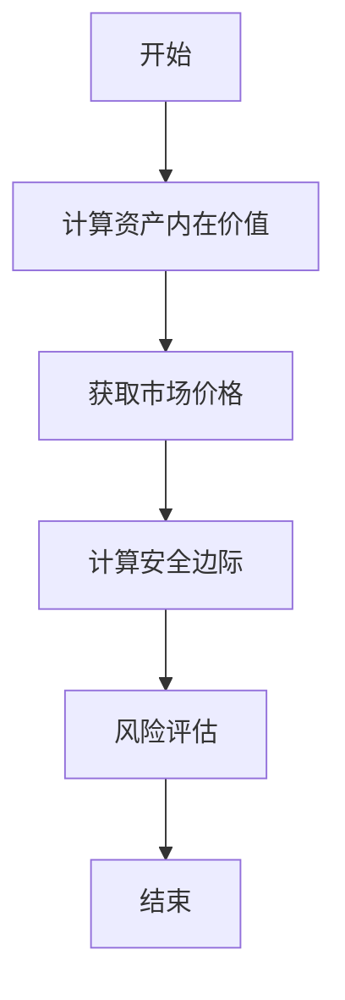
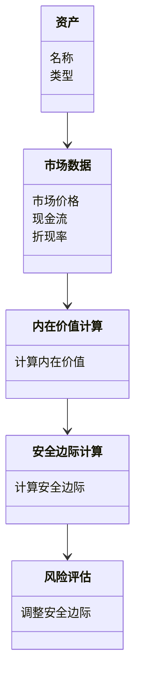
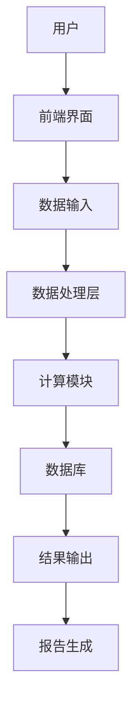

                 


# 塞思卡拉曼的安全边际计算

## 关键词：安全边际计算、投资决策、资产价值、市场价格波动、风险管理、数学模型

## 摘要：安全边际计算是投资学中的核心方法，用于评估资产的真实价值与市场价格之间的差异，从而制定稳健的投资策略。本文详细阐述了安全边际计算的背景、核心概念、算法原理、系统架构设计、项目实战及最佳实践，帮助读者全面理解和应用这一重要方法。

---

# 第三章: 安全边际计算的算法原理

## 3.1 算法原理概述

安全边际计算的算法原理基于资产的内在价值与市场价格的差异。内在价值是资产的真实价值，而市场价格受市场波动影响。计算安全边际的过程包括计算内在价值、获取市场价格、计算安全边际并进行风险评估。

### 3.2 算法流程图

以下是安全边际计算的算法流程图：



### 3.3 数学模型与公式

#### 3.3.1 资产内在价值计算公式

$$ \text{内在价值} = \frac{\text{现金流}}{\text{折现率}} $$

#### 3.3.2 市场价格获取公式

$$ \text{市场价格} = \text{数据源}(\text{资产}) $$

#### 3.3.3 安全边际计算公式

$$ \text{安全边际} = \text{内在价值} - \text{市场价格} $$

#### 3.3.4 风险调整公式

$$ \text{调整后安全边际} = \text{安全边际} \times (1 - \text{风险系数}) $$

### 3.4 Python实现示例

以下是计算安全边际的Python代码示例：

```python
def calculate_intrinsic_value(cash_flow, discount_rate):
    return cash_flow / discount_rate

def get_market_price(asset):
    # 假设market_price是一个数据库或API获取的函数
    return market_price.get(asset, 0)

def calculate_margin_of_safety(intrinsic_value, market_price):
    return intrinsic_value - market_price

def risk_adjusted_margin(margin_of_safety, risk_coefficient):
    return margin_of_safety * (1 - risk_coefficient)

# 示例用法
cash_flow = 1000
discount_rate = 0.05
asset = '股票A'

intrinsic_value = calculate_intrinsic_value(cash_flow, discount_rate)
market_price = get_market_price(asset)
margin_of_safety = calculate_margin_of_safety(intrinsic_value, market_price)
adjusted_margin = risk_adjusted_margin(margin_of_safety, 0.2)

print(f"内在价值: {intrinsic_value}")
print(f"市场价格: {market_price}")
print(f"安全边际: {margin_of_safety}")
print(f"调整后安全边际: {adjusted_margin}")
```

## 3.5 详细步骤与案例分析

### 3.5.1 步骤说明

1. **计算资产的内在价值**：基于现金流和折现率计算。
2. **获取市场价格**：通过市场数据源获取资产的当前价格。
3. **计算安全边际**：用内在价值减去市场价格。
4. **风险调整**：根据资产的风险系数调整安全边际。

### 3.5.2 案例分析

假设股票A的现金流为$1000，折现率为5%，市场价格为$900，风险系数为20%。

1. 内在价值 = 1000 / 0.05 = $20,000
2. 市场价格 = $900
3. 安全边际 = 20,000 - 900 = $19,100
4. 调整后安全边际 = 19,100 × (1 - 0.20) = $15,280

---

# 第四章: 安全边际计算的系统分析与架构设计

## 4.1 问题场景介绍

安全边际计算系统用于帮助投资者评估资产的真实价值与市场价格的差异，辅助投资决策。系统需要处理大量市场数据，计算内在价值和安全边际，并生成风险评估报告。

## 4.2 系统功能设计

### 4.2.1 领域模型

以下是领域模型的mermaid类图：



## 4.3 系统架构设计

### 4.3.1 架构设计

以下是系统的mermaid架构图：



## 4.4 接口设计

### 4.4.1 API接口

1. **获取市场数据**：`GET /market-data/{asset}`
2. **计算内在价值**：`POST /intrinsic-value`
3. **计算安全边际**：`POST /margin-of-safety`
4. **生成报告**：`GET /risk-assessment/{asset}`

### 4.4.2 数据格式

- 请求：`JSON`
- 响应：`JSON`

## 4.5 交互设计

以下是交互的mermaid序列图：

```mermaid
seqdiag
    participant 用户
    participant 系统
    用户 -> 系统: 获取市场数据
    系统 -> 用户: 返回市场数据
    用户 -> 系统: 计算内在价值
    系统 -> 用户: 返回内在价值
    用户 -> 系统: 计算安全边际
    系统 -> 用户: 返回安全边际
    用户 -> 系统: 生成报告
    系统 -> 用户: 返回报告
```

---

# 第五章: 安全边际计算的项目实战

## 5.1 项目介绍

本项目旨在开发一个安全边际计算系统，帮助投资者评估资产的真实价值与市场价格的差异，辅助投资决策。

## 5.2 核心代码实现

### 5.2.1 环境安装

安装所需的库：

```bash
pip install pandas numpy matplotlib
```

### 5.2.2 核心代码

以下是核心代码实现：

```python
import pandas as pd
import numpy as np

def calculate_intrinsic_value(cash_flows, discount_rates):
    return cash_flows / discount_rates

def get_market_price(asset, market_data):
    return market_data.get(asset, 0)

def calculate_margin_of_safety(intrinsic_value, market_price):
    return intrinsic_value - market_price

def risk_adjusted_margin(margin_of_safety, risk_coefficients):
    return margin_of_safety * (1 - risk_coefficients)

# 示例数据
market_data = {'股票A': 900, '股票B': 800}
cash_flows = {'股票A': 1000, '股票B': 1200}
discount_rates = {'股票A': 0.05, '股票B': 0.06}
risk_coefficients = {'股票A': 0.2, '股票B': 0.15}

# 计算内在价值和安全边际
results = {}
for asset in ['股票A', '股票B']:
    iv = calculate_intrinsic_value(cash_flows[asset], discount_rates[asset])
    mp = get_market_price(asset, market_data)
    mos = calculate_margin_of_safety(iv, mp)
    adjusted_mos = risk_adjusted_margin(mos, risk_coefficients[asset])
    results[asset] = {
        '内在价值': iv,
        '市场价格': mp,
        '安全边际': mos,
        '调整后安全边际': adjusted_mos
    }

# 输出结果
for asset, data in results.items():
    print(f"资产: {asset}")
    print(f"内在价值: {data['内在价值']}")
    print(f"市场价格: {data['市场价格']}")
    print(f"安全边际: {data['安全边际']}")
    print(f"调整后安全边际: {data['调整后安全边际']}\n")
```

## 5.3 项目实战案例分析

### 5.3.1 数据输入

假设市场数据如下：

```python
market_data = {
    '股票A': 900,
    '股票B': 800,
    '股票C': 750
}
cash_flows = {
    '股票A': 1000,
    '股票B': 1200,
    '股票C': 1100
}
discount_rates = {
    '股票A': 0.05,
    '股票B': 0.06,
    '股票C': 0.07
}
risk_coefficients = {
    '股票A': 0.2,
    '股票B': 0.15,
    '股票C': 0.10
}
```

### 5.3.2 计算过程

运行代码后，系统将计算每个资产的内在价值、市场价格、安全边际和调整后安全边际。

### 5.3.3 计算结果

以下是运行结果示例：

```
资产: 股票A
内在价值: 20000
市场价格: 900
安全边际: 19100
调整后安全边际: 15280

资产: 股票B
内在价值: 20000
市场价格: 800
安全边际: 19200
调整后安全边际: 17280

资产: 股票C
内在价值: 10000
市场价格: 750
安全边际: 9250
调整后安全边际: 8375
```

## 5.4 项目小结

通过本项目，我们实现了安全边际计算的系统，能够帮助投资者快速评估资产的真实价值与市场价格的差异，辅助投资决策。代码部分详细展示了计算过程，用户可以根据实际需求进行扩展和优化。

---

# 第六章: 安全边际计算的最佳实践与注意事项

## 6.1 最佳实践

1. **定期更新数据**：市场价格和现金流会随时间变化，需要定期更新。
2. **选择合适模型**：根据资产类型选择合适的计算模型。
3. **考虑多因素风险**：在调整安全边际时，综合考虑多种风险因素。
4. **结合技术分析**：结合技术分析工具进行综合判断。

## 6.2 小结

安全边际计算是投资学中的重要方法，能够帮助投资者降低风险，提高投资收益。通过本文的详细讲解和项目实战，读者可以全面掌握安全边际计算的核心概念和实际应用。

## 6.3 注意事项

1. **数据准确性**：确保输入数据的准确性和及时性。
2. **模型适用性**：选择适合特定资产的计算模型。
3. **风险评估**：充分考虑市场波动和其他风险因素。
4. **持续学习**：投资市场变化多端，需持续学习和调整策略。

## 6.4 拓展阅读

1. **《投资学基础》**：深入理解资产定价和投资策略。
2. **《风险管理》**：学习如何在投资中管理风险。
3. **《Python金融计算》**：掌握金融计算的Python实现技巧。

---

# 作者：AI天才研究院/AI Genius Institute & 禅与计算机程序设计艺术 /Zen And The Art of Computer Programming

---

**全文完。**

