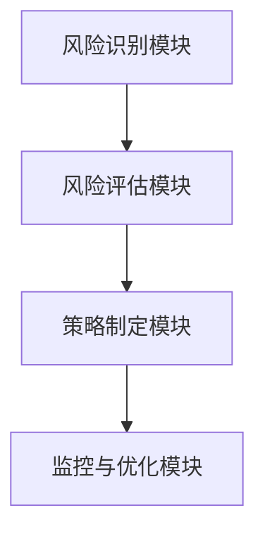

                 


# 塞思卡拉曼的风险规避策略

## 关键词：
- 风险规避
- 风险管理
- 策略制定
- 概率模型
- 影响评估
- 系统架构
- 数学模型

## 摘要：
本文详细探讨了塞思卡拉曼的风险规避策略，从背景介绍、核心概念到算法原理、系统架构设计，再到项目实战和最佳实践，全面解析了如何科学识别和评估风险，并通过数学模型和系统架构优化来制定和实施有效的风险规避策略。文章结合理论与实践，提供了一套完整的风险管理解决方案。

---

## 第一部分：风险规避策略的背景与核心概念

### 第1章：风险规避策略的背景介绍

#### 1.1 风险的基本概念
- **风险的定义与内涵**  
  风险是指在特定条件下，某一事件发生的可能性及其可能带来的负面影响。它通常与不确定性相关，且可以通过量化的方法进行评估。

- **风险的分类与特征**  
  风险可以分为“纯粹风险”和“投机风险”。纯粹风险是指只有损失可能而无收益的情况，如自然灾害、战争等；投机风险则可能带来收益或损失，如投资、市场波动等。  
  风险的特征包括：可变性、相关性、可控性和潜在性。

- **风险与机会的关系**  
  风险与机会是辩证统一的。高风险往往伴随着高回报，但并非所有风险都能转化为机会。有效的风险管理能够帮助我们抓住潜在的机会，同时避免重大损失。

---

#### 1.2 塞思卡拉曼的风险规避策略
- **塞思卡拉曼策略的核心思想**  
  塞思卡拉曼策略强调“预防为主，规避为辅”。其核心思想是通过系统化的风险识别、评估和控制，最大限度地减少潜在损失，同时抓住风险背后的机会。

- **风险规避策略的适用场景与目标**  
  该策略适用于金融投资、企业运营、项目管理等多个领域。其目标是通过科学的方法，制定个性化的风险规避方案，确保目标的实现不受重大风险的影响。

- **策略与传统风险管理方法的对比**  
  传统风险管理方法通常侧重于事后补救，而塞思卡拉曼策略更注重事前预防。前者关注损失的最小化，而后者更注重机会的把握与风险的规避。

---

#### 1.3 风险规避策略的目标读者与应用场景
- **目标读者定位**  
  本文的目标读者包括企业高管、项目经理、投资决策者、风险管理从业者以及对风险管理感兴趣的学生和研究者。

- **策略在不同领域的应用**  
  - **金融领域**：评估投资项目的潜在风险，制定合理的投资组合。  
  - **企业运营**：优化供应链管理，降低生产风险。  
  - **项目管理**：制定项目计划时考虑潜在风险，确保项目按时完成。

- **案例分析**  
  例如，在企业并购中，塞思卡拉曼策略可以帮助企业在评估并购风险时，识别出目标企业的潜在问题，从而制定相应的规避措施。

---

## 第二部分：风险规避策略的核心概念与联系

### 第2章：风险规避策略的核心概念

#### 2.1 风险识别与评估
- **风险识别的步骤与方法**  
  风险识别是风险管理的第一步，主要包括以下步骤：  
  1. 明确目标：确定需要保护的资产或目标。  
  2. 收集信息：通过文献调研、访谈等方式收集相关信息。  
  3. 识别风险源：列出所有可能影响目标的因素。  
  4. 筛选关键风险：根据风险的严重性和可能性进行排序，筛选出关键风险。

- **风险评估的指标与模型**  
  风险评估通常包括两个关键指标：  
  - **风险概率（P）**：风险发生的可能性，取值范围为0到1。  
  - **风险影响（I）**：风险发生后可能带来的损失，通常用货币、时间或声誉等指标衡量。  
  - **综合风险值（R）**：将概率和影响结合起来，计算综合风险值：  
    $$ R = P \times I $$

---

#### 2.2 风险规避策略的制定与实施
- **策略制定的原则与步骤**  
  - **原则**：  
    1. 经济性：确保策略的成本小于潜在的损失。  
    2. 可行性：策略必须能够在实际中实施。  
    3. 针对性：策略应针对具体风险量身定制。  
  - **步骤**：  
    1. 明确目标：确定风险管理的目标和范围。  
    2. 分析风险：对已识别的风险进行详细分析。  
    3. 制定策略：根据分析结果，制定具体的规避措施。  
    4. 实施策略：将策略付诸实施，并进行监控和调整。

- **策略实施的关键环节**  
  - **资源分配**：确保实施策略所需的资源充足。  
  - **监控与评估**：定期监控策略的实施效果，并根据实际情况进行调整。  
  - **沟通与培训**：确保相关人员了解策略的内容，并掌握实施方法。

---

### 第3章：风险规避策略的系统分析与架构设计

#### 3.1 系统分析
- **系统目标**  
  通过系统化的方法，帮助组织或个人识别、评估和规避风险。

- **系统功能需求分析**  
  - **风险识别模块**：自动识别潜在风险。  
  - **风险评估模块**：计算风险的概率和影响。  
  - **策略制定模块**：根据评估结果，制定规避策略。  
  - **监控与优化模块**：实时监控风险，并根据变化进行优化。

- **系统边界与外部实体关系**  
  ```mermaid
  graph TD
    A[风险识别模块] --> B[风险评估模块]
    B --> C[策略制定模块]
    C --> D[监控与优化模块]
    D --> E[外部数据源]
    E --> F[风险数据库]
  ```

---

## 第三部分：风险规避策略的算法原理与数学模型

### 第4章：风险评估算法的原理与实现

#### 4.1 风险评估算法概述
- **算法的基本原理**  
  通过数学模型，量化风险的概率和影响，从而计算出综合风险值。  
  $$ R = P \times I $$

- **算法的输入与输出**  
  - **输入**：风险发生的概率P和影响I。  
  - **输出**：综合风险值R。

- **算法的优缺点**  
  - **优点**：简单易懂，计算高效。  
  - **缺点**：过于简化，无法考虑复杂的风险因素。

---

#### 4.2 风险评估算法的 mermaid 流程图


---

## 第四部分：项目实战与最佳实践

### 第5章：项目实战

#### 5.1 环境安装
- **工具安装**：安装Python、Jupyter Notebook等开发工具。  
- **库的安装**：安装必要的库，如numpy、pandas、scikit-learn等。

#### 5.2 核心代码实现
```python
import numpy as np
import pandas as pd

# 示例数据：风险列表
risks = [
    ('市场风险', 0.8, 100),
    ('信用风险', 0.6, 50),
    ('操作风险', 0.4, 20),
    ('法律风险', 0.2, 10)
]

# 计算综合风险值
for risk in risks:
    P = risk[1]
    I = risk[2]
    R = P * I
    print(f"风险：{risk[0]}，综合风险值：{R}")
```

#### 5.3 代码解读与分析
- **代码功能**：上述代码通过读取风险列表，计算每个风险的综合风险值，并输出结果。  
- **代码实现细节**：使用Python的列表和循环结构，简单直观。

#### 5.4 案例分析
- **案例背景**：假设某企业计划投资一个新项目，需要评估潜在风险。  
- **案例分析**：通过上述代码，计算出各个风险的综合风险值，选择综合风险值最小的策略进行实施。

#### 5.5 项目小结
- **项目成果**：成功识别和评估了潜在风险，并制定了相应的规避策略。  
- **改进建议**：可以进一步引入机器学习算法，提高风险评估的准确性。

---

## 第五部分：最佳实践与总结

### 第6章：最佳实践

#### 6.1 小结
- **核心内容回顾**  
  本文详细介绍了塞思卡拉曼的风险规避策略，从理论到实践，提供了完整的解决方案。

#### 6.2 注意事项
- **风险识别的全面性**：确保识别所有潜在风险。  
- **模型的适用性**：根据实际情况选择合适的数学模型。  
- **策略的灵活性**：根据环境变化及时调整策略。

#### 6.3 拓展阅读
- **推荐阅读书籍**：  
  - 《风险管理与金融创新》  
  - 《项目风险管理方法论》  
  - 《概率论与数理统计》

---

## 作者：AI天才研究院/AI Genius Institute & 禅与计算机程序设计艺术/Zen And The Art of Computer Programming

---

通过本文的详细讲解，读者可以全面掌握塞思卡拉曼的风险规避策略，并能够在实际工作中灵活运用这些方法，有效降低风险，抓住潜在机会。

