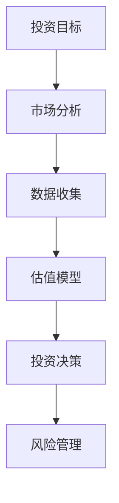

                 


# 塞斯·卡拉曼的特殊情况投资技巧

## 关键词：
- 塞斯·卡拉曼
- 特殊情况投资
- 安全边际
- 价值投资
- 投资策略

## 摘要：
塞斯·卡拉曼是价值投资领域的权威，尤其擅长在市场困境中寻找投资机会。本文详细解析了他的特殊情况投资技巧，包括安全边际计算、逆向投资策略、估值模型构建等，并通过实际案例展示其方法的实践应用。

---

## 第一部分: 塞斯·卡拉曼的生平与投资理念

### 第1章: 塞斯·卡拉曼的生平简介

#### 1.1.1 早年经历与教育背景
塞斯·卡拉曼出生于1956年，父亲是著名投资家本杰明·格雷厄姆的学生。他早年在哥伦比亚大学学习，师从杰里·克鲁格曼，打下了扎实的价值投资理论基础。

#### 1.1.2 投资职业生涯的起点
卡拉曼于1980年代进入投资行业，最初在格雷厄姆的公司工作，随后创立了自己的投资公司，专注于困境企业投资。

#### 1.1.3 价值投资理念的形成与发展
卡拉曼深受格雷厄姆影响，强调安全边际和逆向投资，逐步发展出一套独特的特殊情况投资方法。

---

### 第1.2 节：卡拉曼投资理念的核心思想

#### 1.2.1 价值投资的定义与特点
价值投资是指以低于内在价值的价格购买优质资产。卡拉曼强调，内在价值是投资的核心，安全边际是保护资金的关键。

#### 1.2.2 安全边际的强调
卡拉曼的安全边际计算公式为：
$$ 安全边际 = 内在价值 - 市场价格 $$
他建议投资者购买时确保安全边际至少为30%，以降低风险。

#### 1.2.3 逆向投资策略的实践
逆向投资是指在市场恐慌时买入，在市场高涨时卖出。卡拉曼通过分析市场情绪和估值指标，寻找被低估的机会。

---

## 第二部分: 特殊情况投资的背景与定义

### 第2章: 特殊情况投资的背景介绍

#### 2.1.1 什么是特殊情况投资
特殊情况投资是指在企业重组、破产、困境等情况下的投资机会。这种投资需要深入分析企业的财务状况和市场环境。

#### 2.1.2 特殊情况投资的市场环境
市场环境通常在经济衰退或行业低迷时出现特殊情况投资机会。此时，许多企业估值被低估，为投资者提供了安全边际。

#### 2.1.3 特殊情况投资的典型案例
典型案例包括2008年金融危机后的银行股投资，以及疫情期间的航空业投资。

---

### 第2.2 节：特殊情况投资的核心概念

#### 2.2.1 特殊情况投资的定义与特点
特殊情况投资具有高风险、高回报的特点，需要投资者具备较高的分析能力和风险承受能力。

#### 2.2.2 特殊情况投资与其他投资策略的对比
| 投资策略 | 核心目标 | 适用场景 |
|----------|----------|----------|
| 价值投资 | 发掘低估资产 | 市场低迷 |
| 成长投资 | 寻找高增长企业 | 市场繁荣 |
| 特殊情况投资 | 抓住困境机会 | 经济衰退 |

#### 2.2.3 特殊情况投资的边界与外延
特殊情况投资的边界在于企业的财务状况和市场环境，外延则包括债务重组、资产重组等。

---

## 第三部分: 卡拉曼的特殊情况投资策略

### 第3章: 卡拉曼的特殊情况投资方法

#### 3.1.1 安全边际的计算与应用
卡拉曼的安全边际计算公式为：
$$ 安全边际 = 内在价值 - 市场价格 $$
他建议投资者购买时确保安全边际至少为30%，以降低风险。

#### 3.1.2 逆向投资的实践技巧
逆向投资是指在市场恐慌时买入，在市场高涨时卖出。卡拉曼通过分析市场情绪和估值指标，寻找被低估的机会。

#### 3.1.3 特殊情况下的估值模型
卡拉曼的估值模型包括市盈率、市净率和股息率等指标，结合企业财务状况进行综合评估。

---

### 第3.2 节：卡拉曼投资策略的数学模型

#### 3.2.1 安全边际计算公式
$$ 安全边际 = 内在价值 - 市场价格 $$

#### 3.2.2 内在价值计算模型
$$ 内在价值 = 股息率 × 市盈率 $$

---

## 第四部分: 特殊情况投资的系统分析与架构设计

### 第4章: 投资系统的整体架构

#### 4.1.1 系统架构图


#### 4.1.2 投资系统的功能模块
模块化设计包括数据收集、估值模型、投资决策和风险管理。

---

## 第五部分: 项目实战与案例分析

### 第5章: 项目实战与案例分析

#### 5.1 环境安装与数据准备
选择合适的工具，如Python的pandas和numpy库，进行数据清洗和处理。

#### 5.2 案例分析
以某家困境企业为例，计算其内在价值和市场价格，评估安全边际。

#### 5.3 代码实现
```python
import pandas as pd
import numpy as np

def calculate_intrinsic_value(stock_data):
    # 计算内在价值
    intrinsic_value = stock_data[' dividends'] / stock_data[' pe']
    return intrinsic_value

def calculate_margin_of_safety(intrinsic_value, market_price):
    # 计算安全边际
    margin = intrinsic_value - market_price
    return margin

# 示例数据
stock_data = {'pe': 15, 'dividends': 2.5, 'market_price': 10}
intrinsic_value = calculate_intrinsic_value(stock_data)
margin_of_safety = calculate_margin_of_safety(intrinsic_value, stock_data['market_price'])
print(f"内在价值: {intrinsic_value}, 安全边际: {margin_of_safety}")
```

---

## 结论与展望

### 第六章: 结论与展望

#### 6.1.1 总结
塞斯·卡拉曼的特殊情况投资技巧以安全边际为核心，通过逆向投资和深入分析企业财务状况，寻找被低估的投资机会。

#### 6.1.2 展望
未来，特殊情况投资将更加依赖于数据分析和人工智能技术，投资者需要不断学习和适应市场变化。

#### 6.1.3 投资中的注意事项
投资者需谨慎评估企业的财务状况和市场环境，合理控制风险。

---

## 作者：AI天才研究院 & 禅与计算机程序设计艺术

---

通过以上结构，您可以逐步撰写详细的博客文章，每部分均按照上述大纲展开，确保内容丰富、逻辑清晰、技术语言专业易懂。

