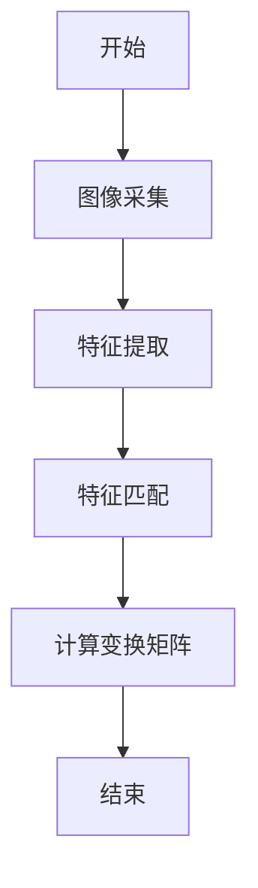
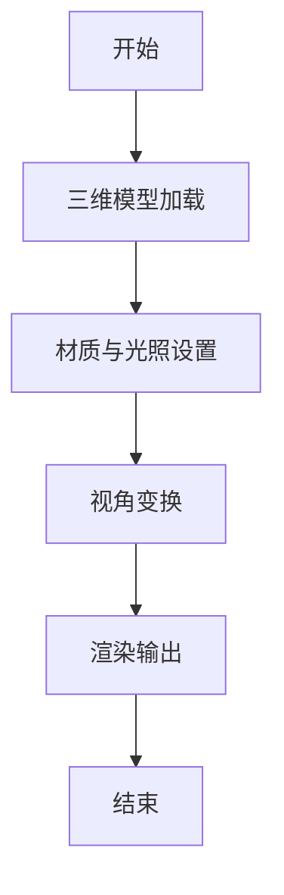
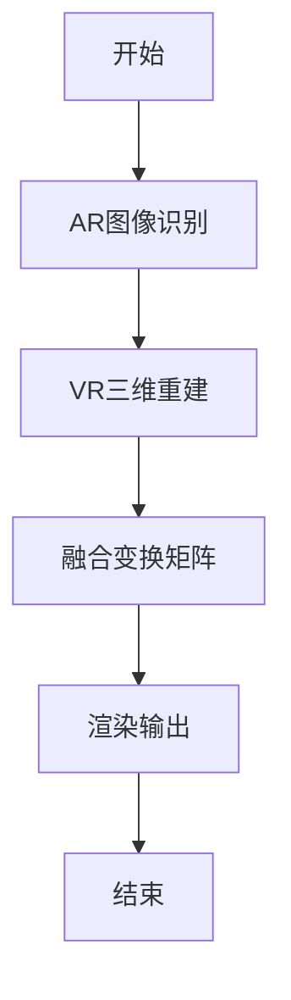

                 


# 增强现实（AR）和虚拟现实（VR）技术的商业化与投资前景

> 关键词：增强现实（AR）、虚拟现实（VR）、技术商业化、投资前景、市场分析

> 摘要：本文深入探讨了增强现实（AR）和虚拟现实（VR）技术的核心概念、技术原理、商业化应用以及投资前景。通过分析AR和VR在教育、医疗、娱乐和零售等领域的实际应用案例，结合技术原理和市场数据，为读者提供了全面的市场分析和投资建议。文章还详细讨论了AR与VR技术的融合趋势，以及未来的发展方向。

---

# 第一部分: 增强现实（AR）和虚拟现实（VR）技术的背景与基础

# 第1章: 增强现实（AR）和虚拟现实（VR）概述

## 1.1 增强现实（AR）的核心概念

### 1.1.1 AR的定义与基本原理

增强现实（AR）是一种通过计算机技术将虚拟信息叠加在真实环境中的技术。其基本原理是通过摄像头、传感器和计算机算法，将数字信息（如图像、文字、3D模型）与真实世界中的物体或场景进行实时叠加，从而为用户提供一种增强的视觉体验。

例如，在手机上使用AR应用时，摄像头会捕捉到真实场景，计算机算法会分析场景中的特征（如平面或特定物体），并在这些特征上叠加虚拟内容（如虚拟家具或游戏角色）。

### 1.1.2 AR的核心技术特征

- **实时性**：AR需要实时捕捉和处理环境信息，并快速生成和叠加虚拟内容。
- **交互性**：用户可以通过手势、语音或触控等方式与AR内容进行互动。
- **沉浸性**：AR通过叠加虚拟内容，增强了用户的沉浸感和真实感。

### 1.1.3 AR与传统计算机视觉的联系与区别

| **特性** | **AR** | **传统计算机视觉** |
|----------|---------|--------------------|
| 目标     | 将虚拟内容叠加在真实环境中 | 分析和理解真实环境中的图像或视频 |
| 技术     | 结合图像识别、跟踪和渲染技术 | 专注于图像识别、目标检测等任务 |
| 应用     | 游戏、教育、广告、医疗等 | 人脸识别、自动驾驶等 |

## 1.2 虚拟现实（VR）的核心概念

### 1.2.1 VR的定义与基本原理

虚拟现实（VR）是一种通过计算机生成的三维虚拟环境，让用户通过特殊的设备（如头戴式显示器）完全沉浸在一个虚拟的世界中。VR的核心原理是通过渲染引擎生成高质量的三维图像，并通过传感器捕捉用户的动作，实时调整虚拟环境中的视角和交互。

例如，使用VR头盔时，用户可以看到一个完全虚拟的三维场景，并通过手柄与场景中的物体进行互动。

### 1.2.2 VR的核心技术特征

- **沉浸性**：用户通过VR设备完全沉浸在一个虚拟环境中。
- **交互性**：用户可以通过手柄、手势或语音等方式与虚拟环境进行互动。
- **实时性**：VR需要快速渲染和处理用户的动作，以提供流畅的体验。

### 1.2.3 VR与AR的异同点对比

| **特性** | **AR** | **VR** |
|----------|---------|--------|
| 场景     | 真实环境叠加虚拟内容 | 完全虚拟环境 |
| 设备     | 手机、平板、AR眼镜 | VR头盔、PC |
| 应用     | 教育、广告、游戏 | 游戏、模拟训练 |

## 1.3 AR与VR的技术发展历程

### 1.3.1 AR的起源与发展

- **起源**：AR技术最早可以追溯到20世纪60年代，但当时的技术限制使其仅限于实验室研究。
- **发展**：随着计算机视觉和图形渲染技术的进步，AR在21世纪初逐渐应用于商业领域，如游戏、广告和教育。
- **现状**：AR技术已成熟，并在智能手机和平板电脑上得到广泛应用。

### 1.3.2 VR的起源与发展

- **起源**：VR技术的起源可以追溯到20世纪60年代，但早期的技术非常笨重且成本高昂。
- **发展**：随着Oculus等公司的发展，VR技术在21世纪初逐渐商业化，并在游戏和教育领域得到广泛应用。
- **现状**：VR技术正在逐步成熟，并扩展到工业、医疗等领域。

### 1.3.3 AR与VR技术的融合趋势

随着技术的进步，AR和VR正在逐渐融合，形成一种更加沉浸和智能的用户体验。例如，未来的AR眼镜可能会集成VR的沉浸式体验，通过实时渲染和高度交互的方式，提供更加丰富和真实的视觉体验。

## 1.4 本章小结

本章介绍了AR和VR的核心概念、技术特征和发展历程，为后续章节的分析奠定了基础。AR和VR作为两项互补的技术，分别在增强现实和虚拟环境中展现了强大的应用潜力。

---

# 第二部分: 增强现实（AR）和虚拟现实（VR）的技术原理与算法分析

# 第2章: AR与VR的核心算法原理

## 2.1 AR的图像识别与跟踪算法

### 2.1.1 图像识别算法的数学模型

图像识别是AR技术的核心，其数学模型主要包括以下步骤：

1. **图像采集**：通过摄像头采集真实环境中的图像。
2. **特征提取**：提取图像中的关键特征（如边缘、角点）。
3. **特征匹配**：将提取的特征与数据库中的特征进行匹配，确定图像的位置和姿态。

数学模型如下：

$$ I = f(x, y) $$

其中，$I$ 表示图像，$x$ 和 $y$ 表示图像的行和列坐标，$f(x, y)$ 表示图像在 $(x, y)$ 处的像素值。

### 2.1.2 跟踪算法的流程图

以下是AR图像跟踪算法的流程图：



### 2.1.3 AR图像跟踪的实现代码

以下是一个简单的AR图像跟踪算法的Python代码示例：

```python
import cv2

# 初始化摄像头
cap = cv2.VideoCapture(0)

# 初始化ORB特征检测器
orb = cv2.ORB_create()

while True:
    # 读取视频流中的图像
    ret, frame = cap.read()
    
    # 检测特征点
    kp = orb.detect(frame, None)
    
    # 绘制特征点
    frame_with_kp = frame.copy()
    cv2.drawKeypoints(frame_with_kp, kp, frame_with_kp, (0, 0, 255), 0)
    
    # 显示结果
    cv2.imshow('AR Image Tracking', frame_with_kp)
    
    # 按下 'q' 键退出循环
    if cv2.waitKey(1) & 0xFF == ord('q'):
        break

# 释放资源
cap.release()
cv2.destroyAllWindows()
```

### 2.1.4 AR图像跟踪的数学模型

图像跟踪的数学模型可以表示为：

$$ T = R \cdot t $$

其中，$T$ 是变换矩阵，$R$ 是旋转矩阵，$t$ 是平移向量。

---

## 2.2 VR的三维重建与渲染算法

### 2.2.1 三维重建算法的数学模型

三维重建是VR技术的核心，其数学模型主要包括以下步骤：

1. **图像采集**：通过多个摄像头采集不同视角的图像。
2. **特征提取**：提取图像中的特征点。
3. **匹配特征点**：将不同视角的特征点进行匹配，计算物体的三维结构。
4. **渲染三维模型**：根据计算出的三维结构，生成虚拟环境。

数学模型如下：

$$ V = \begin{bmatrix} x \\ y \\ z \end{bmatrix} $$

其中，$V$ 表示三维点的坐标，$x$、$y$ 和 $z$ 分别表示点的三个空间坐标。

### 2.2.2 VR渲染的流程图

以下是VR渲染算法的流程图：



### 2.2.3 VR渲染的实现代码

以下是一个简单的VR渲染算法的Python代码示例：

```python
import pythreejs as p3js

# 初始化场景、摄像头和渲染器
scene = p3js.Scene()
camera = p3js.PerspectiveCamera(75, 1, 0.1, 1000)
renderer = p3js.Renderer()
renderer.setSize(800, 600)

# 创建立方体
cube = p3js.Mesh(
    geometry=p3js.BoxGeometry(2, 2, 2),
    material=p3js.MeshBasicMaterial(color='blue')
)
scene.add(cube)

# 设置摄像头位置
camera.position.z = 5

# 渲染场景
while True:
    # 更新摄像头视角
    camera.position.z += 0.1
    renderer.render(scene, camera)
    # 按下 'q' 键退出循环
    if ord(input('')) & 0xFF == ord('q'):
        break

# 释放资源
renderer.dispose()
```

### 2.2.4 VR渲染的数学模型

三维渲染的数学模型可以表示为：

$$ P = M \cdot V $$

其中，$P$ 是投影矩阵，$M$ 是模型变换矩阵，$V$ 是视图变换矩阵。

---

## 2.3 AR与VR的融合算法

### 2.3.1 融合算法的数学模型

AR与VR的融合算法需要将AR中的图像跟踪与VR中的三维重建结合起来，其数学模型可以表示为：

$$ T = R \cdot t $$

其中，$T$ 是变换矩阵，$R$ 是旋转矩阵，$t$ 是平移向量。

### 2.3.2 融合算法的流程图

以下是AR与VR融合算法的流程图：



---

## 2.4 本章小结

本章详细介绍了AR和VR的核心算法原理，包括图像识别与跟踪、三维重建与渲染，以及两者的融合算法。这些算法是AR和VR技术实现的基础，也是商业化应用的核心。

---

# 第三部分: 增强现实（AR）和虚拟现实（VR）的商业化应用

# 第3章: AR与VR的商业化应用场景

## 3.1 教育领域的AR与VR应用

### 3.1.1 虚拟课堂的实现

通过AR和VR技术，教育机构可以创建虚拟课堂，让学生在虚拟环境中学习和互动。例如，学生可以通过VR头盔进入虚拟教室，与教师和同学进行实时互动，参与虚拟实验和模拟操作。

### 3.1.2 增强现实教材的应用

AR技术可以将教材中的内容进行增强，例如通过AR眼镜查看三维模型或动态视频，帮助学生更好地理解和记忆知识。

---

## 3.2 医疗领域的AR与VR应用

### 3.2.1 手术模拟与培训

通过VR技术，医生可以进行虚拟手术模拟，提高手术成功率和安全性。例如，医生可以在VR环境中进行手术演练，熟悉手术步骤和可能的风险。

### 3.2.2 病例分析与诊断辅助

AR技术可以通过将患者的三维模型叠加在真实环境中，帮助医生更直观地分析病情和制定治疗方案。

---

## 3.3 娱乐与游戏领域的AR与VR应用

### 3.3.1 虚拟现实游戏

VR游戏通过完全沉浸的虚拟环境，为玩家提供身临其境的游戏体验。例如，玩家可以通过VR头盔进入虚拟世界，与其他玩家进行互动和对抗。

### 3.3.2 增强现实广告

AR广告可以通过在真实环境中叠加虚拟内容，吸引用户的注意力。例如，广告商可以在街道上投射虚拟的三维广告，吸引路过的行人驻足观看。

---

## 3.4 零售与营销领域的AR与VR应用

### 3.4.1 虚拟试衣

通过AR技术，消费者可以在虚拟试衣间中试穿不同风格和尺寸的服装，提高购物体验和满意度。

### 3.4.2 增强现实产品展示

AR技术可以将产品的三维模型叠加在真实环境中，帮助消费者更直观地了解产品的功能和特点。例如，消费者可以通过AR应用查看手机的三维模型，并旋转和缩放以查看不同角度。

---

## 3.5 本章小结

本章探讨了AR和VR在教育、医疗、娱乐和零售等领域的商业化应用场景。通过这些应用案例，可以看出AR和VR技术在提升用户体验、提高效率和创造新商业模式方面具有巨大的潜力。

---

# 第四部分: 增强现实（AR）和虚拟现实（VR）的投资与市场分析

# 第4章: 增强现实（AR）和虚拟现实（VR）的投资与市场分析

## 4.1 AR与VR市场的现状与未来趋势

### 4.1.1 市场规模与增长趋势

根据市场研究机构的数据，AR和VR市场的规模正在快速增长。预计到2030年，全球AR和VR市场的规模将达到数千亿美元。

### 4.1.2 市场驱动因素

- **技术进步**：AR和VR技术的不断进步，降低了设备的成本和提高了用户体验。
- **行业应用**：AR和VR技术在教育、医疗、娱乐和零售等领域的广泛应用，推动了市场的需求。
- **政策支持**：各国政府对AR和VR技术的政策支持，为市场的发展提供了保障。

## 4.2 AR与VR技术的投资分析

### 4.2.1 投资机会

- **硬件设备**：AR和VR设备的生产和销售是主要的投资机会，尤其是高端设备的研发和生产。
- **软件开发**：AR和VR应用的开发和优化也是重要的投资方向，尤其是在教育、医疗和娱乐等领域。
- **内容创作**：AR和VR内容的创作和分发也是一个重要的投资领域，尤其是高质量的三维模型和虚拟场景的制作。

### 4.2.2 投资风险

- **技术风险**：AR和VR技术还在快速发展阶段，技术不稳定性和不确定性可能导致投资失败。
- **市场竞争**：AR和VR市场的竞争日益激烈，可能导致投资回报率下降。
- **政策风险**：政府政策的变化可能对AR和VR市场产生重大影响，增加投资风险。

## 4.3 AR与VR技术的未来发展趋势

### 4.3.1 技术融合

AR和VR技术将更加融合，形成更加沉浸和智能的用户体验。例如，未来的AR眼镜可能会集成VR的沉浸式体验，通过实时渲染和高度交互的方式，提供更加丰富和真实的视觉体验。

### 4.3.2 行业应用扩展

AR和VR技术将在更多行业得到广泛应用，尤其是在教育、医疗、工业和娱乐等领域。例如，AR技术可以用于工业制造中的设备维护和培训，VR技术可以用于娱乐产业中的虚拟现实游戏和电影制作。

---

## 4.4 本章小结

本章分析了AR和VR市场的现状和未来趋势，探讨了投资机会和风险，并展望了技术的未来发展趋势。通过这些分析，投资者可以更好地把握市场机遇，制定合理的投资策略。

---

# 附录: 增强现实（AR）和虚拟现实（VR）相关工具与资源

## 附录A: AR与VR开发工具

### 1. AR开发工具

- **ARKit**：苹果公司推出的AR开发框架，适用于iOS和macOS平台。
- **ARCore**：谷歌公司推出的AR开发框架，适用于Android平台。
- **OpenCV**：开源计算机视觉库，支持多种编程语言。

### 2. VR开发工具

- **Unity**：跨平台的游戏引擎，支持VR应用的开发。
- **Unreal Engine**：专业的游戏引擎，支持VR应用的开发。
- **OpenVR**：开源的VR开发框架，支持多种VR设备。

---

## 附录B: AR与VR相关数据与报告

### 1. 市场报告

- **IDC报告**：全球AR和VR市场的市场规模和增长趋势。
- **Gartner报告**：AR和VR技术的未来发展趋势和应用场景。
- **Meticulously报告**：AR和VR技术在不同行业的应用案例和投资机会。

---

## 附录C: AR与VR社区与资源

### 1. 开发者社区

- **Unity社区**：https://forum.unity.com/
- **Unreal Engine社区**：https://unrealforums.com/
- **OpenCV社区**：https://opencv.org/

### 2. 投资者资源

- **TechCrunch**：https://techcrunch.com/
- **VentureBeat**：https://venturebeat.com/
- **CB Insights**：https://www.cbinsights.com/

---

作者：AI天才研究院/AI Genius Institute & 禅与计算机程序设计艺术 /Zen And The Art of Computer Programming

