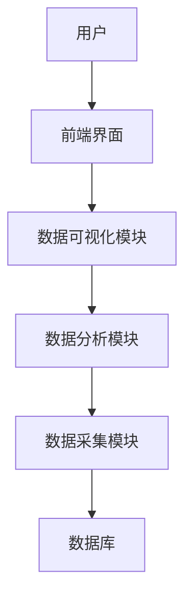
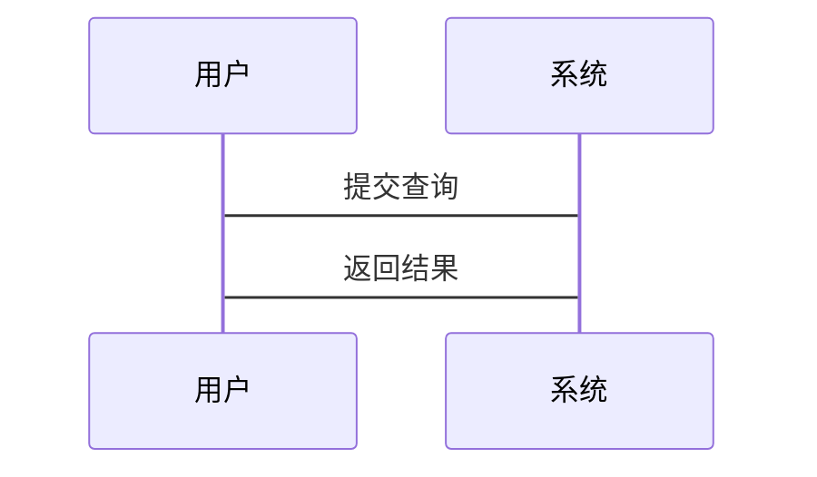

                 


# 墨西哥股市估值: 北美自由贸易区的新兴市场

> 关键词：墨西哥股市、估值、NAFTA、新兴市场、投资分析

> 摘要：本文详细分析了墨西哥股市的估值方法，探讨了北美自由贸易区对墨西哥股市的影响，结合新兴市场的特点，提供了系统的估值框架和实际案例分析。通过本文，读者可以深入了解墨西哥股市的估值逻辑和实际操作技巧。

---

## 第一部分: 墨西哥股市估值的背景与概述

### 第1章: 墨西哥股市的概述与特点

#### 1.1 墨西哥股市的起源与发展
- **1.1.1 墨西哥股市的起源**
  - 墨西哥股市的起源可以追溯到19世纪末，经历了多次合并和重组，逐步发展为如今的墨西哥证券交易所（BMV）。
  - BMV是拉丁美洲最大的证券交易所之一，也是全球最重要的新兴市场之一。
  - 墨西哥股市的国际化进程：从本地市场到全球化的交易所。

- **1.1.2 墨西哥股市的发展历程**
  - 20世纪初：墨西哥股市的初步发展。
  - 1990年代：墨西哥股市的快速扩张。
  - 21世纪：墨西哥股市的全球化进程。

- **1.1.3 墨西哥股市的国际化进程**
  - 墨西哥股市与国际市场的联系：通过NAFTA和后续的USMCA协议，墨西哥股市成为北美自由贸易区的重要组成部分。
  - 墨西哥股市的国际化特点：吸引外资、提升市场流动性。

---

#### 1.2 北美自由贸易区对墨西哥股市的影响
- **1.2.1 北美自由贸易区的背景**
  - NAFTA（1994年）：美国、加拿大和墨西哥签署的自由贸易协议。
  - USMCA（2020年）：NAFTA的升级版，进一步促进了北美自由贸易区的经济一体化。

- **1.2.2 墨西哥在NAFTA中的角色**
  - 墨西哥作为 NAFTA 中的重要成员，承担着连接南美和北美的战略地位。
  - 墨西哥股市在 NAFTA 中的作用：为外国投资者提供进入南美市场的通道。

- **1.2.3 NAFTA对墨西哥股市的具体影响**
  - 墨西哥股市的开放：吸引更多外资流入。
  - 墨西哥股市的行业分布变化：制造业和服务业的外资比例上升。
  - 墨西哥股市的波动性： NAFTA 解除后的不确定性对股市的影响。

---

#### 1.3 墨西哥股市的行业分布与特点
- **1.3.1 墨西哥股市的主要行业分布**
  - 制造业：汽车、电子等。
  - 服务业：金融、信息技术等。
  - 能源：石油、天然气等。

- **1.3.2 墨西哥股市的特点与优势**
  - 与北美市场的紧密联系。
  - 丰富的资源和劳动力优势。
  - 市场流动性逐渐提高。

- **1.3.3 墨西哥股市的风险与挑战**
  - 政治风险：墨西哥的政治稳定性对股市的影响。
  - 经济波动：美元与墨西哥比索的汇率波动对股市的影响。
  - 法律风险：墨西哥的法律环境对外国投资者的保护力度。

---

#### 1.4 墨西哥股市的国际化与全球化趋势
- **1.4.1 墨西哥股市的国际化进程**
  - 墨西哥股市的国际化：吸引更多外资流入。
  - 墨西哥股市的全球化：成为全球投资者关注的焦点。

- **1.4.2 全球化对墨西哥股市的影响**
  - 全球化带来的机遇：吸引外资，提升市场流动性。
  - 全球化带来的挑战：全球经济波动对墨西哥股市的影响。

- **1.4.3 墨西哥股市的未来发展趋势**
  - 预测墨西哥股市的长期发展趋势。
  - 墨西哥股市在 NAFTA 后时代的角色。

---

#### 1.5 本章小结
本章详细介绍了墨西哥股市的起源与发展，分析了北美自由贸易区对墨西哥股市的影响，探讨了墨西哥股市的行业分布与特点，最后总结了墨西哥股市的国际化与全球化趋势。

---

### 第2章: 新兴市场的股市估值特点

#### 2.1 新兴市场的定义与特点
- **2.1.1 新兴市场的定义**
  - 新兴市场是指那些经济快速增长、市场机制逐步完善、但尚未完全发达国家的股市。

- **2.1.2 新兴市场的共同特点**
  - 经济快速增长。
  - 市场流动性逐步提高。
  - 政治和经济风险较高。

- **2.1.3 新兴市场的独特性与挑战**
  - 市场波动性大。
  - 信息不透明。
  - 法律和政策风险高。

---

#### 2.2 新兴市场股市估值的核心问题
- **2.2.1 估值的基本概念**
  - 估值是通过对企业的财务数据和市场情况进行分析，确定其股票的合理价格。

- **2.2.2 新兴市场估值的独特问题**
  - 数据不完整：新兴市场的财务数据可能不够透明。
  - 市场流动性低：新兴市场的交易量可能较低，导致估值难度增加。
  - 经济周期波动：新兴市场的经济周期波动较大。

- **2.2.3 新兴市场估值的复杂性**
  - 不同行业的估值方法差异大。
  - 宏观经济环境对估值的影响显著。

---

#### 2.3 新兴市场与发达市场的估值差异
- **2.3.1 市场流动性差异**
  - 发达市场流动性高，新兴市场流动性较低。

- **2.3.2 企业治理结构差异**
  - 发达市场企业治理较为完善，新兴市场可能存在治理问题。

- **2.3.3 宏观经济环境差异**
  - 发达市场的宏观经济稳定，新兴市场的宏观经济波动较大。

---

#### 2.4 新兴市场的估值方法与挑战
- **2.4.1 常用的估值方法**
  - 市盈率（P/E）。
  - 市净率（P/B）。
  - 市销率（P/S）。
  - EV/EBITDA。

- **2.4.2 新兴市场的估值挑战**
  - 数据可靠性问题。
  - 市场波动性高。

- **2.4.3 如何克服估值挑战**
  - 使用多种估值方法结合。
  - 关注宏观经济环境。

---

#### 2.5 本章小结
本章分析了新兴市场的定义与特点，探讨了新兴市场股市估值的核心问题，比较了新兴市场与发达市场的估值差异，并总结了新兴市场的估值方法与挑战。

---

### 第3章: 墨西哥股市估值的核心概念与框架

#### 3.1 墨西哥股市估值的核心概念
- **3.1.1 市盈率（P/E）**
  - 定义：市盈率=股价/每股收益。
  - 用途：衡量股票的估值水平。

- **3.1.2 市净率（P/B）**
  - 定义：市净率=股价/每股净资产。
  - 用途：衡量股票的估值水平。

- **3.1.3 市销率（P/S）**
  - 定义：市销率=股价/每股收入。
  - 用途：衡量股票的估值水平。

- **3.1.4 EV/EBITDA**
  - 定义：企业价值/息税折旧及摊销前利润。
  - 用途：衡量企业的整体估值。

---

#### 3.2 墨西哥股市估值的核心框架
- **3.2.1 基本面分析框架**
  - 收入分析：企业收入的增长情况。
  - 利润分析：企业的盈利能力。
  - 财务状况：企业的资产负债情况。

- **3.2.2 技术分析框架**
  - 趋势分析：股票价格的趋势。
  - 坐标分析：股票价格的支撑位和阻力位。
  - 交易量分析：股票交易量的变化。

- **3.2.3 综合估值框架**
  - 结合基本面分析和技术分析，得出股票的综合估值。

---

#### 3.3 墨西哥股市估值的行业差异
- **3.3.1 不同行业的估值特点**
  - 制造业：市盈率和市净率的结合。
  - 服务业：市销率和EV/EBITDA的结合。

- **3.3.2 行业周期对估值的影响**
  - 行业周期上升期：高估。
  - 行业周期下降期：低估。

- **3.3.3 行业政策对估值的影响**
  - 政策支持的行业：估值较高。
  - 政策限制的行业：估值较低。

---

#### 3.4 墨西哥股市估值的区域差异
- **3.4.1 区域经济差异对估值的影响**
  - 经济发达地区：估值较高。
  - 经济欠发达地区：估值较低。

- **3.4.2 区域政策差异对估值的影响**
  - 政策支持的区域：估值较高。
  - 政策限制的区域：估值较低。

- **3.4.3 区域市场流动性差异对估值的影响**
  - 市场流动性高的区域：估值较高。
  - 市场流动性低的区域：估值较低。

---

#### 3.5 本章小结
本章详细介绍了墨西哥股市估值的核心概念，提出了墨西哥股市估值的核心框架，探讨了行业和区域差异对估值的影响。

---

### 第4章: 墨西哥股市估值的算法原理与数学模型

#### 4.1 基本面分析的数学模型
- **4.1.1 市盈率模型**
  - 公式：P/E = 市价/每股收益。
  - 用途：衡量股票的估值水平。

- **4.1.2 市净率模型**
  - 公式：P/B = 市价/每股净资产。
  - 用途：衡量股票的估值水平。

- **4.1.3 市销率模型**
  - 公式：P/S = 市价/每股收入。
  - 用途：衡量股票的估值水平。

- **4.1.4 EV/EBITDA模型**
  - 公式：EV/EBITDA = 企业价值/息税折旧及摊销前利润。
  - 用途：衡量企业的整体估值。

---

#### 4.2 技术分析的数学模型
- **4.2.1 移动平均线（MA）**
  - 公式：MA = (过去n天的收盘价之和)/n。
  - 用途：判断股票价格的趋势。

- **4.2.2 相对强弱指数（RSI）**
  - 公式：RSI = 100 - (100 - (升幅/跌幅) / 10)。
  - 用途：判断股票的超买或超卖状态。

- **4.2.3 布林带（Bollinger Bands）**
  - 公式：中线=收盘价的n天移动平均线，上轨=中线+标准差×2，下轨=中线-标准差×2。
  - 用途：判断股票价格的波动范围。

---

#### 4.3 综合估值模型
- **4.3.1 综合估值模型的构建**
  - 结合基本面分析和技术分析，构建综合估值模型。

- **4.3.2 综合估值模型的实现**
  - 使用Python代码实现综合估值模型。

---

#### 4.4 本章小结
本章详细介绍了基本面分析和技术分析的数学模型，提出了综合估值模型，并通过Python代码实现了模型的构建。

---

## 第二部分: 墨西哥股市估值的系统分析与架构设计

### 第5章: 系统分析与架构设计方案

#### 5.1 问题场景介绍
- 墨西哥股市估值的复杂性。
- 需要构建一个高效的估值系统。

---

#### 5.2 系统功能设计
- **5.2.1 数据采集模块**
  - 采集墨西哥股市的历史数据。
  - 采集宏观经济数据。

- **5.2.2 数据分析模块**
  - 使用Python进行数据分析。
  - 使用Pandas进行数据清洗和处理。

- **5.2.3 数据可视化模块**
  - 使用Matplotlib进行数据可视化。
  - 使用Seaborn进行高级数据可视化。

---

#### 5.3 系统架构设计
- **5.3.1 系统架构图**
  - 使用Mermaid绘制系统架构图。



- **5.3.2 系统接口设计**
  - 数据接口：与数据源对接。
  - 用户接口：与用户交互。

---

#### 5.4 系统交互设计
- **5.4.1 系统交互图**
  - 使用Mermaid绘制系统交互图。



---

#### 5.5 本章小结
本章详细介绍了系统分析与架构设计方案，包括问题场景介绍、系统功能设计、系统架构设计和系统交互设计。

---

## 第三部分: 墨西哥股市估值的项目实战

### 第6章: 项目实战

#### 6.1 环境安装
- **6.1.1 安装Python**
  - 使用Anaconda安装Python。

- **6.1.2 安装数据处理库**
  - 安装Pandas、NumPy、Matplotlib。

- **6.1.3 安装数据可视化库**
  - 安装Seaborn。

---

#### 6.2 系统核心实现
- **6.2.1 数据采集模块**
  - 使用API获取墨西哥股市的历史数据。

```python
import pandas as pd
import requests

url = "https://api.bmv.com.mx/stock-data"
response = requests.get(url)
data = response.json()
df = pd.DataFrame(data)
```

- **6.2.2 数据分析模块**
  - 使用Pandas进行数据清洗和处理。

```python
df.dropna(inplace=True)
df['收盘价'] = pd.to_numeric(df['收盘价'])
df['开盘价'] = pd.to_numeric(df['开盘价'])
```

- **6.2.3 数据可视化模块**
  - 使用Matplotlib进行数据可视化。

```python
import matplotlib.pyplot as plt

plt.plot(df['日期'], df['收盘价'])
plt.xlabel('日期')
plt.ylabel('收盘价')
plt.title('墨西哥股市收盘价')
plt.show()
```

---

#### 6.3 代码应用解读与分析
- **6.3.1 数据采集模块的实现**
  - 使用API获取数据。
  - 处理数据格式。

- **6.3.2 数据分析模块的实现**
  - 数据清洗。
  - 数据转换。

- **6.3.3 数据可视化模块的实现**
  - 绘制收盘价趋势图。
  - 绘制K线图。

---

#### 6.4 案例分析与详细讲解
- **6.4.1 案例分析**
  - 分析某行业在墨西哥股市的表现。

- **6.4.2 详细讲解**
  - 使用综合估值模型进行案例分析。

---

#### 6.5 项目小结
本章通过项目实战，详细介绍了环境安装、系统核心实现、代码应用解读与分析，最后通过案例分析和详细讲解，总结了项目的核心内容。

---

## 第四部分: 总结与展望

### 第7章: 总结与展望

#### 7.1 最佳实践 tips
- 墨西哥股市估值的关键点。
- 如何避免估值错误。

#### 7.2 小结
- 本文的总结。

#### 7.3 注意事项
- 投资者需要注意的风险。

#### 7.4 拓展阅读
- 推荐的进一步阅读资料。

---

## 作者：AI天才研究院/AI Genius Institute & 禅与计算机程序设计艺术 /Zen And The Art of Computer Programming

