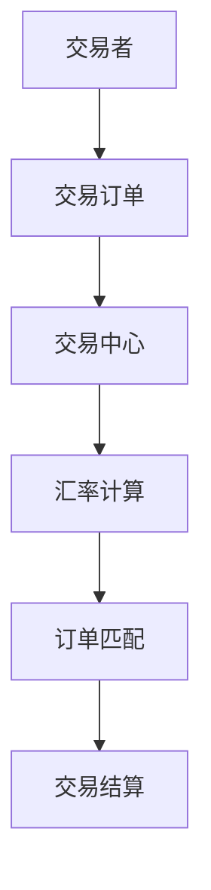
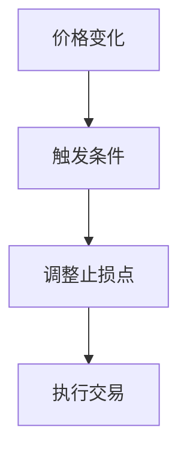

                 


# 外汇投资：把握全球货币市场机会

> 关键词：外汇投资、全球货币市场、汇率波动、风险管理、技术分析、套利策略

> 摘要：本文将深入探讨外汇投资的核心概念、策略和风险管理，帮助读者掌握在复杂多变的全球货币市场中把握投资机会的技巧。通过分析市场背景、技术指标、套利策略和风险管理原则，本文为投资者提供了系统化的知识框架和实际操作指南。

---

# 第一部分: 外汇市场的概述

## 第1章: 外汇市场的定义与特点

### 1.1 外汇市场的定义与特点

#### 背景介绍
外汇市场是全球最大的金融市场，涉及全球主要国家的货币交易。其核心功能是实现货币兑换和汇率形成，支持国际贸易和投资。外汇市场的交易规模庞大，每天交易额超过数万亿美元，吸引了各国央行、银行、企业和个人投资者参与。

#### 核心概念与联系
- **货币对**：外汇交易的基本单位，如 EUR/USD 表示欧元兑美元的汇率。
- **汇率**：一种货币相对于另一种货币的价格，决定市场参与者的行为和交易策略。

#### 核心概念与联系

| 概念 | 定义 | 属性 |
|------|------|------|
| 货币对 | 表示两种货币的兑换比例 | EUR/USD, GBP/JPY |
| 汇率 | 购买力平价或市场供求决定的价格 | 直接标价法、间接标价法 |

#### ER 实体关系图

```mermaid
erDiagram
USD o- "交易货币" :交易中的计价货币
EUR o- "基准货币" :交易中的基准货币
FXMarket -> "交易者" :参与者包括银行、企业和个人
FXMarket -> "汇率" :决定交易价格
```

### 1.2 外汇交易的基本概念

#### 背景介绍
外汇交易是通过买卖货币对来获利的活动。投资者根据市场预测，买入或卖出货币，期望在汇率变化中获得收益。

#### 核心概念与联系

- **即期交易**：当日结算的交易，是外汇市场的基础交易类型。
- **远期交易**：约定在未来特定时间以预定汇率买卖货币的合约，用于对冲汇率风险或投机。

#### 算法原理
即期交易的算法核心是实时汇率计算和订单匹配。



### 1.3 外汇市场的历史与发展

#### 背景介绍
外汇市场起源于古代的商品贸易，经历了从固定汇率到浮动汇率的演变。现代外汇市场的发展与全球化进程紧密相关，技术进步推动了电子交易平台的普及。

---

# 第二部分: 外汇交易的基础知识

## 第2章: 外汇交易的技术分析

### 2.1 技术分析的基本原理

#### 背景介绍
技术分析通过分析历史价格数据，预测未来汇率走势。其核心假设是价格反映所有信息，市场参与者的行为模式可被识别和利用。

#### 核心概念与联系

| 指标 | 定义 | 特性 |
|------|------|------|
| 移动平均线 (MA) | 平滑价格数据，显示趋势方向 | 常用周期：50、100、200 |
| 相对强弱指数 (RSI) | 衡量超买或超卖状态 | 范围：0-100 |

#### 算法原理
RSI 计算公式：

$$ RSI = \frac{\text{上涨幅度}}{\text{上涨幅度} + \text{下跌幅度}} \times 100 $$

---

# 第三部分: 风险管理与投资策略

## 第3章: 外汇交易的风险管理

### 3.1 风险管理的重要性

#### 背景介绍
外汇市场波动剧烈，投资者必须采取有效的风险管理策略，包括止损、止盈和资金分配。

#### 核心概念与联系

| 策略 | 描述 |
|------|------|
| 止损 | 限制最大损失 | 根据技术指标或固定比例设置 |
| 止盈 | 锁定利润 | 根据目标收益或技术信号触发 |

#### 算法原理
动态止损策略：



---

## 第4章: 外汇投资的未来趋势

### 4.1 数字货币的影响

#### 背景介绍
比特币等数字货币的兴起对传统外汇市场构成挑战，同时也提供了新的投资机会。

#### 核心概念与联系

| 比较维度 | 数字货币 | 传统外汇 |
|----------|----------|----------|
| 支付效率 | 高 | 低 |
| 监管环境 | 无明确监管 | 严格监管 |

---

## 第5章: 结论

### 5.1 总结

外汇投资是一个复杂但充满机会的领域。通过深入理解市场机制、掌握技术分析和风险管理技巧，投资者可以在全球货币市场中实现稳健收益。

---

作者：AI天才研究院/AI Genius Institute & 禅与计算机程序设计艺术 /Zen And The Art of Computer Programming

