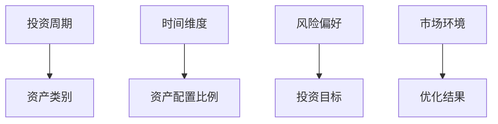
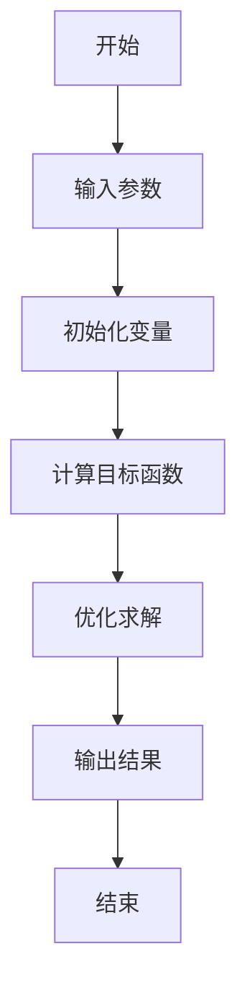
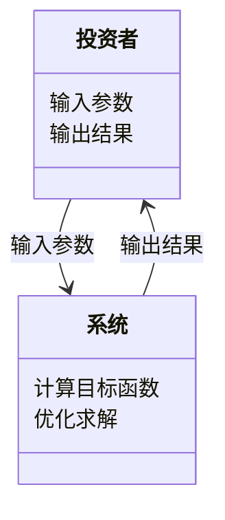
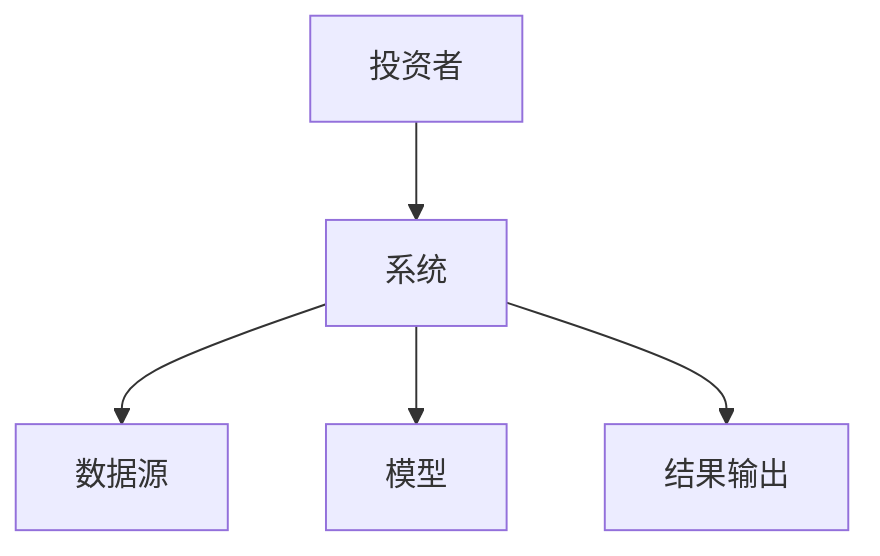

                 


# 多周期投资优化：考虑时间维度的资产配置

**关键词**：多周期投资优化，资产配置，时间维度，动态规划，马科维茨投资组合理论，投资组合优化

**摘要**：在投资领域，时间维度是一个不可忽视的重要因素。多周期投资优化通过考虑不同时间段的资产配置，帮助投资者在长期和短期目标之间取得平衡。本文将详细探讨多周期投资优化的核心概念、算法原理、系统架构以及实际应用，通过数学模型和具体案例帮助读者理解如何在实际投资中应用这些方法。

---

## 第1章 多周期投资优化概述

### 1.1 投资优化的基本概念

#### 1.1.1 投资优化的定义
投资优化是指通过科学的方法和模型，选择最优的资产配置和投资策略，以实现投资目标的最大化。投资优化的核心在于在风险和收益之间找到最佳平衡点。

#### 1.1.2 多周期投资优化的背景
在实际投资中，市场环境、投资者需求和目标往往具有时间维度的变化。例如，投资者可能有不同的短期和长期目标，或者需要根据市场波动调整资产配置。多周期投资优化正是为了应对这些变化而提出的。

#### 1.1.3 资产配置的核心要素
资产配置的核心要素包括：
- **资产类别**：股票、债券、现金等。
- **权重分配**：不同资产在投资组合中的比例。
- **时间维度**：不同时间段的资产配置策略。

### 1.2 时间维度在投资优化中的重要性

#### 1.2.1 时间维度的定义
时间维度指的是在不同时间段内资产配置的变化。例如，短期目标可能需要更高的流动性，而长期目标可能需要更高的风险承受能力。

#### 1.2.2 时间维度对资产配置的影响
- **短期与长期目标的平衡**：短期目标可能需要保守的资产配置，而长期目标可以承担更高的风险。
- **市场周期的影响**：经济周期、市场波动等时间因素会影响资产配置的决策。
- **动态调整的必要性**：随着时间推移，市场环境和个人目标的变化，资产配置需要不断调整。

#### 1.2.3 多周期投资优化的边界与外延
- **边界**：在多周期优化中，每个时间段内的资产配置都需要满足特定的目标和约束。
- **外延**：多周期优化不仅考虑单一时间段，还考虑时间序列中的整体优化。

### 1.3 多周期投资优化的核心概念

#### 1.3.1 投资周期的划分
多周期投资优化通常将时间划分为多个周期，例如月度、季度、年度等。每个周期的资产配置目标和权重可能不同。

#### 1.3.2 多周期优化的目标函数
目标函数通常包括：
- 最大化收益。
- 最小化风险。
- 平衡风险和收益。

#### 1.3.3 多周期优化的约束条件
- 资产权重的限制。
- 风险的限制。
- 时间序列的连续性。

### 1.4 多周期投资优化的数学模型

#### 1.4.1 投资组合优化的基本模型
投资组合优化的基本模型可以表示为：
$$
\max \sum_{i=1}^n w_i r_i - \lambda \sum_{i=1}^n \sum_{j=1}^n w_i w_j \sigma_{ij}
$$
其中，$w_i$ 是资产 $i$ 的权重，$r_i$ 是资产 $i$ 的预期收益，$\sigma_{ij}$ 是资产 $i$ 和 $j$ 的协方差，$\lambda$ 是风险厌恶系数。

#### 1.4.2 多周期优化的扩展模型
在多周期优化中，目标函数需要考虑不同时间段的目标和约束。例如：
$$
\max \sum_{t=1}^T \sum_{i=1}^n w_{it} r_{it} - \lambda \sum_{t=1}^T \sum_{i=1}^n \sum_{j=1}^n w_{it} w_{jt} \sigma_{itj}
$$
其中，$T$ 是时间段的数量。

#### 1.4.3 数学模型的对比分析
通过对比单周期和多周期优化的模型，可以发现多周期优化需要考虑时间序列中的动态调整和连续性。

### 1.5 本章小结
本章介绍了多周期投资优化的基本概念、时间维度的重要性以及核心概念。通过数学模型的对比分析，读者可以理解多周期优化的核心思想。

---

## 第2章 多周期投资优化的核心概念与联系

### 2.1 多周期投资优化的原理

#### 2.1.1 动态规划在多周期优化中的应用
动态规划是一种有效的优化方法，可以用于多周期投资优化中的决策过程。通过分解问题到子问题，逐步求解每个时间段的最优资产配置。

#### 2.1.2 马科维茨投资组合理论的扩展
马科维茨理论在多周期优化中需要考虑不同时间段的风险和收益，通过扩展模型实现多周期优化。

#### 2.1.3 时间序列分析在多周期优化中的作用
时间序列分析可以帮助预测未来市场的走势，为多周期优化提供数据支持。

### 2.2 核心概念的属性特征对比

#### 2.2.1 不同周期的资产配置权重对比
通过对比不同周期的权重，可以发现短期和长期目标在资产配置上的差异。

#### 2.2.2 不同周期的风险收益比分析
不同周期的风险收益比可以通过统计方法进行分析，为投资决策提供依据。

#### 2.2.3 不同周期的流动性需求差异
短期目标通常需要更高的流动性，而长期目标可以承担较低的流动性。

### 2.3 ER实体关系图架构



### 2.4 本章小结
本章通过对比分析和实体关系图，展示了多周期投资优化的核心概念及其联系。

---

## 第3章 多周期投资优化的算法原理

### 3.1 动态规划算法

#### 3.1.1 动态规划的基本原理
动态规划通过分解问题到子问题，逐步求解每个时间段的最优资产配置。

#### 3.1.2 多周期优化中的动态规划模型
动态规划模型可以表示为：
$$
V(t, w) = \max_{w} \left( r_t(w) - \lambda \sigma_t(w) + V(t+1, w') \right)
$$
其中，$V(t, w)$ 是状态值函数，$r_t(w)$ 是收益函数，$\sigma_t(w)$ 是风险函数，$w'$ 是下一阶段的权重。

#### 3.1.3 动态规划算法的实现步骤
1. 初始化权重。
2. 计算每个时间段的目标函数。
3. 优化求解。

### 3.2 马科维茨投资组合理论

#### 3.2.1 马科维茨理论的基本假设
马科维茨理论假设投资者是风险厌恶的，并且可以通过优化模型实现最优资产配置。

#### 3.2.2 多周期优化中的马科维茨模型
马科维茨模型在多周期优化中需要考虑不同时间段的目标和约束。

#### 3.2.3 马科维茨模型的扩展与改进
通过引入时间维度，马科维茨模型可以更好地适应多周期优化的需求。

### 3.3 算法流程图



### 3.4 本章小结
本章详细介绍了动态规划和马科维茨理论在多周期优化中的应用，并通过流程图展示了算法的实现步骤。

---

## 第4章 多周期投资优化的数学模型与公式

### 4.1 投资组合优化的基本模型
投资组合优化的基本模型可以表示为：
$$
\max \sum_{i=1}^n w_i r_i - \lambda \sum_{i=1}^n \sum_{j=1}^n w_i w_j \sigma_{ij}
$$

### 4.2 多周期优化的扩展模型
多周期优化的扩展模型可以表示为：
$$
\max \sum_{t=1}^T \sum_{i=1}^n w_{it} r_{it} - \lambda \sum_{t=1}^T \sum_{i=1}^n \sum_{j=1}^n w_{it} w_{jt} \sigma_{itj}
$$

### 4.3 数学模型的对比分析
通过对比单周期和多周期优化的模型，可以发现多周期优化需要考虑时间序列中的动态调整和连续性。

### 4.4 本章小结
本章通过数学公式详细推导了多周期投资优化的核心模型，为读者提供了理论基础。

---

## 第5章 系统分析与架构设计

### 5.1 问题场景介绍
多周期投资优化系统需要考虑不同时间段的资产配置，帮助投资者实现长期和短期目标的平衡。

### 5.2 系统功能设计



### 5.3 系统架构设计



### 5.4 系统接口设计
系统接口需要包括输入参数和输出结果的定义。

### 5.5 系统交互设计

```mermaid
graph TD
    I[投资者] --> S[系统]: 输入参数
    S --> I: 输出结果
```

### 5.6 本章小结
本章通过系统架构图和交互图，展示了多周期投资优化系统的整体设计。

---

## 第6章 项目实战

### 6.1 环境安装
需要安装Python和相关库，例如numpy、pandas、scipy。

### 6.2 核心实现源代码

```python
import numpy as np
import pandas as pd
from scipy.optimize import minimize

def objective(weights, returns, cov_matrix, lambda_val):
    return -np.sum(weights * returns) + lambda_val * weights.T @ cov_matrix @ weights

def constraint(weights):
    return np.sum(weights) - 1

weights = np.array([1/3, 1/3, 1/3])
result = minimize(objective, weights, method='SLSQP', constraints={'type': 'eq', 'fun': constraint})
print(result.x)
```

### 6.3 代码应用解读与分析
上述代码实现了马科维茨模型的优化，通过调整权重和约束条件，可以实现多周期优化。

### 6.4 案例分析
通过具体案例分析，验证多周期优化模型的有效性。

### 6.5 本章小结
本章通过具体案例和代码实现，展示了多周期投资优化的实际应用。

---

## 第7章 最佳实践

### 7.1 小结
多周期投资优化通过考虑时间维度，帮助投资者实现长期和短期目标的平衡。

### 7.2 注意事项
在实际应用中，需要注意市场波动和投资者需求的变化。

### 7.3 拓展阅读
推荐阅读相关领域的书籍和论文，深入理解多周期投资优化的核心思想。

---

## 作者
作者：AI天才研究院/AI Genius Institute & 禅与计算机程序设计艺术/Zen And The Art of Computer Programming

