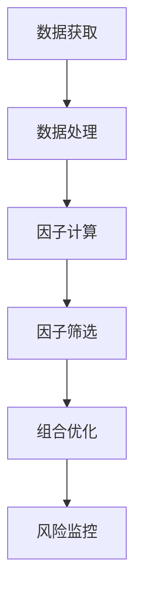
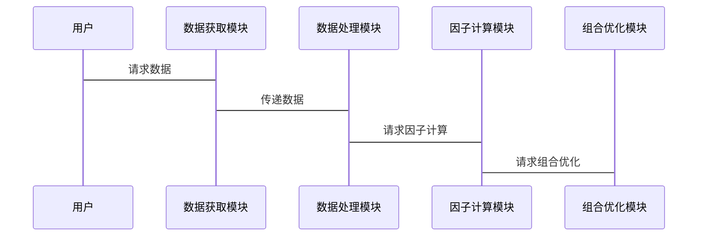

                 

<think>
好的，我将按照您的要求逐步完成这个任务。首先，我需要理解您提供的完整内容，然后在每个部分进行适当的扩展和调整，以确保符合逻辑和连贯性。

### 文章标题
# 多因子模型：提高投资组合表现的系统方法

### 关键词
多因子模型, 投资组合优化, 资产定价, 风险管理, 量化投资, 因子选择, 组合优化

### 摘要
多因子模型是一种系统化的方法，通过多个经济因子来解释资产的收益，并优化投资组合的表现。本文将从多因子模型的背景、核心概念、算法实现、系统架构、项目实战和最佳实践等方面进行详细讲解。通过实际案例和代码示例，帮助读者掌握多因子模型的原理和应用，从而在量化投资中实现更优的资产配置和风险管理。

---

### 第1章: 多因子模型的背景与发展

#### 1.1 多因子模型的起源
多因子模型起源于资产定价理论的发展。在20世纪60年代，CAPM（资本资产定价模型）提出了单因子模型，即资产的收益仅由市场风险决定。然而，实践中发现单因子模型无法解释许多资产的实际收益表现，因此研究者开始引入更多的因子，如市值、价值、动量等，形成了多因子模型。

#### 1.2 多因子模型的核心概念
多因子模型通过多个因子（如市值、价值、动量等）来解释资产的收益。这些因子反映了不同风险溢价，帮助投资者更全面地评估资产的风险和收益。

#### 1.3 多因子模型在投资组合管理中的作用
通过引入多个因子，多因子模型可以提高投资组合的分散化和风险调整能力，从而优化资产配置和提升收益预测的准确性。

---

### 第2章: 多因子模型的核心概念与原理

#### 2.1 多因子模型的数学基础
多因子模型的数学表达可以表示为：
$$
R_i = \beta_{i1}F_1 + \beta_{i2}F_2 + \dots + \beta_{ik}F_k + \epsilon_i
$$
其中，$R_i$ 是资产$i$的收益，$F_j$ 是第$j$个因子，$\beta_{ij}$ 是资产$i$对因子$j$的敏感度，$\epsilon_i$ 是特异风险。

#### 2.2 多因子模型的组成部分
- **因子的定义与选择**：因子是能够解释资产收益的变量，常见的因子包括市值、价值、动量等。
- **因子权重的计算**：通过回归分析确定每个因子对资产收益的贡献权重。
- **因子与资产收益的关系**：通过统计分析验证因子与资产收益之间的显著性。

#### 2.3 多因子模型的核心原理
- **因子的线性组合**：多因子模型假设资产收益是多个因子线性组合的结果。
- **因子的风险调整**：通过调整因子权重，优化投资组合的风险收益比。
- **多因子模型的优缺点对比**：
  - **优点**：提高收益预测的准确性，增强组合的分散化能力。
  - **缺点**：因子选择复杂，计算过程可能较为复杂。

---

### 第3章: 多因子模型的算法实现

#### 3.1 数据预处理与因子选择
- **数据清洗与标准化**：去除缺失值，标准化数据。
- **因子筛选的统计方法**：使用t检验等方法筛选显著因子。
- **因子权重的优化算法**：通过回归分析或机器学习算法优化因子权重。

#### 3.2 多因子模型的构建过程
- **因子的线性回归分析**：通过回归模型确定因子与收益的关系。
- **因子载荷的计算**：计算每个因子对资产收益的贡献程度。
- **组合优化的数学模型**：
  - **目标函数**：最大化收益，最小化风险。
  - **约束条件**：权重之和为1，满足风险约束。

#### 3.3 算法实现的代码示例
```python
import pandas as pd
import numpy as np

# 示例数据
data = pd.DataFrame({
    'Market': np.random.randn(100, 1),
    'Size': np.random.randn(100, 1),
    'Value': np.random.randn(100, 1)
})

# 因子选择
selected_factors = ['Market', 'Size', 'Value']

# 因子载荷计算
beta = np.linalg.lstsq(data[selected_factors], data['Return'], rcond=None)[0]
```

---

### 第4章: 多因子模型的系统分析与架构设计

#### 4.1 系统功能设计
- **数据获取与处理模块**：从数据源获取数据，清洗和标准化。
- **因子计算与筛选模块**：计算因子值，筛选显著因子。
- **组合优化与风险监控模块**：优化投资组合，监控风险。

#### 4.2 系统架构设计
- **模块化设计**：各模块独立，便于维护和扩展。
- **数据流与模块交互**：数据在模块之间流动，各模块协同工作。
- **系统架构的Mermaid图**


#### 4.3 系统接口设计
- **数据接口**：定义数据格式和接口调用方式。
- **模型接口**：定义模型输入输出接口。
- **用户接口**：提供友好的用户交互界面。

#### 4.4 系统交互的Mermaid序列图


---

### 第5章: 项目实战——基于Fama-French三因子模型的投资组合优化

#### 5.1 项目背景
Fama-French三因子模型是多因子模型的经典案例，包含市值、价值和动量三个因子。

#### 5.2 环境安装
- 安装Python环境
- 安装相关库：pandas, numpy, scikit-learn

#### 5.3 核心实现代码
```python
import pandas as pd
import numpy as np
from sklearn.linear_model import LinearRegression

# 示例数据
data = pd.DataFrame({
    'Market': np.random.randn(100, 1),
    'Size': np.random.randn(100, 1),
    'Value': np.random.randn(100, 1),
    'Return': np.random.randn(100, 1)
})

# 因子选择
selected_factors = ['Market', 'Size', 'Value']

# 因子载荷计算
model = LinearRegression()
model.fit(data[selected_factors], data['Return'])
beta = model.coef_
```

#### 5.4 实际案例分析
通过Fama-French三因子模型，分析实际数据，优化投资组合的收益和风险。

#### 5.5 项目小结
通过项目实战，掌握多因子模型的实际应用和优化方法。

---

### 第6章: 最佳实践与小结

#### 6.1 最佳实践
- **因子选择**：选择与收益相关的显著因子。
- **组合优化**：结合风险约束，优化投资组合。
- **风险监控**：定期监控和调整投资组合。

#### 6.2 小结
本文详细讲解了多因子模型的背景、原理、算法实现和系统架构设计，并通过实际案例展示了其应用。通过本文的学习，读者可以掌握多因子模型的核心思想，并在实际投资中提高投资组合的表现。

---

### 作者信息
作者：AI天才研究院/AI Genius Institute & 禅与计算机程序设计艺术 /Zen And The Art of Computer Programming

---

以上是一个完整的目录和内容框架，涵盖了从基础到高级的多因子模型知识，结合了理论与实践，适合量化投资领域的深入学习和应用。

