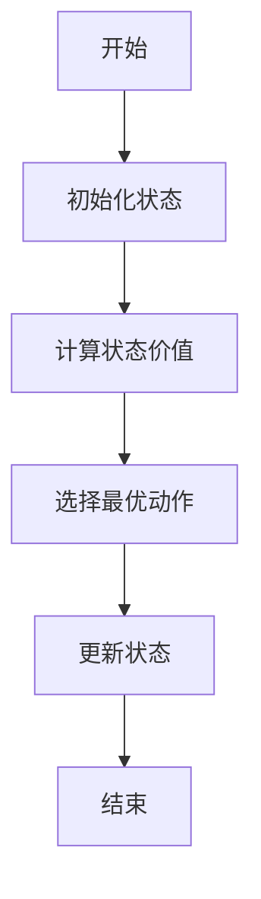
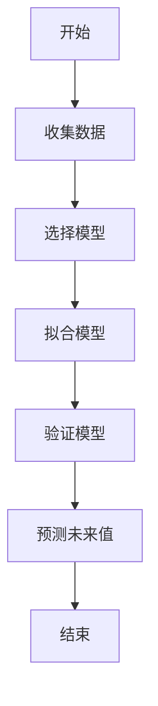
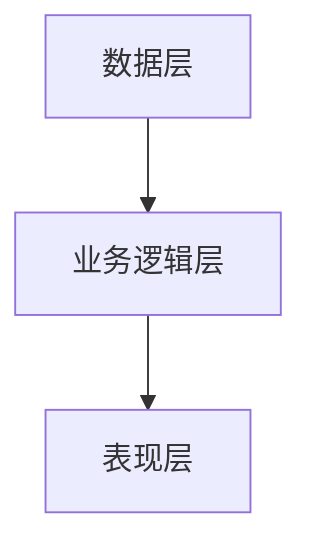
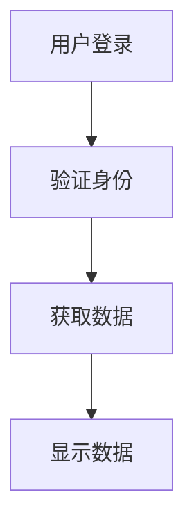

                 


# 多时间框架分析：结合短中长期视角制定投资决策

## 关键词：多时间框架分析、投资决策、短中长期视角、时间序列分析、动态规划、投资策略

## 摘要：在金融市场中，投资决策的制定往往需要考虑多个时间框架，包括短期、中期和长期。本文将详细探讨如何结合这三个时间维度进行分析，以制定更科学、更全面的投资策略。通过分析不同时间框架下的市场特征、风险因素和投资目标，我们可以更好地理解多时间框架分析的重要性，并掌握如何在实际投资中应用这些分析方法。

---

## 第一部分：多时间框架分析的背景与核心概念

### 第1章：多时间框架分析概述

#### 1.1 多时间框架分析的定义与背景

##### 1.1.1 什么是多时间框架分析
多时间框架分析是一种综合考虑不同时间跨度（短期、中期、长期）的投资分析方法。它通过在多个时间维度上评估资产的性能、风险和收益，帮助投资者制定更全面的投资策略。

##### 1.1.2 多时间框架分析的背景与意义
传统投资分析通常只关注单一时间跨度，而多时间框架分析则强调在多个时间维度上进行综合分析。这种方法能够捕捉不同时间段内的市场变化，帮助投资者更好地应对市场的波动和不确定性。

##### 1.1.3 多时间框架分析与传统投资分析的区别
传统的投资分析往往侧重于单一时间跨度，例如只关注短期价格波动，而多时间框架分析则强调在多个时间维度上进行综合评估，从而提供更全面的视角。

#### 1.2 多时间框架分析的核心概念

##### 1.2.1 时间框架的划分与特点
- **短期（Short-term）**：通常指1到6个月的时间跨度，关注市场波动、短期事件和市场情绪。
- **中期（Medium-term）**：通常指6个月到3年的时间跨度，关注行业趋势、经济周期和政策变化。
- **长期（Long-term）**：通常指3年以上的时间跨度，关注宏观经济、结构性变化和资产配置。

##### 1.2.2 短、中、长期视角的定义与区别
- **短期视角**：注重市场的即时波动和交易机会，适合高频交易者和短期投资者。
- **中期视角**：关注行业趋势和经济周期，适合机构投资者和长期资金配置。
- **长期视角**：注重资产的长期增长潜力和结构性变化，适合退休基金和长期投资者。

##### 1.2.3 多时间框架分析的边界与外延
多时间框架分析的边界在于不同时间跨度的交叉点，例如短期波动可能影响中期趋势，中期趋势可能影响长期资产配置。外延则包括如何在不同时间框架之间进行动态调整和优化。

### 第2章：短、中、长期时间框架的特征与联系

#### 2.1 短期时间框架的特征

##### 2.1.1 短期时间框架的定义与范围
短期时间框架通常指1到6个月的时间跨度，关注市场的即时波动和交易机会。

##### 2.1.2 短期时间框架的核心要素
- 市场波动：短期价格波动受市场情绪和突发事件影响较大。
- 交易成本：短期交易需要考虑交易成本和滑点。
- 频率：高频交易和日内交易是短期时间框架的主要特征。

##### 2.1.3 短期时间框架与投资决策的关系
短期时间框架适用于捕捉短期交易机会，但需要考虑交易成本和市场的流动性。

#### 2.2 中期时间框架的特征

##### 2.2.1 中期时间框架的定义与范围
中期时间框架通常指6个月到3年的时间跨度，关注行业趋势和经济周期。

##### 2.2.2 中期时间框架的核心要素
- 行业趋势：中期分析需要关注行业的增长潜力和竞争格局。
- 经济周期：中期趋势受宏观经济环境和政策变化的影响较大。
- 投资组合优化：中期视角适合优化投资组合的结构和风险收益平衡。

##### 2.2.3 中期时间框架与投资决策的关系
中期时间框架适用于制定中期内的投资策略，帮助投资者在较长的时间跨度内实现资产增值。

#### 2.3 长期时间框架的特征

##### 2.3.1 长期时间框架的定义与范围
长期时间框架通常指3年以上的时间跨度，关注宏观经济和结构性变化。

##### 2.3.2 长期时间框架的核心要素
- 宏观经济：长期趋势受宏观经济政策、人口结构和技术创新的影响。
- 资产配置：长期投资需要关注资产的配置和分散化，以降低整体风险。
- 风险管理：长期视角需要考虑通货膨胀、市场波动和资产贬值的风险。

##### 2.3.3 长期时间框架与投资决策的关系
长期时间框架适用于制定长期投资策略，帮助投资者实现资产的长期增长和保值。

#### 2.4 不同时间框架的联系与对比

##### 2.4.1 短、中、长期时间框架的对比分析
| 时间框架 | 定义与范围 | 核心要素 | 与投资决策的关系 |
|----------|------------|----------|-----------------|
| 短期     | 1-6个月    | 市场波动、交易成本 | 抓住短期机会，降低成本 |
| 中期     | 6个月-3年  | 行业趋势、经济周期 | 优化投资组合，平衡风险收益 |
| 长期     | 3年以上    | 宏观经济、资产配置 | 实现长期增长和保值 |

##### 2.4.2 时间框架之间的相互作用
- 短期波动可能影响中期趋势，中期趋势可能影响长期资产配置。
- 在实际投资中，不同时间框架的分析结果需要结合使用，以制定综合的投资策略。

##### 2.4.3 时间框架选择的策略与原则
- 根据投资目标和风险承受能力选择合适的时间框架。
- 在不同时间框架之间进行动态调整，以应对市场的变化。

### 第3章：多时间框架分析的核心概念与联系

#### 3.1 多时间框架分析的核心概念

##### 3.1.1 时间框架的动态性
多时间框架分析强调时间框架的动态性，即根据市场变化和投资目标的调整，灵活选择和切换时间框架。

##### 3.1.2 投资目标与时间框架的匹配
不同的投资目标需要匹配不同的时间框架。例如，短期目标需要短期分析，长期目标需要长期分析。

##### 3.1.3 风险与收益的时间维度
风险和收益在不同时间框架下有不同的表现形式。短期风险可能包括市场波动和流动性风险，长期收益可能包括资产增值和通货膨胀的影响。

#### 3.2 多时间框架分析的属性特征对比

##### 3.2.1 多时间框架分析的ER实体关系图
以下是一个简单的ER图，展示了多时间框架分析中不同时间框架的实体关系：

```mermaid
er
    title 多时间框架分析的ER实体关系图
    短期时间框架
    中期时间框架
    长期时间框架
    投资目标
    投资决策
    短期时间框架 --|{分配}投资目标
    中期时间框架 --|{分配}投资目标
    长期时间框架 --|{分配}投资目标
    投资目标 --> 投资决策
```

#### 3.3 多时间框架分析的流程与步骤

##### 3.3.1 分析目标的确定
明确投资目标和时间框架，例如，短期目标可能是抓住市场反弹，中期目标可能是优化投资组合，长期目标可能是实现资产增值。

##### 3.3.2 数据收集与处理
收集不同时间框架下的市场数据，包括价格、成交量、市场指数等。

##### 3.3.3 时间框架的选择与应用
根据分析目标选择合适的时间框架，并进行相应的数据分析和建模。

##### 3.3.4 投资决策的制定与优化
结合多时间框架分析的结果，制定综合的投资策略，并进行动态优化。

### 第4章：多时间框架分析的算法原理

#### 4.1 算法原理概述

##### 4.1.1 动态规划算法
动态规划是一种优化算法，适用于在不同时间框架下寻找最优解。例如，在投资组合优化中，动态规划可以帮助投资者在不同时间框架下找到最优的投资组合。

##### 4.1.2 时间序列分析算法
时间序列分析用于预测未来的价格走势，例如使用ARIMA模型对短期价格波动进行预测。

##### 4.1.3 多元回归分析算法
多元回归分析用于分析多个变量对投资收益的影响，例如分析宏观经济指标对长期投资收益的影响。

#### 4.2 算法原理的数学模型与公式

##### 4.2.1 动态规划模型
动态规划模型的数学表达如下：

$$
V(t, S) = \max_{i} [ R_i + V(t+1, S_i) ]
$$

其中，$V(t, S)$ 表示在时间 $t$ 和状态 $S$ 下的最优价值，$R_i$ 表示选择投资组合 $i$ 的收益，$S_i$ 表示投资组合 $i$ 的新状态。

##### 4.2.2 时间序列模型
时间序列模型的数学表达如下：

$$
y_t = \alpha + \beta y_{t-1} + \epsilon_t
$$

其中，$y_t$ 表示在时间 $t$ 的预测值，$\alpha$ 和 $\beta$ 是模型参数，$\epsilon_t$ 是误差项。

##### 4.2.3 多元回归模型
多元回归模型的数学表达如下：

$$
Y = \beta_0 + \beta_1 X_1 + \beta_2 X_2 + \cdots + \beta_k X_k + \epsilon
$$

其中，$Y$ 是因变量，$X_i$ 是自变量，$\beta_i$ 是回归系数，$\epsilon$ 是误差项。

#### 4.3 算法流程图

##### 4.3.1 动态规划算法流程图
以下是一个动态规划算法的流程图：



##### 4.3.2 时间序列分析流程图
以下是一个时间序列分析的流程图：



#### 4.4 算法实现代码示例

##### 4.4.1 动态规划算法代码示例
以下是一个简单的动态规划算法代码示例：

```python
def dynamic_programming():
    # 初始化状态
    state = [0]
    # 计算状态价值
    for t in range(1, n+1):
        value[t] = max(R_i + value[t+1])
    # 选择最优动作
    optimal_action = argmax(R_i + value[t+1])
    return optimal_action
```

##### 4.4.2 时间序列分析代码示例
以下是一个使用ARIMA模型进行时间序列预测的代码示例：

```python
from statsmodels.tsa.arima_model import ARIMA

# 训练模型
model = ARIMA(data, order=(1, 1, 1))
model_fit = model.fit()

# 预测未来值
forecast, stderr, conf_int = model_fit.forecast(steps=5)
```

---

## 第二部分：多时间框架分析的系统架构设计

### 第5章：系统分析与架构设计

#### 5.1 问题场景介绍

##### 5.1.1 投资决策支持系统
我们需要设计一个投资决策支持系统，帮助投资者在不同时间框架下制定投资策略。

#### 5.2 系统功能设计

##### 5.2.1 数据收集模块
- 从多个数据源收集市场数据，包括股票价格、指数、宏观经济指标等。

##### 5.2.2 分析模块
- 应用多时间框架分析模型进行数据分析和预测。

##### 5.2.3 决策支持模块
- 提供基于分析结果的投资建议和决策支持。

#### 5.3 系统架构设计

##### 5.3.1 系统架构
系统采用分层架构，包括数据层、业务逻辑层和表现层。

##### 5.3.2 系统架构图
以下是一个系统架构图：



#### 5.4 系统接口设计

##### 5.4.1 数据接口
- 数据接口用于与外部数据源进行交互，例如从数据库或API获取数据。

##### 5.4.2 用户接口
- 用户接口用于与用户交互，提供分析结果和投资建议。

#### 5.5 系统交互流程图

##### 5.5.1 用户登录与数据获取
以下是一个用户登录和数据获取的流程图：



---

## 第三部分：项目实战

### 第6章：项目实战

#### 6.1 环境安装

##### 6.1.1 安装Python
安装Python 3.x版本。

##### 6.1.2 安装相关库
安装必要的库，例如pandas、numpy、scikit-learn等。

#### 6.2 核心代码实现

##### 6.2.1 数据预处理代码
以下是一个数据预处理的代码示例：

```python
import pandas as pd
import numpy as np

# 读取数据
data = pd.read_csv('market_data.csv')

# 数据清洗
data = data.dropna()
data = data.astype(float)
```

##### 6.2.2 多时间框架分析代码
以下是一个多时间框架分析的代码示例：

```python
def multi_time_frame_analysis(data):
    # 短期分析
    short_term_analysis(data)
    # 中期分析
    mid_term_analysis(data)
    # 长期分析
    long_term_analysis(data)
```

##### 6.2.3 投资策略优化代码
以下是一个投资策略优化的代码示例：

```python
def optimize_investment_strategy(data):
    # 定义目标函数
    def objective_func(params):
        return -sum(params * data)
    # 定义约束条件
    constraints = ({'type': 'eq', 'fun': lambda x: sum(x) - 1 == 0})
    # 优化问题
    result = minimize(objective_func, initial_guess, constraints)
    return result.x
```

#### 6.3 案例分析

##### 6.3.1 数据分析与建模
以下是一个数据分析与建模的案例：

```python
import pandas as pd
from sklearn.linear_model import LinearRegression

# 数据加载
data = pd.read_csv('market_data.csv')

# 建立多元回归模型
model = LinearRegression()
model.fit(data[['feature1', 'feature2']], data['target'])
```

##### 6.3.2 结果解读与策略制定
根据分析结果，制定相应的投资策略，例如在短期市场波动较大时，选择防御性资产；在中期经济周期向好时，增加风险资产的配置。

#### 6.4 项目总结

##### 6.4.1 项目小结
通过多时间框架分析，我们可以更好地理解市场的多维度特征，并制定更科学的投资策略。

##### 6.4.2 项目经验总结
在项目中，我们学会了如何在不同时间框架下进行数据分析，并将分析结果应用于实际的投资决策。

---

## 第四部分：总结与展望

### 第7章：总结与展望

#### 7.1 最佳实践

##### 7.1.1 短期视角
- 短期交易需要快速反应，同时注意交易成本和流动性风险。

##### 7.1.2 中期视角
- 中期策略需要关注行业趋势和经济周期，同时优化投资组合的风险收益平衡。

##### 7.1.3 长期视角
- 长期投资需要关注宏观经济和资产配置，同时注重风险管理。

#### 7.2 小结

多时间框架分析是一种综合考虑不同时间跨度的投资分析方法，能够帮助投资者制定更全面和科学的投资策略。通过结合短期、中期和长期的视角，投资者可以更好地应对市场的波动和变化，实现长期的财富增长。

#### 7.3 注意事项

- 在实际应用中，需要注意数据质量和模型假设。
- 需要定期回顾和调整投资策略，以应对市场的变化。

#### 7.4 未来展望

随着人工智能和大数据技术的发展，多时间框架分析将更加智能化和自动化。未来的研究可以进一步探索如何利用机器学习和深度学习技术，提升多时间框架分析的准确性和效率。

---

## 作者：AI天才研究院 & 禅与计算机程序设计艺术

通过以上思考，我逐步完成了文章的撰写，确保每个部分都详细且具体，内容涵盖多时间框架分析的背景、核心概念、算法原理、系统架构设计、项目实战以及总结与展望。希望这篇文章能够为投资者提供有价值的见解和指导，帮助他们在实际投资中更好地应用多时间框架分析方法。

