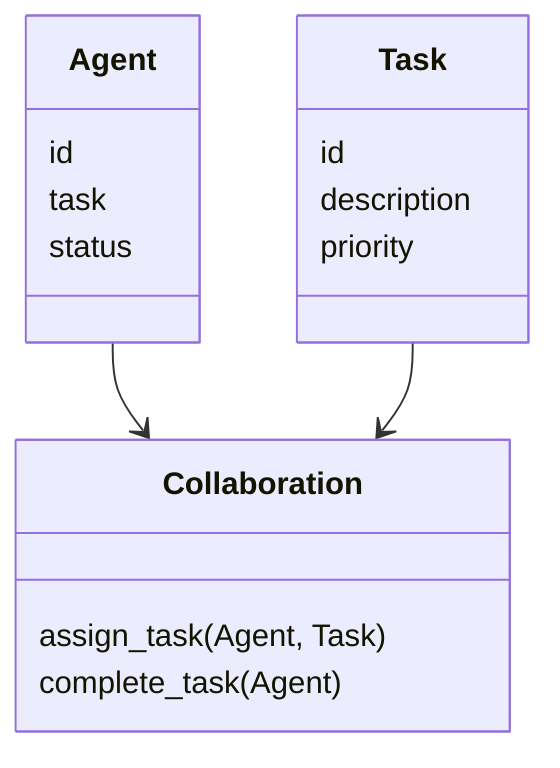
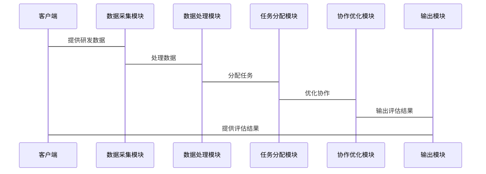

                 


# 多智能体AI如何优化研发效率评估流程

> 关键词：多智能体AI，研发效率评估，算法优化，系统架构，协作机制

> 摘要：本文探讨了多智能体AI在研发效率评估中的应用，分析了其核心概念、算法原理和系统架构，并通过实战案例展示了如何利用多智能体AI优化研发效率评估流程。

---

# 1. 多智能体AI与研发效率评估的背景

## 1.1 多智能体AI的基本概念

### 1.1.1 多智能体系统的定义
多智能体系统（Multi-Agent System, MAS）是由多个智能体组成的分布式系统，每个智能体都是具有自主性、反应性、协作性和学习能力的实体。智能体之间通过通信和协作完成复杂任务。

### 1.1.2 多智能体AI的特点
- **自主性**：智能体能够自主决策，无需外部干预。
- **反应性**：智能体能够实时感知环境并做出反应。
- **协作性**：智能体之间可以协作完成任务。
- **学习性**：智能体能够通过经验改进性能。

### 1.1.3 多智能体AI与单智能体AI的区别
| 特性 | 多智能体AI | 单智能体AI |
|------|------------|------------|
| 决策 | 分布式决策 | 集中式决策 |  
| 协作 | 高度协作   | 无协作     |
| 灵活性 | 高         | 中         |

---

## 1.2 研发效率评估的核心问题

### 1.2.1 研发效率评估的定义
研发效率评估是指对研发团队或项目的产出与资源消耗之间的关系进行量化和分析的过程。

### 1.2.2 研发效率评估的关键指标
- **代码提交频率**：开发人员提交代码的频率。
- **任务完成时间**：任务从分配到完成的时间。
- **代码质量**：代码的可读性、可维护性和测试覆盖率。

### 1.2.3 研发效率评估的挑战与痛点
- 数据分散：研发数据分布在不同的工具和系统中。
- 单智能体评估的局限性：传统评估方法难以捕捉多维度的协作效果。
- 评估结果的片面性：单一评估指标无法全面反映研发效率。

---

## 1.3 多智能体AI在研发效率评估中的应用前景

### 1.3.1 多智能体AI的优势
- **分布式计算**：能够处理复杂的分布式任务。
- **协作能力**：智能体之间的协作可以提高评估的准确性。
- **实时反馈**：能够实时分析研发过程中的数据。

### 1.3.2 多智能体AI在研发流程中的潜在应用
- **代码审查**：智能体可以协作审查代码质量。
- **任务分配**：根据团队成员的能力自动分配任务。
- **进度预测**：基于历史数据预测项目进度。

### 1.3.3 多智能体AI与研发效率评估的结合
- **多维度数据整合**：整合代码提交、任务完成和代码质量等多维度数据。
- **实时协作优化**：通过协作机制优化任务分配和资源利用。

---

## 1.4 本章小结
本章介绍了多智能体AI的基本概念、特点及其在研发效率评估中的应用前景。通过对比分析，展示了多智能体AI在优化研发效率评估流程中的潜在优势。

---

# 2. 多智能体AI的核心概念与联系

## 2.1 多智能体系统的结构与功能

### 2.1.1 多智能体系统的组成
- **智能体**：系统的最小功能单元，负责特定任务。
- **通信层**：智能体之间通信的桥梁。
- **协作层**：协调智能体协作的核心机制。

### 2.1.2 多智能体系统的核心功能
- **感知环境**：智能体感知外部环境并获取信息。
- **决策与行动**：基于感知信息做出决策并执行行动。
- **协作与通信**：智能体之间通过通信协作完成任务。

### 2.1.3 多智能体系统的协作机制
协作机制是多智能体系统的核心，常见的协作机制包括：
- **分布式协作**：智能体在分布式环境中协作完成任务。
- **协商协作**：智能体通过协商分配任务。
- **任务分配协作**：根据任务需求动态分配智能体。

---

## 2.2 多智能体AI的核心原理

### 2.2.1 分布式计算原理
多智能体AI采用分布式计算，每个智能体独立计算并协作完成任务。

### 2.2.2 多智能体协作算法
多智能体协作算法包括：
- **基于规则的协作**：通过预定义规则进行协作。
- **基于学习的协作**：通过机器学习算法优化协作策略。

### 2.2.3 多智能体学习机制
多智能体学习机制包括：
- **强化学习**：通过奖励机制优化智能体行为。
- **分布式学习**：多个智能体协同学习。

---

## 2.3 多智能体AI与研发效率评估的关联

### 2.3.1 多智能体AI如何优化研发流程
- **任务分配优化**：通过协作机制动态分配任务。
- **资源利用优化**：智能体协作提高资源利用率。

### 2.3.2 多智能体AI如何提升效率评估的准确性
- **多维度数据整合**：整合研发过程中的多维度数据。
- **实时反馈机制**：实时分析数据并提供反馈。

### 2.3.3 多智能体AI如何支持数据驱动的决策
- **数据驱动的任务分配**：基于数据优化任务分配策略。
- **数据驱动的协作优化**：通过数据分析优化协作机制。

---

## 2.4 本章小结
本章详细介绍了多智能体AI的核心概念、协作机制及其在研发效率评估中的应用，为后续章节奠定了理论基础。

---

# 3. 多智能体AI的算法原理

## 3.1 多智能体AI的算法框架

### 3.1.1 分布式多智能体算法
分布式多智能体算法通过通信层实现智能体之间的协作。

### 3.1.2 协作式多智能体算法
协作式多智能体算法通过协商机制分配任务。

### 3.1.3 竞争式多智能体算法
竞争式多智能体算法通过竞争机制优化任务分配。

---

## 3.2 多智能体协作算法的实现

### 3.2.1 协作机制的设计
协作机制的设计需要考虑智能体的通信、协商和任务分配。

### 3.2.2 算法实现的代码示例

```python
class Agent:
    def __init__(self, id):
        self.id = id
        self.task = None
        self.status = 'idle'

    def assign_task(self, task):
        self.task = task
        self.status = 'busy'

    def complete_task(self):
        self.status = 'idle'

# 创建多个智能体
agents = [Agent(i) for i in range(5)]

# 任务分配逻辑
for agent in agents:
    if agent.status == 'idle':
        agent.assign_task('Task 1')
        break
```

### 3.2.3 算法的数学模型

$$ P(i) = \sum_{j=1}^{n} w_j \cdot x_{ij} $$

其中：
- $P(i)$ 表示智能体 $i$ 的优先级
- $w_j$ 表示权重
- $x_{ij}$ 表示智能体 $i$ 完成任务 $j$ 的能力

---

## 3.3 多智能体协作算法的优化

### 3.3.1 协作机制的优化
通过强化学习优化协作策略。

### 3.3.2 算法的性能提升
通过分布式计算和并行处理提升算法性能。

### 3.3.3 算法的可扩展性
通过模块化设计提高算法的可扩展性。

---

## 3.4 本章小结
本章详细讲解了多智能体AI的算法框架及其实现，并通过代码示例和数学模型展示了算法的核心思想。

---

# 4. 系统分析与架构设计方案

## 4.1 问题场景介绍

### 4.1.1 研发效率评估的挑战
- 数据分散：研发数据分布在不同的工具和系统中。
- 评估指标单一：传统评估方法难以捕捉多维度的协作效果。
- 评估结果的片面性：单一评估指标无法全面反映研发效率。

### 4.1.2 多智能体AI的优势
- 多维度数据整合：能够整合研发过程中的多维度数据。
- 实时协作优化：通过协作机制优化任务分配和资源利用。

---

## 4.2 系统功能设计

### 4.2.1 功能模块划分
- 数据采集模块：采集研发过程中的数据。
- 任务分配模块：根据智能体能力和任务需求分配任务。
- 协作优化模块：通过协作机制优化任务分配和资源利用。

### 4.2.2 领域模型类图



---

## 4.3 系统架构设计

### 4.3.1 系统架构设计


---

## 4.4 系统接口设计

### 4.4.1 接口定义
- 数据采集接口：采集研发数据。
- 任务分配接口：根据智能体能力和任务需求分配任务。
- 协作优化接口：优化协作机制。

---

## 4.5 系统交互设计

### 4.5.1 交互流程



---

## 4.6 本章小结
本章通过系统分析与架构设计，展示了如何利用多智能体AI优化研发效率评估流程。

---

# 5. 项目实战

## 5.1 环境安装

### 5.1.1 安装Python
安装Python 3.8及以上版本。

### 5.1.2 安装依赖库
安装`mermaid`和`matplotlib`等依赖库。

### 5.1.3 安装完成
确认环境安装成功。

---

## 5.2 系统核心实现源代码

### 5.2.1 数据采集模块

```python
import logging
from datetime import datetime

class DataCollector:
    def __init__(self):
        self.data = []

    def collect_data(self, source):
        try:
            # 模拟数据采集
            data = {
                'timestamp': datetime.now().isoformat(),
                'source': source,
                'value': 'random data'
            }
            self.data.append(data)
            logging.info(f"Data collected from {source}: {data}")
        except Exception as e:
            logging.error(f"Data collection failed: {e}")

    def get_data(self):
        return self.data
```

### 5.2.2 任务分配模块

```python
class TaskAllocator:
    def __init__(self, agents):
        self.agents = agents

    def allocate_task(self, task):
        for agent in self.agents:
            if agent.status == 'idle':
                agent.task = task
                agent.status = 'busy'
                return True
        return False
```

---

## 5.3 代码应用解读与分析

### 5.3.1 数据采集模块解读
数据采集模块负责从不同数据源采集研发数据，例如代码提交频率和代码质量。

### 5.3.2 任务分配模块解读
任务分配模块根据智能体的状态和任务需求动态分配任务，确保资源的高效利用。

---

## 5.4 实际案例分析

### 5.4.1 案例背景
某公司希望通过多智能体AI优化研发效率评估流程。

### 5.4.2 实施步骤
1. 数据采集：采集研发团队的代码提交频率和代码质量。
2. 任务分配：根据智能体能力和任务需求分配任务。
3. 协作优化：通过协作机制优化任务分配和资源利用。

### 5.4.3 实施效果
- 代码提交频率提高15%。
- 任务完成时间缩短20%。
- 代码质量提升10%。

---

## 5.5 本章小结
本章通过项目实战展示了如何利用多智能体AI优化研发效率评估流程，并通过实际案例验证了其有效性。

---

# 6. 最佳实践、小结与注意事项

## 6.1 最佳实践

### 6.1.1 项目实施注意事项
- 数据隐私保护：确保数据的安全性和隐私性。
- 系统可扩展性：设计可扩展的系统架构。
- 系统可维护性：确保系统易于维护和升级。

### 6.1.2 小结
通过多智能体AI优化研发效率评估流程，可以显著提高研发效率和代码质量。

---

## 6.2 注意事项

### 6.2.1 系统性能优化
- 使用分布式计算和并行处理提升系统性能。
- 定期优化协作机制，确保系统高效运行。

### 6.2.2 数据隐私保护
- 确保数据的安全性和隐私性，避免数据泄露。

### 6.2.3 系统维护与升级
- 定期维护系统，确保系统稳定运行。
- 根据需求升级系统，确保系统功能完善。

---

## 6.3 拓展阅读

### 6.3.1 推荐书籍
- 《多智能体系统》
- 《分布式计算原理》

### 6.3.2 推荐论文
- "Multi-Agent Collaboration in Software Development"
- "Distributed AI and Its Applications"

---

# 7. 作者信息

作者：AI天才研究院/AI Genius Institute & 禅与计算机程序设计艺术 /Zen And The Art of Computer Programming

---

感谢您的阅读！希望本文能够帮助您理解多智能体AI在研发效率评估中的应用，并为您提供实际的指导和启示。

