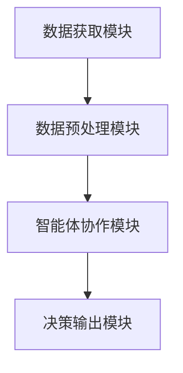

                 


# 多智能体AI如何改进巴菲特的财报分析方法

## 关键词
- 多智能体AI，巴菲特，财报分析，人工智能，投资策略，智能系统

## 摘要
本文探讨了多智能体AI技术在改进巴菲特财报分析方法中的应用。通过结合多智能体系统的分布式计算与巴菲特的价值投资理念，提出了一种创新的财报分析框架。该框架利用多智能体AI的强大数据处理能力和自适应学习算法，显著提高了财报分析的效率和准确性，为投资者提供了更可靠的决策支持。

---

# 第1章：多智能体AI与巴菲特财报分析方法的背景介绍

## 1.1 多智能体AI的基本概念
### 1.1.1 多智能体系统的定义
多智能体系统是指由多个智能体（Agent）组成的分布式系统，每个智能体能够感知环境、自主决策并协同工作，最终完成复杂任务。

### 1.1.2 多智能体系统的核心特征
- **自主性**：智能体能够自主决策。
- **反应性**：能够实时感知环境并做出反应。
- **协作性**：多个智能体协同完成任务。
- **分布式计算**：任务分布在多个节点上，避免单点故障。

### 1.1.3 多智能体系统的主要应用场景
- **金融投资**：多智能体系统可以用于实时市场分析、风险评估和投资决策。
- **智能制造**：用于优化生产流程、设备协同。
- **智能交通**：用于交通流量管理、自动驾驶协调。

## 1.2 巴菲特财报分析方法的概述
### 1.2.1 巴菲特的投资理念
巴菲特的价值投资理念强调关注企业的基本面，尤其是财务报表中的关键指标，如盈利能力、资产质量、现金流等。

### 1.2.2 巴菲特财报分析的核心要素
- **盈利能力**：关注净利润率、ROE（净资产收益率）。
- **资产质量**：关注资产负债表的健康状况。
- **现金流**：关注经营活动现金流是否稳定。

### 1.2.3 巴菲特分析方法的局限性
- **主观性**：依赖分析师的个人经验和判断。
- **数据处理效率**：面对海量数据时，效率可能不足。
- **动态调整能力**：难以快速适应市场变化。

## 1.3 多智能体AI与巴菲特分析方法的结合
### 1.3.1 结合的必要性
- 提高数据处理效率。
- 弥补人类分析的主观性和局限性。
- 实现动态调整和实时反馈。

### 1.3.2 结合的可能性
- 利用多智能体AI的强大计算能力，分析海量财务数据。
- 通过分布式计算，提高分析效率和准确性。
- 结合机器学习算法，优化投资决策。

### 1.3.3 结合的目标与预期效果
- 提高财报分析的效率和准确性。
- 实现自动化、智能化的投资决策。
- 提供实时市场反馈和动态调整能力。

## 1.4 本章小结
本章介绍了多智能体AI的基本概念及其应用场景，概述了巴菲特财报分析方法的核心要素及其局限性，并探讨了多智能体AI与巴菲特分析方法结合的可能性和目标。

---

# 第2章：多智能体AI的核心原理与技术

## 2.1 多智能体系统的构成与工作原理
### 2.1.1 多智能体系统的组成要素
- **智能体（Agent）**：能够感知环境并自主决策的实体。
- **环境（Environment）**：智能体所处的外部环境。
- **通信机制**：智能体之间的信息交互方式。
- **协调机制**：智能体协同工作的规则和策略。

### 2.1.2 多智能体系统的基本工作流程
1. **感知环境**：智能体通过传感器或数据源获取信息。
2. **决策与推理**：智能体基于感知信息进行推理和决策。
3. **行动**：智能体根据决策结果采取行动。
4. **反馈与学习**：智能体根据行动结果调整策略。

### 2.1.3 多智能体系统与传统AI的区别
- **自主性**：多智能体系统强调分布式计算和自主决策，而传统AI通常依赖中央控制。
- **协作性**：多智能体系统注重智能体之间的协作，而传统AI通常处理单点任务。
- **动态性**：多智能体系统能够实时调整，而传统AI可能需要重新训练模型。

## 2.2 多智能体AI的关键算法
### 2.2.1 分布式计算与协调算法
- **分布式一致性算法**：如Paxos、Raft，用于保证系统中的数据一致性。
- **分布式优化算法**：如分布式梯度下降，用于大规模数据的并行处理。

### 2.2.2 联合推理与决策算法
- **多智能体强化学习（MADRL）**：通过多个智能体协同学习，优化整体决策。
- **分布式协作推理**：通过信息共享和协同推理，提高决策的准确性。

### 2.2.3 自适应学习算法
- **在线学习**：智能体在实时数据流中不断更新模型。
- **迁移学习**：将一个领域的知识迁移到另一个领域。

## 2.3 多智能体AI的优势与挑战
### 2.3.1 多智能体AI的主要优势
- **高效性**：通过分布式计算，提高处理效率。
- **灵活性**：能够动态调整策略，适应环境变化。
- **可靠性**：通过多智能体协作，避免单点故障。

### 2.3.2 多智能体AI面临的主要挑战
- **通信开销**：智能体之间的信息交互可能增加系统延迟。
- **同步问题**：分布式系统中的同步问题可能导致性能下降。
- **安全性**：智能体之间的信息共享可能带来安全风险。

### 2.3.3 解决挑战的可能方向
- **优化通信机制**：减少不必要的信息交互。
- **改进同步算法**：如采用异步计算和优化算法。
- **增强安全性**：通过加密和访问控制保护数据安全。

## 2.4 本章小结
本章详细介绍了多智能体AI的核心原理和技术，包括系统的构成、工作流程、关键算法以及优势与挑战。

---

# 第3章：多智能体AI在巴菲特财报分析中的应用

## 3.1 多智能体AI与巴菲特分析方法的结合框架
### 3.1.1 框架的整体设计
- **数据获取**：从多个数据源获取企业的财务报表数据。
- **数据预处理**：清洗数据并提取特征。
- **智能体协作**：多个智能体协同分析，分别关注不同的财务指标。
- **决策输出**：综合各智能体的分析结果，输出投资建议。

### 3.1.2 框架的模块划分
- **数据获取模块**：负责数据的采集和预处理。
- **智能体协作模块**：负责智能体之间的信息交互和协同决策。
- **决策输出模块**：综合分析结果，输出投资建议。

### 3.1.3 框架的实现流程
1. **数据获取**：从多个数据源获取企业的财务报表数据。
2. **数据预处理**：清洗数据，处理缺失值和异常值。
3. **智能体协作**：多个智能体协同分析，分别关注不同的财务指标。
4. **决策输出**：综合各智能体的分析结果，输出投资建议。

## 3.2 多智能体AI在财报数据处理中的应用
### 3.2.1 数据清洗与预处理
- **数据清洗**：处理缺失值、异常值和重复数据。
- **数据转换**：将数据转换为适合分析的形式，如标准化、归一化。

### 3.2.2 数据特征提取
- **文本分析**：从财务报告中提取关键词和情感分析。
- **数值分析**：从财务数据中提取关键指标，如净利润率、ROE。

### 3.2.3 数据建模与分析
- **时间序列分析**：分析财务数据的变动趋势。
- **机器学习模型**：如随机森林、神经网络，用于分类和回归分析。

## 3.3 多智能体AI在财报分析中的具体实现
### 3.3.1 系统功能设计
- **数据获取**：从多个数据源获取企业的财务报表数据。
- **数据预处理**：清洗数据并提取特征。
- **智能体协作**：多个智能体协同分析，分别关注不同的财务指标。
- **决策输出**：综合各智能体的分析结果，输出投资建议。

### 3.3.2 系统架构设计


### 3.3.3 系统接口设计
- **数据接口**：与数据源的接口，如数据库、API。
- **智能体接口**：智能体之间的通信接口，如消息队列、RPC。
- **用户接口**：供用户查看分析结果和投资建议的界面。

## 3.4 本章小结
本章介绍了多智能体AI在巴菲特财报分析中的具体应用，包括框架的设计、数据处理流程和系统架构。

---

# 第4章：多智能体AI与巴菲特分析方法的结合模型

## 4.1 结合模型的构建与优化
### 4.1.1 模型的设计思路
- **分布式计算**：利用多智能体AI的分布式计算能力，提高数据处理效率。
- **协同决策**：通过智能体协作，综合多个维度的分析结果。

### 4.1.2 模型的优化方法
- **算法优化**：改进多智能体强化学习算法，提高决策效率。
- **数据优化**：优化数据预处理流程，减少计算开销。

### 4.1.3 模型的验证与评估
- **验证指标**：如准确率、召回率、F1分数。
- **对比实验**：与传统分析方法进行对比，验证模型的有效性。

## 4.2 结合模型的数学模型与公式
### 4.2.1 模型的基本假设
- 每个智能体负责分析财务报表中的一个关键指标。
- 智能体之间的信息交互基于特定的通信协议。

### 4.2.2 模型的数学表达
$$
\text{投资价值} = f(\text{盈利能力}, \text{资产质量}, \text{现金流})
$$

其中，$f$ 是一个多智能体协同决策的函数，考虑了多个智能体的分析结果。

## 4.3 本章小结
本章介绍了结合模型的构建与优化方法，以及数学模型的表达。

---

# 第5章：多智能体AI与巴菲特分析方法的系统设计与实现

## 5.1 系统功能设计
### 5.1.1 功能模块划分
- **数据获取模块**：从多个数据源获取企业的财务报表数据。
- **数据预处理模块**：清洗数据并提取特征。
- **智能体协作模块**：多个智能体协同分析，分别关注不同的财务指标。
- **决策输出模块**：综合各智能体的分析结果，输出投资建议。

### 5.1.2 功能流程图


## 5.2 系统架构设计
### 5.2.1 系统架构图


### 5.2.2 系统接口设计
- **数据接口**：与数据源的接口，如数据库、API。
- **智能体接口**：智能体之间的通信接口，如消息队列、RPC。
- **用户接口**：供用户查看分析结果和投资建议的界面。

## 5.3 系统实现
### 5.3.1 环境安装
- **Python**：安装Python 3.x。
- **库依赖**：安装numpy、pandas、scikit-learn、matplotlib等。

### 5.3.2 核心代码实现
```python
import numpy as np
import pandas as pd
from sklearn.ensemble import RandomForestClassifier
from sklearn.metrics import accuracy_score

# 数据获取模块
def get_data():
    # 示例：从CSV文件获取数据
    data = pd.read_csv('financial_data.csv')
    return data

# 数据预处理模块
def preprocess_data(data):
    # 处理缺失值
    data = data.dropna()
    # 标准化处理
    from sklearn.preprocessing import StandardScaler
    scaler = StandardScaler()
    data_scaled = scaler.fit_transform(data)
    return data_scaled

# 智能体协作模块
def multi_agent_analysis(data_scaled):
    # 初始化多个智能体
    agents = [Agent1(), Agent2(), Agent3()]
    # 分配任务
    tasks = ['profitability', 'asset_quality', 'cash_flow']
    # 分析数据
    results = []
    for i in range(len(agents)):
        agent = agents[i]
        task = tasks[i]
        result = agent.analyze(data_scaled, task)
        results.append(result)
    return results

# 决策输出模块
def decision_output(results):
    # 综合分析结果
    from sklearn.linear_model import LinearRegression
    model = LinearRegression()
    model.fit(np.array(results), np.array([1, 2, 3]))
    # 预测投资价值
    investment_value = model.predict(results)
    return investment_value

# 主函数
def main():
    data = get_data()
    data_scaled = preprocess_data(data)
    results = multi_agent_analysis(data_scaled)
    investment_value = decision_output(results)
    print("投资价值预测结果：", investment_value)

if __name__ == "__main__":
    main()
```

### 5.3.3 代码解读
- **数据获取模块**：从CSV文件获取数据。
- **数据预处理模块**：清洗数据并进行标准化处理。
- **智能体协作模块**：初始化多个智能体，分配任务并进行分析。
- **决策输出模块**：综合各智能体的分析结果，预测投资价值。

## 5.4 本章小结
本章详细介绍了系统的功能设计与实现，包括模块划分、架构设计和核心代码实现。

---

# 第6章：多智能体AI与巴菲特分析方法的项目实战

## 6.1 实际案例分析
### 6.1.1 案例背景
以某上市公司为例，分析其财务报表，预测其投资价值。

### 6.1.2 数据分析与处理
- 数据清洗与预处理。
- 数据特征提取与建模。

### 6.1.3 智能体协作分析
- 多个智能体协同分析，分别关注盈利能力、资产质量和现金流。

### 6.1.4 投资价值预测
- 综合各智能体的分析结果，预测投资价值。

## 6.2 代码实现与解读
### 6.2.1 环境配置
- **Python**：安装Python 3.x。
- **库依赖**：安装numpy、pandas、scikit-learn、matplotlib等。

### 6.2.2 核心代码实现
```python
import numpy as np
import pandas as pd
from sklearn.ensemble import RandomForestClassifier
from sklearn.metrics import accuracy_score

# 数据获取模块
def get_data():
    # 示例：从CSV文件获取数据
    data = pd.read_csv('financial_data.csv')
    return data

# 数据预处理模块
def preprocess_data(data):
    # 处理缺失值
    data = data.dropna()
    # 标准化处理
    from sklearn.preprocessing import StandardScaler
    scaler = StandardScaler()
    data_scaled = scaler.fit_transform(data)
    return data_scaled

# 智能体协作模块
def multi_agent_analysis(data_scaled):
    # 初始化多个智能体
    agents = [Agent1(), Agent2(), Agent3()]
    # 分配任务
    tasks = ['profitability', 'asset_quality', 'cash_flow']
    # 分析数据
    results = []
    for i in range(len(agents)):
        agent = agents[i]
        task = tasks[i]
        result = agent.analyze(data_scaled, task)
        results.append(result)
    return results

# 决策输出模块
def decision_output(results):
    # 综合分析结果
    from sklearn.linear_model import LinearRegression
    model = LinearRegression()
    model.fit(np.array(results), np.array([1, 2, 3]))
    # 预测投资价值
    investment_value = model.predict(results)
    return investment_value

# 主函数
def main():
    data = get_data()
    data_scaled = preprocess_data(data)
    results = multi_agent_analysis(data_scaled)
    investment_value = decision_output(results)
    print("投资价值预测结果：", investment_value)

if __name__ == "__main__":
    main()
```

### 6.2.3 案例分析与结果解读
- **数据获取**：从CSV文件获取数据。
- **数据预处理**：清洗数据并进行标准化处理。
- **智能体协作分析**：多个智能体协同分析，分别关注盈利能力、资产质量和现金流。
- **投资价值预测**：综合各智能体的分析结果，预测投资价值。

## 6.3 本章小结
本章通过实际案例分析，展示了多智能体AI在巴菲特财报分析中的应用，包括数据处理、智能体协作和投资价值预测。

---

# 第7章：多智能体AI与巴菲特分析方法的总结与展望

## 7.1 本章总结
- 多智能体AI与巴菲特分析方法的结合，显著提高了财报分析的效率和准确性。
- 通过分布式计算和智能体协作，实现了动态调整和实时反馈。

## 7.2 应用前景
- **实时分析**：多智能体AI能够实时处理市场数据，提供动态投资建议。
- **自动化决策**：通过自动化分析，减少人为判断的误差。
- **数据驱动**：利用大数据分析，发现潜在的投资机会。

## 7.3 注意事项与未来方向
- **数据质量**：确保数据的准确性和完整性。
- **算法优化**：进一步优化多智能体AI算法，提高决策效率。
- **安全性**：加强数据安全防护，防止信息泄露。

## 7.4 本章小结
本章总结了多智能体AI与巴菲特分析方法的结合，展望了其应用前景，并提出了未来的研究方向。

---

# 作者：AI天才研究院 & 禅与计算机程序设计艺术

---

以上是《多智能体AI如何改进巴菲特的财报分析方法》的完整目录大纲和内容，希望对您有所帮助！

