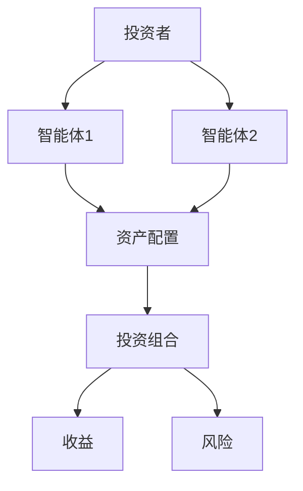
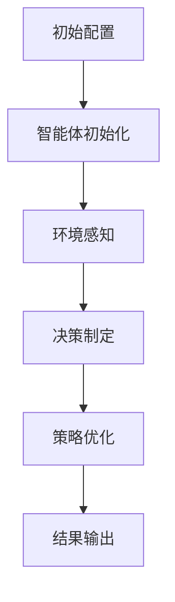
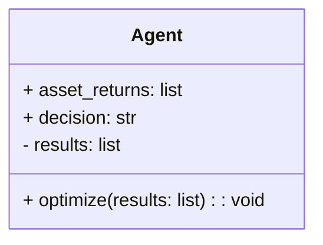
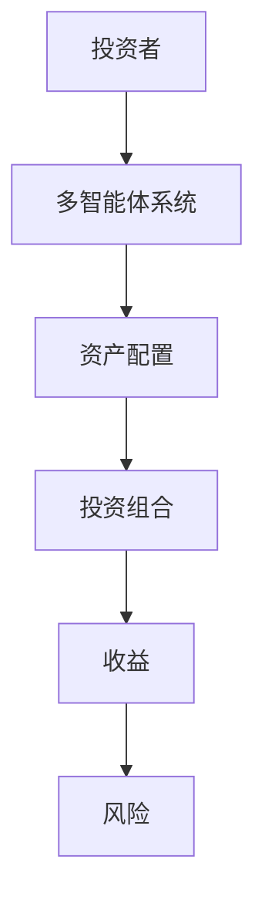
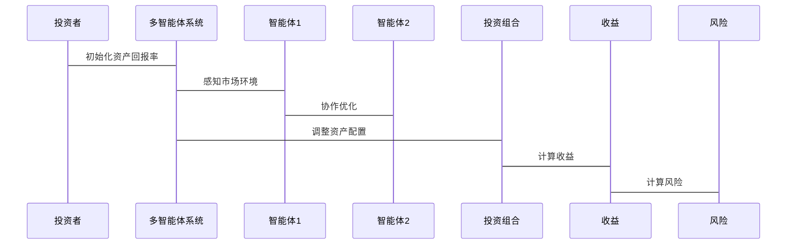

                 


# 多智能体优化价值投资的多资产类别动态配置

> 关键词：多智能体优化，价值投资，动态资产配置，金融投资，智能体系统

> 摘要：本文详细探讨了多智能体优化在价值投资中的应用，特别是如何通过多资产类别动态配置来优化投资组合。文章从背景介绍、核心概念、算法原理、系统架构、项目实战等多个方面展开分析，结合实际案例和代码实现，深入阐述了多智能体优化在金融投资中的潜力和实现方法。

---

## 第一部分: 多智能体优化与价值投资概述

### 第1章: 多智能体优化与动态资产配置背景

#### 1.1 多智能体优化的定义与特点

##### 1.1.1 多智能体系统的定义  
多智能体系统（Multi-Agent System, MAS）是由多个智能体组成的系统，每个智能体都是一个能够感知环境、做出决策并采取行动的实体。这些智能体可以是软件程序、算法或物理设备，它们通过协同工作完成复杂的任务。

##### 1.1.2 多智能体系统的优化目标  
在金融投资中，多智能体优化的目标是通过多个智能体的协同决策，实现投资组合的最优配置。这包括资产分配、风险控制和收益最大化。

##### 1.1.3 多智能体优化的核心特征  
- **分布式计算**：智能体之间通过分布式计算协同工作。  
- **自主性**：每个智能体具有自主决策能力。  
- **协作性**：智能体之间通过协作实现全局优化。  
- **动态性**：能够适应市场的动态变化。

#### 1.2 价值投资与动态资产配置

##### 1.2.1 价值投资的基本概念  
价值投资是一种投资策略，通过分析企业的基本面（如盈利能力、财务状况、行业地位等）来寻找被市场低估的投资标的。

##### 1.2.2 动态资产配置的意义  
动态资产配置是指根据市场环境的变化，实时调整资产在不同类别（如股票、债券、黄金等）之间的分配比例，以最大化收益并降低风险。

##### 1.2.3 价值投资与动态资产配置的结合  
价值投资注重长期收益，而动态资产配置强调短期调整。两者的结合可以在长期收益和短期风险控制之间找到平衡点。

#### 1.3 多智能体优化在金融投资中的应用

##### 1.3.1 多智能体优化在金融领域的优势  
- **高效性**：多智能体系统能够快速处理大量数据。  
- **协作性**：智能体之间可以分工合作，提高决策效率。  
- **适应性**：能够快速响应市场变化。

##### 1.3.2 多智能体优化在动态资产配置中的作用  
通过多智能体优化，可以实现资产配置的动态调整，根据市场波动和投资者风险偏好实时优化投资组合。

##### 1.3.3 多智能体优化与价值投资的结合  
多智能体系统可以用于筛选低估资产、监控市场变化，并实时调整投资策略，从而提升价值投资的效果。

---

### 第2章: 多智能体优化的核心概念与联系

#### 2.1 多智能体优化的核心原理

##### 2.1.1 多智能体优化的基本原理  
多智能体优化通过多个智能体的协同工作，利用分布式计算和自主决策实现全局优化。

##### 2.1.2 多智能体优化的关键算法  
- **强化学习**：通过奖励机制优化智能体的决策。  
- **遗传算法**：通过基因变异和选择优化解空间。  

##### 2.1.3 多智能体优化的数学模型  
数学模型包括目标函数、约束条件和优化变量的定义。例如，目标函数可以是收益最大化，约束条件可以是风险可控。

#### 2.2 多智能体优化与动态资产配置的关系

##### 2.2.1 多智能体优化在动态资产配置中的应用  
通过多智能体系统实时监控市场变化，动态调整资产配置比例。

##### 2.2.2 多智能体优化与价值投资的结合  
智能体可以用于筛选低估资产、分析企业基本面，并实时调整投资策略。

##### 2.2.3 多智能体优化在金融投资中的优势  
- **高效性**：快速响应市场变化。  
- **协作性**：多个智能体分工合作，提高决策效率。  
- **适应性**：能够适应市场的不确定性。

#### 2.3 多智能体优化的核心概念对比表格

| 概念                | 特性                          |
|---------------------|----------------------------|
| 多智能体优化         | 分布式、协作性、自主性        |
| 动态资产配置         | 实时调整、风险控制、收益最大化|
| 价值投资             | 长期收益、基本面分析、低估资产|

#### 2.4 多智能体优化的ER实体关系图



---

### 第3章: 多智能体优化算法原理

#### 3.1 多智能体优化算法的基本原理

##### 3.1.1 多智能体优化算法的定义  
多智能体优化算法是一种通过多个智能体协同工作来实现全局优化的算法。

##### 3.1.2 多智能体优化算法的核心步骤  
1. 初始化智能体。  
2. 智能体感知环境并做出决策。  
3. 智能体之间协作优化。  
4. 适应环境变化。  

##### 3.1.3 多智能体优化算法的数学模型  
目标函数：最大化收益，$f(x) = \sum w_i r_i$，其中$w_i$是权重，$r_i$是收益。  
约束条件：$\sum w_i = 1$，$w_i \geq 0$。

#### 3.2 基于强化学习的多智能体优化算法

##### 3.2.1 强化学习的基本原理  
强化学习通过智能体与环境的交互，学习最优策略，实现目标。

##### 3.2.2 多智能体强化学习的实现  
智能体之间通过共享策略网络，协作优化。

##### 3.2.3 多智能体强化学习的应用  
用于动态资产配置中的实时决策。

#### 3.3 基于遗传算法的多智能体优化算法

##### 3.3.1 遗传算法的基本原理  
通过模拟生物进化过程，优化解空间。

##### 3.3.2 多智能体遗传算法的实现  
智能体之间共享基因信息，优化资产配置。

##### 3.3.3 多智能体遗传算法的应用  
用于价值投资中的资产筛选。

#### 3.4 多智能体优化算法的流程图



---

## 第4章: 多智能体优化算法的实现

### 4.1 算法实现的核心代码

```python
import numpy as np

def multi_agent_optimization(asset_returns, num_agents):
    agents = [Agent() for _ in range(num_agents)]
    for agent in agents:
        agent.initialize(asset_returns)
    while True:
        for agent in agents:
            agent.make_decision()
        results = [agent.analyze_results() for agent in agents]
        optimize(results)
```

### 4.2 代码实现的详细解读

#### 4.2.1 系统功能设计
- **智能体初始化**：根据资产回报率初始化智能体。  
- **环境感知**：智能体感知市场环境并做出决策。  
- **策略优化**：智能体之间协作优化资产配置。  

#### 4.2.2 领域模型类图


---

## 第5章: 系统架构与实现

### 5.1 系统架构设计

#### 5.1.1 系统架构图


#### 5.1.2 系统交互序列图


---

## 第6章: 项目实战

### 6.1 环境安装

#### 6.1.1 系统环境
- Python 3.8+
- NumPy、Pandas、Matplotlib

### 6.2 系统核心实现

#### 6.2.1 核心代码实现
```python
import numpy as np

class Agent:
    def __init__(self, asset_returns):
        self.asset_returns = asset_returns
        self.results = []
    
    def make_decision(self):
        # 示例决策逻辑
        self.results.append(np.max(self.asset_returns))
    
    def analyze_results(self):
        return self.results
```

#### 6.2.2 代码实现解读
- **智能体初始化**：根据资产回报率初始化智能体。  
- **决策逻辑**：根据市场回报率做出投资决策。  
- **结果分析**：分析智能体的决策结果并优化。

---

## 第7章: 总结与展望

### 7.1 总结

多智能体优化在价值投资中的应用，特别是多资产类别动态配置，能够显著提升投资收益并降低风险。通过多智能体系统的协同工作，投资者可以实时调整资产配置，抓住市场机会。

### 7.2 注意事项

- **市场风险**：智能体系统需要能够适应市场波动。  
- **数据质量**：数据来源和质量直接影响决策结果。  
- **算法优化**：需要不断优化算法以适应市场变化。  

### 7.3 拓展阅读

- 《Multi-Agent Systems》  
- 《Dynamic Asset Allocation》  
- 《Value Investing Strategies》  

---

## 作者

作者：AI天才研究院/AI Genius Institute & 禅与计算机程序设计艺术 /Zen And The Art of Computer Programming

