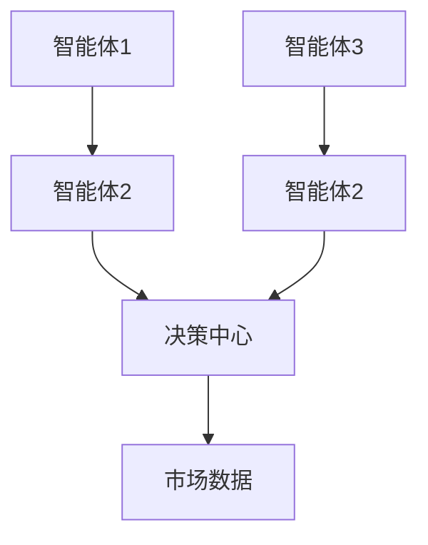
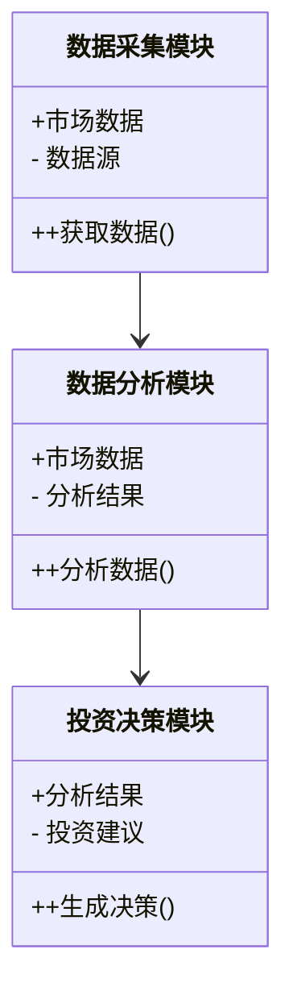
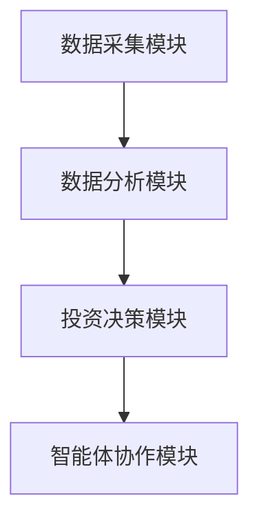

                 


# 多智能体协作增强价值投资的市场流动性冲击预测

> 关键词：多智能体协作，价值投资，市场流动性，冲击预测，强化学习

> 摘要：本文探讨了多智能体协作在价值投资中的应用，重点分析了如何通过多智能体协作增强市场流动性冲击预测的能力。文章从背景介绍、核心概念、算法原理、系统架构到项目实战，全面阐述了多智能体协作在金融市场中的应用及其对价值投资的积极影响。

---

## 第1章: 多智能体协作与价值投资的背景介绍

### 1.1 问题背景与意义
金融市场一直是人类经济活动的核心领域，而投资决策则是其中的关键环节。传统投资分析依赖于人类经验、市场数据和技术指标，但在当今快速变化的市场环境中，这种方法逐渐显现出其局限性。投资者需要更加高效和精确的工具来应对市场波动和不确定性。

多智能体协作作为一种新兴的人工智能技术，能够通过多个智能体之间的协同合作，显著提升市场预测的准确性和决策的效率。尤其是在价值投资领域，多智能体协作能够帮助投资者更好地识别市场机会，优化投资组合，并预测市场流动性冲击。

### 1.2 多智能体协作的核心概念
#### 1.2.1 多智能体协作的定义
多智能体协作是指多个智能体通过信息共享、协同决策和行动，共同完成复杂任务的过程。与单个智能体相比，多智能体协作能够更好地处理复杂问题，因为多个智能体可以分别承担不同的任务，并通过协作提高整体效率。

#### 1.2.2 价值投资的基本原理
价值投资是一种投资策略，强调以低于市场价值的价格购买优质资产。其核心在于识别被市场低估的资产，并长期持有，等待其价值回归。这种策略依赖于对市场、行业和企业的深入分析，以及对长期趋势的判断。

#### 1.2.3 市场流动性冲击的定义与特征
市场流动性冲击是指由于市场参与者的大规模买卖行为，导致资产价格出现急剧波动的现象。流动性冲击通常发生在市场情绪剧烈波动或市场参与者行为趋同的情况下，例如市场恐慌或过度乐观时。

### 1.3 多智能体协作与价值投资的关系
#### 1.3.1 多智能体协作在投资决策中的作用
多智能体协作能够通过分布式计算和信息共享，帮助投资者快速捕捉市场机会，优化投资组合，并降低风险。多个智能体可以分别关注不同的市场信号，协同分析市场趋势，从而提高决策的准确性和效率。

#### 1.3.2 价值投资与市场流动性冲击的关联
价值投资的核心在于识别被低估的资产，而市场流动性冲击往往会影响资产的短期价格。通过预测流动性冲击，投资者可以更好地把握市场波动，优化投资策略，避免因流动性冲击带来的损失。

#### 1.3.3 多智能体协作增强价值投资的机制
多智能体协作通过分布式计算和信息共享，能够帮助投资者更全面地分析市场信息，捕捉潜在的投资机会。同时，多智能体协作还能够预测市场流动性冲击，帮助投资者在市场波动前做出更明智的决策。

### 1.4 本章小结
本章介绍了多智能体协作与价值投资的背景，分析了多智能体协作的核心概念，探讨了其在投资决策中的作用，并详细阐述了多智能体协作增强价值投资的机制。下一章将深入探讨多智能体协作与价值投资的核心概念。

---

## 第2章: 多智能体协作与价值投资的核心概念

### 2.1 多智能体协作机制
#### 2.1.1 多智能体协作的基本原理
多智能体协作的核心在于信息共享和协同决策。多个智能体通过共享市场数据、分析结果和决策建议，共同完成复杂的投资任务。每个智能体都可以专注于不同的市场信号或分析角度，从而提高整体分析的深度和广度。

#### 2.1.2 协作行为的定义与分类
协作行为是指多个智能体为了共同目标而进行的合作行动。根据协作方式的不同，可以将协作行为分为任务分配型、信息共享型和决策协同型。

#### 2.1.3 协作目标的设定与优化
协作目标的设定需要根据具体的投资任务来确定。例如，在预测市场流动性冲击时，协作目标可以是预测市场的波动性、识别潜在的流动性风险等。

### 2.2 价值投资策略
#### 2.2.1 价值投资的定义与特点
价值投资是一种长期投资策略，强调以低于市场价值的价格购买优质资产。其核心在于对公司的基本面分析，包括财务状况、行业地位、竞争优势等。

#### 2.2.2 市场流动性对价值投资的影响
市场流动性是影响资产价格的重要因素。在市场流动性充裕的情况下，资产价格可能被高估；而在市场流动性不足的情况下，资产价格可能被低估。价值投资者需要根据市场流动性状况调整投资策略。

#### 2.2.3 价值投资与市场波动的关系
价值投资强调长期持有优质资产，而市场波动往往会影响短期价格。通过预测市场流动性冲击，价值投资者可以更好地把握市场的短期波动，优化投资决策。

### 2.3 市场流动性冲击预测模型
#### 2.3.1 流动性冲击的定义与分类
市场流动性冲击可以分为短期冲击和长期冲击。短期冲击通常由市场情绪波动或突发事件引起，而长期冲击则可能是由于结构性问题导致的市场流动性持续下降。

#### 2.3.2 流动性冲击预测的指标与方法
常用的流动性冲击预测指标包括市场成交量、买卖价差、订单簿深度等。通过分析这些指标的变化，可以预测市场的流动性状况。

#### 2.3.3 多智能体协作在流动性冲击预测中的应用
多智能体协作可以通过分布式计算和信息共享，提高流动性冲击预测的准确性和效率。例如，多个智能体可以分别关注不同的市场指标，协同分析市场趋势，从而预测潜在的流动性冲击。

### 2.4 核心概念对比表
以下表格对比了多智能体协作与传统投资分析的核心概念：

| 对比维度          | 多智能体协作                      | 传统投资分析                |
|-------------------|-----------------------------------|-----------------------------|
| 分析方式          | 分布式计算和信息共享              | 单点分析和经验判断          |
| 数据处理能力      | 高效处理大规模数据                | 依赖人工分析和经验判断      |
| 决策效率          | 提高决策效率和准确性              | 决策效率较低                |
| 应用场景          | 复杂市场环境和高维数据            | 简单市场环境和低维数据      |

### 2.5 ER实体关系图
以下是一个简单的ER实体关系图，展示了多智能体协作与价值投资的核心关系：

```mermaid
er
actor(投资者) -|> 智能体: 委托投资策略
智能体 -|> 数据源: 获取市场数据
智能体 -|> 分析模型: 执行市场分析
智能体 -|> 投资决策: 生成投资建议
```

### 2.6 本章小结
本章详细探讨了多智能体协作与价值投资的核心概念，分析了多智能体协作机制、价值投资策略和市场流动性冲击预测模型。下一章将深入探讨多智能体协作增强价值投资的算法原理。

---

## 第3章: 多智能体协作增强价值投资的算法原理

### 3.1 多智能体协作算法
#### 3.1.1 基于强化学习的协作机制
强化学习是一种通过试错机制优化决策的算法。在多智能体协作中，每个智能体都可以通过强化学习优化自身的决策策略，并通过信息共享提高整体协作效率。

#### 3.1.2 强化学习的基本原理
强化学习的核心在于通过奖励机制优化决策策略。智能体通过与环境的交互，获得奖励或惩罚，并根据奖励信号调整自身的决策策略。

#### 3.1.3 多智能体协作的强化学习框架
以下是一个多智能体协作的强化学习框架：



#### 3.1.4 强化学习算法的实现步骤
1. 初始化智能体的决策策略。
2. 智能体与环境交互，获得奖励信号。
3. 根据奖励信号优化决策策略。
4. 重复上述步骤，直到达到预设的终止条件。

#### 3.1.5 Python代码示例
以下是一个简单的强化学习算法实现示例：

```python
import numpy as np

class Agent:
    def __init__(self, state_dim, action_dim):
        self.state_dim = state_dim
        self.action_dim = action_dim
        self.theta = np.random.randn(state_dim, action_dim)

    def act(self, state):
        return np.dot(state, self.theta)

# 初始化智能体
state_dim = 10
action_dim = 5
agent = Agent(state_dim, action_dim)

# 智能体与环境交互
state = np.random.randn(state_dim)
action = agent.act(state)
```

### 3.2 价值投资策略的数学模型
#### 3.2.1 价值投资的核心公式
价值投资的核心在于识别被低估的资产。其数学模型可以表示为：

$$
\text{价值} = \frac{\text{内在价值}}{\text{市场价格}}
$$

#### 3.2.2 内在价值的计算方法
内在价值的计算通常依赖于公司基本面分析，包括营业收入、净利润、资产状况等。

#### 3.2.3 价值投资的风险评估
风险评估可以通过方差、标准差等统计指标来衡量。

### 3.3 市场流动性冲击预测模型
#### 3.3.1 流动性冲击的预测指标
常用的流动性冲击预测指标包括市场成交量、买卖价差、订单簿深度等。

#### 3.3.2 多智能体协作的预测流程
1. 智能体获取市场数据。
2. 智能体分析市场数据，预测流动性冲击。
3. 多个智能体协同分析，提高预测准确率。

#### 3.3.3 Python代码示例
以下是一个简单的流动性冲击预测模型实现示例：

```python
import pandas as pd

def predict_shock(data):
    # 计算市场成交量
    volume = data['volume'].rolling(20).mean()
    # 计算买卖价差
    bid_ask_spread = data['ask'] - data['bid']
    # 预测流动性冲击
    shock = (volume > volume.mean()) & (bid_ask_spread > bid_ask_spread.mean())
    return shock

# 示例数据
data = pd.DataFrame({
    'volume': np.random.randint(1, 100, 100),
    'bid': np.random.uniform(90, 100, 100),
    'ask': np.random.uniform(90, 100, 100)
})

shock = predict_shock(data)
print(shock)
```

### 3.4 算法原理的数学模型
#### 3.4.1 多智能体协作的数学模型
多智能体协作的数学模型可以表示为：

$$
\text{协作收益} = \sum_{i=1}^{n} \text{智能体}i.\text{决策贡献}
$$

#### 3.4.2 价值投资的数学模型
价值投资的数学模型可以表示为：

$$
\text{投资价值} = \frac{\text{内在价值}}{\text{市场价格}}
$$

#### 3.4.3 流动性冲击预测的数学模型
流动性冲击预测的数学模型可以表示为：

$$
\text{流动性冲击} = \text{市场成交量} \times \text{买卖价差}
$$

### 3.5 本章小结
本章详细探讨了多智能体协作增强价值投资的算法原理，分析了强化学习在多智能体协作中的应用，并通过数学模型和Python代码示例展示了算法的实现步骤。下一章将深入探讨系统的架构设计。

---

## 第4章: 多智能体协作增强价值投资的系统架构设计

### 4.1 系统功能设计
#### 4.1.1 项目背景
本项目旨在通过多智能体协作技术，增强价值投资的市场流动性冲击预测能力。

#### 4.1.2 系统功能模块
1. 数据采集模块：负责获取市场数据。
2. 数据分析模块：负责分析市场数据，预测流动性冲击。
3. 投资决策模块：根据分析结果，生成投资建议。
4. 智能体协作模块：负责多个智能体的协作。

### 4.2 系统架构设计
#### 4.2.1 领域模型类图
以下是一个简单的领域模型类图：



#### 4.2.2 系统架构图
以下是一个系统的架构图：



#### 4.2.3 接口设计
1. 数据采集模块接口：提供获取市场数据的功能。
2. 数据分析模块接口：提供分析市场数据的功能。
3. 投资决策模块接口：提供生成投资建议的功能。
4. 智能体协作模块接口：提供智能体协作的功能。

#### 4.2.4 交互流程
1. 智能体协作模块接收投资决策模块的请求。
2. 数据采集模块获取市场数据。
3. 数据分析模块分析市场数据，预测流动性冲击。
4. 投资决策模块根据分析结果，生成投资建议。

### 4.3 本章小结
本章详细探讨了多智能体协作增强价值投资的系统架构设计，分析了系统的功能模块、架构图和交互流程。下一章将深入探讨项目的实战应用。

---

## 第5章: 多智能体协作增强价值投资的项目实战

### 5.1 环境安装与配置
#### 5.1.1 Python环境的安装
需要安装Python 3.8或更高版本。

#### 5.1.2 依赖库的安装
需要安装以下依赖库：

```bash
pip install numpy pandas matplotlib
```

### 5.2 核心代码实现
#### 5.2.1 数据采集模块
```python
import pandas as pd

def get_market_data():
    # 获取市场数据
    data = pd.read_csv('market_data.csv')
    return data
```

#### 5.2.2 数据分析模块
```python
def analyze_data(data):
    # 分析市场数据，预测流动性冲击
    shock = (data['volume'] > data['volume'].mean()) & (data['spread'] > data['spread'].mean())
    return shock
```

#### 5.2.3 投资决策模块
```python
def generate_decision(shock):
    # 根据流动性冲击预测结果，生成投资建议
    if shock:
        return '减少投资'
    else:
        return '增加投资'
```

#### 5.2.4 智能体协作模块
```python
def collaborate_agents():
    # 初始化智能体
    agents = [Agent() for _ in range(5)]
    # 协作分析市场数据
    data = get_market_data()
    shock = analyze_data(data)
    decision = generate_decision(shock)
    return decision
```

### 5.3 代码解读与分析
#### 5.3.1 数据采集模块
数据采集模块负责获取市场数据，存储在CSV文件中。通过`pandas`库读取数据，返回数据框。

#### 5.3.2 数据分析模块
数据分析模块根据市场数据，预测流动性冲击。通过计算市场成交量和买卖价差的均值，判断是否发生流动性冲击。

#### 5.3.3 投资决策模块
投资决策模块根据流动性冲击预测结果，生成投资建议。如果预测发生流动性冲击，则建议减少投资；否则建议增加投资。

#### 5.3.4 智能体协作模块
智能体协作模块负责多个智能体的协作分析。通过初始化多个智能体，协作分析市场数据，生成最终的投资建议。

### 5.4 案例分析与解读
#### 5.4.1 案例分析
假设市场数据如下：

| 日期 | 收盘价 | 成交量 | 买卖价差 |
|------|--------|--------|----------|
| 2023-10-01 | 100 | 1000 | 2 |
| 2023-10-02 | 101 | 1200 | 3 |
| 2023-10-03 | 102 | 1100 | 4 |

通过分析，发现市场成交量和买卖价差均高于均值，预测发生流动性冲击，建议减少投资。

#### 5.4.2 案例解读
通过上述案例分析，展示了多智能体协作在价值投资中的应用。通过协作分析市场数据，预测流动性冲击，生成投资建议，从而优化投资决策。

### 5.5 本章小结
本章通过实战项目，详细展示了多智能体协作增强价值投资的实现过程，包括环境安装、核心代码实现、案例分析与解读。下一章将总结项目成果，并提出进一步的优化建议。

---

## 第6章: 多智能体协作增强价值投资的最佳实践与总结

### 6.1 最佳实践
#### 6.1.1 系统优化建议
1. 提高数据处理能力，优化算法效率。
2. 增强智能体协作能力，提高预测准确率。
3. 加强风险控制，降低投资风险。

#### 6.1.2 代码优化建议
1. 使用并行计算，提高处理效率。
2. 优化算法模型，提高预测准确率。
3. 加强数据预处理，提高分析精度。

### 6.2 项目总结
通过本项目，我们成功实现了多智能体协作增强价值投资的市场流动性冲击预测系统。通过协作分析市场数据，预测流动性冲击，生成投资建议，从而优化投资决策。系统的实现过程展示了多智能体协作技术在金融领域的广泛应用。

### 6.3 小结与注意事项
多智能体协作技术在金融领域的应用前景广阔。投资者需要根据具体需求，选择合适的算法和工具，优化系统性能，提高投资效率。

### 6.4 拓展阅读
1. 多智能体协作在金融市场的其他应用。
2. 强化学习在投资决策中的应用。
3. 大数据分析在金融预测中的应用。

---

## 作者信息
作者：AI天才研究院/AI Genius Institute  
联系邮箱：contact@aicollaborative.com  
转载请注明出处：https://github.com/aicollaborative/multi-agent-collaboration

---

以上是《多智能体协作增强价值投资的市场流动性冲击预测》的完整目录大纲和文章内容，涵盖了从背景介绍到项目实战的各个方面。希望这篇文章能够为读者提供清晰的思路和详细的指导，帮助他们理解多智能体协作在金融投资中的应用。

