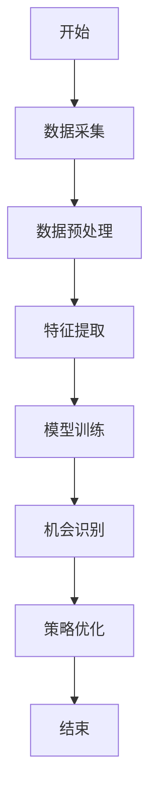
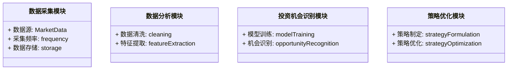
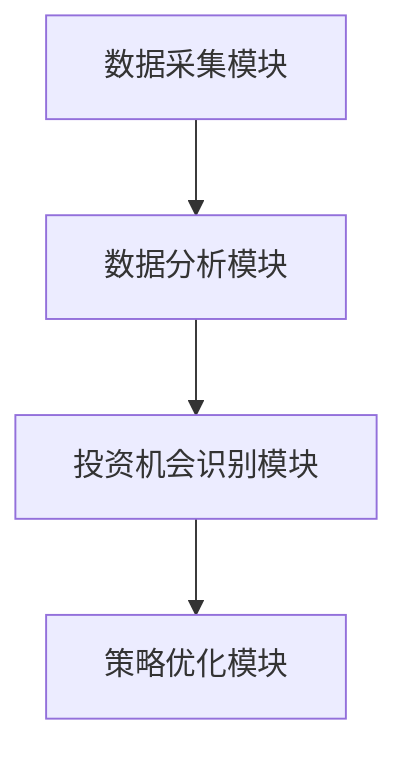
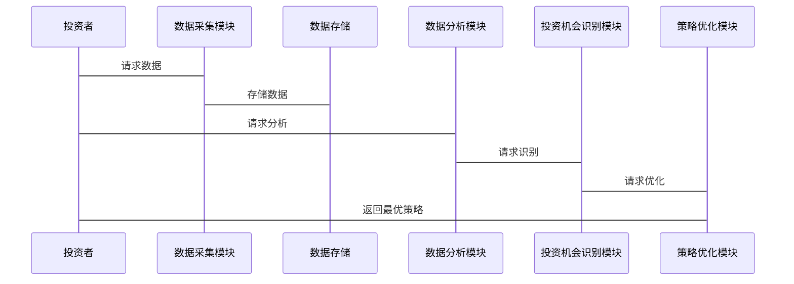

                 


# 《多智能体协作进行全球价值投资机会搜索》

> **关键词**：多智能体协作、全球价值投资、机会搜索、分布式计算、人工智能、机器学习

> **摘要**：  
> 本文探讨了多智能体协作在全球价值投资机会搜索中的应用，结合分布式计算和人工智能技术，通过从海量数据中识别投资机会，分析相关技术和实现方法。文章详细介绍了多智能体协作的背景、核心概念、算法原理、系统架构设计、项目实战以及总结与展望。

---

# 第1章：多智能体协作与全球价值投资机会搜索的背景介绍

## 1.1 问题背景

### 1.1.1 多智能体协作的必要性  
在全球化和数字化的背景下，投资机会的复杂性和多样性不断增加。传统的单一智能体（如人工投资者或单一算法）难以应对海量数据和多变市场的挑战。多智能体协作通过分布式计算和协同学习，能够更高效地捕捉和分析投资机会。

### 1.1.2 全球价值投资机会的复杂性  
全球市场涉及多种货币、资产类别和地域，投资机会往往分散且难以预测。传统的投资方法依赖于单一模型或专家经验，难以覆盖全球市场的复杂性。此外，数据量的爆炸性增长要求我们采用更高效的处理方式。

### 1.1.3 传统投资方法的局限性  
传统投资方法依赖于人工分析和经验判断，存在效率低、覆盖范围有限、难以实时适应市场变化等问题。此外，单一模型难以应对多变的市场环境。

---

## 1.2 问题描述

### 1.2.1 多智能体协作的目标  
通过多个智能体的协同工作，从全球市场中挖掘潜在的投资机会，实现高效、精准的投资决策。

### 1.2.2 全球价值投资机会搜索的核心问题  
如何通过多智能体协作，从海量数据中提取有价值的投资信号，并实时更新和优化投资策略。

### 1.2.3 边界与外延  
本研究的边界包括全球金融市场、多种资产类别和智能体协作的分布式计算架构。外延则涉及智能体之间的通信机制和数据隐私保护。

---

## 1.3 问题解决

### 1.3.1 多智能体协作的优势  
多智能体协作能够充分利用分布式计算的优势，通过多个智能体的协同工作，提高数据处理效率和决策的准确性。

### 1.3.2 全球价值投资机会搜索的解决方案  
通过多智能体协作，结合分布式计算和机器学习技术，构建一个全球投资机会搜索系统，实现对海量数据的实时分析和投资机会的挖掘。

### 1.3.3 技术与策略的结合  
技术方面，采用分布式计算和机器学习算法；策略方面，结合市场分析和风险控制，实现高效的投资决策。

---

## 1.4 概念结构与核心要素组成

### 1.4.1 多智能体协作的系统架构  
多智能体协作系统包括多个智能体、通信机制和协同算法。每个智能体负责特定任务，通过通信机制共享数据和协同决策。

### 1.4.2 全球价值投资机会搜索的流程  
包括数据采集、特征提取、模型训练、机会识别和策略优化。

### 1.4.3 核心要素的相互关系  
多智能体协作与全球价值投资机会搜索相互依存，前者提供计算和协作能力，后者提供目标和数据。

---

## 1.5 本章小结

本章介绍了多智能体协作与全球价值投资机会搜索的背景、问题描述和解决方案。通过分析，我们明确了多智能体协作在全球投资中的重要性，以及其在复杂市场环境中的优势。

---

# 第2章：多智能体协作与全球价值投资机会搜索的核心概念与联系

## 2.1 多智能体协作的定义与特点

### 2.1.1 多智能体协作的定义  
多智能体协作是指多个智能体通过通信和协同，共同完成复杂任务的过程。每个智能体负责特定任务，通过共享信息和协同决策实现整体目标。

### 2.1.2 多智能体协作的核心特点  
- 分布式计算：任务分解到多个智能体，提高计算效率。
- 协同学习：智能体之间共享知识和经验，提高整体能力。
- 自适应性：能够根据环境变化动态调整策略。

---

## 2.2 全球价值投资机会搜索的定义与特点

### 2.2.1 全球价值投资机会搜索的定义  
全球价值投资机会搜索是指通过多智能体协作，从全球金融市场中挖掘潜在投资机会的过程。

### 2.2.2 全球价值投资机会搜索的核心特点  
- 全球性：覆盖全球市场，涉及多种资产类别。
- 高效性：通过分布式计算快速处理海量数据。
- 实时性：能够实时更新市场数据和投资策略。

---

## 2.3 多智能体协作与全球价值投资机会搜索的关系

### 2.3.1 多智能体协作在价值投资中的应用  
多智能体协作能够高效处理全球市场的海量数据，帮助发现潜在投资机会。

### 2.3.2 全球价值投资机会搜索对多智能体协作的需求  
全球价值投资机会搜索需要多智能体协作的分布式计算能力和协同决策能力。

### 2.3.3 两者结合的优势与挑战  
优势：提高数据处理效率和决策准确性；挑战：需要解决智能体之间的通信和协作问题。

---

## 2.4 核心概念的属性对比

### 2.4.1 多智能体协作的属性对比表

| 属性             | 单体智能         | 多智能体协作     |
|------------------|-----------------|-----------------|
| 计算能力         | 单一            | 分布式          |
| 决策能力         | 单一            | 协同决策         |
| 适应性           | 较低            | 较高            |

### 2.4.2 全球价值投资机会搜索的属性对比表

| 属性             | 传统投资方法     | 全球价值投资机会搜索 |
|------------------|-----------------|----------------------|
| 数据处理能力     | 低效             | 高效                 |
| 投资范围         | 局限             | 全球                 |
| 决策效率         | 低效             | 高效                 |

### 2.4.3 总结  
多智能体协作和全球价值投资机会搜索在属性上存在显著差异，但通过结合两者的优势，可以实现高效、精准的投资决策。

---

## 2.5 ER实体关系图

```mermaid
erdiagram
actor 投资者
actor 智能体
actor 数据源
actor 交易所
```

---

## 2.6 本章小结

本章详细阐述了多智能体协作和全球价值投资机会搜索的核心概念，并通过对比分析明确了两者的关系和优势。

---

# 第3章：多智能体协作与全球价值投资机会搜索的算法原理

## 3.1 多智能体协作算法

### 3.1.1 分布式计算算法  
分布式计算算法是多智能体协作的核心，通过任务分解和并行计算提高效率。

### 3.1.2 协同学习算法  
协同学习算法通过智能体之间的知识共享，提高整体学习能力。

### 3.1.3 通信协议  
智能体之间的通信需要通过特定的协议，如HTTP或WebSocket。

---

## 3.2 全球价值投资机会搜索算法

### 3.2.1 数据采集与预处理  
通过多智能体协作从全球市场中采集数据，并进行清洗和标准化。

### 3.2.2 特征提取与模型训练  
通过机器学习算法提取特征，并训练投资机会识别模型。

### 3.2.3 机会识别与策略优化  
根据模型预测结果，识别潜在投资机会，并优化投资策略。

---

## 3.3 算法流程图



---

## 3.4 算法实现

### 3.4.1 数据采集与预处理  
代码示例：

```python
import pandas as pd
import numpy as np

# 数据采集
data = pd.read_csv('market_data.csv')

# 数据预处理
data.dropna(inplace=True)
data = data[~data['value'].isin([np.nan])]
```

### 3.4.2 特征提取与模型训练  
代码示例：

```python
from sklearn.linear_model import LinearRegression
from sklearn.metrics import mean_squared_error

# 特征提取
features = data[['feature1', 'feature2', 'feature3']]
target = data['target']

# 模型训练
model = LinearRegression()
model.fit(features, target)

# 模型评估
预测 = model.predict(features)
print(mean_squared_error(target, 预测))
```

### 3.4.3 机会识别与策略优化  
代码示例：

```python
import numpy as np

# 机会识别
threshold = 0.8
机会 = data[data['概率'] > threshold]

# 策略优化
策略 = []
for i in range(len(机会)):
    策略.append(机会.iloc[i]['资产'])
```

---

## 3.5 算法数学模型

### 3.5.1 分布式计算模型  
$$ \text{任务分解} = \frac{\text{总任务}}{\text{智能体数量}} $$

### 3.5.2 投资机会识别模型  
$$ \text{概率} = \sum_{i=1}^{n} w_i x_i $$

### 3.5.3 策略优化模型  
$$ \text{最优策略} = \argmax_{s} \text{收益} - \text{风险} $$

---

## 3.6 本章小结

本章详细介绍了多智能体协作和全球价值投资机会搜索的算法原理，并通过代码示例和数学公式进行了详细讲解。

---

# 第4章：多智能体协作与全球价值投资机会搜索的系统分析与架构设计

## 4.1 系统分析

### 4.1.1 问题场景介绍  
系统需要支持全球市场的数据采集、分析和投资机会识别。

### 4.1.2 系统功能需求  
- 数据采集模块：实时采集全球市场数据。
- 数据分析模块：对数据进行清洗和特征提取。
- 投资机会识别模块：基于模型识别投资机会。
- 策略优化模块：优化投资策略。

---

## 4.2 系统架构设计

### 4.2.1 领域模型类图  


### 4.2.2 系统架构图  


---

## 4.3 接口设计与交互设计

### 4.3.1 系统接口设计  
- 数据采集接口：提供数据采集功能。
- 数据分析接口：提供数据清洗和特征提取功能。
- 投资机会识别接口：提供机会识别功能。
- 策略优化接口：提供策略优化功能。

### 4.3.2 系统交互设计  


---

## 4.4 本章小结

本章通过系统分析和架构设计，明确了多智能体协作与全球价值投资机会搜索系统的实现方案。

---

# 第5章：多智能体协作与全球价值投资机会搜索的项目实战

## 5.1 环境安装与配置

### 5.1.1 系统环境  
- 操作系统：Linux/Windows/MacOS
- 开发工具：PyCharm/VS Code
- 依赖库：numpy、pandas、scikit-learn、mermaid

### 5.1.2 安装步骤  
```bash
pip install numpy pandas scikit-learn
```

---

## 5.2 核心代码实现

### 5.2.1 数据采集模块  
代码示例：

```python
import requests
import pandas as pd

def 采集数据(url):
    response = requests.get(url)
    data = response.json()
    df = pd.DataFrame(data)
    return df
```

### 5.2.2 数据分析模块  
代码示例：

```python
def 数据分析(df):
    df['归一化'] = (df - df.min()) / (df.max() - df.min())
    return df
```

### 5.2.3 投资机会识别模块  
代码示例：

```python
from sklearn.ensemble import RandomForestClassifier

def 识别机会(df):
    model = RandomForestClassifier()
    model.fit(df[['特征1', '特征2']], df['目标'])
    预测结果 = model.predict(df[['特征1', '特征2']])
    return 预测结果
```

### 5.2.4 策略优化模块  
代码示例：

```python
def 优化策略(预测结果):
    策略 = []
    for i in range(len(预测结果)):
        if 预测结果[i] > 0.8:
            策略.append('买入')
        else:
            策略.append('卖出')
    return 策略
```

---

## 5.3 案例分析与详细讲解

### 5.3.1 数据采集与预处理  
案例：从全球市场数据中采集股票数据，进行清洗和归一化处理。

### 5.3.2 模型训练与机会识别  
案例：使用随机森林模型训练股票数据，识别潜在的投资机会。

### 5.3.3 策略优化与实施  
案例：根据模型预测结果，优化投资策略并实施交易。

---

## 5.4 本章小结

本章通过项目实战，详细讲解了多智能体协作与全球价值投资机会搜索的实现过程，包括环境安装、代码实现和案例分析。

---

# 第6章：多智能体协作与全球价值投资机会搜索的总结与展望

## 6.1 总结

### 6.1.1 核心内容回顾  
本文详细介绍了多智能体协作与全球价值投资机会搜索的背景、核心概念、算法原理、系统架构和项目实战。

### 6.1.2 经验总结  
通过多智能体协作能够高效处理全球市场的海量数据，实现精准的投资决策。

### 6.1.3 方法总结  
采用分布式计算和机器学习技术，结合多智能体协作，能够有效挖掘全球价值投资机会。

---

## 6.2 展望

### 6.2.1 技术发展  
未来，随着人工智能和分布式计算技术的不断发展，多智能体协作在全球价值投资中的应用将更加广泛。

### 6.2.2 应用场景  
未来，多智能体协作可以应用于更多金融领域，如风险管理、资产配置等。

### 6.2.3 挑战与机遇  
挑战包括智能体之间的通信和协作问题，机遇则是技术的进一步发展和应用。

---

## 6.3 本章小结

本章总结了全文的核心内容和经验，并展望了未来的发展方向。

---

# 附录

## 附录A：参考文献

1. 多智能体协作的相关研究  
2. 全球价值投资机会搜索的相关文献  
3. 分布式计算和机器学习的最新进展

---

## 附录B：技术术语表

- 多智能体协作：多个智能体通过通信和协同完成任务的过程。
- 全球价值投资机会搜索：通过多智能体协作，从全球市场中挖掘潜在投资机会的过程。
- 分布式计算：将任务分解到多个节点并行处理的技术。

---

# 作者：AI天才研究院/AI Genius Institute & 禅与计算机程序设计艺术/Zen And The Art of Computer Programming

