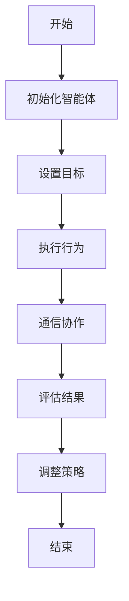
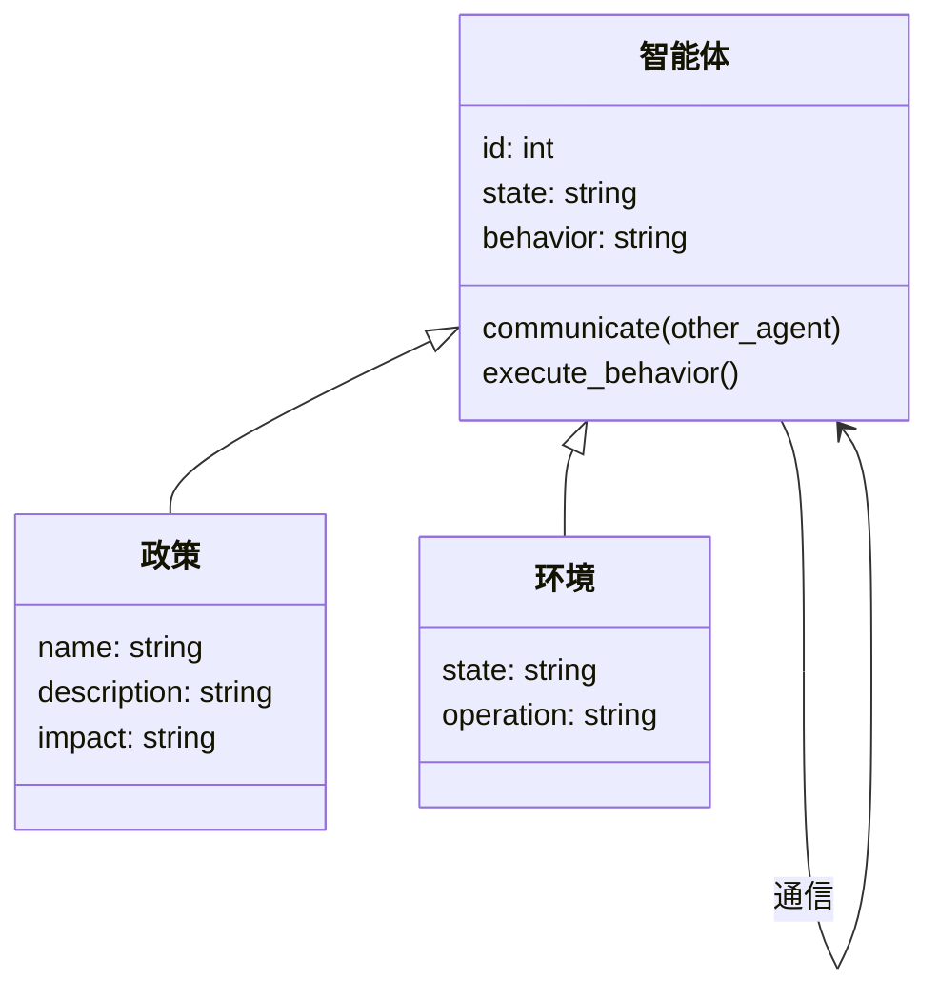

                 


# 多智能体协作进行政策影响分析

> **关键词**：多智能体协作，政策影响分析，分布式计算，博弈论，系统架构，Python实现  
>
> **摘要**：本文深入探讨了多智能体协作在政策影响分析中的应用，从理论基础到实际应用，详细分析了多智能体协作的核心概念、算法原理、系统架构设计以及项目实战。通过具体案例分析和代码实现，展示了多智能体协作在政策影响分析中的强大能力。文章最后总结了最佳实践和未来研究方向。

---

## 第1章 多智能体协作与政策影响分析概述

### 1.1 多智能体协作的背景与意义

#### 1.1.1 多智能体协作的定义与特点
多智能体协作（Multi-Agent Collaboration, MAC）是指多个智能体（Agent）通过分布式计算和通信协议，协同完成复杂任务的过程。与传统的单智能体系统相比，多智能体协作具有以下特点：
- **分布式计算**：多个智能体独立运行，通过通信协作完成任务。
- **自主性**：每个智能体都有一定的自主决策能力。
- **协调性**：通过通信协议和协作机制，确保各智能体协同工作。
- **动态性**：能够适应环境变化，实时调整协作策略。

#### 1.1.2 政策影响分析的重要性
政策影响分析（Policy Impact Analysis）是评估政策实施后对社会、经济、环境等多方面影响的过程。传统的政策分析方法依赖人工计算和专家经验，效率较低且难以应对复杂场景。多智能体协作通过分布式计算和博弈论模型，能够高效模拟政策实施后的多维影响，为政策制定者提供科学依据。

#### 1.1.3 多智能体协作在政策影响分析中的优势
- **高效性**：多智能体协作能够快速模拟复杂场景，提高政策分析效率。
- **准确性**：通过博弈论模型，能够更准确地预测政策实施后的多维影响。
- **灵活性**：适用于多种政策场景，能够快速调整协作策略。

### 1.2 政策影响分析的基本概念

#### 1.2.1 政策影响分析的定义
政策影响分析是指通过数学模型和模拟方法，评估政策实施后对社会、经济、环境等多方面的影响。其核心目标是为政策制定者提供科学依据，优化政策设计。

#### 1.2.2 政策影响分析的核心要素
政策影响分析的核心要素包括：
- **政策目标**：政策实施的主要目标。
- **影响指标**：用于评估政策影响的关键指标（如GDP、就业率、环境指标等）。
- **模拟模型**：用于模拟政策实施后的影响的数学模型。

#### 1.2.3 多智能体协作在政策影响分析中的作用
多智能体协作通过分布式计算和博弈论模型，能够高效模拟政策实施后的多维影响，为政策制定者提供科学依据。

### 1.3 多智能体协作的边界与外延

#### 1.3.1 多智能体协作的边界
多智能体协作的边界包括：
- **智能体数量**：协作的智能体数量。
- **协作范围**：协作任务的范围。
- **通信方式**：智能体之间的通信方式。

#### 1.3.2 政策影响分析的外延
政策影响分析的外延包括：
- **微观层面**：政策对个体或企业的具体影响。
- **宏观层面**：政策对整个社会或经济体系的影响。
- **动态变化**：政策实施后的动态变化。

#### 1.3.3 多智能体协作与政策影响分析的结合
多智能体协作与政策影响分析的结合，能够通过分布式计算和博弈论模型，高效模拟政策实施后的多维影响，为政策制定者提供科学依据。

---

## 第2章 多智能体协作的核心概念与联系

### 2.1 多智能体协作的核心原理

#### 2.1.1 分布式计算与协作机制
分布式计算是多智能体协作的核心原理之一。通过分布式计算，多个智能体能够独立运行，通过通信协议协作完成任务。

#### 2.1.2 多智能体协作的通信协议
多智能体协作的通信协议包括：
- **消息传递**：智能体之间通过消息传递信息。
- **共识机制**：通过共识机制达成一致。

#### 2.1.3 多智能体协作的决策模型
多智能体协作的决策模型包括：
- **博弈论模型**：通过博弈论模型模拟智能体之间的竞争与合作。
- **分布式决策模型**：通过分布式决策模型实现多智能体协作。

### 2.2 多智能体协作的属性特征对比

#### 2.2.1 多智能体协作的属性特征对比
以下是多智能体协作的属性特征对比表：

| **属性** | **单智能体** | **多智能体** |
|----------|--------------|--------------|
| **决策** | 单一决策中心 | 分布式决策    |
| **通信** | 无或有限 | 高频通信      |
| **协作** | 无或有限 | 强协作         |

### 2.3 多智能体协作的ER实体关系图

#### 2.3.1 实体关系图
以下是多智能体协作的ER实体关系图（使用mermaid绘制）：

```mermaid
erDiagram
    actor 智能体1 {
        string id
        string 状态
        string 行为
    }
    actor 智能体2 {
        string id
        string 状态
        string 行为
    }
    actor 环境 {
        string 状态
        string 操作
    }
    智能体1 -> 环境 : 受影响
    智能体2 -> 环境 : 受影响
    智能体1 <-> 智能体2 : 通信
```

---

## 第3章 多智能体协作的算法原理

### 3.1 多智能体协作的算法流程

#### 3.1.1 多智能体协作的算法流程
以下是多智能体协作的算法流程图（使用mermaid绘制）：



#### 3.1.2 多智能体协作的Python实现
以下是多智能体协作的Python实现代码示例：

```python
class Agent:
    def __init__(self, id):
        self.id = id
        self.state = "idle"
        self.behavior = None

    def set_behavior(self, behavior):
        self.behavior = behavior

    def execute_behavior(self):
        if self.behavior:
            print(f"Agent {self.id} executing {self.behavior}")
        else:
            print(f"Agent {self.id} has no behavior")

    def communicate(self, other_agent):
        print(f"Agent {self.id} communicates with Agent {other_agent.id}")

# 初始化多个智能体
agent1 = Agent(1)
agent2 = Agent(2)
agent1.set_behavior("action1")
agent2.set_behavior("action2")

# 执行行为
agent1.execute_behavior()
agent2.execute_behavior()

# 智能体之间通信
agent1.communicate(agent2)
```

#### 3.1.3 多智能体协作的数学模型
以下是多智能体协作的数学模型示例：

$$
\text{总收益} = \sum_{i=1}^{n} \text{智能体收益}_i
$$

其中，$n$ 是智能体数量，$\text{智能体收益}_i$ 是第 $i$ 个智能体的收益。

---

## 第4章 多智能体协作的系统分析与架构设计

### 4.1 问题场景介绍

#### 4.1.1 问题场景
假设我们需要分析一项新政策对某地区的经济影响，涉及多个智能体（如企业、政府机构、居民等）的协作。

### 4.2 系统功能设计

#### 4.2.1 系统功能设计（领域模型）
以下是系统功能设计的类图（使用mermaid绘制）：



### 4.3 系统架构设计

#### 4.3.1 系统架构设计
以下是系统架构设计的架构图（使用mermaid绘制）：


---

## 第5章 项目实战

### 5.1 环境安装

#### 5.1.1 环境安装说明
安装Python和必要的库（如numpy、matplotlib）。

### 5.2 系统核心实现

#### 5.2.1 核心代码实现
以下是核心代码实现示例：

```python
import numpy as np
import matplotlib.pyplot as plt

def simulate_policy_impact(policy, agents):
    results = []
    for agent in agents:
        impact = calculate_impact(policy, agent)
        results.append(impact)
    return results

def calculate_impact(policy, agent):
    # 示例计算
    return policy['coefficients'] * agent['attributes']

# 初始化政策和智能体
policy = {
    'name': '新政策',
    'coefficients': 0.5
}

agents = [
    {'id': 1, 'attributes': 2},
    {'id': 2, 'attributes': 3}
]

# 模拟政策影响
impacts = simulate_policy_impact(policy, agents)
print(impacts)

# 可视化结果
plt.plot(impacts)
plt.show()
```

---

## 第6章 总结与展望

### 6.1 最佳实践 Tips

#### 6.1.1 Tips
- **模块化设计**：将系统划分为多个模块，便于维护和扩展。
- **通信机制**：设计高效的通信机制，确保智能体之间高效协作。
- **动态调整**：根据环境变化动态调整协作策略。

### 6.2 小结

#### 6.2.1 小结
多智能体协作在政策影响分析中的应用前景广阔，通过分布式计算和博弈论模型，能够高效模拟复杂场景，为政策制定者提供科学依据。

### 6.3 注意事项

#### 6.3.1 注意事项
- **通信延迟**：注意智能体之间的通信延迟，避免影响协作效率。
- **数据隐私**：注意数据隐私问题，确保数据安全。
- **算法复杂度**：注意算法复杂度，确保系统运行效率。

### 6.4 拓展阅读

#### 6.4.1 拓展阅读推荐
- **推荐书籍**：《分布式系统：概念与设计》
- **推荐论文**：《Multi-Agent Collaboration in Policy Impact Analysis》

---

## 作者

**作者**：AI天才研究院/AI Genius Institute & 禅与计算机程序设计艺术 /Zen And The Art of Computer Programming

