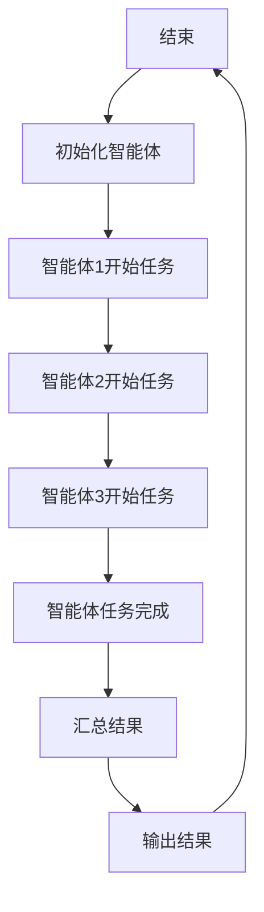
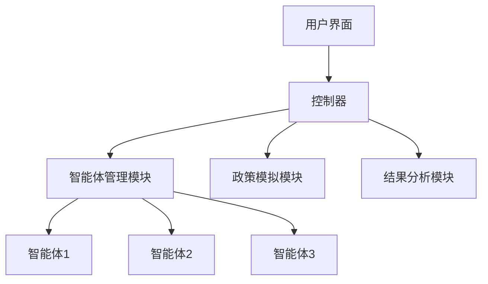

                 


# 多智能体协作进行政策影响分析

> 关键词：多智能体协作、政策影响分析、分布式计算、博弈论、系统架构设计、政策优化

> 摘要：本文深入探讨了多智能体协作在政策影响分析中的应用，从理论基础到算法实现，再到系统设计和项目实战，系统性地分析了多智能体协作如何助力政策影响分析的优化与创新。通过具体案例分析，本文展示了如何利用多智能体协作技术解决政策影响分析中的复杂问题，为相关领域的研究和实践提供了新的思路和方法。

---

# 第1章: 多智能体协作与政策影响分析背景

## 1.1 多智能体协作的定义与特点

### 1.1.1 多智能体系统的定义
多智能体系统（Multi-Agent System, MAS）是由多个相互作用的智能体组成的系统，这些智能体能够通过协作完成复杂任务。每个智能体都有自己的目标、知识和行为规则。

### 1.1.2 多智能体协作的核心特点
- **分布式性**：智能体分布在不同的空间或逻辑位置，独立决策。
- **协作性**：通过通信和协调完成共同目标。
- **自主性**：每个智能体能够自主决策，无需中央控制。
- **动态性**：系统环境和智能体状态动态变化。

### 1.1.3 多智能体协作与传统单智能体的区别
| 特性       | 单智能体           | 多智能体协作         |
|------------|--------------------|----------------------|
| 决策中心化 | 单一决策中心       | 分布式决策          |
| 资源分配   | 集中资源           | 分散资源            |
| 适应性     | 较低               | 较高                |
| 任务复杂度 | 较低               | 较高                |

---

## 1.2 政策影响分析的定义与方法

### 1.2.1 政策影响分析的定义
政策影响分析是指通过建模和模拟，评估不同政策方案对社会、经济、环境等方面的影响。其核心目标是为政策制定者提供科学依据。

### 1.2.2 政策影响分析的主要方法
- **定量分析**：基于数据和模型进行预测。
- **定性分析**：通过专家访谈和情景分析进行评估。
- **混合分析**：结合定量和定性方法。

### 1.2.3 政策影响分析的挑战与难点
- **复杂性**：涉及多领域、多利益相关者。
- **不确定性**：政策效果受多种因素影响。
- **动态性**：政策执行后的反馈机制复杂。

---

## 1.3 多智能体协作在政策影响分析中的应用前景

### 1.3.1 政策影响分析的复杂性与多智能体协作的契合点
- 多智能体协作能够模拟多个利益相关者的决策行为。
- 分布式计算能力能够处理大规模数据和复杂场景。

### 1.3.2 多智能体协作在政策模拟中的优势
- **分布式决策**：模拟不同主体的独立决策过程。
- **动态交互**：模拟政策执行过程中的实时反馈。
- **协作优化**：通过智能体协作找到最优政策方案。

### 1.3.3 多智能体协作在政策优化中的潜力
- **实时模拟**：快速评估不同政策的效果。
- **情景分析**：模拟多种政策方案的对比。
- **动态调整**：根据反馈实时优化政策。

---

## 1.4 本章小结
本章介绍了多智能体协作的基本概念和特点，分析了政策影响分析的定义、方法及挑战，并探讨了多智能体协作在政策影响分析中的应用前景和潜力。通过本章内容，读者可以理解多智能体协作与政策影响分析的契合点及其重要性。

---

# 第2章: 多智能体协作进行政策影响分析的核心概念

## 2.1 多智能体协作的理论基础

### 2.1.1 分布式计算与多智能体系统
分布式计算是多智能体系统的核心理论基础。通过分布式计算，多个智能体可以在不同的节点上协同完成任务。

### 2.1.2 博弈论与多智能体协作的关系
博弈论为多智能体协作提供了行为规则和决策模型。通过博弈论，可以分析智能体之间的策略互动。

### 2.1.3 多智能体协作的数学模型
多智能体协作可以通过状态、动作、奖励的三元组 $(s, a, r)$ 来建模。每个智能体根据当前状态 $s$ 选择动作 $a$，并获得奖励 $r$。

---

## 2.2 政策影响分析的数学模型

### 2.2.1 政策影响分析的基本模型
政策影响分析的基本模型可以表示为：
$$
f(s, a) = r
$$
其中，$s$ 是政策状态，$a$ 是政策动作，$r$ 是政策结果。

### 2.2.2 多智能体协作下的政策模拟模型
多智能体协作下的政策模拟模型可以表示为：
$$
P(s, a) = \sum_{i=1}^{n} w_i \cdot f_i(s, a)
$$
其中，$w_i$ 是第 $i$ 个智能体的权重，$f_i$ 是第 $i$ 个智能体的决策函数。

### 2.2.3 政策优化的数学表达
政策优化的目标是最优化政策结果 $r$，可以通过以下公式表示：
$$
\max_{a} \sum_{i=1}^{n} w_i \cdot f_i(s, a)
$$

---

## 2.3 多智能体协作与政策影响分析的结合

### 2.3.1 多智能体协作在政策模拟中的作用
- **模拟复杂系统**：通过多智能体协作模拟政策执行过程中的多方互动。
- **预测政策效果**：通过协作模型预测政策的潜在影响。

### 2.3.2 政策影响分析对多智能体协作的需求
- **实时反馈**：需要快速响应政策执行的效果。
- **动态调整**：需要根据反馈实时优化政策。

### 2.3.3 两者的结合方式与实现路径
- **模块化设计**：将政策影响分析分解为多个模块，每个模块由一个智能体负责。
- **协作机制设计**：设计智能体之间的通信和协作规则。

---

## 2.4 本章小结
本章从理论基础出发，详细阐述了多智能体协作与政策影响分析的结合方式，分析了两者结合的实现路径和作用。通过本章内容，读者可以理解多智能体协作在政策影响分析中的理论依据和实现方式。

---

# 第3章: 多智能体协作进行政策影响分析的核心算法

## 3.1 分布式计算算法

### 3.1.1 分布式计算的基本原理
分布式计算通过将任务分解到多个节点上并行执行，提高计算效率。其核心思想是“分而治之”。

### 3.1.2 多智能体协作的分布式算法
以下是多智能体协作的分布式算法流程图：



### 3.1.3 分布式计算在政策影响分析中的应用
以下是一个简单的分布式计算实现示例：

```python
import multiprocessing

def policy_simulation(agent_id, params):
    # 智能体的政策模拟逻辑
    result = agent_id * params
    return result

if __name__ == "__main__":
    params = [1, 2, 3, 4, 5]
    with multiprocessing.Pool(5) as p:
        results = p.map(policy_simulation, range(5), params)
    print(results)
```

---

## 3.2 博弈论算法

### 3.2.1 博弈论的基本概念
博弈论研究的是多个参与者之间的策略互动。核心概念包括：

- **策略**：参与者在特定情况下的选择。
- **收益**：参与者选择策略后的结果。
- **纳什均衡**：策略组合，使得没有任何一方有动机单方面改变策略。

### 3.2.2 多智能体协作下的博弈论模型
多智能体协作下的博弈论模型可以通过以下公式表示：
$$
\text{收益}(a_i) = \sum_{j=1}^{n} w_{ij} \cdot a_j
$$
其中，$w_{ij}$ 是智能体 $i$ 和智能体 $j$ 之间的权重，$a_j$ 是智能体 $j$ 的决策。

### 3.2.3 博弈论算法在政策优化中的应用
以下是基于博弈论的政策优化算法：

```python
def nash_equilibrium(strategies):
    # 计算纳什均衡
    for strategy in strategies:
        if is_best_response(strategy):
            return strategy
    return None

def is_best_response(strategy):
    # 判断策略是否为纳什均衡
    for other_strategy in strategies:
        if payoff(strategy) < payoff(other_strategy):
            return False
    return True
```

---

## 3.3 本章小结
本章详细介绍了多智能体协作进行政策影响分析的核心算法，包括分布式计算和博弈论算法。通过具体的代码示例和公式推导，读者可以理解这些算法的实现原理和应用场景。

---

# 第4章: 多智能体协作进行政策影响分析的系统设计

## 4.1 系统分析与架构设计

### 4.1.1 问题场景介绍
假设我们正在设计一个城市交通政策影响分析系统，需要模拟不同交通政策对城市交通流的影响。

### 4.1.2 系统功能设计
系统功能包括：

1. **智能体管理**：管理多个智能体，每个智能体代表一个交通参与者。
2. **政策模拟**：模拟不同交通政策的效果。
3. **结果分析**：分析模拟结果，生成优化建议。

### 4.1.3 系统架构设计
以下是系统架构设计图：



---

## 4.2 项目实战

### 4.2.1 环境安装
需要安装以下工具和库：

- Python 3.8+
- multiprocessing模块
- matplotlib库
- numpy库

### 4.2.2 核心代码实现

```python
import numpy as np
import matplotlib.pyplot as plt

def simulate_policy(policy, agents):
    # 模拟政策对多个智能体的影响
    results = []
    for agent in agents:
        result = evaluate_policy(policy, agent)
        results.append(result)
    return results

def evaluate_policy(policy, agent):
    # 评估政策对单个智能体的影响
    return policy * agent

def main():
    agents = [1, 2, 3, 4, 5]
    policies = [0.5, 1.0, 1.5, 2.0, 2.5]
    results = simulate_policy(policies, agents)
    plt.plot(policies, results)
    plt.xlabel('Policy')
    plt.ylabel('Result')
    plt.show()

if __name__ == "__main__":
    main()
```

---

## 4.3 本章小结
本章通过系统分析和项目实战，详细介绍了多智能体协作进行政策影响分析的系统架构设计和实现过程。通过具体的代码示例，读者可以理解如何将理论应用于实际项目中。

---

# 第5章: 多智能体协作进行政策影响分析的最佳实践

## 5.1 最佳实践 Tips

### 5.1.1 智能体设计
- 确保智能体的独立性和协作性。
- 设计合理的通信机制。

### 5.1.2 政策模拟
- 确保模拟模型的准确性和可扩展性。
- 定期验证模拟结果。

### 5.1.3 结果分析
- 使用可视化工具展示结果。
- 结合专家意见进行分析。

---

## 5.2 本章小结
本章总结了多智能体协作进行政策影响分析的最佳实践，包括智能体设计、政策模拟和结果分析等方面。通过这些实践，可以提高政策影响分析的效率和准确性。

---

# 作者信息

作者：AI天才研究院/AI Genius Institute & 禅与计算机程序设计艺术 /Zen And The Art of Computer Programming

---

以上是《多智能体协作进行政策影响分析》的技术博客文章的完整目录和内容框架。接下来，我将根据这一框架逐步完成文章的撰写。

