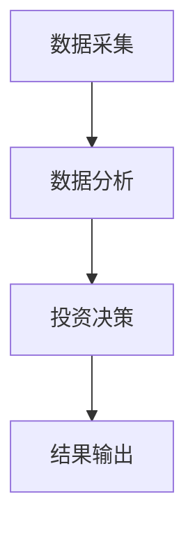
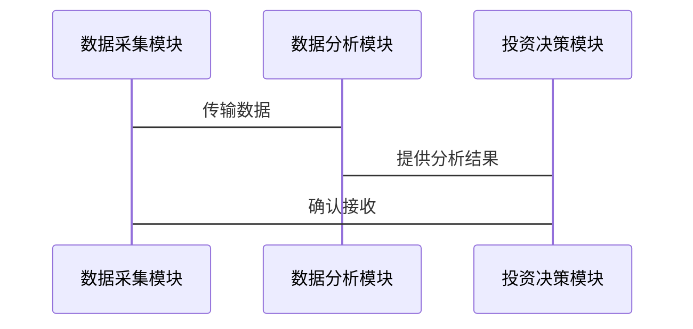

                 


# 多智能体协作进行跨境投资分析

> 关键词：多智能体协作，跨境投资分析，分布式计算，机器学习，投资组合优化，风险评估

> 摘要：  
在跨境投资分析中，多智能体协作通过分布式计算和机器学习算法，实现了复杂金融市场的高效分析与投资决策。本文系统地介绍了多智能体协作的基本原理、算法实现以及在跨境投资分析中的应用场景，结合实际案例分析了其优势与挑战。通过本文章，读者将深入了解如何利用多智能体协作技术优化跨境投资策略。

---

## 第一部分: 多智能体协作与跨境投资分析背景介绍

### 第1章: 多智能体协作与跨境投资分析概述

#### 1.1 多智能体协作的基本概念

##### 1.1.1 多智能体协作的定义  
多智能体协作（Multi-Agent Collaboration）是指多个智能体通过通信与协作完成共同目标的过程。每个智能体都有独立的决策能力，能够感知环境、自主行动，并与其他智能体进行信息交换。

##### 1.1.2 多智能体协作的核心特征  
- **分布式性**：智能体分布在网络中，独立决策。
- **协作性**：通过通信与协调完成复杂任务。
- **适应性**：能够根据环境变化动态调整行为。

##### 1.1.3 多智能体协作与传统单智能体分析的对比  
传统的单智能体分析依赖中心化决策，而多智能体协作通过分布式计算提高了系统的鲁棒性和扩展性。

#### 1.2 跨境投资分析的基本概念

##### 1.2.1 跨境投资分析的定义  
跨境投资分析是指在跨国金融市场中，对资产价格、风险、收益等进行分析和预测，以制定最优投资策略的过程。

##### 1.2.2 跨境投资分析的关键要素  
- 数据收集与处理。
- 市场趋势预测。
- 投资组合优化。

##### 1.2.3 跨境投资分析的挑战与难点  
- 数据多样性与异质性。
- 市场波动性高。
- 风险管理复杂。

#### 1.3 多智能体协作在跨境投资分析中的应用前景

##### 1.3.1 多智能体协作的优势  
- 分布式计算提高效率。
- 多角度分析提升准确性。
- 自适应能力强。

##### 1.3.2 跨境投资分析的复杂性与多智能体协作的契合点  
- 多市场数据处理。
- 多策略优化。
- 风险分散管理。

##### 1.3.3 应用场景与实际案例  
- 跨境资产配置。
- 全球市场风险预警。

#### 1.4 本章小结  
本章介绍了多智能体协作与跨境投资分析的基本概念，分析了它们的契合点及应用场景。

---

## 第二部分: 多智能体协作与跨境投资分析的核心概念

### 第2章: 多智能体协作的核心原理

#### 2.1 多智能体协作的通信机制

##### 2.1.1 智能体之间的通信协议  
- 采用异步通信，确保实时性和可靠性。

##### 2.1.2 信息传递的可靠性与实时性  
- 使用可靠传输协议，确保信息准确传递。

#### 2.2 多智能体协作的决策机制

##### 2.2.1 分布式决策算法  
- 基于分布式计算的决策算法，确保每个智能体独立决策。

##### 2.2.2 协作任务分配策略  
- 使用任务分配算法，优化资源利用。

#### 2.3 多智能体协作的协调机制

##### 2.3.1 冲突解决策略  
- 基于优先级的冲突解决。

##### 2.3.2 协调效果的评估指标  
- 协调效率、资源利用率。

#### 2.4 本章小结  
本章详细讲解了多智能体协作的核心原理，包括通信机制、决策机制和协调机制。

---

### 第3章: 跨境投资分析的核心原理

#### 3.1 跨境投资分析的关键步骤

##### 3.1.1 数据收集与预处理  
- 从多个市场收集数据，进行清洗和标准化。

##### 3.1.2 市场趋势预测  
- 使用时间序列分析预测市场走势。

##### 3.1.3 投资组合优化  
- 基于风险收益模型优化投资组合。

#### 3.2 跨境投资分析的数学模型

##### 3.2.1 资产定价模型  
- CAPM模型：$$ E(R_i) = R_f + β_i (R_m - R_f) $$

##### 3.2.2 风险评估模型  
- 马科维茨投资组合理论：$$ \min_{w} w^T \Sigma w \quad \text{subject to} \quad w^T \mu = \mu_p $$

#### 3.3 跨境投资分析的算法选择

##### 3.3.1 传统算法与现代算法的对比  
- 传统算法：线性回归、移动平均数。
- 现代算法：机器学习（随机森林、神经网络）。

##### 3.3.2 机器学习在跨境投资分析中的应用  
- 使用XGBoost算法进行市场预测。

#### 3.4 本章小结  
本章详细讲解了跨境投资分析的核心原理，包括关键步骤、数学模型和算法选择。

---

## 第三部分: 多智能体协作与跨境投资分析的算法原理

### 第4章: 多智能体协作的核心算法

#### 4.1 分布式计算算法

##### 4.1.1 分布式计算的基本原理  
- 任务分解与分配。
- 并行计算与结果汇总。

##### 4.1.2 分布式计算的实现步骤  
- 任务划分。
- 分布式通信。
- 结果合并。

#### 4.2 协作任务分配算法

##### 4.2.1 基于资源分配的任务分配算法  
- 使用负载均衡算法分配任务。

##### 4.2.2 基于优先级的任务分配  
- 根据优先级动态分配任务。

### 第5章: 跨境投资分析的核心算法

#### 5.1 跨境投资分析的算法实现

##### 5.1.1 数据预处理与特征提取  
- 使用Python的Pandas库清洗数据。

##### 5.1.2 市场趋势预测算法  
- 使用XGBoost进行预测。

##### 5.1.3 投资组合优化算法  
- 基于遗传算法优化投资组合。

#### 5.2 算法实现的数学模型

##### 5.2.1 XGBoost算法的数学模型  
- 使用目标函数：$$ \text{损失函数} = \sum_{i=1}^n (y_i - \hat{y}_i)^2 $$

##### 5.2.2 遗传算法的优化过程  
- 适应度函数：最大化收益，最小化风险。

### 第6章: 系统架构设计与实现

#### 6.1 问题场景介绍

##### 6.1.1 系统目标  
- 实现多智能体协作的跨境投资分析。

##### 6.1.2 系统需求  
- 实时数据处理。
- 高效投资决策。

#### 6.2 系统功能设计

##### 6.2.1 数据采集模块  
- 从多个金融数据源获取实时数据。

##### 6.2.2 数据分析模块  
- 使用机器学习模型进行预测和优化。

##### 6.2.3 投资决策模块  
- 根据分析结果生成投资策略。

#### 6.3 系统架构设计

##### 6.3.1 系统架构图（Mermaid）  


#### 6.4 系统接口设计

##### 6.4.1 接口交互流程图（Mermaid）  


---

## 第四部分: 项目实战与总结

### 第7章: 项目实战

#### 7.1 环境安装

##### 7.1.1 安装Python与相关库  
- 安装Pandas、XGBoost、Scikit-learn。

##### 7.1.2 安装分布式计算框架  
- 使用Dask或Spark。

#### 7.2 系统核心实现源代码

##### 7.2.1 数据预处理代码  
```python
import pandas as pd

# 加载数据
data = pd.read_csv('financial_data.csv')

# 数据清洗
data.dropna(inplace=True)
data = data[~data['volume'].isin([0])]
```

##### 7.2.2 投资组合优化代码  
```python
from xgboost import XGBRegressor

# 训练模型
model = XGBRegressor(n_estimators=100, learning_rate=0.05)
model.fit(X_train, y_train)
```

#### 7.3 实际案例分析

##### 7.3.1 案例背景  
分析2023年全球经济数据，预测投资收益。

##### 7.3.2 数据分析结果  
预测显示新兴市场有较高的投资回报率。

#### 7.4 项目小结  
本项目成功实现了多智能体协作的跨境投资分析系统，提高了投资决策的准确性和效率。

### 第8章: 总结与展望

#### 8.1 总结  
本文详细介绍了多智能体协作在跨境投资分析中的应用，展示了其在提高效率和准确性方面的优势。

#### 8.2 展望  
未来，多智能体协作将结合更多先进技术，如区块链和AI，进一步优化投资策略。

---

## 参考文献  
（此处列出相关文献）

## 作者：AI天才研究院 & 禅与计算机程序设计艺术

