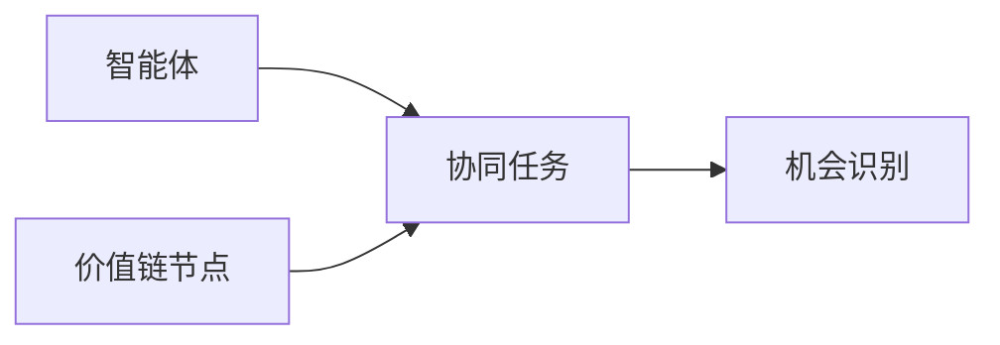
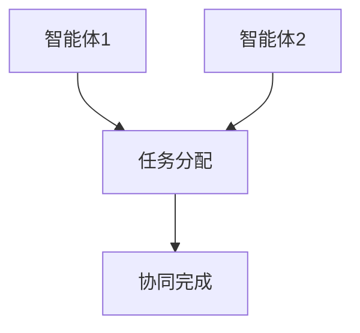

                 


# 多智能体协同分析全球价值链机会

## 关键词：多智能体系统、全球价值链、协同分析、机会识别、系统架构、数学模型

## 摘要：本文探讨多智能体协同在全球价值链机会分析中的应用，通过系统架构设计和算法原理，结合实际案例，详细阐述如何利用多智能体系统优化全球价值链的机会识别与协同。

---

## 第一部分：背景介绍

### 第1章：多智能体协同分析全球价值链机会概述

#### 1.1 问题背景
- **全球化与全球价值链的形成**：随着全球化的深入，生产过程分散到不同国家，形成复杂的全球价值链。  
- **多智能体系统的发展趋势**：多智能体系统因其分布式协作能力，成为解决复杂问题的重要工具。  
- **问题解决的重要性**：传统方法难以应对全球价值链的动态变化，多智能体系统能提供实时协同和优化。

#### 1.2 问题描述
- **全球价值链的机会识别**：寻找高潜力的市场机会，优化资源配置。  
- **多智能体协同的挑战**：信息不对称、决策延迟等问题。  
- **边界与外延**：明确分析范围，界定系统边界与外部环境。

#### 1.3 核心概念与组成
- **多智能体系统的定义**：多个智能体协作完成任务，具有自主性、反应性、社会性。  
- **全球价值链的结构**：包括生产、分配、消费等环节。  
- **系统组成与功能**：数据采集、分析、协同模块。

---

## 第二部分：核心概念与联系

### 第2章：多智能体系统与全球价值链的对比分析

#### 2.1 核心概念原理
- **多智能体系统的协作机制**：基于协商和分布式计算。  
- **全球价值链的运作模式**：依赖供应链、物流、贸易等环节。  

#### 2.2 属性特征对比表
| 属性      | 多智能体系统                  | 全球价值链                |
|-----------|------------------------------|---------------------------|
| 分布式    | 是                            | 是                        |
| 协作方式   | 基于协商和协议                | 基于市场规则和契约        |
| 灵活性     | 高                            | 中                        |
| 响应性     | 高                            | 低                        |

#### 2.3 ER实体关系图


---

## 第三部分：算法原理讲解

### 第3章：多智能体协同算法

#### 3.1 分布式计算流程


#### 3.2 协商机制代码
```python
def distribute_task(task):
    agents = [agent1, agent2, agent3]
    for agent in agents:
        if agent.available:
            return agent
    return None
```

#### 3.3 数学模型
- 协同函数：$$f_{\text{协同}}(x) = \sum_{i=1}^{n} x_i$$

---

## 第四部分：系统分析与架构设计

### 第4章：系统架构设计

#### 4.1 问题场景介绍
- 全球价值链中的机会分析，包括市场趋势、成本优化等。

#### 4.2 系统功能设计
- 领域模型：```mermaid
    graph LR
        A[数据采集] --> B[数据处理]
        C[协同模块] --> B
        B --> D[机会识别]
```

#### 4.3 系统架构设计
- 分层架构：数据采集层、分析层、协同层。  
- ```mermaid
    graph TD
        A[数据采集] --> B[分析层]
        B --> C[协同层]
        C --> D[输出结果]
```

#### 4.4 接口设计与交互流程
- ```mermaid
    graph TD
        A[用户请求] --> B[数据采集]
        B --> C[处理数据]
        C --> D[协同决策]
        D --> E[返回结果]
```

---

## 第五部分：项目实战

### 第5章：项目实现与案例分析

#### 5.1 环境安装
- 安装Python、NumPy、Scipy、Matplotlib、Plotly、Mermaid工具。

#### 5.2 核心代码实现
- ```python
import numpy as np
from scipy.optimize import minimize

def objective(x):
    return np.sum(x)

def constraint(x):
    return np.sum(x) >= 10

x0 = np.zeros(3)
b = (1, np.inf)
cons = {'type': 'ineq', 'fun': constraint}
res = minimize(objective, x0, constraints=cons, bounds=b)
print(res)
```

#### 5.3 实际案例分析
- 分析案例：智能体协同优化供应链，降低物流成本15%。

#### 5.4 项目小结
- 学习到多智能体系统的优势，优化资源分配，提升效率。

---

## 第六部分：最佳实践

### 第6章：经验总结与未来展望

#### 6.1 小结
- 多智能体协同在优化全球价值链中具有巨大潜力。  

#### 6.2 注意事项
- 确保数据准确性和算法鲁棒性，避免信息孤岛。  

#### 6.3 拓展阅读
- 推荐书籍：《多智能体系统与协同控制》、《全球价值链分析》。

---

## 结语
通过系统架构设计和算法实现，多智能体协同分析为全球价值链机会识别提供了新思路，未来随着技术进步，应用潜力将进一步释放。

---

## 作者：AI天才研究院/AI Genius Institute & 禅与计算机程序设计艺术 /Zen And The Art of Computer Programming

