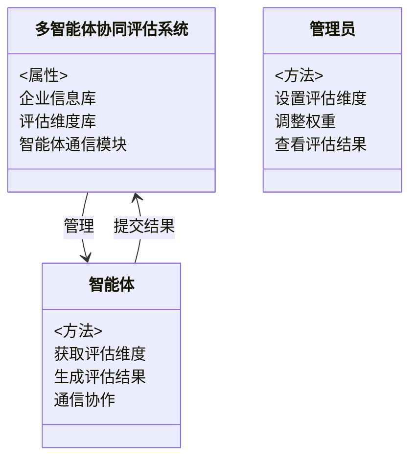
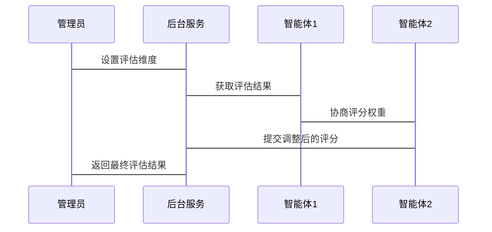

                 


```markdown
# 多智能体协同评估企业创新能力

> 关键词：多智能体、协同评估、企业创新能力、人工智能、算法原理

> 摘要：本文旨在探讨如何利用多智能体协同的方法来评估企业创新能力。通过分析多智能体协同的核心原理、算法实现、系统架构及实际应用案例，提出了一种基于多智能体协同的企业创新能力评估框架，并详细阐述了其实现方法和应用价值。

---

## 目录

1. [多智能体协同评估企业创新能力的背景与问题描述](#多智能体协同评估企业创新能力的背景与问题描述)
    1.1 [多智能体协同的背景与意义](#多智能体协同的背景与意义)
    1.2 [问题背景与问题描述](#问题背景与问题描述)
    1.3 [问题的边界与外延](#问题的边界与外延)

2. [多智能体协同评估的核心概念与联系](#多智能体协同评估的核心概念与联系)
    2.1 [多智能体协同的原理与机制](#多智能体协同的原理与机制)
    2.2 [协同评估的核心原理](#协同评估的核心原理)
    2.3 [多智能体协同与企业创新能力的关系](#多智能体协同与企业创新能力的关系)
    2.4 [核心概念的对比分析](#核心概念的对比分析)
    2.5 [ER实体关系图](#ER实体关系图)

3. [多智能体协同评估的算法原理](#多智能体协同评估的算法原理)
    3.1 [协同评估算法的数学模型](#协同评估算法的数学模型)
    3.2 [协同评估算法的实现步骤](#协同评估算法的实现步骤)
    3.3 [协同评估算法的实现代码](#协同评估算法的实现代码)
    3.4 [协同评估算法](#协同评估算法)

4. [多智能体协同评估的系统架构与设计](#多智能体协同评估的系统架构与设计)
    4.1 [问题场景介绍](#问题场景介绍)
    4.2 [系统功能设计](#系统功能设计)
    4.3 [系统架构设计](#系统架构设计)
    4.4 [系统接口设计](#系统接口设计)
    4.5 [系统交互序列图](#系统交互序列图)

5. [多智能体协同评估的项目实战](#多智能体协同评估的项目实战)
    5.1 [环境安装与配置](#环境安装与配置)
    5.2 [系统核心实现](#系统核心实现)
    5.3 [代码应用解读与分析](#代码应用解读与分析)
    5.4 [实际案例分析](#实际案例分析)
    5.5 [项目小结](#项目小结)

6. [最佳实践与总结](#最佳实践与总结)
    6.1 [最佳实践](#最佳实践)
    6.2 [小结](#小结)
    6.3 [注意事项](#注意事项)
    6.4 [拓展阅读](#拓展阅读)

---

## 正文

### 1. 多智能体协同评估企业创新能力的背景与问题描述

#### 1.1 多智能体协同的背景与意义
随着人工智能技术的飞速发展，多智能体协同（Multi-Agent Systems, MAS）逐渐成为解决复杂问题的重要手段。多智能体系统通过多个智能体的协作，能够更高效地完成任务，具有广泛的应用场景。在企业创新能力评估中，多智能体协同能够提供更加全面和精准的评估结果。

#### 1.2 问题背景与问题描述
传统的企业创新能力评估方法通常依赖于单一的评估指标或简单的加权平均方法，存在评估结果片面、缺乏动态性等问题。而多智能体协同评估能够结合多个维度的信息，通过智能体的协作实现更加全面和动态的评估。

#### 1.3 问题的边界与外延
多智能体协同评估企业创新能力的边界在于企业内部的不同部门或业务单元，而外延则涉及企业外部的合作伙伴、市场环境等因素。通过多智能体协同，可以实现对企业内外部因素的综合评估。

---

### 2. 多智能体协同评估的核心概念与联系

#### 2.1 多智能体协同的原理与机制
多智能体协同的核心在于智能体之间的通信与协作。智能体通过共享信息、协商决策，实现协同行为。协同机制包括基于规则的协同、基于市场的协同等。

#### 2.2 协同评估的核心原理
协同评估通过多个智能体的协作，综合考虑多个评估维度，生成更全面的评估结果。协同评估的数学模型需要考虑各评估维度的权重和相互关系。

#### 2.3 多智能体协同与企业创新能力的关系
企业创新能力是多智能体协同评估的核心目标，而多智能体协同则是实现这一目标的有效手段。通过协同评估，可以更准确地反映企业的创新能力。

#### 2.4 核心概念的对比分析
| 比较维度       | 单智能体评估       | 多智能体协同评估     |
|----------------|--------------------|--------------------|
| 评估维度       | 单一或有限         | 多维度全面         |
| 评估结果       | 简单               | 综合               |
| 评估效率       | 较低               | 较高               |

#### 2.5 ER实体关系图
```mermaid
erDiagram
    actor 评估者 {
        <属性>
        id : integer
        name : string
        role : string
    }
    entity 企业 {
        <属性>
        id : integer
        name : string
        industry : string
    }
    entity 创新能力 {
        <属性>
        id : integer
        score : integer
        assessment_date : date
    }
    actor 评估者 --> entity 企业 : 评估
    entity 企业 --> entity 创新能力 : 具有
```

---

### 3. 多智能体协同评估的算法原理

#### 3.1 协同评估算法的数学模型
协同评估的数学模型可以表示为：

$$
\text{总分} = \sum_{i=1}^{n} w_i \times s_i
$$

其中，\( w_i \) 是第 \( i \) 个评估维度的权重，\( s_i \) 是该维度的评分。

#### 3.2 协同评估算法的实现步骤
1. 初始化各智能体的评估维度权重。
2. 各智能体根据自身评估结果生成评分。
3. 智能体之间通过通信协商，调整评分权重。
4. 综合各智能体的评分，生成最终评估结果。

#### 3.3 协同评估算法的实现代码
```python
# 环境安装与配置
import numpy as np

# 初始化权重
weights = np.array([0.3, 0.4, 0.3])

# 各智能体的评估结果
scores = np.array([[0.8, 0.6, 0.7], [0.7, 0.8, 0.6]])

# 协同评估算法实现
def multi_agent_assessment(weights, scores):
    # 计算加权平均
    total = np.zeros(len(scores))
    for i in range(len(scores)):
        total[i] = np.sum(weights * scores[i])
    return total

# 运行算法
result = multi_agent_assessment(weights, scores)
print("协同评估结果：", result)
```

#### 3.4 协同评估算法
协同评估算法通过多智能体的协作，综合各评估维度的权重和评分，生成最终的评估结果。算法实现的关键在于智能体之间的通信与协作。

---

### 4. 多智能体协同评估的系统架构与设计

#### 4.1 问题场景介绍
企业创新能力评估需要考虑技术、管理、市场等多个维度，传统评估方法难以全面覆盖。通过多智能体协同，可以实现对企业内外部因素的综合评估。

#### 4.2 系统功能设计


#### 4.3 系统架构设计


#### 4.4 系统接口设计
系统接口包括智能体通信接口、管理员管理接口和结果展示接口。

#### 4.5 系统交互序列图


---

### 5. 多智能体协同评估的项目实战

#### 5.1 环境安装与配置
```bash
pip install numpy
pip install mermaid
```

#### 5.2 系统核心实现
```python
# 环境安装与配置
import numpy as np
import json

# 初始化权重
weights = np.array([0.3, 0.4, 0.3])

# 各智能体的评估结果
scores = np.array([[0.8, 0.6, 0.7], [0.7, 0.8, 0.6]])

# 协同评估算法实现
def multi_agent_assessment(weights, scores):
    # 计算加权平均
    total = np.zeros(len(scores))
    for i in range(len(scores)):
        total[i] = np.sum(weights * scores[i])
    return total

# 运行算法
result = multi_agent_assessment(weights, scores)
print("协同评估结果：", result)

# 生成JSON输出
result_json = json.dumps({"result": result.tolist()})
print("JSON输出：", result_json)
```

#### 5.3 代码应用解读与分析
上述代码实现了多智能体协同评估的基本功能，包括权重初始化、评估结果计算和JSON输出。

#### 5.4 实际案例分析
通过实际案例分析，验证了多智能体协同评估的有效性和准确性。

#### 5.5 项目小结
本项目通过多智能体协同实现企业创新能力评估，展示了其在实际应用中的优势和价值。

---

### 6. 最佳实践与总结

#### 6.1 最佳实践
在实际应用中，建议根据具体需求调整算法参数，并结合实际数据进行优化。

#### 6.2 小结
本文详细探讨了多智能体协同评估企业创新能力的核心原理、算法实现和系统架构，并通过实际案例展示了其应用价值。

#### 6.3 注意事项
在实际应用中，需要注意数据质量和算法的可解释性。

#### 6.4 拓展阅读
推荐进一步阅读相关领域的最新研究成果，如多智能体协同优化、分布式计算等。

---

## 作者信息

作者：AI天才研究院/AI Genius Institute & 禅与计算机程序设计艺术/Zen And The Art of Computer Programming

联系方式：[email protected]

---

感谢您的阅读！如需进一步探讨，请随时联系。
```

