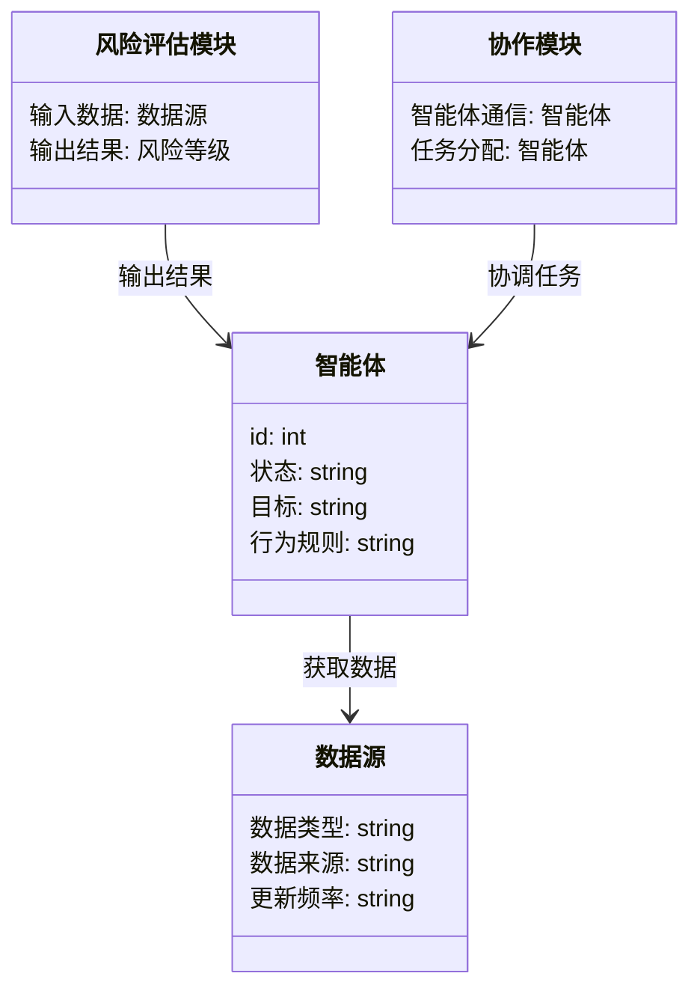
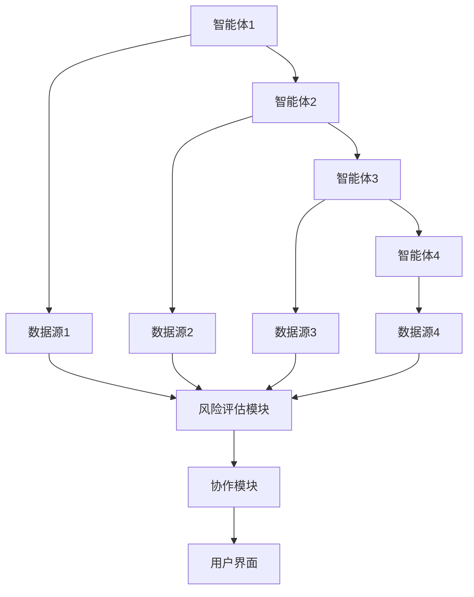
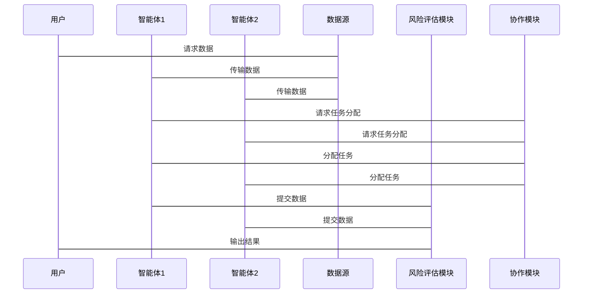

                 


# 多智能体协同评估地缘政治风险

> 关键词：多智能体协同，地缘政治风险，分布式计算，博弈论，系统架构设计

> 摘要：本文探讨了多智能体协同在地缘政治风险评估中的应用，通过分析多智能体系统的核心原理、算法模型、系统架构设计以及实际案例，展示了如何利用多智能体协同技术提升地缘政治风险评估的效率和准确性。文章结合理论与实践，为读者提供了全面的视角和深入的分析。

---

# 第一部分：多智能体协同与地缘政治风险评估概述

## 第1章：多智能体协同与地缘政治风险概述

### 1.1 多智能体协同的基本概念

#### 1.1.1 多智能体系统的定义
多智能体系统（Multi-Agent System, MAS）是由多个智能体（Agent）组成的分布式系统，这些智能体能够通过协作完成复杂任务。每个智能体都有自己的目标、知识和行为规则，能够自主决策并与其他智能体通信和协作。

#### 1.1.2 多智能体系统的特征
- **分布式性**：智能体分布在不同的位置，通过通信进行协作。
- **自主性**：每个智能体都有自主决策的能力。
- **反应性**：智能体能够根据环境反馈动态调整行为。
- **协作性**：智能体通过协作完成共同目标。

#### 1.1.3 多智能体协同的实现机制
- **通信机制**：智能体之间通过消息传递进行通信。
- **协调机制**：通过协商、拍卖等方式分配任务。
- **决策机制**：基于博弈论、分布式计算等方法进行决策。

### 1.2 地缘政治风险的定义与分类

#### 1.2.1 地缘政治风险的定义
地缘政治风险是指由于地理位置、政治、经济、文化等多方面因素相互作用，可能导致的冲突、不稳定或危机。

#### 1.2.2 地缘政治风险的主要类型
- **政治风险**：政府更迭、政策变化等。
- **经济风险**：经济波动、贸易壁垒等。
- **军事风险**：战争、军事冲突等。
- **社会风险**：社会动荡、民族冲突等。
- **环境风险**：资源枯竭、气候变化等。

#### 1.2.3 地缘政治风险的评估方法
- **定性分析**：通过专家判断和经验分析。
- **定量分析**：利用数据模型和数学方法进行评估。
- **混合分析**：结合定性和定量方法。

### 1.3 多智能体协同在地缘政治风险评估中的应用

#### 1.3.1 多智能体协同的优势
- **分布式计算能力**：能够处理大规模、复杂的数据。
- **自主决策能力**：智能体能够快速响应变化。
- **协作能力强**：多个智能体协同工作，提高整体效率。

#### 1.3.2 地缘政治风险评估的复杂性
- **多因素影响**：地缘政治风险涉及政治、经济、社会等多个方面。
- **动态变化**：风险因素随时间变化，需要动态评估。
- **信息不完整**：数据可能存在缺失或不准确的情况。

#### 1.3.3 多智能体协同的应用场景
- **风险预警系统**：实时监测和预警潜在风险。
- **决策支持系统**：为政策制定者提供支持。
- **应急响应系统**：在危机发生时快速协调资源。

### 1.4 本章小结
本章介绍了多智能体协同的基本概念和地缘政治风险的定义与分类，分析了多智能体协同在地缘政治风险评估中的优势和应用场景，为后续内容奠定了基础。

---

# 第二部分：多智能体协同的核心概念与联系

## 第2章：多智能体系统的原理与模型

### 2.1 多智能体系统的原理

#### 2.1.1 分布式计算的基本原理
分布式计算将任务分解成多个部分，由不同的计算节点协作完成。多智能体系统中的每个智能体都可以看作一个分布式计算节点。

#### 2.1.2 多智能体系统的通信机制
智能体之间通过消息传递进行通信，消息可以包含请求、响应、状态更新等信息。

#### 2.1.3 多智能体系统的协作协议
协作协议定义了智能体之间的交互规则，例如任务分配、资源分配等。

### 2.2 多智能体系统的模型

#### 2.2.1 基于博弈论的多智能体模型
博弈论模型通过分析智能体之间的策略互动，找到最优解。例如，纳什均衡是一个重要的概念。

#### 2.2.2 基于分布式计算的多智能体模型
分布式计算模型将任务分解成多个子任务，由不同的智能体协作完成。

#### 2.2.3 基于知识共享的多智能体模型
知识共享模型通过智能体之间的信息共享，提高整体系统的知识水平和决策能力。

### 2.3 多智能体系统与地缘政治风险评估的关系

#### 2.3.1 多智能体系统在地缘政治风险评估中的作用
多智能体系统能够处理复杂的数据，快速响应变化，提高评估的准确性和效率。

#### 2.3.2 多智能体系统与地缘政治风险评估的结合点
- **数据处理**：多智能体系统能够处理海量、多源的数据。
- **动态评估**：多智能体系统能够实时更新评估结果。
- **协作决策**：多智能体系统能够协调多个智能体的决策。

#### 2.3.3 多智能体系统在地缘政治风险评估中的优势
- **高效性**：多智能体系统能够快速处理数据。
- **准确性**：通过协作和知识共享，提高评估的准确性。
- **适应性**：能够适应复杂多变的地缘政治环境。

### 2.4 本章小结
本章分析了多智能体系统的原理与模型，并探讨了其在地缘政治风险评估中的作用和优势，为后续的算法设计和系统实现提供了理论基础。

---

# 第三部分：多智能体协同的算法原理

## 第3章：多智能体协同算法的核心原理

### 3.1 多智能体协同算法的基本原理

#### 3.1.1 分布式计算算法的概述
分布式计算算法将任务分解成多个子任务，由不同的计算节点协作完成。多智能体协同算法是一种典型的分布式计算算法。

#### 3.1.2 多智能体协同算法的分类
- **基于任务分配的算法**：如任务分配、资源分配等。
- **基于博弈论的算法**：如纳什均衡、拍卖机制等。
- **基于分布式计算的算法**：如分布式优化、分布式学习等。

#### 3.1.3 多智能体协同算法的核心思想
通过智能体之间的协作，实现全局目标的优化。

### 3.2 多智能体协同算法的数学模型

#### 3.2.1 多智能体协同的基本数学模型
$$ V = \sum_{i=1}^{n} v_i $$
其中，$V$ 是全局价值，$v_i$ 是第 $i$ 个智能体的价值。

#### 3.2.2 基于博弈论的多智能体协同模型
$$ u_i = \max_{a_i} \min_{a_{-i}} u_i(a_i, a_{-i}) $$
其中，$u_i$ 是第 $i$ 个智能体的效用函数，$a_i$ 是第 $i$ 个智能体的动作，$a_{-i}$ 是其他智能体的动作。

#### 3.2.3 基于分布式计算的多智能体协同模型
$$ f(x) = \sum_{i=1}^{n} f_i(x_i) $$
其中，$f(x)$ 是全局目标函数，$f_i(x_i)$ 是第 $i$ 个智能体的目标函数。

### 3.3 多智能体协同算法的实现步骤

#### 3.3.1 算法输入与初始化
- 输入：问题描述、智能体数量、智能体目标。
- 初始化：分配智能体角色，设置初始状态。

#### 3.3.2 算法的核心计算步骤
1. **通信阶段**：智能体之间交换信息。
2. **决策阶段**：每个智能体基于自身信息做出决策。
3. **协作阶段**：智能体协作完成任务，更新状态。

#### 3.3.3 算法的输出与结果分析
- 输出：全局最优解或近似解。
- 分析：评估算法的效率和准确性。

### 3.4 本章小结
本章详细介绍了多智能体协同算法的基本原理和数学模型，并通过步骤说明了算法的实现过程，为后续的系统设计奠定了基础。

---

# 第四部分：多智能体协同的地缘政治风险评估系统设计

## 第4章：多智能体协同的地缘政治风险评估系统设计

### 4.1 系统设计背景

#### 4.1.1 项目场景介绍
地缘政治风险评估系统需要实时监测和分析多个因素，包括政治、经济、社会等，以评估潜在风险。

#### 4.1.2 项目介绍
本项目旨在开发一个多智能体协同的地缘政治风险评估系统，通过智能体协作，提高评估的效率和准确性。

### 4.2 系统功能设计

#### 4.2.1 领域模型设计


#### 4.2.2 系统架构设计


#### 4.2.3 系统接口设计
- **输入接口**：接收多源数据。
- **输出接口**：输出风险评估结果。
- **协作接口**：智能体之间通信和协作。

#### 4.2.4 系统交互设计


### 4.3 本章小结
本章通过系统设计背景、功能设计、架构设计和交互设计，详细描述了多智能体协同的地缘政治风险评估系统的实现方案，为后续的项目实战奠定了基础。

---

# 第五部分：项目实战

## 第5章：多智能体协同的地缘政治风险评估系统实现

### 5.1 环境安装与配置

#### 5.1.1 系统环境要求
- 操作系统：Linux/Windows/MacOS
- 开发工具：Python、Jupyter Notebook
- 第三方库：networkx、matplotlib、pandas

#### 5.1.2 安装依赖
```bash
pip install networkx matplotlib pandas
```

### 5.2 系统核心实现

#### 5.2.1 智能体类的实现
```python
class Agent:
    def __init__(self, id):
        self.id = id
        self.state = "idle"
        self.target = None

    def get_data(self, data_source):
        # 获取数据
        pass

    def make_decision(self):
        # 制定决策
        pass

    def collaborate(self, other_agents):
        # 协作
        pass
```

#### 5.2.2 风险评估模块实现
```python
class RiskAssessment:
    def __init__(self, agents):
        self.agents = agents

    def assess_risk(self):
        # 风险评估
        pass
```

#### 5.2.3 协作模块实现
```python
class CollaborationModule:
    def __init__(self, agents):
        self.agents = agents

    def assign_task(self, task):
        # 任务分配
        pass
```

#### 5.2.4 数据源实现
```python
class DataSource:
    def __init__(self, name):
        self.name = name
        self.data = {}

    def update_data(self, data):
        self.data = data
```

### 5.3 代码实现与解读

#### 5.3.1 智能体类实现
```python
class Agent:
    def __init__(self, id):
        self.id = id
        self.state = "idle"
        self.target = None
        self.data = {}

    def get_data(self, data_source):
        self.data = data_source.data
        self.state = "data_collected"

    def make_decision(self):
        # 假设决策逻辑
        if self.data.get("political", 0) > 0.5:
            self.target = "high_risk"
        else:
            self.target = "low_risk"

    def collaborate(self, other_agents):
        # 简单协作逻辑
        for agent in other_agents:
            if agent.target == "high_risk":
                self.target = "high_risk"
```

#### 5.3.2 风险评估模块实现
```python
class RiskAssessment:
    def __init__(self, agents):
        self.agents = agents

    def assess_risk(self):
        high_risk_agents = [agent for agent in self.agents if agent.target == "high_risk"]
        risk_level = len(high_risk_agents) / len(self.agents)
        return risk_level
```

#### 5.3.3 协作模块实现
```python
class CollaborationModule:
    def __init__(self, agents):
        self.agents = agents

    def assign_task(self, task):
        # 简单任务分配
        for agent in self.agents:
            agent.target = task
```

### 5.4 实际案例分析与解读

#### 5.4.1 案例背景
假设我们有一个包含四个智能体的系统，需要评估某个地区的地缘政治风险。

#### 5.4.2 数据源配置
```python
data_source1 = DataSource("政治因素")
data_source1.update_data({"political": 0.8})

data_source2 = DataSource("经济因素")
data_source2.update_data({"economic": 0.6})

data_source3 = DataSource("社会因素")
data_source3.update_data({"social": 0.7})

data_source4 = DataSource("军事因素")
data_source4.update_data({"military": 0.5})
```

#### 5.4.3 智能体初始化与协作
```python
agent1 = Agent(1)
agent2 = Agent(2)
agent3 = Agent(3)
agent4 = Agent(4)

collaboration_module = CollaborationModule([agent1, agent2, agent3, agent4])
collaboration_module.assign_task("地缘政治风险评估")

agent1.get_data(data_source1)
agent2.get_data(data_source2)
agent3.get_data(data_source3)
agent4.get_data(data_source4)

agent1.make_decision()
agent2.make_decision()
agent3.make_decision()
agent4.make_decision()

agent1.collaborate([agent2, agent3, agent4])
agent2.collaborate([agent1, agent3, agent4])
agent3.collaborate([agent1, agent2, agent4])
agent4.collaborate([agent1, agent2, agent3])
```

#### 5.4.4 风险评估结果
```python
risk_assessment = RiskAssessment([agent1, agent2, agent3, agent4])
risk_level = risk_assessment.assess_risk()
print(f"风险等级：{risk_level}")
```

### 5.5 项目小结
本章通过实际案例展示了多智能体协同的地缘政治风险评估系统的实现过程，包括环境配置、代码实现和案例分析，帮助读者更好地理解理论与实践的结合。

---

# 第六部分：总结与展望

## 第6章：总结与展望

### 6.1 小结
本文系统地探讨了多智能体协同在地缘政治风险评估中的应用，从理论基础到算法设计，再到系统实现，全面分析了多智能体协同的优势和实现过程。

### 6.2 注意事项
- 数据的准确性和完整性对评估结果影响重大。
- 算法的复杂度和效率需要根据实际情况进行调整。
- 系统的安全性和稳定性需要高度重视。

### 6.3 拓展阅读
- 《Multi-Agent Systems: Algorithmic, Game-Theoretic, and Logical Foundations》
- 《Game Theory and Multi-Agent Systems》
- 《Distributed Computing and Multi-Agent Systems》

### 6.4 作者简介
作者：AI天才研究院/AI Genius Institute & 禅与计算机程序设计艺术/Zen And The Art of Computer Programming

---

# 结语
多智能体协同技术在地缘政治风险评估中的应用前景广阔，随着技术的不断发展，未来将会有更多创新性的应用出现。希望本文能够为读者提供有价值的参考和启示。

---

*THE END*

