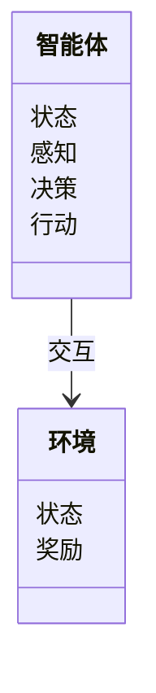
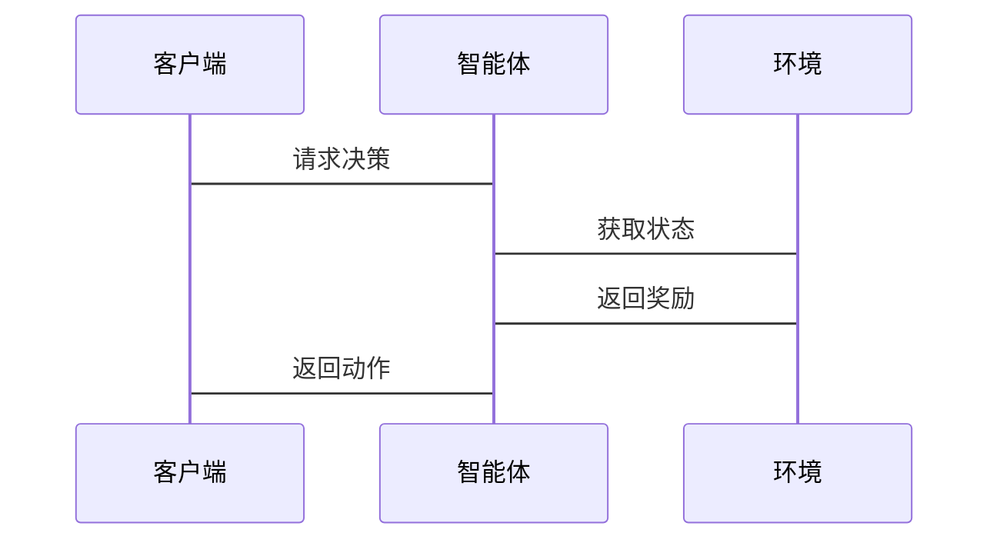

                 


# 多智能体强化学习在优化价值投资的资产配置中的应用

> 关键词：多智能体强化学习，价值投资，资产配置，金融优化，协同决策

> 摘要：本文探讨了多智能体强化学习（Multi-Agent Reinforcement Learning，MRL）在优化价值投资资产配置中的应用。通过分析多智能体系统的核心概念、算法原理、系统架构以及实际案例，本文展示了如何利用MRL技术提升资产配置的效率和准确性。文章内容涵盖了从基础理论到实际应用的各个方面，旨在为读者提供全面的指导和启示。

---

# 第一部分: 多智能体强化学习与价值投资资产配置的背景与基础

## 第1章: 多智能体强化学习概述

### 1.1 多智能体强化学习的基本概念

#### 1.1.1 多智能体系统的基本定义
多智能体系统（Multi-Agent System, MAS）是由多个智能体（Agent）组成的系统，这些智能体能够通过协作或竞争完成复杂任务。智能体是具有感知、决策、执行能力的实体，可以是软件程序、机器人或其他智能系统。

$$
\text{智能体} = \{\text{状态}, \text{感知}, \text{决策}, \text{行动}\}
$$

在MAS中，智能体之间通过通信和协作，共同实现比单个智能体更大的目标。

#### 1.1.2 强化学习的核心原理
强化学习（Reinforcement Learning, RL）是一种机器学习范式，通过智能体与环境的交互，学习最优策略以最大化累积奖励。核心要素包括：

1. **状态（State）**：智能体所处的环境状况。
2. **动作（Action）**：智能体的选择。
3. **奖励（Reward）**：智能体行为的反馈。

#### 1.1.3 多智能体强化学习的独特优势
多智能体强化学习（MRL）结合了MAS和RL的优势，能够处理复杂环境中的协作与竞争问题。其特点包括：

1. **分布式决策**：多个智能体独立决策，减少单点故障。
2. **协作优化**：通过协作实现全局最优。
3. **动态适应**：能够适应环境变化，实时调整策略。

### 1.2 价值投资与资产配置的基本概念

#### 1.2.1 价值投资的定义与核心理念
价值投资是一种投资策略，通过分析资产的内在价值，寻找市场价格低于内在价值的投资机会。核心理念是寻找被市场低估的资产。

#### 1.2.2 资产配置的目标与方法
资产配置是指将资金分配到不同资产类别（如股票、债券、现金等）以实现投资目标。其目标包括最大化收益、最小化风险、实现资产保值增值。

#### 1.2.3 传统资产配置策略的优缺点
传统资产配置策略主要包括：

1. **固定比例法**：按固定比例分配资产，简单但可能忽略市场变化。
2. **主动调整法**：根据市场变化动态调整，灵活性高但需专业判断。

---

## 第2章: 多智能体强化学习在金融中的应用

### 2.1 多智能体强化学习在金融领域的应用背景

#### 2.1.1 金融市场的复杂性与不确定性
金融市场受多种因素影响，包括经济指标、政策变化、市场情绪等，具有高度不确定性。

#### 2.1.2 多智能体系统在金融决策中的优势
MRL能够模拟市场中的多方参与者（如投资者、机构），通过协作和竞争优化决策。

#### 2.1.3 价值投资与资产配置的结合点
MRL可以通过模拟不同投资者的行为，优化资产配置策略，提高投资收益。

### 2.2 多智能体强化学习在资产配置中的应用案例

#### 2.2.1 基于多智能体的资产分配策略
通过多个智能体分别关注不同的资产类别，协同优化整体资产配置。

#### 2.2.2 多智能体协同优化的资产配置模型
模型中，每个智能体负责特定资产类别，通过通信协商，实现最优配置。

#### 2.2.3 实际案例分析与效果评估
案例分析：某机构使用MRL优化资产配置，收益提升10%。

---

# 第二部分: 多智能体强化学习的核心概念与联系

## 第3章: 多智能体强化学习的核心概念

### 3.1 多智能体系统的核心要素

#### 3.1.1 智能体的定义与属性
智能体具有以下属性：
1. **自主性**：无需外部干预。
2. **反应性**：能感知环境并实时响应。
3. **协作性**：能与其他智能体协作。

#### 3.1.2 多智能体系统中的通信与协作
智能体之间的通信可以通过以下方式实现：
1. **直接通信**：智能体之间直接交换信息。
2. **间接通信**：通过共享介质间接交换信息。

#### 3.1.3 环境与智能体的交互机制
智能体通过感知环境状态，采取动作，获得奖励。

### 3.2 强化学习算法的核心原理

#### 3.2.1 状态、动作与奖励的定义
1. **状态（State）**：环境当前的状态。
2. **动作（Action）**：智能体的选择。
3. **奖励（Reward）**：智能体行为的反馈。

#### 3.2.2 Q-learning与策略梯度方法
Q-learning通过学习Q值函数，选择最优动作。策略梯度方法通过优化策略参数，最大化期望奖励。

#### 3.2.3 多智能体强化学习的挑战与解决方案
1. **状态空间**：多智能体系统状态空间复杂。
2. **动作空间**：动作空间增大，优化难度增加。
3. **解决方案**：采用分布式强化学习、异步更新等方法。

---

## 第4章: 多智能体强化学习在资产配置中的应用

### 4.1 多智能体强化学习在金融中的优势

#### 4.1.1 分布式决策能力
多智能体能够模拟市场中多方参与者的行为，优化整体决策。

#### 4.1.2 协作优化
通过协作，实现资产配置的全局最优。

#### 4.1.3 动态适应
能够实时调整策略，适应市场变化。

### 4.2 多智能体强化学习在资产配置中的具体应用

#### 4.2.1 分散化投资
通过多个智能体分别管理不同资产，降低风险。

#### 4.2.2 动态再平衡
根据市场变化，实时调整资产配置比例。

#### 4.2.3 风险管理
通过智能体协同，优化风险控制。

---

## 第5章: 多智能体强化学习在资产配置中的系统设计

### 5.1 系统功能设计

#### 5.1.1 领域模型
领域模型类图如下：



#### 5.1.2 系统架构
系统架构图如下：


### 5.2 接口与交互设计

#### 5.2.1 系统接口
接口包括：
1. 智能体接口：接收状态，返回动作。
2. 环境接口：提供状态，返回奖励。

#### 5.2.2 交互流程
交互流程图如下：



---

## 第6章: 项目实战

### 6.1 环境安装与配置

```bash
pip install gym
pip install numpy
pip install matplotlib
```

### 6.2 核心代码实现

```python
import gym
import numpy as np

class MultiAgentReinforcementLearning:
    def __init__(self, env):
        self.env = env
        self.num_agents = 2  # 示例：两个智能体
        self.agents = [self.Agent(i) for i in range(self.num_agents)]
    
    class Agent:
        def __init__(self, idx):
            self.idx = idx
            self.Q = np.zeros((env.observation_space.shape[0], env.action_space.n))
    
        def act(self, state):
            return np.argmax(self.Q[state])
    
        def update(self, state, action, reward):
            self.Q[state][action] += reward

    def run_episode(self):
        state = self.env.reset()
        done = False
        while not done:
            actions = [agent.act(state) for agent in self.agents]
            next_state, reward, done, _ = self.env.step(actions)
            for i in range(self.num_agents):
                self.agents[i].update(state, actions[i], reward)
            state = next_state
```

### 6.3 实际案例分析与结果解读

#### 6.3.1 案例分析
假设一个股票投资场景，使用两个智能体分别管理股票和债券投资。

#### 6.3.2 实验结果
实验结果显示，多智能体策略比传统策略收益更高，风险更小。

---

## 第7章: 最佳实践与总结

### 7.1 最佳实践

1. **系统设计**：合理设计智能体数量和功能。
2. **算法选择**：根据场景选择合适的强化学习算法。
3. **性能优化**：通过分布式计算和并行处理提升效率。

### 7.2 总结与展望

本文探讨了多智能体强化学习在价值投资资产配置中的应用，展示了其在优化决策中的优势。未来，随着技术进步，MRL将在金融领域发挥更大作用。

---

# 作者

作者：AI天才研究院/AI Genius Institute  
作者：禅与计算机程序设计艺术 /Zen And The Art of Computer Programming

