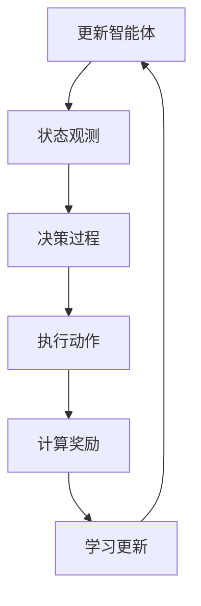

                 


# 多智能体强化学习在优化止损和止盈策略中的应用

> 关键词：多智能体强化学习，止损，止盈，金融交易，策略优化

> 摘要：本文探讨了多智能体强化学习在优化止损和止盈策略中的应用，分析了多智能体强化学习的基本原理、其在金融交易中的优势，并通过具体案例展示了如何利用多智能体强化学习来优化止损和止盈策略，以提高交易效率和收益。

---

# 第一部分: 多智能体强化学习基础

## 第1章: 多智能体强化学习概述

### 1.1 多智能体强化学习的背景与意义
- **1.1.1 多智能体系统的定义与特点**
  - 多智能体系统是由多个智能体组成的协作或竞争系统，每个智能体都有自己的目标和决策能力。
  - 特点：分布式决策、协作性、动态性。

- **1.1.2 强化学习的基本概念与特点**
  - 强化学习：智能体通过与环境交互，学习策略以最大化累积奖励。
  - 特点：基于反馈学习、试错性、长期目标优化。

- **1.1.3 多智能体强化学习的核心优势**
  - 多智能体协作可以提高决策的鲁棒性和效率。
  - 适用于复杂环境中的优化问题。

### 1.2 多智能体强化学习的分类与应用场景
- **1.2.1 单智能体强化学习与多智能体强化学习的区别**
  - 单智能体：单一决策主体，环境状态影响单一智能体。
  - 多智能体：多个智能体协作或竞争，环境状态影响所有智能体。

- **1.2.2 多智能体强化学习的分类**
  - 基于通信：智能体之间可以共享信息。
  - 基于价值：通过价值函数优化策略。
  - 基于策略：直接优化策略空间。

- **1.2.3 多智能体强化学习在金融领域的应用**
  - 交易策略优化、风险管理、市场预测。

### 1.3 多智能体强化学习的核心概念
- **1.3.1 状态空间与动作空间**
  - 状态：环境当前的观测。
  - 动作：智能体可以执行的动作。

- **1.3.2 奖励机制与目标函数**
  - 奖励：智能体行为的即时反馈。
  - 目标函数：长期目标的度量。

- **1.3.3 多智能体协作与竞争关系**
  - 协作：智能体共同完成任务。
  - 竞争：智能体争夺资源或目标。

### 1.4 多智能体强化学习的挑战与解决方案
- **1.4.1 多智能体协作中的通信与协调问题**
  - 解决方案：设计高效的通信协议，减少信息冗余。

- **1.4.2 多智能体强化学习的收敛性问题**
  - 解决方案：使用分布式优化算法，如基于价值的方法。

- **1.4.3 解决多智能体强化学习挑战的常用方法**
  - 使用基于价值的算法、分布式训练、异步更新。

## 第2章: 多智能体强化学习的核心概念与联系

### 2.1 多智能体强化学习的核心概念
- **2.1.1 多智能体系统中的通信与协作**
  - 通过共享信息提高决策质量。
  - 通信机制：消息传递、状态广播。

### 2.2 多智能体强化学习的数学模型
- **2.2.1 多智能体强化学习的状态空间**
  - 状态：S = (s₁, s₂, ..., sₙ)，每个s_i表示一个智能体的状态。
- **2.2.2 多智能体强化学习的动作空间**
  - 动作：A = (a₁, a₂, ..., aₙ)，每个a_i表示一个智能体的动作。

### 2.3 多智能体强化学习的奖励机制
- **2.3.1 奖励函数的设计**
  - 设计奖励函数时需要考虑全局目标和个体目标。
  - 例如，交易中的奖励可以是最终的利润或风险控制指标。

### 2.4 多智能体强化学习的算法流程


---

# 第二部分: 多智能体强化学习在止损和止盈策略中的应用

## 第3章: 止损和止盈策略优化的背景与问题分析

### 3.1 金融交易中的止损和止盈策略
- **3.1.1 止损和止盈的基本概念**
  - 止损：当亏损达到一定程度时，自动卖出以减少损失。
  - 止盈：当收益达到一定程度时，自动卖出以锁定利润。

### 3.2 多智能体强化学习在止损和止盈策略中的优势
- **3.2.1 多智能体协作优化止损和止盈策略**
  - 多个智能体可以分别负责不同的市场条件下的策略优化。

### 3.3 止损和止盈策略优化的数学模型
- **3.3.1 状态空间定义**
  - 例如，市场状态：上涨、下跌、盘整。

### 3.4 多智能体强化学习在止损和止盈策略中的应用
- **3.4.1 算法流程**
  ```mermaid
  graph TD
      I[智能体初始化] --> S[市场状态观测]
      S --> D[决策过程]
      D --> A[执行止损或止盈动作]
      A --> R[计算奖励（利润或损失）]
      R --> L[学习更新策略]
      L --> I[更新智能体]
  ```

---

## 第4章: 多智能体强化学习算法实现

### 4.1 算法原理
- **4.1.1 Q-learning算法**
  - 通过Q表记录状态-动作对的值，逐步更新Q值以最大化奖励。

### 4.2 算法实现
- **4.2.1 多智能体协作算法**
  - 使用分布式Q-learning，多个智能体协同更新Q表。

### 4.3 算法流程
- **4.3.1 多智能体协作流程**
  ```mermaid
  graph TD
      I[智能体初始化] --> S[状态观测]
      S --> D[决策过程]
      D --> A[执行动作]
      A --> R[计算奖励]
      R --> L[更新Q表]
      L --> I[更新智能体]
  ```

---

## 第5章: 项目实战

### 5.1 环境安装
- 需要安装Python、TensorFlow、Keras等工具。

### 5.2 核心代码实现
- **5.2.1 Q-learning实现**
  ```python
  import numpy as np
  class QLearning:
      def __init__(self, state_space, action_space):
          self.Q = np.zeros((state_space, action_space))
      
      def choose_action(self, state, epsilon):
          if np.random.random() < epsilon:
              return np.random.randint(0, action_space)
          return np.argmax(self.Q[state])
      
      def update_Q(self, state, action, reward, next_state, alpha=0.1):
          self.Q[state][action] = (1 - alpha) * self.Q[state][action] + alpha * (reward + np.max(self.Q[next_state]))
  ```

### 5.3 案例分析
- **5.3.1 止损策略优化案例**
  - 使用多智能体协作优化不同的市场状态下的止损点。

### 5.4 项目总结
- 总结项目实现过程中的经验和教训，提出改进建议。

---

## 第6章: 总结与展望

### 6.1 总结
- 多智能体强化学习在优化止损和止盈策略中的优势和应用。

### 6.2 展望
- 未来研究方向，如更复杂的市场环境建模、更高效的多智能体协作算法。

---

作者：AI天才研究院/AI Genius Institute & 禅与计算机程序设计艺术 /Zen And The Art of Computer Programming

