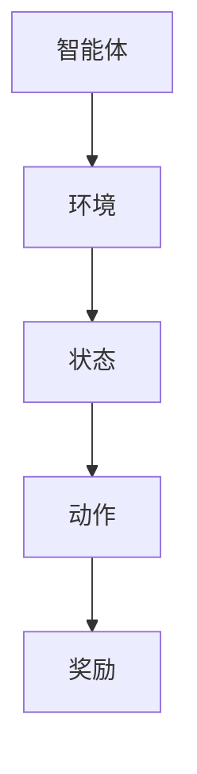
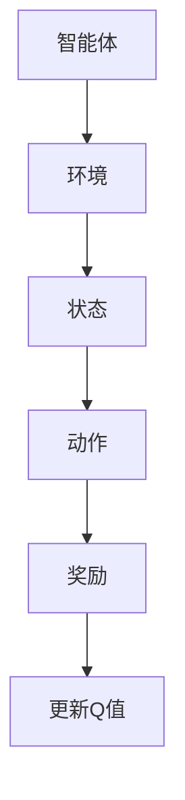
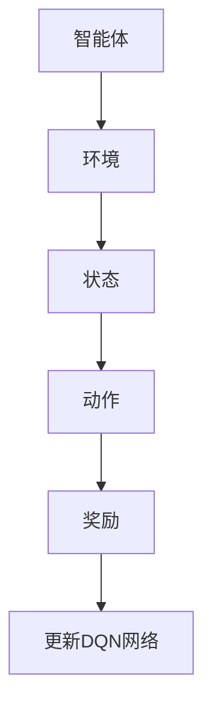
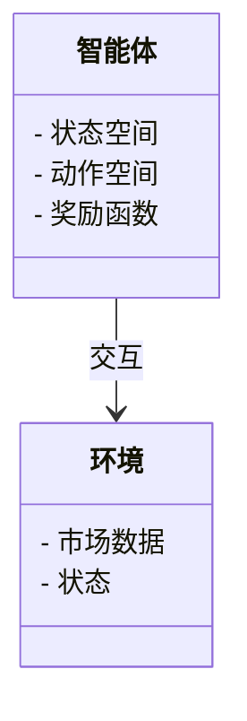
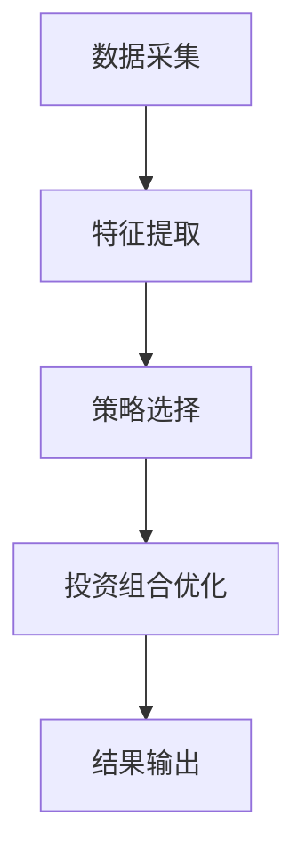
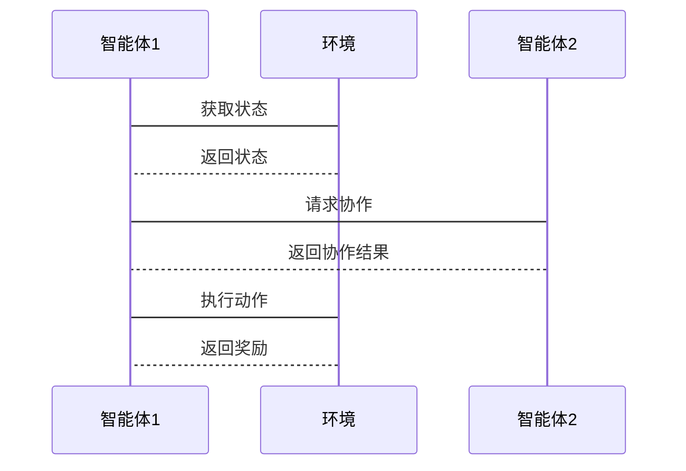

                 


# 多智能体强化学习在股票市场价值发现中的应用

> 关键词：多智能体强化学习，股票市场，价值发现，强化学习，机器学习，人工智能

> 摘要：本文探讨了多智能体强化学习在股票市场中的应用，特别是如何利用多个智能体协作来发现股票的潜在价值。通过详细分析多智能体系统的构建、算法原理、系统设计和实际案例，本文展示了如何利用这些技术手段提升投资决策的智能化水平。

---

## 第1章: 多智能体强化学习概述

### 1.1 多智能体强化学习的背景与意义

#### 1.1.1 传统投资方法的局限性
传统的股票投资方法依赖于人类专家的分析和经验，但这种方法存在主观性强、效率低且难以处理海量数据的问题。随着市场的复杂化和数据量的爆炸式增长，传统的投资方法已经难以满足现代金融市场的需求。

#### 1.1.2 多智能体强化学习的提出
多智能体强化学习（Multi-Agent Reinforcement Learning, MARL）是一种新兴的人工智能技术，通过多个智能体协作完成复杂的任务。与传统的单智能体强化学习相比，MARL能够更好地模拟现实市场中的多参与者行为，适用于股票市场这种高度动态和不确定的环境。

#### 1.1.3 股票市场价值发现的挑战与机遇
股票市场的价值发现是一个复杂的过程，需要考虑多种因素，包括公司基本面、市场情绪、宏观经济指标等。多智能体强化学习能够通过多个智能体分别关注不同的因素，协作完成价值评估，从而提供更加准确和全面的市场分析。

---

### 1.2 多智能体强化学习的核心概念

#### 1.2.1 多智能体系统的基本构成
多智能体系统由多个智能体组成，每个智能体负责特定的任务。这些智能体可以协作或竞争，共同完成复杂的问题。在股票市场中，每个智能体可以专注于不同的信息源，如财务数据、市场情绪、技术指标等。

#### 1.2.2 强化学习的基本原理
强化学习是一种通过试错学习的方法，智能体通过与环境互动，学习如何做出决策以获得最大化的累积奖励。核心要素包括状态、动作、奖励和策略。

#### 1.2.3 多智能体强化学习的独特性
多智能体强化学习的特点在于智能体之间的协作与竞争。多个智能体通过共享信息或策略，能够更高效地完成任务。此外，MARL能够处理高度动态的市场环境，适应市场的快速变化。

---

### 1.3 多智能体强化学习的应用场景

#### 1.3.1 股票市场中的多智能体协作
在股票市场中，多个智能体可以协作完成数据采集、分析和决策。例如，一个智能体负责收集财务数据，另一个负责分析市场情绪，第三个负责技术指标分析。

#### 1.3.2 基于多智能体的市场预测
通过多个智能体分别关注不同的市场因素，可以更全面地预测市场走势。每个智能体提供自己的预测结果，最终通过协作得到一个综合的预测。

#### 1.3.3 多智能体在投资组合优化中的作用
多智能体可以分别优化投资组合中的不同资产配置，通过协作实现风险与收益的最佳平衡。

---

### 1.4 本章小结

---

## 第2章: 多智能体强化学习的核心概念与联系

### 2.1 多智能体强化学习的原理

#### 2.1.1 智能体与环境的交互
智能体通过与环境互动，获取状态信息，选择动作，并获得奖励。在股票市场中，环境是动态变化的市场数据，智能体通过这些数据做出投资决策。

#### 2.1.2 多智能体系统中的协作与竞争
多个智能体可以在系统中协作或竞争。协作时，智能体共享信息，共同优化决策；竞争时，智能体之间存在博弈关系，最终达到纳什均衡。

#### 2.1.3 基于Q-learning的多智能体学习
Q-learning是一种经典的强化学习算法，通过更新Q值函数，学习最优策略。在多智能体系统中，每个智能体维护自己的Q值函数，通过协作或竞争更新。

---

### 2.2 多智能体强化学习的数学模型

#### 2.2.1 状态空间的定义
状态空间描述了智能体所处的环境。在股票市场中，状态可以包括股票价格、成交量、财务指标等。

#### 2.2.2 动作空间的构建
动作空间定义了智能体可以执行的动作，如买入、卖出或持有股票。动作空间的设计需要考虑市场规则和交易成本。

#### 2.2.3 奖励函数的设计
奖励函数定义了智能体获得的奖励，通常基于投资收益和风险控制。例如，获得正收益时给予奖励，承担过高风险时给予惩罚。

---

### 2.3 多智能体强化学习的对比分析

#### 2.3.1 单智能体强化学习与多智能体强化学习的对比
单智能体强化学习适用于简单任务，而多智能体强化学习能够处理复杂任务，尤其是需要多参与者协作的场景。

#### 2.3.2 各类多智能体模型的优缺点
- **Q-learning**：简单易实现，但难以处理大规模问题。
- **DQN**：适合处理高维状态空间，但训练时间较长。
- **DQN2**：改进了DQN的稳定性，适合复杂环境。
- **MAAC**：基于Actor-Critic架构，适合多智能体协作。

---

### 2.4 多智能体强化学习的ER实体关系图



---

### 2.5 本章小结

---

## 第3章: 多智能体强化学习的算法原理

### 3.1 多智能体强化学习的算法

#### 3.1.1 Q-learning算法



Python代码实现：

```python
class QLearning:
    def __init__(self, state_space, action_space):
        self.q_table = np.zeros((state_space, action_space))
    
    def choose_action(self, state, epsilon=0.1):
        if np.random.random() < epsilon:
            return np.random.randint(0, action_space)
        return np.argmax(self.q_table[state])
    
    def update_q(self, state, action, reward, next_state, alpha=0.1):
        self.q_table[state][action] = (1 - alpha) * self.q_table[state][action] + alpha * (reward + np.max(self.q_table[next_state]))
```

---

#### 3.1.2 DQN算法



Python代码实现：

```python
import torch
import torch.nn as nn

class DQN(nn.Module):
    def __init__(self, input_dim, output_dim):
        super(DQN, self).__init__()
        self.fc1 = nn.Linear(input_dim, 64)
        self.fc2 = nn.Linear(64, output_dim)
    
    def forward(self, x):
        x = torch.relu(self.fc1(x))
        return self.fc2(x)
```

---

#### 3.1.3 DQN2算法

DQN2通过改进网络结构和引入经验回放，提高了算法的稳定性和表现。

---

#### 3.1.4 MAAC算法

MAAC（多智能体Actor-Critic）通过多个Actor和Critic网络协作，实现多智能体的联合优化。

---

### 3.2 多智能体强化学习的数学模型

#### 3.2.1 Q-learning的数学模型
$$ Q(s, a) \leftarrow Q(s, a) + \alpha [r + \max Q(s', a') - Q(s, a)] $$

#### 3.2.2 DQN的数学模型
$$ \theta \leftarrow \theta + \alpha (r + \gamma \max Q(s', a') - Q(s, a)) $$

---

### 3.3 本章小结

---

## 第4章: 多智能体强化学习的系统分析与架构设计

### 4.1 系统分析

#### 4.1.1 问题场景
股票市场是一个高度动态和不确定的环境，需要多个智能体协作完成数据采集、分析和决策。

#### 4.1.2 项目介绍
本项目旨在设计一个多智能体系统，用于股票市场的价值发现。系统包括数据采集、特征提取、策略选择和投资组合优化四个模块。

---

### 4.2 系统功能设计

#### 4.2.1 数据采集模块
负责采集股票市场的实时数据，包括价格、成交量、财务指标等。

#### 4.2.2 特征提取模块
对采集的数据进行特征提取，生成适合智能体处理的状态。

#### 4.2.3 策略选择模块
智能体根据当前状态选择最优动作，如买入或卖出。

#### 4.2.4 投资组合优化模块
根据多个智能体的决策，优化投资组合，实现风险与收益的平衡。

---

### 4.3 系统架构设计

#### 4.3.1 领域模型（Mermaid类图）



---

#### 4.3.2 系统架构（Mermaid架构图）



---

### 4.4 系统接口设计

#### 4.4.1 智能体与环境的接口
智能体通过接口与环境交互，获取状态和执行动作。

#### 4.4.2 智能体之间的接口
智能体之间可以通过共享信息或策略进行协作。

---

### 4.5 系统交互（Mermaid序列图）



---

### 4.6 本章小结

---

## 第5章: 多智能体强化学习的项目实战

### 5.1 环境安装

#### 5.1.1 安装Python环境
使用Anaconda或virtualenv创建Python环境，版本建议为3.8以上。

#### 5.1.2 安装依赖库
安装必要的库，如numpy、pandas、tensorflow、keras等。

---

### 5.2 核心代码实现

#### 5.2.1 数据采集模块
使用Yahoo Finance API获取股票数据。

```python
import pandas_datareader as pdr
import datetime

start = datetime.datetime(2020, 1, 1)
end = datetime.datetime(2023, 12, 31)
data = pdr.get_data_yahoo('AAPL', start, end)
```

---

#### 5.2.2 特征提取模块
对数据进行特征提取，如计算移动平均线、相对强弱指数等。

```python
data['MA_20'] = data['Close'].rolling(20).mean()
data['RSI'] = ta.RSI(data['Close'], window=14)
```

---

#### 5.2.3 策略选择模块
实现一个多智能体系统，每个智能体负责不同的特征。

```python
class MultiAgentSystem:
    def __init__(self, agents):
        self.agents = agents
    
    def choose_action(self, state):
        actions = []
        for agent in self.agents:
            action = agent.choose_action(state)
            actions.append(action)
        return actions
```

---

#### 5.2.4 投资组合优化模块
根据多个智能体的决策，优化投资组合。

```python
import numpy as np

def optimize_portfolio(actions):
    returns = np.array([0.1, 0.2, 0.15])
    cov_matrix = np.array([[0.02, 0.01, 0.01],
                           [0.01, 0.03, 0.02],
                           [0.01, 0.02, 0.03]])
    weights = np.linalg.solve(cov_matrix, returns)
    weights = weights / np.sum(weights)
    return weights
```

---

### 5.3 代码应用解读与分析

#### 5.3.1 数据采集模块的实现
通过Yahoo Finance API获取股票数据，包括开盘价、收盘价、最高价、最低价和成交量。

#### 5.3.2 特征提取模块的实现
使用技术指标如移动平均线和RSI，提取有助于决策的特征。

#### 5.3.3 策略选择模块的实现
多个智能体分别对不同的特征进行分析，选择最优动作。

#### 5.3.4 投资组合优化模块的实现
根据多个智能体的决策结果，优化投资组合，实现风险与收益的平衡。

---

### 5.4 案例分析与结果展示

#### 5.4.1 案例分析
以苹果公司股票为例，展示系统如何通过多智能体协作发现其潜在价值。

#### 5.4.2 结果展示
展示智能体的决策过程和最终的投资组合结果，分析系统的有效性和准确性。

---

### 5.5 本章小结

---

## 第6章: 多智能体强化学习的最佳实践、小结与注意事项

### 6.1 最佳实践

#### 6.1.1 数据质量的重要性
高质量的数据是系统准确性的基础，需要确保数据的完整性和实时性。

#### 6.1.2 模型调参的注意事项
合理设置超参数，如学习率、折扣因子、探索与利用的平衡等。

#### 6.1.3 系统的可扩展性
设计时考虑系统的可扩展性，方便后续增加新的智能体或功能。

---

### 6.2 小结

---

### 6.3 注意事项

#### 6.3.1 市场的不确定性
股票市场具有高度的不确定性，系统需要具备良好的鲁棒性和适应性。

#### 6.3.2 模型的局限性
多智能体强化学习虽然强大，但也存在一些局限性，如训练时间长、需要大量的计算资源等。

#### 6.3.3 道德与法律问题
在实际应用中，需要注意道德和法律问题，确保系统的合法性和合规性。

---

## 第7章: 未来的研究方向

### 7.1 未来的研究方向

#### 7.1.1 提高系统的鲁棒性
研究如何提高系统的鲁棒性，使其能够适应市场的快速变化。

#### 7.1.2 多智能体的协作机制
探索更高效的协作机制，进一步提升系统的决策能力。

#### 7.1.3 多模态数据的应用
研究如何利用多模态数据，如文本、图像等，进一步提升系统的分析能力。

---

## 附录

### 附录A: 数据集描述

### 附录B: 工具包安装

### 附录C: 参考文献

---

# 作者：AI天才研究院/AI Genius Institute & 禅与计算机程序设计艺术 /Zen And The Art of Computer Programming

---

通过以上目录和内容的规划，您可以开始撰写详细的博客文章，每个章节都需要详细展开，确保内容丰富且逻辑清晰。

