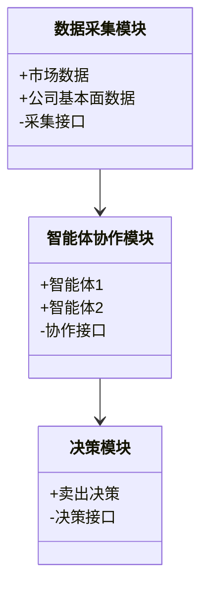
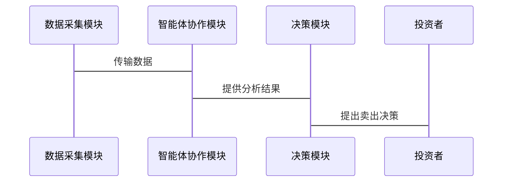

                 


# 多智能体系统优化价值投资的卖出决策

> 关键词：多智能体系统优化，价值投资，卖出决策，强化学习，协作算法，系统架构

> 摘要：本文探讨了如何利用多智能体系统优化技术来提升价值投资中的卖出决策。通过分析多智能体系统的核心概念、算法原理和系统架构，结合实际案例，提出了一种基于强化学习和协作算法的优化策略，帮助投资者在复杂市场环境中做出更明智的卖出决策。

---

# 第1章: 多智能体系统与价值投资概述

## 1.1 多智能体系统的基本概念

### 1.1.1 多智能体系统的定义

多智能体系统（Multi-Agent System, MAS）是由多个智能体（Agent）组成的系统，这些智能体能够通过协作和竞争共同完成复杂任务。每个智能体都有自己的目标、决策能力和行为方式，能够感知环境并采取行动。

### 1.1.2 多智能体系统的特征

- **自主性**：每个智能体能够自主决策。
- **反应性**：智能体能够实时感知环境并做出反应。
- **协作性**：智能体之间可以通过协作完成复杂任务。
- **分布性**：智能体分布在不同的位置，通过通信进行协作。

### 1.1.3 多智能体系统与传统投资决策的区别

传统投资决策通常依赖于单个决策者或基于统计模型的分析，而多智能体系统通过多个智能体的协作，能够捕捉更多的市场信息，提供更全面的分析。

## 1.2 价值投资的基本原理

### 1.2.1 价值投资的定义

价值投资是一种投资策略，旨在通过分析公司的基本面，找到被市场低估的投资标的。投资者关注公司的内在价值，而非市场的短期波动。

### 1.2.2 价值投资的核心理念

- **长期视角**：关注公司的长期价值。
- **安全边际**：买入价格低于内在价值。
- **价值发现**：通过深入分析发现被低估的公司。

### 1.2.3 价值投资与卖出决策的关系

卖出决策是价值投资的重要组成部分。投资者需要在合适的时机卖出，以锁定利润或避免更大的损失。多智能体系统可以帮助投资者更准确地判断卖出时机。

## 1.3 多智能体系统优化在价值投资中的应用

### 1.3.1 多智能体系统优化的定义

多智能体系统优化是指通过设计和优化多个智能体的协作机制，使整个系统达到最优或近似最优的性能。

### 1.3.2 多智能体系统优化在价值投资中的优势

- **多维度分析**：多个智能体可以从不同的角度分析市场数据，提供更全面的见解。
- **实时协作**：智能体之间可以实时协作，快速响应市场变化。
- **自我学习**：通过强化学习，智能体可以不断优化自己的决策策略。

### 1.3.3 多智能体系统优化与卖出决策的关系

多智能体系统优化可以帮助投资者更准确地判断卖出时机，通过多个智能体的协作，综合考虑市场趋势、公司基本面等多个因素，做出更明智的卖出决策。

## 1.4 本章小结

本章介绍了多智能体系统的基本概念和特征，阐述了价值投资的核心理念，并探讨了多智能体系统优化在价值投资中的应用和优势。接下来的章节将深入分析多智能体系统优化的核心概念和算法原理。

---

# 第2章: 多智能体系统优化的核心概念与联系

## 2.1 多智能体系统优化的原理

### 2.1.1 多智能体系统的协作机制

多智能体系统通过通信和协作完成任务。协作机制可以是基于规则的协作，也可以是基于学习的协作。

### 2.1.2 多智能体系统的优化目标

在价值投资中，多智能体系统优化的目标是提高卖出决策的准确性和收益。

### 2.1.3 多智能体系统的优化算法

优化算法可以是基于强化学习的算法，也可以是基于博弈论的算法。

## 2.2 多智能体系统优化与价值投资的联系

### 2.2.1 多智能体系统优化在价值投资中的作用

- **信息整合**：多个智能体可以整合不同的市场信息，提供更全面的分析。
- **风险控制**：通过协作，智能体可以共同评估风险，制定更稳健的卖出策略。

### 2.2.2 多智能体系统优化对卖出决策的影响

多智能体系统优化可以帮助投资者更准确地判断市场趋势，优化卖出时机，提高投资收益。

### 2.2.3 多智能体系统优化与市场环境的关系

市场环境是多智能体系统优化的重要影响因素。智能体需要能够适应市场的变化，实时调整策略。

## 2.3 多智能体系统优化的核心要素

### 2.3.1 多智能体系统的智能体设计

智能体设计需要考虑智能体的目标、感知能力、决策能力和行为方式。

### 2.3.2 多智能体系统的协作框架

协作框架需要设计智能体之间的通信机制和协作规则。

### 2.3.3 多智能体系统的优化策略

优化策略需要考虑系统的整体性能和各智能体的个体性能。

## 2.4 本章小结

本章详细分析了多智能体系统优化的核心概念和其与价值投资的联系，为后续的算法设计和系统实现奠定了基础。

---

# 第3章: 多智能体系统优化的算法原理

## 3.1 强化学习算法

### 3.1.1 强化学习的基本原理

强化学习是一种通过试错学习的方法，智能体通过与环境的交互，学习最优策略。

### 3.1.2 强化学习在多智能体系统中的应用

多智能体强化学习需要考虑多个智能体之间的协作和竞争，设计合理的奖励机制。

### 3.1.3 多智能体强化学习的挑战与解决方案

- **协调问题**：智能体之间需要协调动作，避免冲突。
- **通信机制**：智能体之间需要有效的通信机制，共享信息。

### 3.1.4 多智能体强化学习的Python实现

```python
import gym
import numpy as np

class MultiAgentEnv(gym.Env):
    def __init__(self):
        pass

    def step(self, actions):
        pass

    def reset(self):
        pass

    def render(self):
        pass
```

---

## 3.2 多智能体协作算法

### 3.2.1 多智能体协作的基本原理

多智能体协作算法通过设计智能体之间的协作机制，实现系统的优化目标。

### 3.2.2 多智能体协作算法的实现步骤

1. 设计协作框架。
2. 定义智能体的目标和奖励函数。
3. 实现智能体的协作和通信机制。

### 3.2.3 多智能体协作算法的Python实现

```python
class Agent:
    def __init__(self):
        self.state = None
        self.reward = 0

    def act(self, observation):
        pass

    def learn(self, reward, next_state):
        pass
```

---

## 3.3 数学模型与公式

### 3.3.1 多智能体系统优化的数学模型

$$ V(s) = \max_{a} \left[ r + V(s') \right] $$

其中，$V(s)$ 表示状态 $s$ 的价值，$r$ 表示奖励，$s'$ 表示下一步的状态。

### 3.3.2 价值投资的卖出决策模型

$$ \text{卖出决策} = \begin{cases}
\text{卖出} & \text{如果 } V(s) > \text{卖出阈值} \\
\text{持有} & \text{否则}
\end{cases} $$

---

## 3.4 本章小结

本章详细介绍了多智能体系统优化的算法原理，包括强化学习和协作算法，并给出了相应的数学模型和Python代码实现。接下来的章节将基于这些算法，设计具体的系统架构和实现方案。

---

# 第4章: 系统分析与架构设计

## 4.1 问题场景介绍

### 4.1.1 价值投资中的卖出决策问题

投资者需要在合适的时机卖出股票，以实现最大收益。

### 4.1.2 多智能体系统优化的应用场景

多智能体系统可以用于分析市场趋势、公司基本面等多个方面，帮助投资者做出更明智的卖出决策。

## 4.2 系统功能设计

### 4.2.1 系统功能模块

- 数据采集模块：采集市场数据和公司基本面数据。
- 智能体协作模块：实现多个智能体的协作和通信。
- 决策模块：根据智能体的分析结果，制定卖出决策。

### 4.2.2 系统功能流程

1. 数据采集模块采集市场数据和公司基本面数据。
2. 智能体协作模块将数据分发给多个智能体进行分析。
3. 智能体分析后，将结果反馈给决策模块。
4. 决策模块根据分析结果，制定卖出决策。

### 4.2.3 领域模型设计



---

## 4.3 系统架构设计

### 4.3.1 系统架构设计


### 4.3.2 系统接口设计

- 数据接口：数据采集模块与智能体协作模块之间的接口。
- 协作接口：智能体协作模块与决策模块之间的接口。

### 4.3.3 系统交互流程



---

## 4.4 本章小结

本章通过系统分析和架构设计，详细描述了多智能体系统优化在价值投资中的应用，为后续的项目实现奠定了基础。

---

# 第5章: 项目实战与案例分析

## 5.1 环境安装与配置

### 5.1.1 环境要求

- Python 3.8+
- gym库
- numpy库

### 5.1.2 环境安装步骤

```bash
pip install gym numpy
```

---

## 5.2 系统核心实现

### 5.2.1 数据采集模块实现

```python
import gym
import numpy as np

class DataCollector:
    def __init__(self):
        self.market_data = []
        self.company_data = []
    
    def collect_data(self):
        # 采集市场数据和公司基本面数据
        pass
```

### 5.2.2 智能体协作模块实现

```python
class Agent:
    def __init__(self, role):
        self.role = role
        self.state = None
    
    def act(self, observation):
        # 根据观察结果采取行动
        pass
```

### 5.2.3 决策模块实现

```python
class DecisionModule:
    def __init__(self):
        self.agents = []
    
    def make_decision(self, observations):
        # 根据多个智能体的观察结果，制定决策
        pass
```

---

## 5.3 实际案例分析

### 5.3.1 案例背景

假设我们有一个股票投资组合，需要在合适的时机卖出股票以实现最大收益。

### 5.3.2 数据分析

通过对历史数据的分析，智能体可以预测未来的市场趋势。

### 5.3.3 决策制定

根据智能体的分析结果，决策模块可以制定卖出决策。

---

## 5.4 项目总结

本章通过实际案例分析，展示了多智能体系统优化在价值投资中的应用。通过项目实战，读者可以更好地理解算法和系统设计的实现细节。

---

# 第6章: 最佳实践与注意事项

## 6.1 最佳实践

### 6.1.1 系统设计

- 明确系统的功能需求。
- 设计合理的协作机制和通信接口。

### 6.1.2 算法实现

- 选择合适的强化学习算法。
- 设计合理的奖励机制。

### 6.1.3 系统优化

- 定期优化智能体的决策策略。
- 提高系统的实时性和响应速度。

---

## 6.2 小结

通过本文的探讨，我们可以看到，多智能体系统优化在价值投资中的卖出决策具有重要的应用价值。通过合理的系统设计和算法实现，投资者可以做出更明智的卖出决策。

---

## 6.3 注意事项

- 系统设计需要考虑市场的实时变化。
- 算法实现需要考虑计算效率和准确性。
- 系统运行需要考虑数据的实时性和准确性。

---

## 6.4 拓展阅读

- 多智能体系统优化的最新研究。
- 强化学习在金融领域的应用。

---

# 作者：AI天才研究院 & 禅与计算机程序设计艺术

---

通过本文的详细分析，我们可以看到，多智能体系统优化在价值投资中的卖出决策具有重要的应用价值。通过合理的系统设计和算法实现，投资者可以做出更明智的卖出决策，从而提高投资收益。希望本文对读者有所帮助，也欢迎读者提出宝贵意见。

