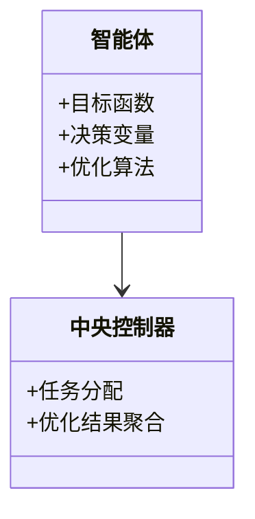
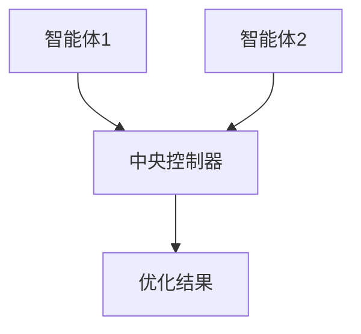
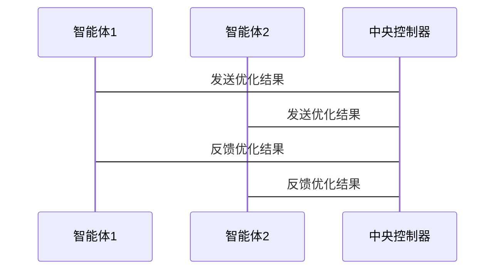

                 


# 多智能体系统优化价值投资的资产配置

> 关键词：多智能体系统，价值投资，资产配置，优化算法，金融建模

> 摘要：本文探讨了多智能体系统在优化价值投资资产配置中的应用，通过详细分析多智能体系统的核心概念、优化算法、数学模型以及实际案例，揭示了多智能体系统如何通过协同优化提升投资决策的效率和准确性。

---

# 第一部分: 多智能体系统与价值投资背景

## # 第1章: 多智能体系统与价值投资背景

### ## 1.1 多智能体系统的定义与特点
#### ### 1.1.1 多智能体系统的定义
多智能体系统（Multi-Agent System, MAS）是由多个智能体（Agent）组成的分布式系统，每个智能体具备自主性、反应性、目标导向性和协作性等特性。智能体能够通过感知环境、自主决策并采取行动，以实现特定目标。

#### ### 1.1.2 多智能体系统的核心特点
- **自主性**：智能体能够自主决策，无需外部集中控制。
- **反应性**：智能体能够实时感知环境变化并做出反应。
- **目标导向性**：每个智能体都有明确的目标，并通过协作实现整体目标。
- **分布式性**：智能体之间通过分布式通信进行协作。

#### ### 1.1.3 多智能体系统与传统单智能体系统的区别
| 特性 | 单智能体系统 | 多智能体系统 |
|------|--------------|--------------|
| 控制方式 | 集中式控制 | 分布式控制 |
| 决策速度 | 中央决策，可能较慢 | 分布式决策，快速响应 |
| 可扩展性 | 较低 | 较高 |
| 系统复杂性 | 较低 | 较高 |

### ## 1.2 价值投资的基本原理
#### ### 1.2.1 价值投资的定义
价值投资是一种投资策略，旨在通过分析企业的基本面（如财务状况、盈利能力、行业地位等），寻找市场价格低于其内在价值的股票进行投资。

#### ### 1.2.2 价值投资的核心理念
- **安全边际**：购买价格低于内在价值，以降低投资风险。
- **长期视角**：关注企业的长期盈利能力，而非短期价格波动。
- **分散投资**：通过合理资产配置降低风险。

#### ### 1.2.3 价值投资与资产配置的关系
资产配置是将资金分配到不同的资产类别（如股票、债券、现金等）中，以实现风险和收益的平衡。价值投资强调在资产配置中选择低估资产，通过多智能体系统的优化，进一步提升资产配置的效率和准确性。

### ## 1.3 多智能体系统在价值投资中的应用背景
#### ### 1.3.1 传统资产配置的局限性
- **信息处理能力有限**：单智能体系统难以处理海量金融数据。
- **决策效率低**：集中式决策可能导致延迟。
- **适应性差**：难以快速响应市场变化。

#### ### 1.3.2 多智能体系统在金融领域的优势
- **分布式计算能力**：多智能体系统能够并行处理大量数据，提升计算效率。
- **实时协作**：智能体之间可以实时通信，快速响应市场变化。
- **多样化决策**：多个智能体可以从不同角度分析问题，提高决策的全面性。

#### ### 1.3.3 价值投资与多智能体系统的结合
通过多智能体系统的分布式优化能力，价值投资者可以在海量数据中快速识别低估资产，并通过动态调整资产配置应对市场波动。

---

## # 第2章: 多智能体系统优化价值投资的核心概念

### ## 2.1 多智能体系统优化的数学模型
#### ### 2.1.1 多智能体系统优化的基本框架
$$
\text{目标函数} = \sum_{i=1}^{n} f_i(x_i)
$$
其中，$f_i(x_i)$ 表示第 $i$ 个智能体的目标函数，$x_i$ 是智能体的决策变量。

#### ### 2.1.2 优化目标与约束条件
优化目标：最大化投资收益，最小化投资风险。
约束条件：
1. $\sum_{i=1}^{n} w_i = 1$（权重之和为1）
2. $w_i \geq 0$（权重非负）

#### ### 2.1.3 数学模型的构建与分析
以资产配置为例，假设我们有 $n$ 种资产，每个智能体负责优化一种资产的权重。目标是最小化风险（方差）并最大化收益。

数学模型：
$$
\min \sum_{i=1}^{n} w_i^2
$$
$$
\text{s.t.} \quad \sum_{i=1}^{n} w_i = 1, \quad w_i \geq 0
$$

### ## 2.2 价值投资与资产配置的关联
#### ### 2.2.1 资产配置的基本原理
资产配置是根据投资者的风险承受能力和收益目标，将资金分配到不同资产类别中。

#### ### 2.2.2 价值投资对资产配置的影响
价值投资强调低估资产的识别，因此在资产配置中需要优先考虑具有较低市场价格但较高内在价值的资产。

#### ### 2.2.3 多智能体系统如何优化资产配置
通过多智能体系统的协同优化，可以实现资产权重的动态调整，以适应市场变化和投资目标。

### ## 2.3 多智能体系统优化价值投资的实现机制
#### ### 2.3.1 多智能体系统的协同机制
- **通信机制**：智能体之间通过共享信息进行协作。
- **协调机制**：通过分布式算法实现目标一致。

#### ### 2.3.2 优化算法的选择与应用
选择适合的优化算法（如分布式优化算法）来实现多智能体系统的协同优化。

#### ### 2.3.3 价值投资策略的动态调整
根据市场反馈动态调整资产配置，确保投资策略的有效性。

---

## # 第3章: 多智能体系统优化价值投资的算法原理

### ## 3.1 分布式优化算法
#### ### 3.1.1 分布式优化的基本概念
分布式优化算法是一种在分布式系统中进行优化的方法，每个节点独立优化局部目标函数，通过通信达到全局最优。

#### ### 3.1.2 分布式优化算法的实现流程
1. 初始化：每个智能体初始化局部目标函数。
2. 优化：每个智能体独立优化局部目标函数。
3. 通信：智能体之间共享优化结果。
4. 聚合：全局优化结果基于局部优化结果进行聚合。

#### ### 3.1.3 分布式优化算法在多智能体系统中的应用
以资产权重优化为例，每个智能体负责优化一种资产的权重，通过通信达到全局最优。

### ## 3.2 联合优化算法
#### ### 3.2.1 联合优化的基本原理
联合优化算法通过协调多个智能体的优化过程，实现全局优化目标。

#### ### 3.2.2 联合优化算法的实现步骤
1. 初始化：设置初始参数。
2. 分配任务：将优化任务分配给多个智能体。
3. 优化：每个智能体独立优化分配的任务。
4. 联合优化：将所有智能体的优化结果进行联合优化。

#### ### 3.2.3 联合优化算法在价值投资中的应用案例
通过联合优化算法，优化多个资产的权重，以实现收益与风险的最优平衡。

### ## 3.3 进化算法
#### ### 3.3.1 进化算法的基本概念
进化算法是一种基于自然选择和遗传机制的优化算法，常用于解决复杂优化问题。

#### ### 3.3.2 进化算法在多智能体系统中的应用
通过进化算法优化智能体的行为策略，以实现整体优化目标。

#### ### 3.3.3 进化算法优化价值投资策略的实现
以股票组合优化为例，通过进化算法优化股票组合的权重，以实现最大收益和最小风险。

---

## # 第4章: 多智能体系统优化价值投资的数学模型与公式

### ## 4.1 优化目标的数学表达
#### ### 4.1.1 资产配置的优化目标
$$
\min \sum_{i=1}^{n} w_i^2
$$
$$
\text{s.t.} \quad \sum_{i=1}^{n} w_i = 1, \quad w_i \geq 0
$$

#### ### 4.1.2 多智能体系统优化的数学表达式
$$
\sum_{i=1}^{n} f_i(x_i) = \text{全局目标函数}
$$

#### ### 4.1.3 约束条件
1. $\sum_{i=1}^{n} w_i = 1$
2. $w_i \geq 0$

### ## 4.2 分布式优化算法的数学模型
$$
x_i^{(k+1)} = \arg\min_{x_i} f_i(x_i) + \lambda \sum_{j=1}^{n} (x_j^{(k)} - x_i)
$$

---

## # 第5章: 系统分析与架构设计

### ## 5.1 项目介绍
我们开发了一个基于多智能体系统的价值投资优化平台，旨在通过分布式计算提升资产配置的效率和准确性。

### ## 5.2 系统功能设计
#### ### 5.2.1 领域模型


#### ### 5.2.2 系统架构设计


#### ### 5.2.3 接口设计
- **输入接口**：接收市场数据和投资目标。
- **输出接口**：输出优化后的资产配置方案。

#### ### 5.2.4 系统交互


### ## 5.3 项目实战

#### ### 5.3.1 环境安装
```bash
pip install numpy matplotlib
```

#### ### 5.3.2 核心实现
```python
import numpy as np

def distributed_optimization(n_agents, initial_weights):
    agents = [Agent(i) for i in range(n_agents)]
    central_controller = CentralController()
    for agent in agents:
        agent.optimize(initial_weights)
    central_controller.aggregate(agents)
    return central_controller.result

class Agent:
    def __init__(self, id):
        self.id = id
        self.weights = np.random.rand(10,)

    def optimize(self, initial_weights):
        # 具体优化逻辑
        pass

class CentralController:
    def __init__(self):
        pass

    def aggregate(self, agents):
        # 聚合优化结果
        pass
```

---

## # 第6章: 总结与展望

### ## 6.1 总结
本文详细探讨了多智能体系统在优化价值投资资产配置中的应用，通过数学建模、算法设计和系统实现，展示了多智能体系统在金融领域的巨大潜力。

### ## 6.2 展望
未来，随着人工智能和分布式计算技术的发展，多智能体系统将在金融领域发挥越来越重要的作用，进一步推动价值投资的优化与创新。

---

作者：AI天才研究院/AI Genius Institute & 禅与计算机程序设计艺术 /Zen And The Art of Computer Programming

