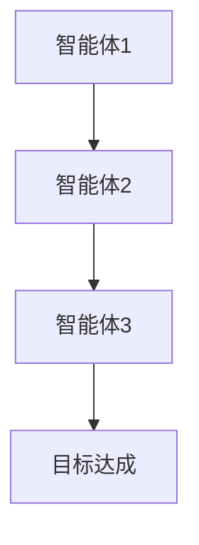

                 


# 多智能体系统分析产业生态系统

> 关键词：多智能体系统, 产业生态系统, 系统架构, 算法原理, 项目实战

> 摘要：多智能体系统（Multi-Agent Systems, MAS）是一种由多个智能体组成的分布式系统，这些智能体通过协作和竞争来实现共同目标。本文从多智能体系统的背景出发，分析其核心概念与产业生态系统的联系，详细讲解相关算法原理，探讨系统架构设计，并通过项目实战展示其应用。本文旨在帮助读者全面理解多智能体系统在现代产业生态系统中的作用及其实际应用。

---

# 第1章: 多智能体系统概述

## 1.1 多智能体系统的定义与特点

### 1.1.1 多智能体系统的定义
多智能体系统（Multi-Agent Systems, MAS）是由多个智能体（Agent）组成的分布式系统，这些智能体通过协作和竞争完成特定任务。智能体是指能够感知环境、自主决策并采取行动的实体。

### 1.1.2 多智能体系统的核心特点
- **自主性**：智能体能够自主决策，无需外部干预。
- **反应性**：智能体能够实时感知环境并做出反应。
- **协作性**：多个智能体通过协作完成共同目标。
- **分布性**：智能体之间通过分布式架构进行通信和协调。
- **动态性**：系统环境和智能体状态可能动态变化。

### 1.1.3 多智能体系统与单智能体系统的区别
| 特性 | 单智能体系统 | 多智能体系统 |
|------|--------------|--------------|
| 决策 | 中央决策 | 分布式决策 |
| 交互 | 无交互 | 智能体之间有交互 |
| 复杂性 | 简单 | 复杂 |
| 应用场景 | 单任务 | 多任务协作 |

---

## 1.2 产业生态系统的基本概念

### 1.2.1 产业生态系统的定义
产业生态系统是指由企业、消费者、供应商、合作伙伴等组成的复杂经济系统，这些参与者通过协作和竞争共同推动产业发展。

### 1.2.2 产业生态系统的组成要素
- **企业**：包括制造商、服务提供商等。
- **消费者**：最终用户。
- **供应商**：提供原材料或技术的企业。
- **合作伙伴**：如代理商、分销商。
- **政府**：制定政策和法规。

### 1.2.3 产业生态系统的特点
- **动态性**：市场环境不断变化。
- **复杂性**：参与者众多，关系复杂。
- **协作性**：参与者通过协作实现共赢。
- **竞争性**：参与者之间存在竞争。

---

## 1.3 多智能体系统与产业生态系统的结合

### 1.3.1 多智能体系统在产业生态系统中的作用
- **优化资源配置**：通过智能体协作，提高资源利用效率。
- **提升决策效率**：智能体能够快速响应市场变化。
- **促进创新**：通过智能体之间的协作，推动技术和服务创新。

### 1.3.2 多智能体系统与产业生态系统的相互关系
多智能体系统为产业生态系统提供了技术支持，而产业生态系统为多智能体系统提供了应用场景。

### 1.3.3 多智能体系统在产业生态系统中的应用前景
- **智能制造**：通过智能体协作实现生产过程的优化。
- **供应链管理**：智能体协调供应链中的各个环节。
- **金融服务**：智能体用于风险评估和交易决策。

---

# 第2章: 多智能体系统的核心概念与联系

## 2.1 多智能体系统的原理

### 2.1.1 多智能体系统的基本原理
多智能体系统通过智能体之间的通信和协作，完成特定任务。智能体之间通过消息传递进行通信，通过协商和协调完成任务。

### 2.1.2 多智能体系统的分类
- **基于任务的多智能体系统**：智能体协作完成特定任务。
- **基于市场的多智能体系统**：智能体通过市场机制进行资源分配。
- **基于知识的多智能体系统**：智能体通过共享知识实现协作。

### 2.1.3 多智能体系统的优缺点
- **优点**：灵活性高、适应性强、协作能力强。
- **缺点**：复杂性高、通信开销大、协调困难。

---

## 2.2 产业生态系统中的多智能体系统

### 2.2.1 多智能体系统在产业生态系统中的核心要素
- **智能体**：企业、消费者、供应商等。
- **通信机制**：消息传递、数据共享。
- **协作机制**：任务分配、资源分配。

### 2.2.2 多智能体系统与产业生态系统的联系
多智能体系统通过智能体协作，优化产业生态系统的运行效率。

---

## 2.3 多智能体系统与产业生态系统的关系

### 2.3.1 多智能体系统对产业生态系统的影响
- **提高效率**：通过智能体协作，优化资源配置。
- **增强灵活性**：智能体能够快速响应市场变化。
- **促进创新**：智能体协作推动技术和服务创新。

### 2.3.2 产业生态系统对多智能体系统的影响
- **提供应用场景**：多智能体系统在产业生态系统中找到应用。
- **推动技术发展**：产业生态系统的需求推动多智能体技术的进步。

---

# 第3章: 多智能体系统的算法原理

## 3.1 一致性算法

### 3.1.1 一致性算法的定义
一致性算法用于保证分布式系统中多个智能体的状态一致。

### 3.1.2 一致性算法的分类
- **强一致性**：保证所有副本同步。
- **弱一致性**：允许副本延迟同步。

### 3.1.3 一致性算法的实现
通过消息传递和状态同步实现一致性。

---

## 3.2 分布式规划与协调算法

### 3.2.1 分布式规划的定义
分布式规划算法用于智能体在分布式环境中制定计划。

### 3.2.2 分布式规划的实现
通过分布式计算和协作完成规划。

---

## 3.3 协调与通信算法

### 3.3.1 协调算法的定义
协调算法用于智能体之间协调行动。

### 3.3.2 协调算法的实现
通过消息传递和协商完成协调。

---

# 第4章: 多智能体系统的数学模型

## 4.1 一致性模型

### 4.1.1 一致性模型的定义
一致性模型用于描述分布式系统中智能体的状态一致性。

### 4.1.2 一致性模型的数学表达
$$ s_i = s_j \quad \text{对于所有智能体} i, j $$

---

## 4.2 博弈论模型

### 4.2.1 博弈论模型的定义
博弈论模型用于描述智能体之间的竞争与协作。

### 4.2.2 博弈论模型的数学表达
$$ \text{收益} = \sum_{i=1}^n a_i \cdot s_i $$

---

# 第5章: 系统分析与架构设计

## 5.1 问题场景介绍

### 5.1.1 问题背景
多智能体系统在产业生态系统中的应用需要解决的问题。

### 5.1.2 问题描述
智能体之间的通信、协作和协调问题。

### 5.1.3 问题解决
通过算法和架构设计解决协作问题。

---

## 5.2 系统功能设计

### 5.2.1 系统功能模块
- **通信模块**：智能体之间通信。
- **协作模块**：智能体协作完成任务。
- **协调模块**：智能体协调行动。

### 5.2.2 系统功能流程图


---

## 5.3 系统架构设计

### 5.3.1 系统架构图


---

## 5.4 系统接口设计

### 5.4.1 系统接口
- **通信接口**：智能体之间通信接口。
- **协作接口**：智能体协作接口。
- **协调接口**：智能体协调接口。

---

## 5.5 系统交互设计

### 5.5.1 系统交互流程图
```mermaid
sequence
    智能体1 -> 智能体2: 发送消息
    智能体2 -> 智能体3: 发送消息
    智能体3 -> 智能体1: 发送确认消息
```

---

# 第6章: 项目实战

## 6.1 环境安装

### 6.1.1 环境要求
- **操作系统**：Linux/Windows/MacOS
- **编程语言**：Python
- **开发工具**：PyCharm/VSCode

---

## 6.2 核心代码实现

### 6.2.1 多智能体通信代码
```python
class Agent:
    def __init__(self, id):
        self.id = id
        self.state = None

    def send_message(self, message, agent):
        agent.receive_message(message)

    def receive_message(self, message):
        self.state = message
```

---

## 6.3 项目小结

### 6.3.1 项目总结
通过项目实战，我们掌握了多智能体系统的实现方法。

### 6.3.2 经验总结
- **通信机制**：智能体之间需要高效的通信机制。
- **协作机制**：协作机制需要简洁高效。
- **协调机制**：协调机制需要灵活。

---

# 第7章: 扩展与未来趋势

## 7.1 多智能体系统的前沿技术

### 7.1.1 边缘计算
边缘计算用于多智能体系统的分布式计算。

### 7.1.2 区块链
区块链用于多智能体系统的信任机制。

---

## 7.2 未来研究方向

### 7.2.1 智能体学习
研究智能体的自适应学习能力。

### 7.2.2 多智能体系统优化
优化多智能体系统的通信和协作效率。

---

## 7.3 挑战与机遇

### 7.3.1 挑战
- **通信延迟**：智能体之间的通信延迟问题。
- **协作复杂性**：多智能体协作的复杂性。

### 7.3.2 机遇
- **技术创新**：多智能体系统的技术创新机遇。
- **应用场景扩展**：多智能体系统的应用场景扩展。

---

# 小结

通过本文的分析，我们全面了解了多智能体系统在产业生态系统中的应用。从核心概念到算法原理，从系统设计到项目实战，我们掌握了多智能体系统的实现方法。未来，随着技术的发展，多智能体系统将在更多领域得到应用。

---

# 作者：AI天才研究院/AI Genius Institute & 禅与计算机程序设计艺术 /Zen And The Art of Computer Programming

