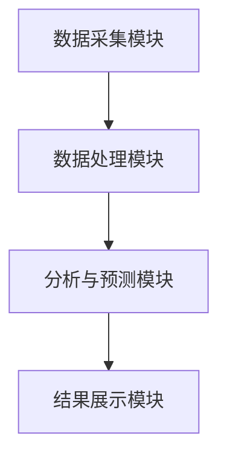

                 


# 多智能体系统分析全球资金流向

> 关键词：多智能体系统、全球资金流向分析、分布式计算、博弈论、数据挖掘、金融数据分析

> 摘要：本文详细探讨了多智能体系统在全球资金流向分析中的应用，从基础概念到系统架构，从算法原理到项目实战，全面解析了如何利用多智能体系统进行高效、准确的资金流向分析。通过理论与实践相结合的方式，为读者提供了一套完整的解决方案。

---

## 第1章: 多智能体系统概述

### 1.1 多智能体系统的定义与特点

#### 1.1.1 多智能体系统的定义
多智能体系统（Multi-Agent Systems, MAS）是由多个相互作用的智能体（Agent）组成的复杂系统。每个智能体都是一个能够感知环境、做出决策并执行动作的实体。这些智能体通过协作与竞争，共同完成复杂的任务。

#### 1.1.2 多智能体系统的分类
多智能体系统可以分为以下几类：
1. **基于智能体结构的分类**：
   - 单智能体系统
   - 多智能体系统
2. **基于任务的分类**：
   - 任务协作型
   - 任务竞争型
3. **基于智能体智能水平的分类**：
   - 简单反应型
   - 基于模型的反应型
   - 目标驱动型
   - 深度智能型

#### 1.1.3 多智能体系统的特点
- **分布性**：智能体分布在不同的节点上，独立运行。
- **协作性**：智能体之间通过协作完成复杂任务。
- **动态性**：系统环境动态变化，智能体需要实时响应。
- **可扩展性**：系统可以根据需求扩展智能体数量。

---

### 1.2 多智能体系统的核心概念

#### 1.2.1 智能体的定义与属性
智能体是一种能够感知环境、做出决策并执行动作的实体。其核心属性包括：
- **感知能力**：通过传感器或其他方式获取环境信息。
- **决策能力**：基于感知信息做出决策。
- **执行能力**：通过执行器或其他方式执行决策。

#### 1.2.2 多智能体系统中的交互关系
智能体之间的交互关系可以分为以下几种：
1. **协作关系**：智能体之间相互协作，共同完成任务。
2. **竞争关系**：智能体之间存在竞争，争夺资源。
3. **中立关系**：智能体之间既不协作也不竞争。

#### 1.2.3 系统的复杂性与可扩展性
多智能体系统的复杂性主要来源于智能体之间的交互关系和环境的动态变化。系统的可扩展性则取决于智能体的设计和系统的架构。

---

## 第2章: 全球资金流向分析的背景与挑战

### 2.1 全球资金流向分析的背景

#### 2.1.1 全球化经济与资金流动的复杂性
全球化使得资金流动更加频繁和复杂。资金流向分析需要考虑多个因素，包括经济政策、市场波动、地缘政治等。

#### 2.1.2 传统资金流向分析方法的局限性
传统方法主要依赖于统计分析和专家经验，难以应对复杂多变的全球资金流动。

---

### 2.2 多智能体系统在资金流向分析中的优势

#### 2.2.1 高效性与实时性
多智能体系统能够实时感知市场变化，快速做出决策。

#### 2.2.2 分布式计算与数据处理能力
多智能体系统通过分布式计算，能够高效处理海量数据。

#### 2.2.3 多维度数据的整合与分析能力
多智能体系统能够整合多维度数据，进行全面分析，提供更准确的资金流向预测。

---

## 第3章: 多智能体系统的核心算法与数学模型

### 3.1 分布式计算与多智能体协作算法

#### 3.1.1 分布式计算的基本原理
分布式计算通过将任务分解为多个子任务，分配给不同的智能体执行，最终汇总结果。

#### 3.1.2 多智能体协作的算法实现
以下是多智能体协作算法的伪代码示例：

```python
def distributed_algorithm():
    # 初始化
    agents = create_agents()
    tasks = distribute_tasks(agents)
    
    # 执行任务
    results = collect_results(agents)
    
    # 汇总结果
    final_result = merge_results(results)
    return final_result
```

#### 3.1.3 算法的复杂度分析
分布式计算的复杂度主要取决于任务分解和结果汇总的方式。复杂度可以通过以下公式计算：

$$
O(n) = O(m) + O(k)
$$

其中，$n$ 是智能体数量，$m$ 是任务分解复杂度，$k$ 是结果汇总复杂度。

---

### 3.2 博弈论与多智能体决策模型

#### 3.2.1 博弈论的基本概念
博弈论研究多个参与者在策略互动中的行为模式。多智能体决策模型可以看作是一种博弈论的应用。

#### 3.2.2 多智能体决策模型的构建
以下是构建多智能体决策模型的步骤：

1. **定义参与者**：确定智能体的数量和角色。
2. **定义策略**：为每个智能体定义决策策略。
3. **定义收益函数**：为每个智能体定义收益函数。
4. **求解 Nash均衡**：找到所有智能体的最优决策。

#### 3.2.3 决策模型的优化与应用
以下是一个简单的博弈论模型：

$$
\text{收益} = \sum_{i=1}^{n} \text{智能体} i \text{的收益}
$$

---

## 第4章: 全球资金流向分析的系统架构设计

### 4.1 系统功能模块设计

#### 4.1.1 数据采集模块
数据采集模块负责从多个数据源采集资金流动数据，包括股票市场、外汇市场、债券市场等。

#### 4.1.2 数据处理模块
数据处理模块对采集的数据进行清洗、转换和预处理，为后续分析提供高质量的数据。

#### 4.1.3 分析与预测模块
分析与预测模块利用多智能体系统的核心算法，对资金流向进行分析和预测。

---

### 4.2 系统架构图



---

## 第5章: 项目实战与代码实现

### 5.1 环境搭建与数据准备

#### 5.1.1 开发环境配置
需要安装 Python、Jupyter Notebook、Pandas、NumPy 等工具。

#### 5.1.2 数据源获取与预处理
从金融数据API获取数据，并进行清洗和转换。

---

### 5.2 核心算法实现

#### 5.2.1 分布式计算代码实现

```python
import numpy as np
import pandas as pd

def distributed_algorithm(data):
    # 分解任务
    agents = ['agent1', 'agent2', 'agent3']
    tasks = np.array_split(data, len(agents))
    
    # 分配任务
    results = []
    for agent in agents:
        result = process_task(tasks[agents.index(agent)])
        results.append(result)
    
    # 汇总结果
    final_result = merge_results(results)
    return final_result

def process_task(task):
    # 具体任务处理逻辑
    return task.mean()

def merge_results(results):
    # 汇总结果
    return np.mean(results)
```

---

## 第6章: 最佳实践与注意事项

### 6.1 实践中的常见问题与解决方案

#### 6.1.1 数据质量问题
解决方案：确保数据源的可靠性和数据清洗的充分性。

#### 6.1.2 算法优化问题
解决方案：根据实际需求，优化算法复杂度和计算效率。

#### 6.1.3 系统性能问题
解决方案：优化系统架构设计，减少通信开销。

---

### 6.2 小结与拓展阅读

#### 6.2.1 本书总结
本文详细介绍了多智能体系统在资金流向分析中的应用，从理论到实践，为读者提供了一套完整的解决方案。

#### 6.2.2 拓展阅读推荐
1. 《Multi-Agent Systems: Complexity and Intelligence》
2. 《博弈论与经济行为》

---

作者：AI天才研究院/AI Genius Institute & 禅与计算机程序设计艺术 /Zen And The Art of Computer Programming

