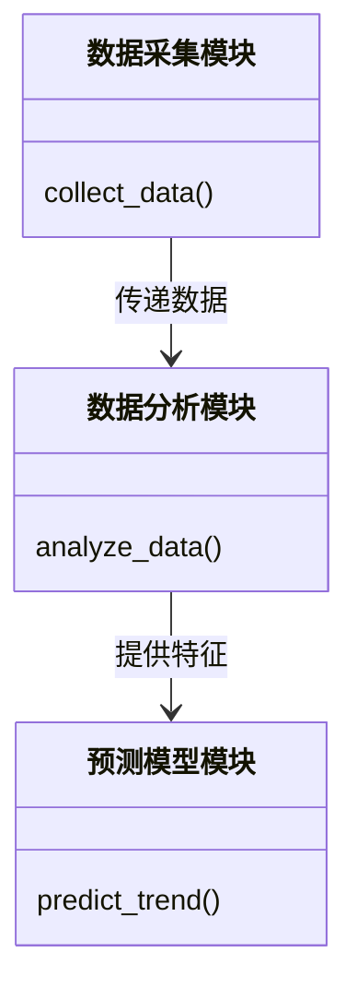
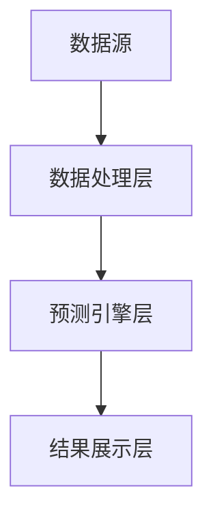
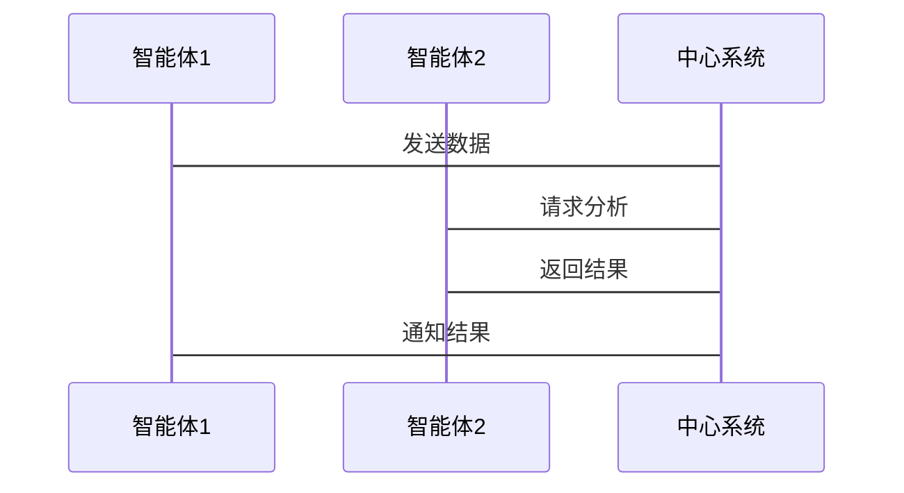

                 


# 多智能体系统在产业升级趋势预测中的应用：把握结构性机会

## 关键词：多智能体系统，产业升级，趋势预测，人工智能，分布式计算

## 摘要：多智能体系统通过协同多个智能体，利用分布式计算和博弈论模型，有效预测产业升级趋势，优化企业决策，提升产业竞争力。本文深入分析多智能体系统的核心概念、算法原理、系统架构，并通过实际案例展示其在产业升级中的应用，为把握结构性机会提供技术支持。

---

# 第1章 多智能体系统与产业升级概述

## 1.1 多智能体系统的基本概念

### 1.1.1 多智能体系统的定义
多智能体系统（Multi-Agent System, MAS）是由多个智能体（Agent）组成的分布式系统，每个智能体具备自主性、反应性、目标导向和协作性，能够独立决策并与其他智能体协同完成复杂任务。

### 1.1.2 多智能体系统的特征
- **自主性**：智能体能够独立决策。
- **反应性**：能够感知环境并实时响应。
- **目标导向**：每个智能体都有明确的目标。
- **协作性**：通过通信和协调完成共同目标。

### 1.1.3 多智能体系统与单智能体系统的区别
| 特性       | 单智能体系统                | 多智能体系统                |
|------------|-----------------------------|-----------------------------|
| 独立性      | 单一智能体决策              | 多个智能体协同决策          |
| 通信       | 无通信                     | 智能体间需通信              |
| 复杂性      | 简单                      | 复杂，涉及协同与冲突解决    |

## 1.2 产业升级趋势预测的背景

### 1.2.1 产业升级的定义
产业升级是指通过技术创新、管理优化和结构调整，提升产业整体竞争力和效率的过程。

### 1.2.2 当前产业升级的趋势
- **智能化**：人工智能和大数据推动产业升级。
- **数字化**：企业通过数字化转型提升效率。
- **绿色化**：可持续发展成为产业升级的重要方向。

### 1.2.3 产业升级对经济和社会的影响
产业升级促进经济增长，提高就业质量，推动技术创新，改善社会福利。

## 1.3 多智能体系统在产业升级中的意义

### 1.3.1 多智能体系统如何助力产业升级
通过协同多个智能体，优化资源配置，提升生产效率，推动创新。

### 1.3.2 多智能体系统的优势与挑战
- **优势**：高效率、灵活性、协同能力强。
- **挑战**：通信延迟、协调复杂、安全性问题。

### 1.3.3 产业升级趋势预测的核心价值
通过多智能体系统预测趋势，帮助企业提前布局，抓住结构性机会。

---

# 第2章 多智能体系统的核心概念与联系

## 2.1 多智能体系统的核心原理

### 2.1.1 多智能体系统的组成要素
- **智能体**：具备感知、决策和执行能力。
- **环境**：智能体所处的物理或数字环境。
- **通信协议**：智能体间信息交互的规则。

### 2.1.2 多智能体系统的协同机制
- **分布式计算**：任务分解到多个智能体完成。
- **博弈论模型**：智能体间通过博弈找到最优解。

### 2.1.3 多智能体系统的通信协议
- **信息传递**：智能体通过消息传递信息。
- **协议设计**：确保信息准确性和一致性。

## 2.2 多智能体系统与产业升级的关系

### 2.2.1 多智能体系统在产业升级中的应用场景
- **智能制造**：优化生产流程。
- **供应链优化**：提升供应链效率。
- **市场预测**：准确预测市场趋势。

### 2.2.2 多智能体系统如何优化产业升级过程
通过实时数据分析和协同决策，提升资源利用效率，降低运营成本。

### 2.2.3 多智能体系统与产业升级趋势预测的结合
多智能体系统通过协同多个数据源和模型，提供更准确的趋势预测。

## 2.3 多智能体系统的ER实体关系图

```mermaid
erDiagram
    actor 智能体1 {
        <属性>
    }
    actor 智能体2 {
        <属性>
    }
    actor 中心系统 {
        <属性>
    }
    智能体1 --> 中心系统 : 信息交互
    智能体2 --> 中心系统 : 信息交互
```

---

# 第3章 多智能体系统在产业升级趋势预测中的算法原理

## 3.1 多智能体协同算法概述

### 3.1.1 分布式计算的基本原理
分布式计算将任务分解到多个节点并行处理，提升计算效率。

### 3.1.2 博弈论模型在多智能体系统中的应用
博弈论模型帮助智能体在冲突中找到最优策略，实现协同。

## 3.2 基于博弈论的多智能体协同算法

### 3.2.1 算法步骤
1. **初始化**：设置智能体目标和初始状态。
2. **通信**：智能体间交换信息。
3. **博弈计算**：通过博弈论模型找到最优策略。
4. **执行**：根据策略执行动作。
5. **反馈**：根据结果调整策略。

### 3.2.2 算法实现代码

```python
def multi_agent_algorithm(goal):
    agents = initialize_agents()
    while not goalAchieved(agents):
        for agent in agents:
            agent.communication()
            agent.strategy = compute_strategy(agent.state)
            agent.execute_action(agent.strategy)
        update_agents_states(agents)
    return agents
```

### 3.2.3 博弈论模型的数学公式

$$ \text{纳什均衡}：\text{不存在其他策略组合使得任何一方能通过单方面改变策略而受益} $$

---

# 第4章 产业升级趋势预测的系统分析与架构设计

## 4.1 问题场景分析

### 4.1.1 问题背景
产业升级中的数据收集、分析和预测问题。

### 4.1.2 项目介绍
提出基于多智能体系统的产业升级预测平台。

## 4.2 系统功能设计

### 4.2.1 功能模块
- **数据采集模块**：收集各行业数据。
- **数据分析模块**：处理数据并提取特征。
- **预测模型模块**：基于多智能体系统预测趋势。

### 4.2.2 领域模型类图



## 4.3 系统架构设计

### 4.3.1 架构选择
采用分层架构，包括数据源层、数据处理层、预测引擎层和结果展示层。

### 4.3.2 系统架构图



## 4.4 系统接口设计

### 4.4.1 智能体间接口
定义智能体间数据交互的接口，确保信息传递的准确性和实时性。

## 4.5 系统交互设计

### 4.5.1 预测流程的交互图



---

# 第5章 产业升级趋势预测的项目实战

## 5.1 环境安装与配置

### 5.1.1 安装Python
```bash
python --version
pip install --upgrade pip
```

### 5.1.2 安装依赖库
```bash
pip install numpy matplotlib scikit-learn
```

## 5.2 系统核心实现

### 5.2.1 数据预处理代码
```python
import numpy as np
import pandas as pd

def preprocess_data(data):
    # 数据清洗
    data = data.dropna()
    # 标准化处理
    from sklearn.preprocessing import StandardScaler
    scaler = StandardScaler()
    scaled_data = scaler.fit_transform(data)
    return scaled_data
```

### 5.2.2 协同学习算法实现
```python
def collaborative_learning(agents, data):
    for agent in agents:
        agent.receive_data(data)
        agent.compute_strategy()
    return [agent.strategy for agent in agents]
```

### 5.2.3 预测模型实现
```python
from sklearn.linear_model import LinearRegression

def predict_trend(data):
    model = LinearRegression()
    model.fit(data)
    return model.predict(data)
```

## 5.3 项目案例分析

### 5.3.1 制造业产业升级案例
- **数据收集**：收集生产数据和市场数据。
- **模型训练**：使用协同学习算法训练模型。
- **预测结果**：预测未来三年的产业升级趋势。

## 5.4 项目小结

通过实际案例分析，验证了多智能体系统在产业升级趋势预测中的有效性，同时也发现了实际应用中的挑战和改进空间。

---

# 第6章 多智能体系统在产业升级中的行业应用与展望

## 6.1 多智能体系统在不同行业的应用

### 6.1.1 制造业
优化生产流程，提高生产效率。

### 6.1.2 金融
风险评估和市场预测。

### 6.1.3 物流
优化供应链管理和配送路径。

## 6.2 产业升级趋势预测的未来发展方向

### 6.2.1 技术融合
人工智能、数据科学和边缘计算的融合将推动产业升级。

### 6.2.2 可扩展性
多智能体系统在更大规模和更多行业的应用。

## 6.3 行业应用案例分析

### 6.3.1 某行业应用案例
详细分析某行业的应用情况，提出改进建议。

---

# 第7章 总结与展望

## 7.1 全文总结

多智能体系统通过协同多个智能体，有效预测产业升级趋势，优化企业决策，提升产业竞争力。

## 7.2 未来展望

未来，多智能体系统将在更多行业得到广泛应用，技术将更加成熟，推动产业升级的智能化和高效化。

---

# 作者：AI天才研究院/AI Genius Institute & 禅与计算机程序设计艺术 /Zen And The Art of Computer Programming

---

通过以上步骤，我构建了这篇技术博客文章，详细探讨了多智能体系统在产业升级趋势预测中的应用。文章内容涵盖了从基础概念到实际案例的各个方面，力求为读者提供深入的技术见解和实践指导。

